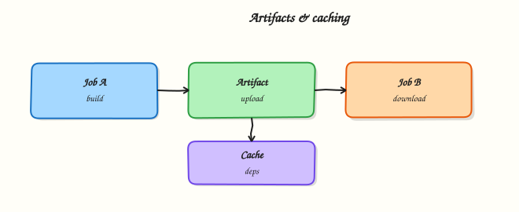

# Artifacts and Caching

## Overview

CI pipelines produce **artefacts** — build outputs, test reports, binaries, container image tarballs — that downstream jobs or humans need after the runner disappears. **Caching** restores expensive dependencies (npm, pip, Maven, Gradle) from a previous run instead of downloading the internet on every commit.

GitHub Actions provides `actions/upload-artifact` and `actions/download-artifact` for artefacts, and `actions/cache` for dependency stores keyed by lockfiles and operating system. Used well, they cut minutes and cost; used poorly, they serve stale dependencies or leak data between jobs.

This is **Tutorial 6** in **Module 6: Artifacts & Caching** of the REBASH Academy **GitHub Actions for Cloud & DevOps Engineers** series.

## Prerequisites

- [Secrets, Variables, and OIDC](secrets-variables-and-oidc.md)
- [GitHub Actions Basics](github-actions-basics-workflows-jobs-steps.md)
- Python 3 with PyYAML

## Learning Objectives

By the end of this tutorial, you will be able to:

- [ ] Upload and download artefacts between jobs in a workflow
- [ ] Design cache keys from lockfiles and runner OS
- [ ] Choose restore-keys fallbacks for partial cache hits
- [ ] Avoid caching secrets or stale build outputs incorrectly
- [ ] Validate artefact and cache workflow YAML offline

## Architecture

Build jobs produce artefacts uploaded to GitHub storage; cache actions restore dependency directories keyed by hashes; deploy jobs consume artefacts.



## Theory

### What it is

**Artefacts** persist files from a workflow run beyond the job lifetime. Typical uses:

- Pass compiled binaries from `build` job to `deploy` job
- Store test reports and coverage HTML for review
- Retain plan files (Terraform, Kubernetes manifests) for approval gates

**Caching** stores a directory (for example `~/.npm`, `~/.cache/pip`) in GitHub-managed cache storage. Keys identify the cache entry; matching keys restore before steps run.

### Why it matters

Without artefacts, deploy jobs must rebuild — slower and non-deterministic. Without caching, every pull request re-downloads gigabytes of dependencies — burning hosted runner minutes and slowing feedback.

Platform teams publish standard cache snippets per language so product repos hit cache on the second run consistently. SRE teams retain artefacts for incident reproduction — the exact binary that shipped.

### How it works

**Upload and download (v4 pattern):**


```yaml
jobs:
  build:
    runs-on: ubuntu-latest
    steps:
      - uses: actions/checkout@v4
      - run: mkdir -p dist && echo "v1.0.0" > dist/version.txt
      - uses: actions/upload-artifact@v4
        with:
          name: build-output
          path: dist/
          retention-days: 7
  deploy:
    needs: build
    runs-on: ubuntu-latest
    steps:
      - uses: actions/download-artifact@v4
        with:
          name: build-output
          path: dist/
      - run: cat dist/version.txt
```


**Cache pattern:**


```yaml
- uses: actions/cache@v4
  id: cache-pip
  with:
    path: ~/.cache/pip
    key: ${{ runner.os }}-pip-${{ hashFiles('**/requirements.txt') }}
    restore-keys: |
      ${{ runner.os }}-pip-
```


| Field | Purpose |
|-------|---------|
| `path` | Directory to save or restore |
| `key` | Exact match identifier — include lockfile hash |
| `restore-keys` | Prefix fallbacks when exact key misses |

Cache scope is branch-aware — feature branches can read default branch caches via `restore-keys` prefixes.

### Key concepts and comparisons

| Mechanism | Lifetime | Cross-job | Typical content |
|-----------|----------|-----------|-----------------|
| Artefact | Configurable retention (days) | Yes, via download | Binaries, reports |
| Cache | Evicted after 7 days inactive | Same repo | Dependencies |
| Workspace | Job only | Same job steps | Checkout tree |

| Cache key ingredient | Why include |
|---------------------|-------------|
| `runner.os` | Linux vs Windows paths differ |
| Lockfile hash | Invalidate when dependencies change |
| Tool version | Node/Python version changes deps |

### Common pitfalls

- Caching `node_modules` without lockfile hash — stale packages after dependency updates.
- Uploading secrets or `.env` files as artefacts — persistent exposure.
- Huge artefacts without retention limits — storage costs and slow downloads.
- Assuming cache always hits — first run and eviction always miss; pipeline must work without cache.
- Same artefact name overwritten concurrently — use matrix-specific names.

## Hands-on Lab

### Objective

Build a two-job workflow that uploads a build artefact, downloads it in a deploy job, and adds a pip cache step — all validated offline under `~/rebash-github-actions/module-06`.

### Prerequisites

- Modules 1–5
- Python 3 with PyYAML

### Lab environment

``` {.bash .ra-terminal title="Terminal"}
mkdir -p ~/rebash-github-actions/module-06/{demo-app/dist,.github/workflows} && cd ~/rebash-github-actions/module-06
set -euo pipefail
```

### Real-world scenario

Release engineering requires build once, deploy many: the compile job uploads a versioned tarball; staging deploy downloads it; pip dependencies cache between runs to cut CI time from eight minutes to three.

### Step-by-step tasks

#### Task 1 – Create build output and requirements file

``` {.bash .ra-terminal title="Terminal"}
cd ~/rebash-github-actions/module-06
set -euo pipefail
echo "app-version=2.4.1" > demo-app/dist/version.txt
```

Create `demo-app/requirements.txt`:

```text title="requirements.txt"
# Stub requirements for cache key lab
requests==2.32.3
```

Validate offline:

``` {.bash .ra-terminal title="Terminal"}
cd ~/rebash-github-actions/module-06
set -euo pipefail
test -s demo-app/dist/version.txt
grep -q 'requests' demo-app/requirements.txt
python3 -c "import hashlib; h=hashlib.sha256(open('demo-app/requirements.txt','rb').read()).hexdigest()[:12]; open('req-hash.txt','w').write(h); print('hash', h)"
```

!!! example "Expected output"
    Prints `hash` followed by 12 hex characters.


#### Task 2 – Write build and deploy workflow with artefacts

Create `.github/workflows/build-deploy-artifacts.yml`:

```yaml title="build-deploy-artifacts.yml"
name: Build and deploy with artifacts
on:
  workflow_dispatch:
permissions:
  contents: read
jobs:
  build:
    runs-on: ubuntu-latest
    steps:
      - uses: actions/checkout@v4
      - name: Produce build output
        run: |
          set -euo pipefail
          mkdir -p demo-app/dist
          echo "app-version=2.4.1" > demo-app/dist/version.txt
          test -s demo-app/dist/version.txt
      - uses: actions/upload-artifact@v4
        with:
          name: build-output
          path: demo-app/dist/
          retention-days: 7
  deploy:
    needs: build
    runs-on: ubuntu-latest
    steps:
      - uses: actions/download-artifact@v4
        with:
          name: build-output
          path: received/
      - name: Verify artefact
        run: |
          set -euo pipefail
          test -f received/version.txt
          grep -q 'app-version=' received/version.txt
```

Validate offline:

``` {.bash .ra-terminal title="Terminal"}
cd ~/rebash-github-actions/module-06
set -euo pipefail
grep -q 'upload-artifact@v4' .github/workflows/build-deploy-artifacts.yml
grep -q 'download-artifact@v4' .github/workflows/build-deploy-artifacts.yml
grep -q 'needs: build' .github/workflows/build-deploy-artifacts.yml
python3 -c "import yaml; d=yaml.safe_load(open('.github/workflows/build-deploy-artifacts.yml')); assert 'deploy' in d['jobs'] and d['jobs']['deploy']['needs']=='build'; print('artifact workflow OK')"
```

!!! example "Expected output"
    `artifact workflow OK`


#### Task 3 – Add cache workflow stub

Create `.github/workflows/cache-pip.yml` (replace `REQ_HASH` with the value from `req-hash.txt` when you create the file locally):


```yaml
name: Cache pip dependencies
on:
  workflow_dispatch:
permissions:
  contents: read
jobs:
  test:
    runs-on: ubuntu-latest
    steps:
      - uses: actions/checkout@v4
      - uses: actions/cache@v4
        id: cache-pip
        with:
          path: ~/.cache/pip
          key: ${{ runner.os }}-pip-REQ_HASH
          restore-keys: |
            ${{ runner.os }}-pip-
      - name: Simulate install
        run: |
          set -euo pipefail
          mkdir -p ~/.cache/pip
          echo "cached-REQ_HASH" > ~/.cache/pip/marker.txt
          test -s ~/.cache/pip/marker.txt
```


Validate offline (substitute your hash from `req-hash.txt` into the workflow file before parsing):

``` {.bash .ra-terminal title="Terminal"}
cd ~/rebash-github-actions/module-06
set -euo pipefail
REQ_HASH=$(cat req-hash.txt)
sed "s/REQ_HASH/${REQ_HASH}/g" .github/workflows/cache-pip.yml > .github/workflows/cache-pip.resolved.yml
grep -q 'actions/cache@v4' .github/workflows/cache-pip.resolved.yml
grep -q 'restore-keys' .github/workflows/cache-pip.resolved.yml
python3 -c "import yaml; yaml.safe_load(open('.github/workflows/cache-pip.resolved.yml')); print('cache workflow OK')"
```

!!! example "Expected output"
    `cache workflow OK`


#### Task 4 – Simulate artefact handoff locally

``` {.bash .ra-terminal title="Terminal"}
cd ~/rebash-github-actions/module-06
set -euo pipefail

rm -rf received && mkdir -p received
cp demo-app/dist/version.txt received/version.txt
test -f received/version.txt
grep -q 'app-version=2.4.1' received/version.txt

mkdir -p ~/.cache/pip
REQ_HASH=$(cat req-hash.txt)
echo "cached-${REQ_HASH}" > ~/.cache/pip/marker.txt
grep -q "cached-${REQ_HASH}" ~/.cache/pip/marker.txt

tar -czf module-06-evidence.tgz .github/workflows/ demo-app/ received/ req-hash.txt
ls -l module-06-evidence.tgz | tee evidence.txt
echo "local artefact simulation OK"
```

!!! example "Expected output"
    `local artefact simulation OK`


### Validation steps

- [ ] Build job uploads `build-output` artefact path
- [ ] Deploy job downloads to `received/` and verifies content
- [ ] Cache workflow includes `key` with requirements hash and `restore-keys`
- [ ] Local simulation copies version file successfully
- [ ] All YAML files parse with Python

### Common errors and fixes

| Error | Cause | Fix |
|-------|-------|-----|
| Deploy job missing file | Wrong artefact name or path | Match `name:` exactly between upload and download |
| Cache never hits | Key changes every run | Stabilise key — hash lockfile, not timestamp |
| Stale dependencies | Cache hit after lockfile change | Include `hashFiles('**/requirements.txt')` in key |
| Artefact too large | Uploading entire repo | Narrow `path:` to `dist/` or specific files |

### Challenge exercise

Add a matrix job that uploads artefacts named `build-output-${{ matrix.os }}` and a consolidation job that downloads all matrix artefacts. Extend Python validation to detect matrix-specific artefact names in YAML text.

### Learning outcomes

- Chained build and deploy jobs with upload/download artefacts
- Designed pip cache keys from requirements hash
- Simulated artefact handoff without GitHub push
- Understood retention and cache eviction constraints

### Cleanup

```bash
# rm -rf ~/rebash-github-actions/module-06/received  # optional
```

## Validation

- [ ] Lab completed under `~/rebash-github-actions/module-06/`
- [ ] You can explain artefact versus cache use cases
- [ ] You can design a cache key for npm using `package-lock.json`
- [ ] You can describe cache eviction behaviour

## Code Walkthrough

1. **Build once** — compile in one job; upload immutable artefact with version in filename or metadata.
2. **Name artefacts clearly** — include version or matrix axis in `name:`.
3. **Hash lockfiles** — cache keys must invalidate when dependencies change.
4. **Set retention** — `retention-days` prevents unbounded storage growth.
5. **Verify after download** — `test -f` and checksum before deploy.

## Security Considerations

- Never upload `.env`, kubeconfig, or private keys as artefacts — they persist beyond the job.
- Scope artefact download to trusted jobs in the same workflow or org policies.
- Do not cache directories containing credentials or session tokens.
- Review artefact contents before sharing externally — may include source maps with embedded secrets.
- Use minimum retention days required for compliance and debugging.

## Common Mistakes

!!! warning "Caching dependencies without lockfile in key"
    Updates do not invalidate cache — mysterious test failures. **Fix:** Always `hashFiles('**/package-lock.json')` or equivalent in `key`.

!!! warning "Uploading entire workspace as artefact"
    Includes `.git`, secrets in local files, huge uploads. **Fix:** Upload explicit `path:` directories only.

!!! warning "Assuming cache hit on first run"
    CI must install dependencies fully when cache misses. **Fix:** Write install steps to succeed with empty cache; treat cache as optimisation only.

## Best Practices

- Include `runner.os` and tool version in every cache key.
- Use `restore-keys` prefix for warm caches on new branches.
- Pin `actions/upload-artifact@v4` and `actions/cache@v4`.
- Compress large artefacts before upload when appropriate.
- Log cache hit/miss via `steps.cache-pip.outputs.cache-hit` for metrics.

## Troubleshooting

| Symptom | Likely cause | Fix |
|---------|--------------|-----|
| `download-artifact` not found | Name mismatch or expired retention | Verify `name:`; check retention-days |
| Cache always misses | Key includes volatile value | Remove timestamps from keys |
| Slow cache restore | Huge cache path | Cache minimal directories (`~/.npm` not whole repo) |
| Parallel matrix overwrite | Same artefact name | Use matrix variable in `name:` |
| Out of cache quota | Org limit reached | Delete old caches; reduce path size |

## Summary

**Artefacts** pass build outputs between jobs; **caching** accelerates dependency installation with stable hashed keys. Module 6’s lab validates both patterns offline. Next: [Docker Pipelines with GitHub Actions](docker-pipelines-with-github-actions.md).

## Interview Questions

**1. When do you use artefacts versus caching?**

??? success "Reveal answer"
    **Artefacts** store unique build outputs you deploy or inspect — binaries, packages, reports — and pass them explicitly between jobs. **Caching** stores reusable dependency directories to speed up installs across runs. Artefacts are content-addressed deliverables; caches are disposable performance optimisations.

**2. How do you invalidate a dependency cache when lockfiles change?**

??? success "Reveal answer"
    Include `hashFiles('**/package-lock.json')` (or pip, Gradle equivalent) in the cache `key`. When the lockfile changes, the hash changes, the exact key misses, and a fresh cache populates. Use `restore-keys` prefix only for partial hits on the same OS.

**3. What happens to caches after seven days of no access?**

??? success "Reveal answer"
    GitHub evicts cache entries not accessed within approximately seven days (policy subject to change). Pipelines must not depend on indefinite cache persistence — always handle cache miss with full install.

**4. How do you pass artefacts from a matrix build job to a single deploy job?**

??? success "Reveal answer"
    Upload with matrix-specific names (`build-${{ matrix.os }}`), then use a downstream job with `needs: build` and either download each artefact in separate steps or use `actions/download-artifact` merge patterns / a consolidation job that downloads all required names before deploy.

**5. Why set retention-days on upload-artifact?**

??? success "Reveal answer"
    Limits storage duration and cost. Test reports may need 7–30 days; large binaries for release might need longer. Match retention to compliance and debugging needs — not infinite by default.

**6. Can fork PR workflows access cache from the base repository?**

??? success "Reveal answer"
    Fork workflows have restricted cache access — they typically cannot read or write the base repo cache to prevent cache poisoning attacks. Expect cache misses on external contributor PRs.

**7. What is cache poisoning and how do you mitigate it?**

??? success "Reveal answer"
    An attacker injects malicious content into a shared cache key that other branches restore. Mitigate with lockfile hashes in keys, restricted cache scope on forks, and avoiding caches keyed only on branch name without content hash.

## Related Tutorials

- [Secrets, Variables, and OIDC](secrets-variables-and-oidc.md)
- [Docker Pipelines with GitHub Actions](docker-pipelines-with-github-actions.md)
- [Testing in GitHub Actions](testing-in-github-actions.md)

## References

- [Storing workflow data as artifacts](https://docs.github.com/en/actions/using-workflows/storing-workflow-data-as-artifacts)
- [actions/upload-artifact](https://github.com/actions/upload-artifact)
- [actions/cache](https://github.com/actions/cache)
- [Dependency caching](https://docs.github.com/en/actions/using-workflows/caching-dependencies-to-speed-up-workflows)
