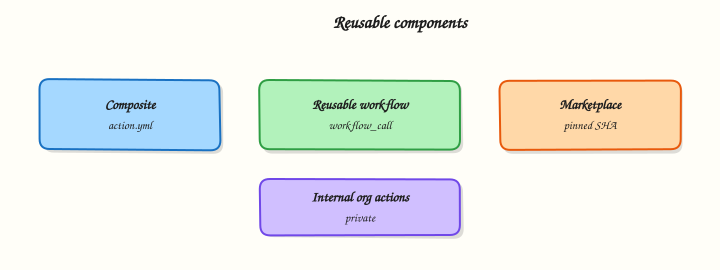

# Composite Actions and Reusable Workflows

## Overview


Factor repeated CI into composite actions and reusable workflows, pin marketplace actions by commit SHA, and outline how platform teams publish internal actions.

Copy-pasted workflow YAML drifts. **Composite actions** package a sequence of steps with inputs and outputs. **Reusable workflows** (`workflow_call`) share whole jobs — often lint, test, build, and deploy contracts — across repositories. The **marketplace** accelerates delivery; **pinning by SHA** and **internal actions** keep the supply chain under your control.

This is a core tutorial in **Module 14 · Reusable Components** of the REBASH Academy **GitHub Actions for Cloud & DevOps Engineers** series — written for Cloud, DevOps, Platform, and SRE engineers.


## Prerequisites


- [Release Management and Versioning](release-management-and-versioning.md)
- [Workflow Syntax, Matrix, and Reusable](workflow-syntax-matrix-and-reusable.md) (or equivalent)


## Learning Objectives


By the end of this tutorial, you will be able to:

- [ ] Author a composite action with inputs and outputs  
- [ ] Call a reusable workflow with `secrets: inherit` or explicit secrets  
- [ ] Pin third-party actions to a full commit SHA  
- [ ] Choose composite vs reusable vs internal action repo


## Architecture


This topic’s control points and relationships are shown below.




## Theory


### What it is

A **composite action** is an `action.yml` with `runs.using: composite` — local steps (shell or nested `uses`) that look like one step to callers. A **reusable workflow** lives under `.github/workflows/`, declares `on.workflow_call`, and is invoked with `jobs.<id>.uses: org/repo/.github/workflows/ci.yml@ref`. **Marketplace actions** are public (or verified) actions you consume with `uses: owner/name@ref`. **Internal actions** are the same mechanism in a private org repo — the platform’s standard “setup language toolchain” or “OIDC deploy” building blocks.

| Pattern | Shares | Best for |
|---------|--------|----------|
| Composite action | Steps | Setup, thin wrappers, repo-local helpers |
| Reusable workflow | Jobs / permissions shape | Org-standard CI/CD contracts |
| Marketplace (SHA-pinned) | Community capability | Well-known tools you do not maintain |
| Internal action repo | Versioned platform steps | Multi-repo consistency + review |

### Why it matters

Platform engineering wins by **shipping templates**, not reviewing 200-line bespoke YAML per app. Reuse cuts mean time to a compliant pipeline and centralises security fixes. SHA pinning stops a compromised or rewritten tag from changing production behaviour overnight — a core supply-chain control for GitHub Actions at enterprise scale.

### How it works

1. Extract repeated steps into `.github/actions/<name>/action.yml` (composite) or a dedicated actions repository.  
2. Extract org-standard job graphs into a reusable workflow with typed `inputs` and optional `outputs`.  
3. Caller workflows stay thin: `uses: ./.github/actions/setup-python` or `uses: org/platform-workflows/.github/workflows/node-ci.yml@v2`.  
4. For marketplace and internal actions, pin `@<full-sha>` and comment the human tag (`# v4.1.0`) for readability.  
5. Version platform workflows with tags or release branches; consumers bump deliberately after changelog review.

Reusable workflows run in the **caller’s** repository context for `GITHUB_TOKEN` by default. Pass secrets explicitly or use `secrets: inherit` when policy allows. Prefer least-privilege `permissions` in the *called* workflow.

### Key concepts and comparisons

| Question | Composite | Reusable workflow |
|----------|-----------|-------------------|
| Can define jobs? | No | Yes |
| Ideal granularity | Thin step wrappers | Full stage contracts |
| Local path `uses` | `./.github/actions/...` | Same-repo or remote `@ref` |

Pin marketplace and internal actions to a **full commit SHA** (comment the human tag). Avoid `@main` and floating major tags in production.

### Common pitfalls

- Hiding broad secrets in callees while callers stay over-privileged.  
- Floating marketplace tags without Dependabot/Renovate SHA updates.  
- Giant composites that re-implement half of CI — keep them thin.  
- Forgetting composites cannot set job-level `permissions` or `runs-on`.


## Hands-on Lab


Create a workspace for this tutorial.

```bash
mkdir -p ~/rebash-github-actions/module-14/.github/{actions/setup-tool,workflows} && cd ~/rebash-github-actions/module-14/.github/{actions/setup-tool,workflows}
```

**Focus:** build a matrix workflow and reusable workflow stub

### Step 1 – Matrix + reusable


```bash
mkdir -p .github/workflows
cat > .github/workflows/matrix.yml << 'EOF'
name: matrix
on: workflow_dispatch
jobs:
  test:
    runs-on: ubuntu-latest
    strategy:
      matrix:
        python: ["3.11", "3.12"]
    steps:
      - uses: actions/checkout@v4
      - run: echo "python ${{ matrix.python }}"
EOF
python3 -c "import yaml; yaml.safe_load(open('.github/workflows/matrix.yml')); print('matrix OK')"
```


### Final step – Cleanup note

```bash
# File-only
```


## Validation


- [ ] Lab commands run under `~/rebash-github-actions/module-14/.github/{actions/setup-tool,workflows}/`
- [ ] You can explain each Theory section in your own words
- [ ] You used modern tooling where it applies to this topic
- [ ] You can describe one production failure mode for this topic


## Code Walkthrough


Production practice for **Composite Actions and Reusable Workflows** always combines:

1. Inspect before you change (status, plan, logs, dry-run)
2. Prefer reversible, documented changes (Git, IaC, drop-ins, version pins)
3. Capture evidence (command output, pipeline logs) for handovers
4. Prefer current tools and APIs over legacy shortcuts
5. Least privilege — escalate credentials only when required

Keep runbooks short enough to follow under pressure. Automate checks; keep humans for judgement.


## Security Considerations


- Treat credentials and tokens for github-actions as privileged — never commit them
- Prefer short-lived auth (OIDC, roles, SSO) over long-lived keys
- Validate blast radius before apply/deploy/delete operations
- Restrict who can approve production changes
- Collect audit logs; limit who can read sensitive traces


## Common Mistakes


!!! warning "Hiding broad secrets in callees while callers stay over-privileged.  "
    Validate assumptions against the Theory section and official docs before changing production.

!!! warning "Floating marketplace tags without Dependabot/Renovate SHA updates.  "
    Lab shortcuts (open security groups, admin roles, skip approvals) must not ship unchanged.

!!! warning "Changing production without a rollback path"
    Always know how to revert (previous artefact, prior release, state rollback, DNS failback).


## Best Practices


- Encode Composite Actions and Reusable Workflows changes as code and review them in pull requests
- Pin versions (images, modules, actions, provider plugins)
- Separate environments with clear promotion gates
- Alert on symptoms with runbooks attached
- Destroy lab resources; tag everything with owner and expiry where possible


## Troubleshooting


| Symptom | Likely cause | Fix |
|---------|--------------|-----|
| Auth / permission denied | Wrong identity, policy, or scope | Check caller identity, roles, and least-privilege policies |
| Timeout / no route | Network, DNS, security group, or endpoint | Trace path, DNS, and allow-lists before retrying |
| Drift / unexpected plan | Manual change or wrong state/workspace | Reconcile desired vs actual; avoid click-ops on managed resources |
| Pipeline/job red | Flaky step, cache, or missing secret | Read failing step logs; bisect recent workflow/config changes |
| Cost spike | Idle load balancer, NAT, oversized compute | Inventory billable resources; stop/delete labs promptly |


## Summary


**Composite Actions and Reusable Workflows** is essential for Cloud and DevOps engineers working with github-actions. Practise the lab until the inspection and change path is muscle memory, then continue the track.


## Interview Questions


1. How does **Composite Actions and Reusable Workflows** fit into a GitHub Actions delivery model?
2. A workflow fails only on `pull_request` — what differences do you inspect?
3. Why pin Actions and limit `permissions`?
4. How should production secrets and OIDC cloud access be designed?
5. How do you keep workflows reusable without copy-paste sprawl?

!!! tip "Sample answer — question 2"
    Compare event payloads, checkout ref for fork PRs, secrets availability, and required environments. Read the failing step log and re-run with debug logging if needed.

!!! tip "Sample answer — question 4"
    Use `permissions` least privilege, environment protection for prod, and OIDC (`id-token: write`) instead of long-lived cloud keys.


## Related Tutorials


- [Course overview](index.md)
- [Production Pipelines and Environments](production-pipelines-and-environments.md)


## References


- [Creating a composite action](https://docs.github.com/en/actions/creating-actions/creating-a-composite-action)  
- [Reusable workflows](https://docs.github.com/en/actions/using-workflows/reusing-workflows)  
- [Security hardening for GitHub Actions](https://docs.github.com/en/actions/security-guides/security-hardening-for-github-actions)
