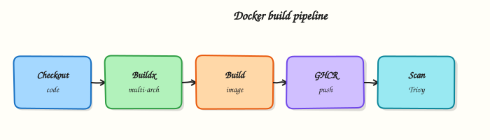

# Docker Pipelines with GitHub Actions

## Overview

Author a GitHub Actions workflow that builds a multi-stage Dockerfile with Buildx, produces multi-architecture images, and pushes immutable SHA tags to GitHub Container Registry (GHCR) — ready for later Kubernetes or cloud promotion.

CI builds containers so every merge produces a **reproducible Open Container Initiative (OCI) image**. Prefer **Docker Buildx** over ad-hoc `docker build` on a laptop. Tag with the commit SHA (and optionally a digest); promote that same image through staging and production. **GHCR** (`ghcr.io/<owner>/<image>`) is the natural home for GitHub-native pipelines; the same pattern works for Docker Hub, Amazon Elastic Container Registry (ECR), and others with different login steps.

This is a core tutorial in **Module 7 · Docker Pipelines** of the REBASH Academy **GitHub Actions for Cloud & DevOps Engineers** series — written for Cloud, DevOps, Platform, and SRE engineers.

## Prerequisites

- [Artifacts and Caching](artifacts-and-caching.md)

## Learning Objectives

By the end of this tutorial, you will be able to:

- [ ] Sketch a Buildx workflow with `packages: write` for GHCR  
- [ ] Write a minimal multi-stage Dockerfile  
- [ ] Build and push `linux/amd64` and `linux/arm64`  
- [ ] Explain SHA tags vs floating `latest`  
- [ ] Describe image promotion without rebuild

## Architecture

This topic’s control points and relationships are shown below.



## Theory

### What it is

A **Docker pipeline** compiles application code into an OCI image inside a GitHub Actions job, then pushes it to a registry. Production jobs use **Buildx** (BuildKit) for layer caching, multi-platform manifests, and provenance-friendly builds. **Multi-stage** Dockerfiles keep compilers and test tools out of the final runtime image. Authentication to GHCR uses the job’s `GITHUB_TOKEN` with `packages: write`; cloud registries usually prefer OpenID Connect (OIDC) over long-lived passwords (Modules 5 and 10).

| Concern | Prefer | Avoid |
|---------|--------|-------|
| Builder | Buildx + BuildKit | Legacy builder only |
| Tags | Commit SHA / semver / digest | Only `latest` |
| Platforms | Explicit `linux/amd64,linux/arm64` | Implicit host arch only |
| Auth | `GITHUB_TOKEN` / OIDC | Personal access tokens in Git |

### Why it matters

Laptop-built images drift from CI and skip scanners. Registry-hosted, SHA-tagged images are the unit of deploy for Kubernetes and managed container services. Multi-arch manifests stop “works on my amd64 runner, fails on arm64 nodes.” Without promotion discipline — retag or deploy the same digest — staging and production silently diverge when each environment rebuilds from source.

### How it works

1. Workflow checks out the repository and sets up Buildx (`docker/setup-buildx-action`).  
2. Log in to GHCR with `docker/login-action` and `GITHUB_TOKEN` (or OIDC for cloud registries).  
3. `docker/build-push-action` builds the Dockerfile, often with GitHub Actions cache (`type=gha`) or a registry cache.  
4. Tags include `ghcr.io/<owner>/<name>:<sha>` and optionally a branch or semver tag; record the digest as a job output.  
5. Deploy jobs (Modules 8–10) pull that SHA or digest; production never rebuilds from source for the same commit.

Pin base images by digest in production Dockerfiles. Cache accelerates rebuilds; it does not replace reproducible tags.

### Key concepts and comparisons

| Practice | Good | Risky |
|----------|------|-------|
| Promote | Same digest across envs | Rebuild per environment |
| Permissions | Least-privilege `packages: write` | Broad `write-all` |
| Secrets | Build-args for non-secrets only | Baking API keys into layers |
| Actions | Pin by commit SHA | Floating `@v1` / `@main` |

### Common pitfalls

- Pushing `latest` from every pull request.  
- Privileged Docker-in-Docker on shared self-hosted runners without isolation.  
- Assuming cache guarantees bit-identical images across builders.  
- Forgetting `packages: write` / package visibility so GHCR push fails.  
- Rebuilding for production instead of promoting the tested digest.

## Hands-on Lab
Create a workspace for this tutorial.

```bash
mkdir -p ~/rebash-github-actions/docker-lab && cd ~/rebash-github-actions/docker-lab
```

**Focus:** Dockerfile + GitHub Actions build workflow for this module

### Step 1 – App and Dockerfile

```bash
mkdir -p app
echo 'hello from rebash gha docker lab' > app/hello.txt
cat > app/Dockerfile << 'EOF'
FROM alpine:3.20
COPY hello.txt /hello.txt
CMD ["cat", "/hello.txt"]
EOF
docker build -t rebash/gha-lab:dev ./app
docker run --rm rebash/gha-lab:dev
```

### Step 2 – Workflow that builds on push

```bash
mkdir -p .github/workflows
cat > .github/workflows/docker.yml << 'EOF'
name: docker-lab
on:
  push:
    paths: ['app/**', '.github/workflows/docker.yml']
  workflow_dispatch:
jobs:
  build:
    runs-on: ubuntu-latest
    steps:
      - uses: actions/checkout@v4
      - uses: docker/setup-buildx-action@v3
      - uses: docker/build-push-action@v6
        with:
          context: ./app
          push: false
          tags: rebash/gha-lab:ci
EOF
sed -n '1,80p' .github/workflows/docker.yml
```

### Final step – Cleanup note

```bash
docker rmi rebash/gha-lab:dev 2>/dev/null || true
# Keep ~/rebash-github-actions/ for later tutorials
```

## Validation

- [ ] Lab commands run under `~/rebash-github-actions/module-07/.github/workflows/`
- [ ] You can explain each Theory section in your own words
- [ ] You used modern tooling where it applies to this topic
- [ ] You can describe one production failure mode for this topic

## Code Walkthrough

Production practice for **Docker Pipelines with GitHub Actions** always combines:

1. Inspect before you change (status, plan, logs, dry-run)
2. Prefer reversible, documented changes (Git, IaC, drop-ins, version pins)
3. Capture evidence (command output, pipeline logs) for handovers
4. Prefer current tools and APIs over legacy shortcuts
5. Least privilege — escalate credentials only when required

Keep runbooks short enough to follow under pressure. Automate checks; keep humans for judgement.

## Security Considerations

- Treat credentials and tokens for github-actions as privileged — never commit them
- Prefer short-lived auth (OIDC, roles, SSO) over long-lived keys
- Validate blast radius before apply/deploy/delete operations
- Restrict who can approve production changes
- Collect audit logs; limit who can read sensitive traces

## Common Mistakes

!!! warning "Pushing `latest` from every pull request.  "
    Validate assumptions against the Theory section and official docs before changing production.

!!! warning "Privileged Docker-in-Docker on shared self-hosted runners without isolation.  "
    Lab shortcuts (open security groups, admin roles, skip approvals) must not ship unchanged.

!!! warning "Changing production without a rollback path"
    Always know how to revert (previous artefact, prior release, state rollback, DNS failback).

## Best Practices

- Encode Docker Pipelines with GitHub Actions changes as code and review them in pull requests
- Pin versions (images, modules, actions, provider plugins)
- Separate environments with clear promotion gates
- Alert on symptoms with runbooks attached
- Destroy lab resources; tag everything with owner and expiry where possible

## Troubleshooting

| Symptom | Likely cause | Fix |
|---------|--------------|-----|
| Auth / permission denied | Wrong identity, policy, or scope | Check caller identity, roles, and least-privilege policies |
| Timeout / no route | Network, DNS, security group, or endpoint | Trace path, DNS, and allow-lists before retrying |
| Drift / unexpected plan | Manual change or wrong state/workspace | Reconcile desired vs actual; avoid click-ops on managed resources |
| Pipeline/job red | Flaky step, cache, or missing secret | Read failing step logs; bisect recent workflow/config changes |
| Cost spike | Idle load balancer, NAT, oversized compute | Inventory billable resources; stop/delete labs promptly |

## Summary

**Docker Pipelines with GitHub Actions** is essential for Cloud and DevOps engineers working with github-actions. Practise the lab until the inspection and change path is muscle memory, then continue the track.

## Interview Questions

1. How does **Docker Pipelines with GitHub Actions** show up when operating Cloud or production platforms?
2. What would you check first if this area misbehaves in production?
3. Which modern tools or APIs replace older equivalents here?
4. What security control should accompany this capability?
5. How would you automate verification of this topic in CI?

!!! tip "Sample answer — question 2"
    Start with blast radius and recent changes, gather evidence (logs, status, plan/diff), then fix forward with a known rollback path — not guesswork.

## Related Tutorials

- [Course overview](index.md)
- - [Kubernetes Deployments with GitHub Actions](kubernetes-deployments-with-github-actions.md)

## References

- [Publishing Docker images](https://docs.github.com/en/actions/publishing-packages/publishing-docker-images) · [GHCR](https://docs.github.com/en/packages/working-with-a-github-packages-registry/working-with-the-container-registry) · [Buildx](https://docs.docker.com/build/buildx/) · [build-push-action](https://github.com/docker/build-push-action)
