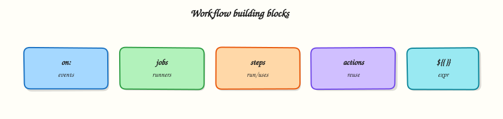

# GitHub Actions Basics: Workflows, Jobs, and Steps

## Overview

A GitHub Actions workflow is a YAML contract: when something happens in Git, which jobs run, on which runner, in what order, with what permissions. Module 1 mapped the lifecycle; this module teaches the **building blocks** — events, jobs, steps, actions, expressions, and variables — so you can read and write production workflows confidently.

Every workflow file lives under `.github/workflows/`. Events decide *when* it runs. Jobs group steps that share one runner workspace. Steps are the smallest unit — a shell command or a reusable action from the marketplace. **Expressions** (`${{ }}`) inject context such as branch name, commit SHA, and matrix values at runtime.

This is **Tutorial 2** in **Module 2: GitHub Actions Basics** of the REBASH Academy **GitHub Actions for Cloud & DevOps Engineers** series. By the end you will complete a `ci.yml` with checkout and shell steps, validate YAML structure offline, and understand the context objects available in expressions.

## Prerequisites

- [CI/CD Fundamentals and GitHub Actions](cicd-fundamentals-and-github-actions.md)
- [Git basics](../git/basic-git-workflow-add-commit-push.md)
- Python 3 with PyYAML (or `pip install pyyaml`)
- Optional: [GitHub CLI](https://cli.github.com/) (`gh`) for optional live runs

## Learning Objectives

By the end of this tutorial, you will be able to:

- [ ] Structure a workflow file with `name`, `on`, `permissions`, `jobs`, and `steps`
- [ ] Choose appropriate trigger events for CI versus manual operations
- [ ] Use `actions/checkout` and `run:` steps with fail-fast shell patterns
- [ ] Reference `github`, `env`, and `vars` context in expressions safely
- [ ] Validate workflow YAML locally before pushing to GitHub

## Architecture

Workflow files react to events; jobs execute on runners; steps call actions or shell commands; context flows into expressions.



## Theory

### What it is

A **workflow** is a YAML file (`.yml` or `.yaml`) in `.github/workflows/`. Required top-level keys for most workflows:

| Key | Purpose |
|-----|---------|
| `name` | Display name in the Actions UI |
| `on` | Events and filters that trigger runs |
| `jobs` | Named units of work |
| `permissions` | Scopes for the `GITHUB_TOKEN` (recommended) |

A **job** runs on one runner. All steps in a job share the same workspace directory (`$GITHUB_WORKSPACE`). Jobs can depend on each other with `needs:`.

A **step** is either:

- `run:` — shell command (default shell depends on OS: bash on Linux/macOS, pwsh on Windows)
- `uses:` — reusable **action** (for example `actions/checkout@v4`)

An **action** packages reusable logic — either from the marketplace, your organisation, or a local path (`./.github/actions/my-action`).

### Why it matters

Without a clear mental model, workflows become copy-paste soup: wrong event filters, jobs that never run, expressions that evaluate to empty strings, and secrets printed in logs. Platform teams publish **golden templates** — minimal CI, Docker build, Terraform plan — so product engineers inherit correct structure.

Expressions let one workflow serve many branches and matrix combinations without duplicating files. Variables (repository, environment, organisation) separate configuration from logic — rotate a URL in Settings instead of editing YAML across fifty repositories.

### How it works

**Events (`on:`)** — common triggers:

| Event | Typical use |
|-------|-------------|
| `push` | CI on branch commits |
| `pull_request` | CI on PRs (uses merge ref) |
| `workflow_dispatch` | Manual run with optional inputs |
| `schedule` | Cron-based jobs (UTC) |
| `release` | Publish on GitHub Release |

Filters narrow triggers:

```yaml
on:
  push:
    branches: [main, 'release/**']
    paths:
      - 'src/**'
      - '.github/workflows/ci.yml'
  pull_request:
    branches: [main]
```

**Job defaults:**

```yaml
jobs:
  build:
    runs-on: ubuntu-latest
    timeout-minutes: 15
    defaults:
      run:
        shell: bash
```

**Expressions** wrap dynamic values. In documentation samples below, expressions are shown wrapped for MkDocs compatibility:


```yaml
- name: Show context
  run: echo "Branch ${{ github.ref_name }} at ${{ github.sha }}"
```


**Context objects** (most used):

| Context | Examples |
|---------|----------|
| `github` | `github.repository`, `github.ref`, `github.event_name`, `github.sha` |
| `env` | Variables set in `env:` blocks |
| `vars` | Repository / organisation variables (non-secret) |
| `secrets` | Encrypted secrets (never log) |
| `runner` | `runner.os`, `runner.arch` |
| `needs` | Outputs from dependent jobs |

**Variables versus secrets:**

| Type | Storage | Visible in logs? |
|------|---------|------------------|
| `vars.*` | Settings → Variables | Yes (non-sensitive config) |
| `secrets.*` | Settings → Secrets | No (masked when possible) |
| `env:` in workflow | YAML / runtime | Depends — do not put secrets in plain `env` |

### Key concepts and comparisons

| Pattern | When to use |
|---------|-------------|
| Single job CI | Small repos; lint + test in one runner |
| Multi-job CI | Separate lint, test, build for clearer failures and parallelism |
| `needs:` chain | Test only after lint passes; deploy only after test |
| `if:` on job/step | Skip deploy on fork PRs; run only on `main` |

| `run:` vs `uses:` | |
|-------------------|---|
| `run:` | Custom shell logic; full control |
| `uses:` | Pin community or internal reusable steps |

### Common pitfalls

- **`pull_request` vs `pull_request_target`** — the latter runs with base branch context and elevated risk for forks; avoid unless you understand the security model.
- **Missing checkout** — the runner workspace starts empty; most jobs need `actions/checkout` first.
- **Expression syntax** — use `${{ }}` inside YAML strings; compare with `${{ github.ref == 'refs/heads/main' }}` not shell `==` alone in `if:`.
- **Unpinned actions** — `@main` moves; pin `@v4` or a commit SHA.
- **Wrong shell** — multiline scripts need `set -euo pipefail` in bash for fail-fast behaviour.

## Hands-on Lab

### Objective

Complete `.github/workflows/ci.yml` with checkout, environment variables, a context-aware shell step, and offline YAML validation under `~/rebash-github-actions/module-02`.

### Prerequisites

- Completed Module 1 lab or equivalent
- Python 3 with PyYAML
- Bash

### Lab environment

```bash
mkdir -p ~/rebash-github-actions/module-02 && cd ~/rebash-github-actions/module-02
set -euo pipefail
```

### Real-world scenario

Your team’s first production workflow must run on every pull request to `main`, checkout code, print the commit context, run unit tests from a stub script, and fail if tests fail — all reviewable in YAML before the first push.

### Step-by-step tasks

#### Task 1 – Create project layout and stub test script

Create the directory layout, then add the test script and README.

```bash
cd ~/rebash-github-actions/module-02
set -euo pipefail
mkdir -p demo-app/tests .github/workflows
```

Create `demo-app/tests/run-tests.sh`:

```bash
#!/usr/bin/env bash
set -euo pipefail
echo "Running stub unit tests..."
test -f ../README.md || { echo "README missing"; exit 1; }
echo "ALL TESTS PASSED"
```

Create `demo-app/README.md`:

````markdown
# Demo app for Module 2 CI lab

Minimal fixture used by the CI workflow stub. Run tests locally:

```bash
cd demo-app/tests && ./run-tests.sh
```
````

Run and verify:

```bash
cd ~/rebash-github-actions/module-02
chmod +x demo-app/tests/run-tests.sh
test -x demo-app/tests/run-tests.sh
grep -q 'ALL TESTS PASSED' demo-app/tests/run-tests.sh
```

**Expected output:** Script is executable; grep succeeds.

#### Task 2 – Write the CI workflow

Create `.github/workflows/ci.yml`:


```yaml
name: Module 2 CI
on:
  pull_request:
    branches: [main]
  push:
    branches: [main]
  workflow_dispatch:

permissions:
  contents: read

env:
  APP_NAME: rebash-demo

jobs:
  ci:
    runs-on: ubuntu-latest
    steps:
      - name: Checkout
        uses: actions/checkout@v4

      - name: Show context
        env:
          REF_NAME: ${{ github.ref_name }}
          SHA_SHORT: ${{ github.sha }}
        run: |
          set -euo pipefail
          echo "Repository: ${{ github.repository }}"
          echo "Event: ${{ github.event_name }}"
          echo "Ref: ${REF_NAME}"
          echo "SHA: ${SHA_SHORT:0:7}"
          echo "${{ env.APP_NAME }}" > context.txt
          test -s context.txt

      - name: Run tests
        working-directory: demo-app/tests
        run: |
          set -euo pipefail
          ./run-tests.sh | tee test-output.txt
          grep -q 'ALL TESTS PASSED' test-output.txt
```


Validate offline:

```bash
cd ~/rebash-github-actions/module-02
set -euo pipefail
grep -q 'actions/checkout@v4' .github/workflows/ci.yml
grep -q 'github.ref_name' .github/workflows/ci.yml
grep -q 'working-directory: demo-app/tests' .github/workflows/ci.yml
```

**Expected output:** All greps succeed.

#### Task 3 – Validate YAML structure

```bash
cd ~/rebash-github-actions/module-02
set -euo pipefail
python3 -c "
import yaml
with open('.github/workflows/ci.yml') as f:
    doc = yaml.safe_load(f)
assert doc['name'] == 'Module 2 CI'
assert 'pull_request' in doc['on']
assert 'ci' in doc['jobs']
steps = doc['jobs']['ci']['steps']
assert any('checkout' in s.get('uses', '').lower() for s in steps)
assert doc['permissions']['contents'] == 'read'
print('structure OK')
"
```

**Expected output:** `structure OK`

#### Task 4 – Simulate workflow shell steps locally

```bash
cd ~/rebash-github-actions/module-02
set -euo pipefail

export APP_NAME=rebash-demo
echo "${APP_NAME}" > context.txt
test -s context.txt
grep -q 'rebash-demo' context.txt

cd demo-app/tests
./run-tests.sh | tee ../../test-output.txt
grep -q 'ALL TESTS PASSED' ../../test-output.txt
echo "local simulation OK"
```

**Expected output:** `local simulation OK`

**Optional — run on GitHub:**

```bash
# gh workflow run ci.yml
# gh run watch
```

### Validation steps

- [ ] `demo-app/tests/run-tests.sh` exits 0 locally
- [ ] `.github/workflows/ci.yml` passes Python structure asserts
- [ ] Workflow contains checkout, context step, and test step
- [ ] `permissions: contents: read` is set
- [ ] `context.txt` and `test-output.txt` prove local simulation

### Common errors and fixes

| Error | Cause | Fix |
|-------|-------|-----|
| `yaml.scanner.ScannerError` | Tab characters in YAML | Replace tabs with spaces (2-space indent) |
| Tests fail — README missing | Wrong working directory | Use `working-directory: demo-app/tests` or adjust path |
| Expression literal in log | Forgot expression syntax | Use `${{ github.ref_name }}` in YAML, not `$GITHUB_REF_NAME` alone in `env:` mapping |
| Action not found | Typo in `uses:` | Pin `actions/checkout@v4` exactly |

### Challenge exercise

Add a job `lint` that runs before `ci` using `needs:` — the lint job echoes "lint ok" and writes `lint-passed.txt`. Update structure validation to assert two jobs and the `needs` relationship.

### Learning outcomes

- Created a multi-step CI workflow with checkout and shell steps
- Used `github` context and `env` in expressions
- Validated YAML structure with Python asserts
- Simulated runner steps locally without a GitHub push

### Cleanup

```bash
# Retain ~/rebash-github-actions/module-02 for Module 3+
# rm -f context.txt test-output.txt  # optional
```

## Validation

- [ ] Lab completed under `~/rebash-github-actions/module-02/`
- [ ] You can name five `github.*` context properties and their purpose
- [ ] You can explain when to use `vars` versus `secrets`
- [ ] You can describe what happens if checkout is omitted

## Code Walkthrough

1. **Start with triggers** — match `on:` to the feedback loop you want (PR for CI, dispatch for ops).
2. **Set permissions first** — default read-only; add scopes per job if needed.
3. **Checkout early** — first step in almost every build job.
4. **Fail fast in shell** — `set -euo pipefail` and explicit `test`/`grep` asserts.
5. **Pin actions** — `@v4` minimum; commit SHA for highest supply-chain assurance.

## Security Considerations

- Use `pull_request` for external contributions; avoid `pull_request_target` unless you need base-branch secrets and accept the risk model.
- Never echo `secrets.*` or mask bypass patterns; GitHub masks known secrets but custom encoding can leak.
- Restrict `workflow_dispatch` inputs — validate and sanitise before use in shell commands.
- Limit `permissions:` — `contents: read` suffices for most CI jobs.
- Review third-party actions — prefer verified creators and pinned versions.

## Common Mistakes

!!! warning "Forgetting actions/checkout"
    The runner workspace is empty at job start. **Fix:** Add `uses: actions/checkout@v4` before steps that read repository files.

!!! warning "Using shell syntax inside expressions"
    `if: github.ref == 'refs/heads/main'` is expression syntax; `if: [ "$(git branch)" = main ]` in the wrong field fails silently or skips unexpectedly. **Fix:** Use `${{ }}` expressions in `if:`, `env:`, and `with:` — shell logic inside `run:` only.

!!! warning "Pinning actions to a moving branch"
    `@main` can change without notice. **Fix:** Pin major version tags or full commit SHAs.

## Best Practices

- One workflow file per concern (CI, release, deploy) when triggers and permissions differ.
- Use `env:` at workflow or job level for shared non-secret configuration.
- Name steps clearly — logs become searchable incident evidence.
- Add `timeout-minutes` on long jobs to avoid hung runners consuming quota.
- Validate YAML in CI with `actionlint` or Python before merge.

## Troubleshooting

| Symptom | Likely cause | Fix |
|---------|--------------|-----|
| Workflow not triggered on PR | PR targets wrong branch or path filter excludes files | Check `on.pull_request.branches` and `paths` |
| Expression shows empty | Wrong context property or typo | Compare with [contexts reference](https://docs.github.com/en/actions/learn-github-actions/contexts) |
| Step cannot find file | Missing checkout or wrong `working-directory` | Add checkout; set path relative to workspace root |
| `Permission denied` pushing tags | Token lacks `contents: write` | Add scoped permissions only on the job that needs write |
| Fork PR secrets missing | Expected — secrets not exposed to fork workflows | Use `pull_request` workflows without secrets or use approval gates |

## Summary

Workflows combine **events**, **jobs**, **steps**, and **actions** with **expressions** for dynamic behaviour. Module 2’s lab gives you a validated CI skeleton. Next, [GitHub-hosted and Self-hosted Runners](github-hosted-and-self-hosted-runners.md) explains where those jobs actually execute.

## Interview Questions

**1. What is the difference between a job and a step?**

??? success "Reveal answer"
    A **job** is a logical unit scheduled on one runner — all its steps share the same workspace and runner environment. A **step** is a single action within that job: either a `run:` shell command or a `uses:` action. Jobs can run in parallel (unless linked by `needs:`); steps within a job run sequentially.

**2. When would you use `workflow_dispatch` inputs?**

??? success "Reveal answer"
    Manual operations that need parameters: choosing an environment, specifying a version tag, or rerunning a deploy for a particular artefact. Inputs appear in the Actions UI when triggering manually. Validate inputs in the workflow before passing them to shell commands to avoid injection.

**3. Explain `github.ref` versus `github.ref_name`.**

??? success "Reveal answer"
    `github.ref` is the full ref (for example `refs/heads/main` or `refs/pull/42/merge`). `github.ref_name` is the short name (`main` or `42/merge`). Use `ref_name` for display and simple branch comparisons; use full `ref` when comparing against `refs/heads/*` patterns in expressions.

**4. Why pin `actions/checkout@v4` instead of `@main`?**

??? success "Reveal answer"
    `@main` is a moving target — the action author can push breaking changes without your review. `@v4` pins to a major version line that receives compatible fixes. For highest assurance, pin the full commit SHA. Supply-chain attacks on popular actions make pinning a production requirement.

**5. What permissions does a typical read-only CI job need?**

??? success "Reveal answer"
    `permissions: contents: read` at workflow or job level. That allows checkout and reading repository contents. Add `pull-requests: read` if using the API for PR comments. Avoid granting `write` scopes unless a step publishes packages, creates releases, or pushes commits.

**6. How do repository variables differ from secrets?**

??? success "Reveal answer"
    **Variables** (`vars.*`) store non-sensitive configuration — API base URLs, feature flags, environment names. They appear in logs. **Secrets** store credentials and tokens; GitHub masks them in logs when possible. Use variables for config you want visible in debugging; secrets for anything that grants access.

**7. A step runs but the job shows success despite test failures — why?**

??? success "Reveal answer"
    The shell step likely did not propagate exit codes — perhaps a piped command (`cmd | tee`) where only `tee`'s exit code counts, or missing `set -e`. **Fix:** Use `set -euo pipefail`, append `| tee` carefully with `pipefail`, or use explicit `test`/`grep -q` asserts that exit non-zero on failure.

## Related Tutorials

- [CI/CD Fundamentals and GitHub Actions](cicd-fundamentals-and-github-actions.md)
- [GitHub-hosted and Self-hosted Runners](github-hosted-and-self-hosted-runners.md)
- [Workflow Syntax: Matrix and Reusable Workflows](workflow-syntax-matrix-and-reusable.md)

## References

- [Workflow syntax for GitHub Actions](https://docs.github.com/en/actions/using-workflows/workflow-syntax-for-github-actions)
- [Contexts reference](https://docs.github.com/en/actions/learn-github-actions/contexts)
- [Expressions reference](https://docs.github.com/en/actions/learn-github-actions/expressions)
- [Metadata syntax for GitHub Actions](https://docs.github.com/en/actions/creating-actions/metadata-syntax-for-github-actions)
- [actions/checkout](https://github.com/actions/checkout)
