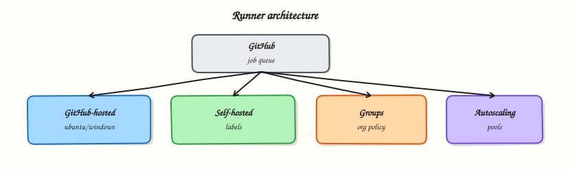

# GitHub-Hosted and Self-Hosted Runners

## Overview


Decide when GitHub-hosted runners are enough, when self-hosted capacity is required, and how labels, runner groups, and autoscaling keep jobs on the right fleet.

A **runner** is the machine that executes a job. **GitHub-hosted** runners are ephemeral VMs (or containers) GitHub operates — labelled `ubuntu-latest`, `windows-latest`, `macos-latest`, plus larger and GPU SKUs on paid plans. **Self-hosted** runners are machines *you* register; they can reach private networks, use custom images, and scale under your cloud account. **Runner groups** and **labels** control which repositories may use which capacity.

This is a core tutorial in **Module 3 · Runners** of the REBASH Academy **GitHub Actions for Cloud & DevOps Engineers** series — written for Cloud, DevOps, Platform, and SRE engineers.


## Prerequisites


- [GitHub Actions Basics: Workflows, Jobs, and Steps](github-actions-basics-workflows-jobs-steps.md)
- Basic Linux administration helps for self-hosted labs


## Learning Objectives


By the end of this tutorial, you will be able to:

- [ ] Contrast GitHub-hosted and self-hosted trade-offs  
- [ ] Select `runs-on` labels intentionally  
- [ ] Explain organisation runner groups and repository access  
- [ ] Outline why autoscaling exists (queue depth and cost)  
- [ ] List security risks of unprotected self-hosted runners


## Architecture


This topic’s control points and relationships are shown below.




## Theory


### What it is

GitHub schedules jobs; **runners** claim them. With hosted runners you only declare `runs-on: ubuntu-latest` (or a specific image / larger runner label). GitHub provisions a clean environment, runs your steps, and destroys the VM afterward — strong isolation for public pull requests.

**Self-hosted runners** install the Actions runner agent on a VM, bare metal, or Kubernetes-backed pool. You choose the operating system, tools, and network path (for example, access to an internal Artifactory or a private Kubernetes API). Registration associates the runner with a repository, organisation, or enterprise. **Labels** (default OS labels plus custom ones such as `gpu` or `prod-build`) appear in `runs-on:` so only matching jobs land on that machine. **Runner groups** (organisation / enterprise) restrict which repositories may target a set of runners — essential when privileged builders must not be usable by every forkable repo.

**Autoscaling** means capacity grows when the pending job queue is deep and shrinks when idle. Patterns include cloud VM scale sets, Actions Runner Controller (ARC) on Kubernetes, and vendor autoscalers. Cold starts trade cost savings for slower first jobs; warm pools mitigate that.

| Kind | Who operates | Typical use |
|------|--------------|-------------|
| GitHub-hosted | GitHub | Public CI, standard Linux/Windows/macOS |
| Larger / GPU hosted | GitHub (paid) | Heavier builds without self-hosting |
| Self-hosted | You | Private network, custom hardware, compliance |

### Why it matters

Wrong runner choices create security and reliability debt: a self-hosted runner on a developer laptop that accepts jobs from a public fork is a classic compromise path; missing labels leave GPU jobs queued forever; static fleets burn money overnight. Platform teams treat runners as **product infrastructure** — patched, monitored, labelled, and grouped like any other fleet. Minute quotas on hosted runners also drive FinOps conversations: cache well, fail fast, and move long private builds to self-hosted when economics favour it.

### How it works

1. Job becomes ready; GitHub looks for a runner matching `runs-on` labels and access scope.
2. Hosted: assign an ephemeral VM/image with preinstalled software (see runner image notes).
3. Self-hosted: idle agent polls; on claim, it executes steps in the configured work directory.
4. Logs stream to GitHub; the job concludes; hosted VMs are discarded; self-hosted agents return to idle (unless ephemeral mode tears them down).
5. Autoscalers watch queue metrics or webhook signals and create or delete runner instances.

You can complete this module’s YAML without registering a self-hosted runner — use `ubuntu-latest` and document when you *would* switch. Register a self-hosted agent only on machines you control, never on untrusted shared desktops for public repositories.

### Key concepts and comparisons

| Concern | GitHub-hosted | Self-hosted |
|---------|---------------|-------------|
| Isolation for forks | Strong (ephemeral) | You must harden / use ephemeral runners |
| Private network | Limited | Native |
| Custom tools / GPUs | Larger SKUs or workaround | Full control |
| Ops burden | Low | Patching, scaling, secrets on host |
| Cost model | Minutes | Cloud VM + idle waste |

| Control | Purpose |
|---------|---------|
| Labels | Match job requirements to capacity |
| Runner groups | Limit which repos can use privileged fleets |
| Ephemeral self-hosted | One job per instance — closer to hosted isolation |

### Common pitfalls

- Registering a personal laptop as an organisation runner for open-source forks.
- Using self-hosted runners for untrusted `pull_request` workflows from forks without isolation.
- Forgetting custom labels so jobs never start (or omitting labels so the wrong machine takes them).
- Assuming self-hosted disks are clean between jobs — leftover files and Docker images cause flaky builds unless you use ephemeral runners or strict cleanup.
- Equating “Docker available on the runner” with safe Docker-in-Docker for every workload.


## Hands-on Lab


Create a workspace for this tutorial.

```bash
mkdir -p ~/rebash-github-actions/module-03/.github/workflows && cd ~/rebash-github-actions/module-03/.github/workflows
```

**Focus:** contrast github-hosted labels with a self-hosted tagged job

### Step 1 – Hosted vs self-hosted definitions

```bash
mkdir -p .github/workflows notes
cat > notes/runners.md << 'EOF'
# Runner notes
- github-hosted: ubuntu-latest — patched by GitHub, ephemeral
- self-hosted: you patch OS, scale, isolate secrets
- Prefer labels like [self-hosted, linux, rebash]
EOF
cat > .github/workflows/runners.yml << 'EOF'
name: Runner shapes
on: [workflow_dispatch]
permissions:
  contents: read
jobs:
  hosted:
    runs-on: ubuntu-latest
    steps:
      - run: uname -a
  self_hosted_shape:
    runs-on: [self-hosted, linux, rebash]
    if: false
    steps:
      - run: echo "Enable when a labelled runner exists"
EOF
```

### Step 2 – Validate labels

```bash
grep -E 'ubuntu-latest|self-hosted' .github/workflows/runners.yml
test -f notes/runners.md
```

### Final step – Cleanup note

```bash
# Keep ~/rebash-github-actions/ for later tutorials
```


## Validation


- [ ] Lab commands run under `~/rebash-github-actions/module-03/.github/workflows/`
- [ ] You can explain each Theory section in your own words
- [ ] You used modern tooling where it applies to this topic
- [ ] You can describe one production failure mode for this topic


## Code Walkthrough


Production practice for **GitHub-Hosted and Self-Hosted Runners** always combines:

1. Inspect before you change (status, plan, logs, dry-run)
2. Prefer reversible, documented changes (Git, IaC, drop-ins, version pins)
3. Capture evidence (command output, pipeline logs) for handovers
4. Prefer current tools and APIs over legacy shortcuts
5. Least privilege — escalate credentials only when required

Keep runbooks short enough to follow under pressure. Automate checks; keep humans for judgement.


## Security Considerations


- Treat credentials and tokens for github-actions as privileged — never commit them
- Prefer short-lived auth (OIDC, roles, SSO) over long-lived keys
- Validate blast radius before apply/deploy/delete operations
- Restrict who can approve production changes
- Collect audit logs; limit who can read sensitive traces


## Common Mistakes


!!! warning "Registering a personal laptop as an organisation runner for open-source forks."
    Validate assumptions against the Theory section and official docs before changing production.

!!! warning "Using self-hosted runners for untrusted `pull_request` workflows from forks without isolat"
    Lab shortcuts (open security groups, admin roles, skip approvals) must not ship unchanged.

!!! warning "Changing production without a rollback path"
    Always know how to revert (previous artefact, prior release, state rollback, DNS failback).


## Best Practices


- Encode GitHub-Hosted and Self-Hosted Runners changes as code and review them in pull requests
- Pin versions (images, modules, actions, provider plugins)
- Separate environments with clear promotion gates
- Alert on symptoms with runbooks attached
- Destroy lab resources; tag everything with owner and expiry where possible


## Troubleshooting


| Symptom | Likely cause | Fix |
|---------|--------------|-----|
| Auth / permission denied | Wrong identity, policy, or scope | Check caller identity, roles, and least-privilege policies |
| Timeout / no route | Network, DNS, security group, or endpoint | Trace path, DNS, and allow-lists before retrying |
| Drift / unexpected plan | Manual change or wrong state/workspace | Reconcile desired vs actual; avoid click-ops on managed resources |
| Pipeline/job red | Flaky step, cache, or missing secret | Read failing step logs; bisect recent workflow/config changes |
| Cost spike | Idle load balancer, NAT, oversized compute | Inventory billable resources; stop/delete labs promptly |


## Summary


**GitHub-Hosted and Self-Hosted Runners** is essential for Cloud and DevOps engineers working with github-actions. Practise the lab until the inspection and change path is muscle memory, then continue the track.


## Interview Questions


1. Pros and cons of github-hosted versus self-hosted runners?
2. Jobs queued forever on self-hosted — what do you check?
3. Why are labels important for runner pools?
4. What isolation risks do self-hosted runners have with public forks?
5. How do you patch and monitor self-hosted fleets?

!!! tip "Sample answer — question 2"
    Verify the runner is online, labels match runs-on, and the repository is allowed to use the runner group.

!!! tip "Sample answer — question 4"
    Never use self-hosted runners for untrusted public fork PRs without hard isolation.


## Related Tutorials


- [Course overview](index.md)
- [Workflow Syntax: Matrix and Reusable Workflows](workflow-syntax-matrix-and-reusable.md)


## References


- [About GitHub-hosted runners](https://docs.github.com/en/actions/using-github-hosted-runners/about-github-hosted-runners)  
- [About self-hosted runners](https://docs.github.com/en/actions/hosting-your-own-runners/managing-self-hosted-runners/about-self-hosted-runners)  
- [Managing access with runner groups](https://docs.github.com/en/actions/hosting-your-own-runners/managing-self-hosted-runners/managing-access-to-self-hosted-runners-using-groups)
