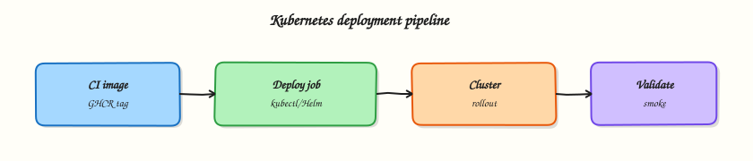

# Kubernetes Deployments with GitHub Actions

## Overview

Sketch a GitHub Actions deploy job that applies a SHA-tagged image with `kubectl` or Helm, waits for rollout success, documents rollback, and draws a clear boundary between push Continuous Delivery (CD) and GitOps pull controllers.

Pipelines that **push** manifests need a secure path into the cluster. Prefer short-lived credentials — OpenID Connect (OIDC) to a cloud Identity and Access Management (IAM) role that can call the Kubernetes API, or a narrowly scoped kubeconfig stored as an environment secret — never a cluster-admin key in unprotected repository secrets. Progressive delivery and rollbacks sit on Deployments or Helm releases. **GitOps** (Flux / Argo CD) inverts the model: the cluster pulls desired state from Git; CI updates Git rather than talking to the API directly.

This is a core tutorial in **Module 8 · Kubernetes Deployments** of the REBASH Academy **GitHub Actions for Cloud & DevOps Engineers** series — written for Cloud, DevOps, Platform, and SRE engineers.

## Prerequisites

- [Docker Pipelines with GitHub Actions](docker-pipelines-with-github-actions.md)

## Learning Objectives

By the end of this tutorial, you will be able to:

- [ ] Sketch a `kubectl` or Helm deploy job with environment protection  
- [ ] Wait on `rollout status` / Helm hooks as validation  
- [ ] Outline rollback (Helm revision or prior image digest)  
- [ ] Compare push CD with GitOps pull  
- [ ] State when CI should stop applying to the cluster

## Architecture

This topic’s control points and relationships are shown below.



## Theory

### What it is

**Kubernetes deployment from GitHub Actions** means a job updates cluster state after Module 7 builds and (ideally) scans an image. Typical tools:

| Mode | Who applies changes | Fit |
|------|---------------------|-----|
| Push CD (`kubectl` / Helm) | Workflow job | Simple apps, controlled envs, demos |
| GitOps pull | Controller (Argo CD / Flux) | Multi-cluster, strong drift control |
| Hybrid | CI updates Git; controller syncs | Common enterprise pattern |

Authenticate with OIDC to Amazon Elastic Kubernetes Service (EKS), Azure Kubernetes Service (AKS), or Google Kubernetes Engine (GKE) (Module 10), or mount a short-lived kubeconfig. Deploy the **same digest** produced in the Docker pipeline — never `latest`.

### Why it matters

Static kubeconfigs in CI are high-value secrets and hard to rotate. Environment protection and required reviewers shrink blast radius for production. Rollouts without validation leave pods CrashLooping while the job reports success. Confusing push CI with GitOps causes double-writes: Actions and Argo CD fight over the same Deployment and drift becomes chronic.

### How it works

1. Gate the workflow on `main` (or a release tag) and a GitHub **Environment** (`staging` / `production`) with protection rules.  
2. Authenticate to the cluster (OIDC + `aws eks update-kubeconfig`, `az aks get-credentials`, or a secret kubeconfig).  
3. Run `kubectl set image` / `kubectl apply -k` or `helm upgrade --install` with the Module 7 image tag (`:<sha>` or `@sha256:…`).  
4. **Validate**: `kubectl rollout status --timeout=…` or Helm wait; fail the job on timeout. Optional smoke checks against the Service or Ingress.  
5. **Rollback**: `helm rollback <release> <revision>`, or redeploy the last known-good digest; under GitOps, revert the Git commit and let the controller sync.

Keep production behind manual approval on the environment. Prefer GitOps when many clusters or strict drift detection matter more than push latency.

### Key concepts and comparisons

| Pattern | Idea | Rollback |
|---------|------|----------|
| Rolling update | Default Deployment surge | Prior ReplicaSet / Helm revision |
| Canary | Partial traffic to new version | Shift weight back |
| Blue-green | Two stacks; cut over Service/Ingress | Point traffic at previous stack |
| GitOps | Desired state in Git | Revert commit |

### Common pitfalls

- Cluster-admin credentials in unprotected repository secrets.  
- Deploying `latest` instead of the SHA built in the same pipeline.  
- Declaring success without `rollout status` or health probes.  
- Both CI and Argo CD applying the same Deployment (duelling controllers).  
- Skipping `helm history` so rollback targets are unclear.

## Hands-on Lab
Create a workspace for this tutorial.

```bash
mkdir -p ~/rebash-github-actions/module-08/{.github/workflows,manifests} && cd ~/rebash-github-actions/module-08/{.github/workflows,manifests}
git init -q
```

**Focus:** author and validate CI config for Kubernetes Deployments with GitHub Actions

### Step 1 – Write a minimal pipeline

```bash
mkdir -p .github/workflows
cat > .github/workflows/lab.yml << 'EOF'
name: lab
on: workflow_dispatch
jobs:
  validate:
    runs-on: ubuntu-latest
    steps:
      - uses: actions/checkout@v4
      - run: echo "workflow ok"
EOF
ls -la
sed -n '1,80p' .github/workflows/lab.yml
```

### Step 2 – Static checks before push

```bash
# Syntax / structure sanity (no runner required)
test -s .github/workflows/lab.yml
grep -E 'script:|runs-on:|steps:' .github/workflows/lab.yml
# When a runner is available, push a branch and confirm the job is green
```

### Final step – Cleanup note

```bash
# Keep ~/rebash-github-actions/ for later tutorials; delete remote test branches when finished
```

## Validation

- [ ] Lab commands run under `~/rebash-github-actions/module-08/{.github/workflows,manifests}/`
- [ ] You can explain each Theory section in your own words
- [ ] You used modern tooling where it applies to this topic
- [ ] You can describe one production failure mode for this topic

## Code Walkthrough

Production practice for **Kubernetes Deployments with GitHub Actions** always combines:

1. Inspect before you change (status, plan, logs, dry-run)
2. Prefer reversible, documented changes (Git, IaC, drop-ins, version pins)
3. Capture evidence (command output, pipeline logs) for handovers
4. Prefer current tools and APIs over legacy shortcuts
5. Least privilege — escalate credentials only when required

Keep runbooks short enough to follow under pressure. Automate checks; keep humans for judgement.

## Security Considerations

- Treat credentials and tokens for github-actions as privileged — never commit them
- Prefer short-lived auth (OIDC, roles, SSO) over long-lived keys
- Validate blast radius before apply/deploy/delete operations
- Restrict who can approve production changes
- Collect audit logs; limit who can read sensitive traces

## Common Mistakes

!!! warning "Cluster-admin credentials in unprotected repository secrets.  "
    Validate assumptions against the Theory section and official docs before changing production.

!!! warning "Deploying `latest` instead of the SHA built in the same pipeline.  "
    Lab shortcuts (open security groups, admin roles, skip approvals) must not ship unchanged.

!!! warning "Changing production without a rollback path"
    Always know how to revert (previous artefact, prior release, state rollback, DNS failback).

## Best Practices

- Encode Kubernetes Deployments with GitHub Actions changes as code and review them in pull requests
- Pin versions (images, modules, actions, provider plugins)
- Separate environments with clear promotion gates
- Alert on symptoms with runbooks attached
- Destroy lab resources; tag everything with owner and expiry where possible

## Troubleshooting

| Symptom | Likely cause | Fix |
|---------|--------------|-----|
| Auth / permission denied | Wrong identity, policy, or scope | Check caller identity, roles, and least-privilege policies |
| Timeout / no route | Network, DNS, security group, or endpoint | Trace path, DNS, and allow-lists before retrying |
| Drift / unexpected plan | Manual change or wrong state/workspace | Reconcile desired vs actual; avoid click-ops on managed resources |
| Pipeline/job red | Flaky step, cache, or missing secret | Read failing step logs; bisect recent workflow/config changes |
| Cost spike | Idle load balancer, NAT, oversized compute | Inventory billable resources; stop/delete labs promptly |

## Summary

**Kubernetes Deployments with GitHub Actions** is essential for Cloud and DevOps engineers working with github-actions. Practise the lab until the inspection and change path is muscle memory, then continue the track.

## Interview Questions

1. How does **Kubernetes Deployments with GitHub Actions** show up when operating Cloud or production platforms?
2. What would you check first if this area misbehaves in production?
3. Which modern tools or APIs replace older equivalents here?
4. What security control should accompany this capability?
5. How would you automate verification of this topic in CI?

!!! tip "Sample answer — question 2"
    Start with blast radius and recent changes, gather evidence (logs, status, plan/diff), then fix forward with a known rollback path — not guesswork.

## Related Tutorials

- [Course overview](index.md)
- - [Terraform Pipelines with GitHub Actions](terraform-pipelines-with-github-actions.md)

## References

- [Deploying to Kubernetes](https://docs.github.com/en/actions/deployment/deploying-to-your-cloud-provider/deploying-to-kubernetes) · [Environments](https://docs.github.com/en/actions/deployment/targeting-different-environments/using-environments-for-deployment) · [Helm upgrade](https://helm.sh/docs/helm/helm_upgrade/) · [kubectl rollout](https://kubernetes.io/docs/reference/kubectl/generated/kubectl_rollout/)
