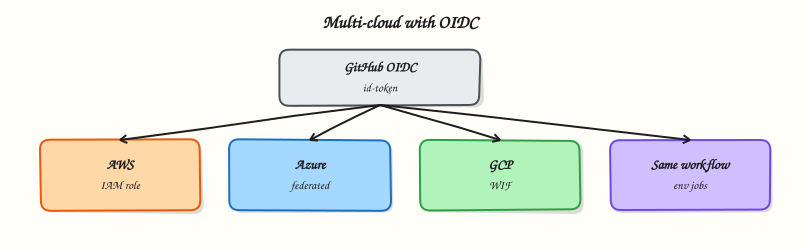

# Multi-Cloud Deployments with GitHub Actions

## Overview

Production teams deploy to Amazon Web Services (AWS), Microsoft Azure, and Google Cloud Platform (GCP) from the same repository. GitHub Actions authenticates with **OpenID Connect (OIDC)** so jobs receive short-lived cloud credentials — no long-lived access keys in repository secrets. This tutorial compares the three OIDC patterns as **YAML stubs** you validate offline; you adapt trust policies and role names to your accounts later.

This is **Tutorial 10** in **Module 10: Cloud Deployments** of the REBASH Academy **GitHub Actions for Cloud & DevOps Engineers** series — written for Cloud, DevOps, Platform, and SRE engineers.

## Prerequisites

- [Terraform Pipelines with GitHub Actions](terraform-pipelines-with-github-actions.md)
- [Secrets, Variables, and OIDC](secrets-variables-and-oidc.md)
- Basic familiarity with one cloud provider's console (optional for the lab)

## Learning Objectives

By the end of this tutorial, you will be able to:

- [ ] Configure OIDC trust for AWS, Azure, and GCP from GitHub Actions
- [ ] Compare federation patterns in a single reference table
- [ ] Author deploy workflow stubs without embedding real cloud credentials
- [ ] Explain least-privilege role design per environment
- [ ] Choose when multi-cloud CI is worth the operational cost

## Architecture

GitHub mints a job JWT; each cloud provider validates issuer and subject, then returns temporary credentials.



## Theory

### What it is

**Multi-cloud deployment from GitHub Actions** means one repository can target AWS (Elastic Container Service (ECS), Elastic Kubernetes Service (EKS)), Azure (Azure Kubernetes Service (AKS)), and GCP (Google Kubernetes Engine (GKE), Cloud Run) using provider-specific OIDC actions. Each cloud maps the GitHub JWT **subject** (`sub`) and **audience** (`aud`) to a role, service principal, or workload identity.

| Cloud | GitHub action (typical) | Cloud identity | Notes |
|-------|-------------------------|----------------|-------|
| AWS | `aws-actions/configure-aws-credentials` | IAM role via OIDC | `role-to-assume` + `aws-region` |
| Azure | `azure/login` | App registration / federated credential | `client-id`, `tenant-id`, `subscription-id` |
| GCP | `google-github-actions/auth` | Workload Identity Federation | `workload_identity_provider`, `service_account` |

**No real credentials in this lab** — stubs use placeholder ARNs and IDs you replace in your sandbox.

### Why it matters

Long-lived access keys in GitHub secrets leak through logs, forks, and compromised workflows. OIDC ties credentials to a specific repository, ref, and environment. Multi-cloud teams need a **consistent pattern** (permissions, environments, concurrency) even when cloud APIs differ.

### How it works

1. Workflow sets `permissions: id-token: write` and `contents: read` (minimum for OIDC).
2. Cloud admin configures trust: GitHub issuer `https://token.actions.githubusercontent.com`, audience, and subject filters (repo, environment, branch).
3. Job runs cloud login action → temporary credentials in environment.
4. Deploy step uses cloud CLI (`aws`, `az`, `gcloud`) or Infrastructure as Code (IaC) with those credentials.
5. Production deploys use GitHub **Environments** with required reviewers.

Example AWS OIDC block (documentation — wrap expressions for MkDocs):


```yaml
permissions:
  id-token: write
  contents: read

- uses: aws-actions/configure-aws-credentials@v4
  with:
    role-to-assume: arn:aws:iam::123456789012:role/github-actions-deploy
    aws-region: eu-west-1
```


### Key concepts and comparisons

| Concern | AWS | Azure | GCP |
|---------|-----|-------|-----|
| Trust anchor | IAM OIDC provider | Entra ID federated credential | Workload Identity Pool |
| Subject claim | `repo:ORG/REPO:ref:refs/heads/main` | Same pattern via credential subject | Attribute mapping from JWT |
| Typical deploy target | ECS, EKS, Lambda | AKS, App Service | GKE, Cloud Run |
| Secret alternative | Avoid `AWS_ACCESS_KEY_ID` | Avoid client secret | Avoid JSON key in secrets |

### Common pitfalls

- Missing `id-token: write` → OIDC step fails silently or with opaque errors.
- Trust policy too broad (`repo:ORG/*:*`) → any repository in the org can assume production roles.
- Fork pull requests receiving cloud credentials → exfiltration risk; use `pull_request_target` only with extreme care.
- Different regions/subscriptions hard-coded in every workflow instead of environment variables.
- Assuming one OIDC role can admin all three clouds — keep roles per cloud and per environment.

## Hands-on Lab

### Objective

Author three OIDC deploy workflow **stubs** (AWS, Azure, GCP), validate YAML offline, and produce a multi-cloud OIDC matrix YAML — without real cloud credentials.

### Prerequisites

- Python 3 with PyYAML
- Optional: `actionlint` for extended workflow linting

### Lab environment

Workspace: `~/rebash-github-actions/module-10`

``` {.bash .ra-terminal title="Terminal"}
mkdir -p ~/rebash-github-actions/module-10/.github/workflows && cd ~/rebash-github-actions/module-10
set -euo pipefail
python3 --version | tee python-version.txt
```

### Real-world scenario

A platform team standardises multi-cloud deploy workflows. You deliver reviewed YAML stubs and a validated comparison matrix before cloud admins wire trust policies in each account.

### Step-by-step tasks

#### Task 1 – AWS OIDC deploy stub

Create `.github/workflows/deploy-aws-stub.yml`:

```yaml title="deploy-aws-stub.yml"
name: Deploy AWS (stub)
on:
  workflow_dispatch:

permissions:
  id-token: write
  contents: read

jobs:
  deploy:
    runs-on: ubuntu-latest
    environment: staging
    steps:
      - uses: actions/checkout@v4
      - name: Configure AWS credentials (OIDC)
        uses: aws-actions/configure-aws-credentials@v4
        with:
          role-to-assume: arn:aws:iam::000000000000:role/PLACEHOLDER-github-actions
          aws-region: eu-west-1
      - name: Prove AWS CLI context (stub)
        run: |
          aws sts get-caller-identity || echo "OIDC not configured — stub only"
```

Validate offline:

``` {.bash .ra-terminal title="Terminal"}
cd ~/rebash-github-actions/module-10
set -euo pipefail
python3 -c "import yaml; yaml.safe_load(open('.github/workflows/deploy-aws-stub.yml')); print('aws stub OK')"
grep -q 'id-token: write' .github/workflows/deploy-aws-stub.yml
```

!!! example "Expected output"
    `aws stub OK`; OIDC permission present.


#### Task 2 – Azure and GCP OIDC stubs

Create `.github/workflows/deploy-azure-stub.yml`:

```yaml title="deploy-azure-stub.yml"
name: Deploy Azure (stub)
on:
  workflow_dispatch:

permissions:
  id-token: write
  contents: read

jobs:
  deploy:
    runs-on: ubuntu-latest
    environment: staging
    steps:
      - uses: actions/checkout@v4
      - name: Azure login (OIDC)
        uses: azure/login@v2
        with:
          client-id: PLACEHOLDER-CLIENT-ID
          tenant-id: PLACEHOLDER-TENANT-ID
          subscription-id: PLACEHOLDER-SUBSCRIPTION-ID
      - name: Prove Azure CLI context (stub)
        run: |
          az account show || echo "OIDC not configured — stub only"
```

Create `.github/workflows/deploy-gcp-stub.yml`:

```yaml title="deploy-gcp-stub.yml"
name: Deploy GCP (stub)
on:
  workflow_dispatch:

permissions:
  id-token: write
  contents: read

jobs:
  deploy:
    runs-on: ubuntu-latest
    environment: staging
    steps:
      - uses: actions/checkout@v4
      - name: Authenticate to Google Cloud (OIDC)
        uses: google-github-actions/auth@v2
        with:
          workload_identity_provider: projects/PLACEHOLDER/locations/global/workloadIdentityPools/POOL/providers/PROVIDER
          service_account: gha-deploy@PLACEHOLDER.iam.gserviceaccount.com
      - name: Prove gcloud context (stub)
        run: |
          gcloud auth list || echo "OIDC not configured — stub only"
```

Validate offline:

``` {.bash .ra-terminal title="Terminal"}
cd ~/rebash-github-actions/module-10
set -euo pipefail
python3 -c "
import yaml, pathlib
for p in pathlib.Path('.github/workflows').glob('deploy-*-stub.yml'):
    yaml.safe_load(open(p))
    print(p.name, 'OK')
"
```

!!! example "Expected output"
    All three stub files parse successfully.


#### Task 3 – Multi-cloud OIDC matrix

Create `multi-cloud-oidc.yaml`:

```yaml title="multi-cloud-oidc.yaml"
# Multi-cloud OIDC comparison (Module 10 lab)
clouds:
  aws:
    github_permission: id-token write
    login_action: aws-actions/configure-aws-credentials
    cloud_trust: IAM OIDC provider and role trust
    lab_placeholder: role ARN
    production_gate: environment production with reviewers
  azure:
    github_permission: id-token write
    login_action: azure/login
    cloud_trust: Federated credential on app registration
    lab_placeholder: client, tenant, and subscription IDs
    production_gate: environment production with reviewers
  gcp:
    github_permission: id-token write
    login_action: google-github-actions/auth
    cloud_trust: Workload Identity Pool and SA binding
    lab_placeholder: WIF provider and service account
    production_gate: environment production with reviewers
trust_subjects:
  examples:
    - repo:my-org/my-app:environment:production
    - repo:my-org/my-app:ref:refs/heads/main
  rule: Never use wildcard repo subjects for production roles
```

Validate and archive:

``` {.bash .ra-terminal title="Terminal"}
cd ~/rebash-github-actions/module-10
set -euo pipefail
python3 -c "
import yaml
with open('multi-cloud-oidc.yaml') as f:
    doc = yaml.safe_load(f)
assert set(doc['clouds'].keys()) == {'aws', 'azure', 'gcp'}
assert 'Workload Identity' in doc['clouds']['gcp']['cloud_trust']
for cloud in doc['clouds'].values():
    assert cloud['github_permission'] == 'id-token write'
print('multi-cloud-oidc.yaml OK')
"
tar -czf module-10-evidence.tgz .github/workflows/*.yml multi-cloud-oidc.yaml
ls -l module-10-evidence.tgz | tee evidence.txt
```

!!! example "Expected output"
    `multi-cloud-oidc.yaml OK`; comparison matrix and evidence archive created.


#### Task 4 – Validate permissions pattern across stubs

``` {.bash .ra-terminal title="Terminal"}
cd ~/rebash-github-actions/module-10
set -euo pipefail

for f in .github/workflows/deploy-*-stub.yml; do
  grep -q 'environment: staging' "$f" || { echo "missing environment in $f"; exit 1; }
  grep -q 'workflow_dispatch' "$f" || { echo "missing dispatch in $f"; exit 1; }
done
echo 'all stubs follow staging + manual dispatch pattern'
```

!!! example "Expected output"
    `all stubs follow staging + manual dispatch pattern`


### Validation steps

- [ ] Three cloud stub workflows parse with PyYAML
- [ ] Each stub requests `id-token: write`
- [ ] Each stub uses `environment: staging` (production pattern documented)
- [ ] `multi-cloud-oidc.yaml` covers AWS, Azure, and GCP and parses with Python

### Common errors and fixes

| Error | Cause | Fix |
|-------|-------|-----|
| `Could not assume role` | Trust policy mismatch | Align `sub`/`aud` with GitHub docs |
| Azure login fails | Wrong tenant or federated credential | Verify app registration subject |
| GCP permission denied | SA not bound to WIF pool | Add `iam.workloadIdentityUser` binding |
| Credentials on fork PR | Over-permissive `on: pull_request` | Restrict to `pull_request` from same repo or plan-only |
| Missing id-token permission | Omitted permissions block | Add `id-token: write` at workflow or job level |

### Challenge exercise

Add a reusable workflow `cloud-login.yml` with `workflow_call` inputs for `cloud: aws|azure|gcp` that calls the correct login action. Validate with Python that all three cloud keys exist in `multi-cloud-oidc.yaml`.

### Learning outcomes

- Authored OIDC deploy stubs for three clouds
- Compared trust patterns in validated YAML matrix
- Validated workflows offline without cloud credentials
- Applied environment gating consistently

### Cleanup

``` {.bash .ra-terminal title="Terminal"}
# Keep stubs under ~/rebash-github-actions/module-10 for portfolio review
ls ~/rebash-github-actions/module-10/.github/workflows/
```

## Validation

- [ ] Lab completed under `~/rebash-github-actions/module-10/`
- [ ] You can explain OIDC vs static keys for each cloud
- [ ] You can describe a safe trust subject for production
- [ ] You can name one production failure mode (fork exfiltration, broad trust)

## Code Walkthrough

1. **OIDC first** — default to federation; static keys only as temporary bridge.
2. **Environment gates** — staging vs production roles and reviewers.
3. **Stub before prod** — validate YAML structure before cloud admin changes.
4. **One role per purpose** — deploy ≠ Terraform state admin ≠ read-only plan.
5. **Manual dispatch for stubs** — prevent accidental runs until trust exists.

## Security Considerations

- Trust policies must pin repository, ref, and environment — avoid org-wide wildcards for production.
- Never pass cloud credentials to jobs triggered from fork pull requests.
- Rotate and audit federated credentials like any IAM change.
- Separate read-only plan roles from deploy roles (Module 9 pattern).
- Log `get-caller-identity` / `account show` output for audit trails (no secrets in logs).

## Common Mistakes

!!! warning "Static admin keys in repository secrets"
    Keys leak and rarely rotate. **Fix:** OIDC roles with least privilege per environment.

!!! warning "Trust policy `repo:ORG/*`"
    Any repo in the org can assume the role. **Fix:** pin `repo:ORG/REPO:environment:production`.

!!! warning "Missing environment protection on production deploy"
    Any maintainer can deploy. **Fix:** required reviewers and wait timers on `production`.

!!! warning "Copy-paste region/subscription across clouds"
    Deploys hit wrong account. **Fix:** environment variables per cloud and environment.

## Best Practices

- Centralise cloud account IDs and regions in GitHub variables (`vars.*`), not hard-coded in ten workflows.
- Use concurrency groups per environment to prevent overlapping deploys.
- Document trust policy changes in Infrastructure as Code where your org allows.
- Test OIDC in staging before promoting trust to production subjects.
- Prefer GitOps (Argo CD / Flux) for multi-cluster when push CD from Actions does not scale.

## Troubleshooting

| Symptom | Likely cause | Fix |
|---------|--------------|-----|
| `Not authorized to perform sts:AssumeRole` | IAM trust mismatch | Fix `sub`/`aud` in role trust |
| Azure `AADSTS` error | Federated credential subject | Update credential subject filter |
| GCP `Permission denied` on WIF | Pool/provider mapping | Verify attribute mapping |
| Works locally, fails in CI | Missing permissions block | Add `id-token: write` |
| Wrong account deployed | Variable typo | Assert account ID in deploy step |

## Summary

Multi-cloud GitHub Actions deploys share one OIDC mindset with cloud-specific login actions and trust configuration. Stubs and comparison tables let you review structure before touching real accounts. Next: [Security Scanning and Supply Chain](security-scanning-and-supply-chain.md).

## Interview Questions

**1. Why prefer OIDC over access keys in GitHub Actions?**

??? success "Reveal answer"
    OIDC mints short-lived credentials per job tied to repository, ref, and environment trust — reducing long-lived secret sprawl and enabling fine-grained IAM policies without storing keys in GitHub.

**2. What GitHub permission does OIDC require?**

??? success "Reveal answer"
    `permissions: id-token: write` (at workflow or job level) so GitHub can issue the JWT the cloud provider validates.

**3. How do AWS, Azure, and GCP differ in OIDC setup?**

??? success "Reveal answer"
    AWS uses an IAM OIDC identity provider and role trust; Azure uses Entra ID federated credentials on an app registration; GCP uses Workload Identity Federation mapping the JWT to a service account.

**4. Why gate production deploys with GitHub Environments?**

??? success "Reveal answer"
    Environments add required reviewers, wait timers, and environment-scoped secrets — so production deploys need explicit approval and cannot use staging credentials accidentally.

**5. What is the fork pull request exfiltration risk?**

??? success "Reveal answer"
    Workflows triggered by fork pull requests may run untrusted code with access to secrets or OIDC if misconfigured. Restrict secrets/OIDC to trusted refs or use pull-request workflows that do not checkout untrusted code with credentials.

**6. When is multi-cloud CI not worth it?**

??? success "Reveal answer"
    When operational overhead (three trust models, three audit trails, divergent runbooks) exceeds benefit — a single primary cloud with abstraction (Terraform/Kubernetes) often simplifies delivery.

**7. What should a deploy job log for audit without leaking secrets?**

??? success "Reveal answer"
    Cloud account/subscription/project ID, role name, region, artefact version or image digest, and environment name — not tokens or keys.

**8. How does Module 9 Terraform OIDC relate to Module 10 deploy OIDC?**

??? success "Reveal answer"
    Same federation mechanism; different IAM roles — plan roles are read-only on pull requests, deploy roles are write-capable and environment-gated on protected branches.

## Related Tutorials

- [Secrets, Variables, and OIDC](secrets-variables-and-oidc.md)
- [Terraform Pipelines with GitHub Actions](terraform-pipelines-with-github-actions.md)
- [Kubernetes Deployments with GitHub Actions](kubernetes-deployments-with-github-actions.md)

## References

- [GitHub OIDC with AWS](https://docs.github.com/en/actions/deployment/security-hardening-your-deployments/configuring-openid-connect-in-amazon-web-services)
- [GitHub OIDC with Azure](https://docs.github.com/en/actions/deployment/security-hardening-your-deployments/configuring-openid-connect-in-azure)
- [GitHub OIDC with Google Cloud](https://docs.github.com/en/actions/deployment/security-hardening-your-deployments/configuring-openid-connect-in-google-cloud-platform)
- [aws-actions/configure-aws-credentials](https://github.com/aws-actions/configure-aws-credentials)
