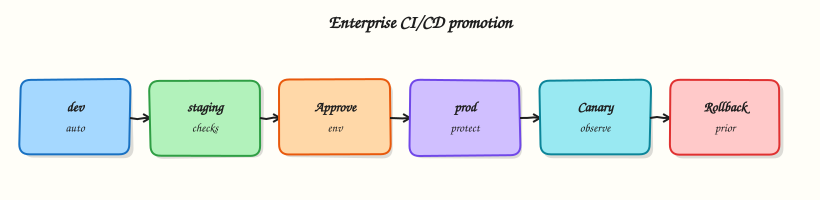

# Production Pipelines and Environments

## Overview

Production delivery needs more than a green build on `main`. GitHub **Environments** (`staging`, `production`) add required reviewers, wait timers, and scoped secrets. **Promotion** moves tested artefacts forward; **rollback** redeploys a prior version; **blue/green** and **canary** strategies reduce downtime and blast radius when releases go wrong.

This is **Tutorial 15** in **Module 15: Production Pipelines** of the REBASH Academy **GitHub Actions for Cloud & DevOps Engineers** series — written for Cloud, DevOps, Platform, and SRE engineers.

## Prerequisites

- [Composite Actions and Reusable Workflows](composite-actions-and-reusable-workflows.md)
- [Multi-Cloud Deployments with GitHub Actions](multi-cloud-deployments-with-github-actions.md)
- [Testing in GitHub Actions](testing-in-github-actions.md)

## Learning Objectives

By the end of this tutorial, you will be able to:

- [ ] Configure GitHub Environments with protection rules and secrets
- [ ] Model staging → production promotion in one workflow graph
- [ ] Implement manual approval gates before production deploy
- [ ] Document rollback using prior tag or Helm revision
- [ ] Explain blue/green and canary at a high level for Actions-driven deploys

## Architecture

Build once; deploy to staging automatically; production requires environment approval and promotion of the same artefact digest.



## Theory

### What it is

| Concept | Purpose |
|---------|---------|
| Environment | Named target (`staging`, `production`) with rules + secrets |
| Protection rules | Required reviewers, wait timer, deployment branches |
| Promotion | Same artefact/image digest advances after staging success |
| Rollback | Redeploy last known-good version (tag, Helm rev, prior stack) |
| Blue/green | Two stacks; switch traffic atomically |
| Canary | Route small % traffic to new version; increase if healthy |

Jobs declare `environment: production` to trigger protection UI and inject environment secrets.

### Why it matters

Auto-deploying every merge to production removes human judgement for high-risk changes. Shared staging catches integration issues. Rollback without a documented path extends incidents. Blue/green and canary limit user impact during partial failures.

### How it works

1. **Build job** — produce immutable artefact (container digest, Terraform plan ID).
2. **Deploy staging** — `environment: staging`, automatic on `main`.
3. **Smoke tests** — validate staging (Module 12).
4. **Deploy production** — `environment: production`, waits for required reviewers.
5. **Rollback job** — `workflow_dispatch` with `version:` input redeploys prior tag (documented runbook).
6. **Blue/green note** — Actions updates inactive stack, runs health checks, switches Service/Ingress or load balancer target group.
7. **Canary note** — progressive weight increase (service mesh, ALB weights, Flagger) with automated metric gates.

Example production gate (documentation):


```yaml
deploy-production:
  needs: [deploy-staging, smoke]
  runs-on: ubuntu-latest
  environment:
    name: production
    url: https://app.example.com
  steps:
    - run: echo "Deploy digest ${{ needs.build.outputs.digest }}"
```


### Key concepts and comparisons

| Strategy | Downtime | Complexity | Rollback speed |
|----------|----------|------------|----------------|
| Rolling (default K8s) | Low | Low | Redeploy prior RS |
| Blue/green | Very low | Medium | Switch traffic back |
| Canary | Minimal | High | Reduce canary weight |
| Recreate | Higher | Low | Redeploy old version |

### Common pitfalls

- Different image tag in staging vs production — not true promotion.
- Production environment without required reviewers — cosmetic gate only.
- Rollback workflow shares production credentials without extra approval.
- Skipping smoke tests after staging deploy.
- Conflating GitHub Environment with cloud environment account — naming collision confusion.

## Hands-on Lab

### Objective

Author a promotion workflow with staging and production environments (YAML stubs), encode deployment strategies as YAML, and validate structure offline.

### Prerequisites

- Python 3 with PyYAML

### Lab environment

Workspace: `~/rebash-github-actions/module-15`

```bash
mkdir -p ~/rebash-github-actions/module-15/.github/workflows && cd ~/rebash-github-actions/module-15
set -euo pipefail
```

### Real-world scenario

Release managers require automatic staging deploy on `main`, manual approval for production, same artefact digest promoted, and a rollback `workflow_dispatch` job backed by validated strategy YAML.

### Step-by-step tasks

#### Task 1 – Promotion workflow with environments

Create `.github/workflows/promote.yml`:


```yaml
name: Promote
on:
  push:
    branches: [main]
  workflow_dispatch:

permissions:
  contents: read

jobs:
  build:
    runs-on: ubuntu-latest
    outputs:
      digest: ${{ steps.meta.outputs.digest }}
    steps:
      - uses: actions/checkout@v4
      - id: meta
        run: |
          echo "digest=sha256:lab-$(git rev-parse --short HEAD)" >> "$GITHUB_OUTPUT"

  deploy-staging:
    needs: build
    runs-on: ubuntu-latest
    environment:
      name: staging
      url: https://staging.example.com
    steps:
      - run: echo "Deploy ${{ needs.build.outputs.digest }} to staging"

  smoke-staging:
    needs: deploy-staging
    runs-on: ubuntu-latest
    steps:
      - run: echo "Smoke check staging"
      - run: test 0 -eq 0

  deploy-production:
    needs: [build, smoke-staging]
    runs-on: ubuntu-latest
    environment:
      name: production
      url: https://app.example.com
    steps:
      - run: echo "Deploy SAME digest ${{ needs.build.outputs.digest }} to production"
```


Validate offline:

```bash
cd ~/rebash-github-actions/module-15
set -euo pipefail
python3 -c "import yaml; yaml.safe_load(open('.github/workflows/promote.yml')); print('promote workflow OK')"
grep -q 'environment:' .github/workflows/promote.yml
grep -q 'deploy-production' .github/workflows/promote.yml
```

**Expected output:** `promote workflow OK`; staging and production environments referenced.

#### Task 2 – Rollback workflow stub

Create `.github/workflows/rollback.yml`:


```yaml
name: Rollback
on:
  workflow_dispatch:
    inputs:
      target-tag:
        description: 'Prior release tag to redeploy (e.g. v1.2.3)'
        required: true

permissions:
  contents: read

jobs:
  rollback:
    runs-on: ubuntu-latest
    environment: production
    steps:
      - uses: actions/checkout@v4
        with:
          ref: ${{ inputs.target-tag }}
      - run: echo "Rollback deploy for tag ${{ inputs.target-tag }}"
      - run: echo "In Kubernetes: helm rollback or kubectl rollout undo"
```


Validate offline:

```bash
cd ~/rebash-github-actions/module-15
set -euo pipefail
python3 -c "import yaml; yaml.safe_load(open('.github/workflows/rollback.yml')); print('rollback workflow OK')"
grep -q 'workflow_dispatch' .github/workflows/rollback.yml
```

**Expected output:** `rollback workflow OK`

#### Task 3 – Deployment strategies as YAML

Create `deployment-strategies.yaml`:

```yaml
# Deployment strategies (Module 15)
strategies:
  blue_green:
    description: Maintain blue (current) and green (new) stacks
    steps:
      - deploy green with new digest
      - run health checks on green
      - switch Service or Ingress to green
    rollback: switch traffic back to blue without rebuild
  canary:
    description: Route small traffic percentage to new version
    initial_weight_percent: 10
    watch: [error_rate, latency_slo]
    abort_on: alert_fires
    tools: [Flagger, Argo Rollouts, mesh traffic split, ALB weights]
github_environments:
  staging:
    deploy_trigger: auto on main
  production:
    required_reviewers: true
    promotion: same digest from build job output
```

Validate offline:

```bash
cd ~/rebash-github-actions/module-15
set -euo pipefail
python3 -c "
import yaml
with open('deployment-strategies.yaml') as f:
    doc = yaml.safe_load(f)
assert 'blue_green' in doc['strategies']
assert doc['github_environments']['production']['promotion'] == 'same digest from build job output'
print('deployment-strategies.yaml OK')
"
```

**Expected output:** `deployment-strategies.yaml OK`

#### Task 4 – Offline validation bundle

Create `validate-module-15.sh`:

```bash
#!/usr/bin/env bash
set -euo pipefail
python3 -c "import yaml; yaml.safe_load(open('.github/workflows/promote.yml')); yaml.safe_load(open('.github/workflows/rollback.yml')); yaml.safe_load(open('deployment-strategies.yaml'))"
grep -q 'needs: build' .github/workflows/promote.yml
grep -q 'SAME digest' .github/workflows/promote.yml
echo 'module-15 validation passed'
```

Run and archive:

```bash
cd ~/rebash-github-actions/module-15
set -euo pipefail
chmod +x validate-module-15.sh
./validate-module-15.sh | tee validation.txt
tar -czf module-15-evidence.tgz .github/workflows/*.yml deployment-strategies.yaml validate-module-15.sh
ls -l module-15-evidence.tgz | tee evidence.txt
```

**Expected output:** `module-15 validation passed`

### Validation steps

- [ ] Promotion workflow deploys staging before production
- [ ] Production job uses `environment: production`
- [ ] Build output digest referenced in both deploy jobs
- [ ] Rollback workflow accepts target tag input
- [ ] `deployment-strategies.yaml` defines blue/green and canary and parses with Python

### Common errors and fixes

| Error | Cause | Fix |
|-------|-------|-----|
| Production deploy without approval | Environment rules not set | Add required reviewers in Settings |
| Staging/prod different builds | Rebuild in prod job | Pass digest artefact from build |
| Rollback checks out wrong ref | Input tag typo | Validate tag exists; protect tags |
| Smoke skipped | Missing `needs` | Chain smoke between staging and prod |
| Environment secret missing | Secret on wrong scope | Add secrets to `production` environment |

### Challenge exercise

Add `concurrency: group: production` with `cancel-in-progress: false` on production deploy in `promote.yml`. Extend `validate-module-15.sh` to grep for the concurrency block.

### Learning outcomes

- Modelled staging → production promotion graph
- Authored rollback dispatch workflow
- Encoded blue/green and canary strategies as validated YAML
- Enforced same-digest promotion pattern

### Cleanup

```bash
ls ~/rebash-github-actions/module-15/.github/workflows/
```

## Validation

- [ ] Lab completed under `~/rebash-github-actions/module-15/`
- [ ] You can configure environment protection rules in GitHub UI
- [ ] You can explain promotion vs rebuild
- [ ] You can describe rollback without rebuilding

## Code Walkthrough

1. **Build once** — digest/tag is promotion unit.
2. **Staging automatic** — catch integration issues early.
3. **Production gated** — environment reviewers + smoke pass.
4. **Rollback input** — prior tag checked out and redeployed.
5. **Strategy docs** — blue/green/canary owned by deploy tooling + runbooks.

## Security Considerations

- Production environment secrets must not be available to pull request workflows.
- Rollback workflow needs same approval rigour as forward deploy.
- Environment URLs should not leak internal-only hostnames publicly.
- Audit deployment events in GitHub Deployments API / audit log.
- Separate cloud roles for staging vs production (Module 10).

## Common Mistakes

!!! warning "Rebuild for production with `:latest`"
    Staging tested digest ≠ production image. **Fix:** promote build output.

!!! warning "Environment without reviewers"
    Approval button is theatre. **Fix:** required reviewers + branch restrictions.

!!! warning "No rollback workflow"
    Incident extends while building hotfix pipeline. **Fix:** documented rollback dispatch.

!!! warning "Canary without metrics"
    Traffic shift blind. **Fix:** SLO gates and automatic abort.

## Best Practices

- Use deployment branches (only `main` deploys production).
- Record deployment in GitHub Environments history for audit.
- Pair Actions promotion with GitOps for drift control where needed.
- Run game days: practice rollback quarterly.
- Keep staging representative of production topology.

## Troubleshooting

| Symptom | Likely cause | Fix |
|---------|--------------|-----|
| Waiting for approval stuck | Reviewer unavailable | Backup reviewers; break-glass process |
| Staging OK, prod fail | Config/secret drift | Align env vars; separate accounts by design |
| Rollback does not heal | DB migration forward-only | Expand rollback runbook; backward-compatible migrations |
| Double production deploy | Missing concurrency | Add concurrency group |
| Wrong URL in environment | Typo in `url:` field | Fix environment URL metadata |

## Summary

Production pipelines use GitHub Environments for approvals, promote immutable artefacts from staging to production, and document rollback plus blue/green/canary strategies. Next: [Troubleshooting GitHub Actions](troubleshooting-github-actions.md).

## Interview Questions

**1. What do GitHub Environment protection rules provide?**

??? success "Reveal answer"
    Required reviewers, wait timers, deployment branch filters, and environment-scoped secrets — so production deploy jobs pause for approval and use the correct credentials.

**2. What is promotion vs rebuilding for production?**

??? success "Reveal answer"
    Promotion deploys the same artefact digest tested in staging; rebuilding production risks shipping different bits than were validated.

**3. How should rollback work in a tag-based release model?**

??? success "Reveal answer"
    Redeploy a prior SemVer tag or prior Helm revision — checkout/ref that tag in a controlled rollback workflow with production environment approval.

**4. When is blue/green preferable to rolling updates?**

??? success "Reveal answer"
    When you need instant traffic switch and fast rollback without waiting for gradual pod replacement — at the cost of double infrastructure during cutover.

**5. What is the purpose of smoke tests between staging and production?**

??? success "Reveal answer"
    They verify the deployed artefact is minimally healthy in a production-like environment before human approval spends production risk budget.

**6. Why use `concurrency` on production deploy jobs?**

??? success "Reveal answer"
    Prevents overlapping production deploys that could leave the system in an inconsistent state or race shared resources.

**7. How do Environments relate to cloud accounts?**

??? success "Reveal answer"
    They are GitHub-side gates and secret scopes — you still map `staging`/`production` environments to separate cloud accounts/subscriptions via OIDC roles and variables.

**8. What is a canary deployment's main risk if metrics are ignored?**

??? success "Reveal answer"
    A bad release affects a subset of users initially, but without SLO monitoring the team may promote a failing version to 100% traffic.

## Related Tutorials

- [Multi-Cloud Deployments with GitHub Actions](multi-cloud-deployments-with-github-actions.md)
- [Kubernetes Deployments with GitHub Actions](kubernetes-deployments-with-github-actions.md)
- [Troubleshooting GitHub Actions](troubleshooting-github-actions.md)

## References

- [Environments for deployment](https://docs.github.com/en/actions/deployment/targeting-different-environments/using-environments-for-deployment)
- [Deployment protection rules](https://docs.github.com/en/actions/deployment/targeting-different-environments/managing-environments-for-deployment)
- [Concurrency](https://docs.github.com/en/actions/using-jobs/using-concurrency)
- [GitHub Deployments REST API](https://docs.github.com/en/rest/deployments)
