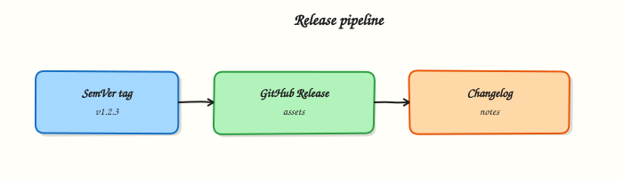

# Release Management and Versioning

## Overview

Releases turn commits into consumable versions customers and operators can trust. **Semantic Versioning (SemVer)** tags (`v1.4.2`), **GitHub Releases** with notes and binaries, and **changelog** automation from conventional commits keep delivery auditable and repeatable from GitHub Actions.

This is **Tutorial 13** in **Module 13: Release Management** of the REBASH Academy **GitHub Actions for Cloud & DevOps Engineers** series — written for Cloud, DevOps, Platform, SRE, and software engineers.

## Prerequisites

- [Testing in GitHub Actions](testing-in-github-actions.md)
- [Git — tags and releases](../git/repository-management-and-releases.md)
- GitHub CLI (`gh`) optional for local release simulation

## Learning Objectives

By the end of this tutorial, you will be able to:

- [ ] Apply SemVer tagging rules in CI (`major.minor.patch`)
- [ ] Create GitHub Releases with `gh release create` or `softprops/action-gh-release`
- [ ] Generate changelog sections from git history or conventional commits
- [ ] Gate releases on tests and security scans
- [ ] Attach build artefacts (binaries, SBOM) to releases

## Architecture

Tag push or manual dispatch triggers release job after quality gates; changelog and assets publish to GitHub Releases.



## Theory

### What it is

| Element | Role |
|---------|------|
| SemVer tag | Immutable pointer (`v2.1.0`) consumers pin |
| GitHub Release | User-facing page + asset downloads |
| Changelog | Human-readable what changed |
| Release workflow | Automates tag, notes, artefact upload |
| Draft/pre-release | Staging release before GA |

**SemVer rules (summary):** `MAJOR` breaking, `MINOR` features backward compatible, `PATCH` fixes. Pre-release: `v1.0.0-rc.1`.

### Why it matters

Floating `main` deploys are hard to roll back and support. Tags give operators a known version. Automated changelogs reduce release-day toil. Attachments (container digest, SBOM, binary) prove what shipped.

### How it works

1. Merge to `main` with conventional commits or maintained `CHANGELOG.md`.
2. Workflow on `push: tags: v*` or `workflow_dispatch` with version input.
3. Run tests and security jobs (`needs:`) before release.
4. Build artefacts; compute release notes (`git log`, `github-script`, or release-changelog-builder).
5. Create annotated tag if not present; `gh release create` with `--notes-file` and `--attach`.
6. Deploy workflows trigger on `release: published` event.

Example trigger (documentation):


```yaml
on:
  push:
    tags:
      - 'v*.*.*'
permissions:
  contents: write
```


### Key concepts and comparisons

| Approach | Pros | Cons |
|----------|------|------|
| Manual tag + release | Simple | Error-prone, inconsistent notes |
| Tag push triggers CI | Git as source of truth | Requires tag discipline |
| Release please / semantic-release | Automated bump | Setup learning curve |
| Draft releases | Review before publish | Extra step |

### Common pitfalls

- Tagging without running tests on the tagged commit.
- Reusing deleted tag names — breaks consumers caching old version.
- Changelog includes internal ticket noise only — no user impact.
- `contents: write` on every workflow — over-permissioned forks risk.
- Release assets not retained — compliance gap.

## Hands-on Lab

### Objective

Simulate SemVer tagging locally, author a release workflow stub triggered by version tags, generate a changelog file from git history, and validate offline.

### Prerequisites

- Git repository initialised in lab folder (local only is fine)
- Python 3 with PyYAML

### Lab environment

Workspace: `~/rebash-github-actions/module-13`

```bash title="Terminal"
mkdir -p ~/rebash-github-actions/module-13/.github/workflows && cd ~/rebash-github-actions/module-13
set -euo pipefail
git init -q 2>/dev/null || true
```

### Real-world scenario

Platform requires every production release to be a SemVer tag, GitHub Release with generated notes, and attached evidence tarball — only after tests pass.

### Step-by-step tasks

#### Task 1 – Local SemVer tag practice

```bash title="Terminal"
cd ~/rebash-github-actions/module-13
set -euo pipefail

echo 'module 13 release lab' > README.md
git add README.md 2>/dev/null || true
git -c user.email='lab@rebash.local' -c user.name='lab' commit -m 'chore: init module-13 lab' 2>/dev/null || true
git tag -a v0.1.0 -m 'lab patch release' 2>/dev/null || git tag v0.1.0
git tag -l 'v*' | tee tags.txt
```

!!! example "Expected output"
    `v0.1.0` listed in `tags.txt`.


#### Task 2 – Changelog generator script

Create `generate-changelog.sh`:

```bash title="generate-changelog.sh"
#!/usr/bin/env bash
set -euo pipefail
prev="${1:-}"
out="${2:-CHANGELOG.md}"
{
  echo "# Changelog"
  echo
  echo "## Unreleased"
  if [[ -n "$prev" ]] && git rev-parse "$prev" >/dev/null 2>&1; then
    git log --pretty=format:'- %s (%h)' "${prev}..HEAD"
  else
    git log --pretty=format:'- %s (%h)' -n 10
  fi
} > "$out"
echo "wrote $out"
```

Run it:

```bash title="Terminal"
cd ~/rebash-github-actions/module-13
set -euo pipefail
chmod +x generate-changelog.sh
./generate-changelog.sh '' CHANGELOG.md | tee changelog-gen.txt
test -s CHANGELOG.md
head -5 CHANGELOG.md
```

!!! example "Expected output"
    Non-empty `CHANGELOG.md` with commit subjects.


#### Task 3 – Release workflow stub

Create `.github/workflows/release.yml`:


```yaml
name: Release
on:
  push:
    tags:
      - 'v*.*.*'
  workflow_dispatch:
    inputs:
      version:
        description: 'SemVer tag without v prefix (e.g. 1.2.3)'
        required: true

permissions:
  contents: write

jobs:
  test-gate:
    runs-on: ubuntu-latest
    steps:
      - uses: actions/checkout@v4
      - run: echo "Replace with real test workflow needs"
      - run: test -f README.md

  release:
    needs: test-gate
    runs-on: ubuntu-latest
    steps:
      - uses: actions/checkout@v4
        with:
          fetch-depth: 0
      - name: Build release evidence
        run: |
          tar -czf release-evidence.tgz README.md CHANGELOG.md 2>/dev/null || tar -czf release-evidence.tgz README.md
      - name: Generate changelog
        run: |
          ./generate-changelog.sh "$(git describe --tags --abbrev=0 HEAD^ 2>/dev/null || echo '')" RELEASE_NOTES.md
      - name: Create GitHub Release
        env:
          GH_TOKEN: ${{ secrets.GITHUB_TOKEN }}
        run: |
          TAG="${GITHUB_REF_NAME}"
          if [[ "${{ github.event_name }}" == "workflow_dispatch" ]]; then
            TAG="v${{ inputs.version }}"
          fi
          gh release create "$TAG" release-evidence.tgz --notes-file RELEASE_NOTES.md --title "$TAG" || echo "gh not authenticated — stub OK locally"
```


Validate offline:

```bash title="Terminal"
cd ~/rebash-github-actions/module-13
set -euo pipefail
python3 -c "import yaml; yaml.safe_load(open('.github/workflows/release.yml')); print('release workflow OK')"
grep -q "tags:" .github/workflows/release.yml
grep -q 'needs: test-gate' .github/workflows/release.yml
```

!!! example "Expected output"
    `release workflow OK`; test gate and tag trigger present.


#### Task 4 – Offline validation bundle

```bash title="Terminal"
cd ~/rebash-github-actions/module-13
set -euo pipefail
tar -czf module-13-evidence.tgz .github/workflows/release.yml generate-changelog.sh CHANGELOG.md tags.txt
ls -l module-13-evidence.tgz | tee evidence.txt
```

!!! example "Expected output"
    Evidence archive created.


### Validation steps

- [ ] SemVer tag exists locally (`v0.1.0`)
- [ ] Changelog generator produces non-empty output
- [ ] Release workflow parses; `needs: test-gate` before release job
- [ ] Tag push trigger `v*.*.*` configured

### Common errors and fixes

| Error | Cause | Fix |
|-------|-------|-----|
| `gh: not authenticated` | No token locally | Expected offline; use `GITHUB_TOKEN` in CI |
| Release on wrong commit | Shallow checkout | `fetch-depth: 0` |
| Duplicate tag | Tag already exists | Bump version; never retag published releases |
| Empty notes | No commits since tag | Fix range in changelog script |
| Assets missing | Wrong path in `gh release create` | Verify artefact path before upload |

### Challenge exercise

Split release into two workflows: (1) `workflow_dispatch` creates a **draft** release; (2) manual approval job publishes it. Document how this maps to GitHub Environments.

### Learning outcomes

- Practised SemVer tagging locally
- Generated changelog from git history
- Authored gated release workflow with artefact attach
- Understood `contents: write` scope for releases

### Cleanup

```bash title="Terminal"
# Keep lab artefacts for portfolio; delete tag locally if rehearsing:
# git tag -d v0.1.0
ls ~/rebash-github-actions/module-13
```

## Validation

- [ ] Lab completed under `~/rebash-github-actions/module-13/`
- [ ] You can explain MAJOR/MINOR/PATCH bump rules
- [ ] You can describe why releases need test gates
- [ ] You can name one release rollback strategy (redeploy prior tag)

## Code Walkthrough

1. **Tag is contract** — consumers pin `v1.2.3`, not branch names.
2. **Full git history** — changelog and notes need `fetch-depth: 0`.
3. **Test before release** — `needs:` test/security jobs.
4. **Attach evidence** — SBOM, binaries, Terraform plan summaries.
5. **Least privilege** — `contents: write` only on release job.

## Security Considerations

- `GITHUB_TOKEN` with `contents: write` can push tags — restrict who can run release workflows.
- Do not attach secrets or `.env` files to release assets.
- Verify tag signature or protected tag rules for production repos.
- Fork workflows must not create releases with elevated tokens.
- Scan release artefacts (Module 11) before publish.

## Common Mistakes

!!! warning "Release from untested commit"
    Broken tag in production. **Fix:** require CI green on tagged SHA.

!!! warning "Floating changelog edits only in UI"
    Drift from git truth. **Fix:** generate notes from git/conventional commits in workflow.

!!! warning "Reusing tag after hotfix mistake"
    Consumers cache corrupted version. **Fix:** new patch version always.

!!! warning "Overbroad `contents: write`"
    Any job can tag. **Fix:** isolate release job; use environments.

## Best Practices

- Protect `main` and tag patterns; require reviews.
- Use pre-release tags (`-rc.1`) for staging validation.
- Link release notes to deployment workflow inputs (image digest per tag).
- Keep `CHANGELOG.md` in repo for human curation plus automated section.
- Notify Slack/Teams on `release: published` event.

## Troubleshooting

| Symptom | Likely cause | Fix |
|---------|--------------|-----|
| Workflow not on tag push | Pattern mismatch | Use `v*.*.*` or exact tag filter |
| `gh release` 403 | Token permissions | `permissions: contents: write` |
| Wrong commits in notes | Shallow clone | `fetch-depth: 0` |
| Asset upload fails | File > limit | Split assets or use object storage |
| Double release | Retagged push | Enable immutable releases policy |

## Summary

Release management ties SemVer tags, automated changelogs, and GitHub Releases to tested artefacts. Gate publishing on CI and attach evidence for audit. Next: [Composite Actions and Reusable Workflows](composite-actions-and-reusable-workflows.md).

## Interview Questions

**1. What do MAJOR, MINOR, and PATCH mean in SemVer?**

??? success "Reveal answer"
    MAJOR increments for breaking API/behaviour changes, MINOR for backward-compatible features, PATCH for backward-compatible bug fixes — communicated as `MAJOR.MINOR.PATCH`.

**2. Why trigger release workflows on tag push rather than manual UI only?**

??? success "Reveal answer"
    Tag push keeps release steps in version-controlled workflows — repeatable, reviewable, and able to run tests before creating the GitHub Release.

**3. What permission does `gh release create` typically need?**

??? success "Reveal answer"
    `contents: write` on `GITHUB_TOKEN` (or a PAT with `contents` scope) to create releases and upload assets.

**4. Why use `fetch-depth: 0` in release jobs?**

??? success "Reveal answer"
    Full history enables accurate changelog generation between tags and access to prior tags for comparison.

**5. How do conventional commits help changelogs?**

??? success "Reveal answer"
    Prefixes like `feat:` and `fix:` classify commits so automation groups features vs fixes in release notes without manual sorting.

**6. What is the difference between a draft and pre-release?**

??? success "Reveal answer"
    Draft releases are unpublished until explicitly released; pre-releases are published but marked unstable (e.g. `-rc.1`) for early adopters.

**7. How should rollback relate to release tags?**

??? success "Reveal answer"
    Redeploy the previous known-good tag/digest — tags make rollback a concrete operation rather than guessing a commit on `main`.

**8. Why gate release jobs on test workflows?**

??? success "Reveal answer"
    A tag must not ship broken artefacts; `needs:` ensures the exact commit passed unit/integration/E2E and security scans before assets publish.

## Related Tutorials

- [Testing in GitHub Actions](testing-in-github-actions.md)
- [Docker Pipelines with GitHub Actions](docker-pipelines-with-github-actions.md)
- [Git — repository management and releases](../git/repository-management-and-releases.md)

## References

- [Semantic Versioning 2.0.0](https://semver.org/)
- [GitHub Releases](https://docs.github.com/en/repositories/releasing-projects-on-github/about-releases)
- [GitHub CLI release create](https://cli.github.com/manual/gh_release_create)
- [Events that trigger workflows — release](https://docs.github.com/en/actions/using-workflows/events-that-trigger-workflows#release)
