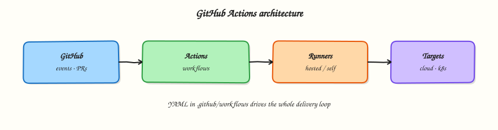
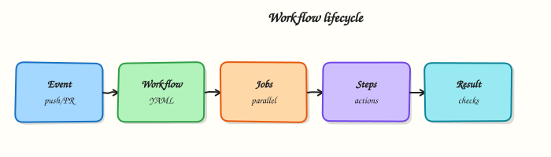

# GitHub Actions — Learning Roadmap

Follow the course in order:

1. **Course overview** — scope, prerequisites, outcomes
2. **Modules 1–16** — beginner foundations through expert production ops
3. **Labs / quizzes / projects** — practice
4. **Capstone** — production CI/CD platform
5. **Interview & certifications** — GitHub Foundations / Actions / Administration





## Modules

| # | Focus | Level | Tutorial |
|---|-------|-------|----------|
| 1 | CI/CD fundamentals | Beginner | [Fundamentals](cicd-fundamentals-and-github-actions.md) |
| 2 | Actions basics | Beginner | [Workflows · jobs · steps](github-actions-basics-workflows-jobs-steps.md) |
| 3 | Runners | Intermediate | [Hosted & self-hosted](github-hosted-and-self-hosted-runners.md) |
| 4 | Workflow syntax | Intermediate | [Matrix & reusable](workflow-syntax-matrix-and-reusable.md) |
| 5 | Secrets & variables | Intermediate | [Secrets · OIDC](secrets-variables-and-oidc.md) |
| 6 | Artifacts & caching | Intermediate | [Artifacts & cache](artifacts-and-caching.md) |
| 7 | Docker pipelines | Intermediate | [Docker · GHCR](docker-pipelines-with-github-actions.md) |
| 8 | Kubernetes | Advanced | [Deploy with Actions](kubernetes-deployments-with-github-actions.md) |
| 9 | Terraform | Advanced | [Plan & apply](terraform-pipelines-with-github-actions.md) |
| 10 | Cloud deployments | Advanced | [AWS · Azure · GCP](multi-cloud-deployments-with-github-actions.md) |
| 11 | Security | Advanced | [Supply chain](security-scanning-and-supply-chain.md) |
| 12 | Testing | Intermediate | [Tests & gates](testing-in-github-actions.md) |
| 13 | Releases | Intermediate | [Tags & releases](release-management-and-versioning.md) |
| 14 | Reusable components | Advanced | [Composite & workflows](composite-actions-and-reusable-workflows.md) |
| 15 | Production | Expert | [Environments & CD](production-pipelines-and-environments.md) |
| 16 | Troubleshooting | Expert | [Debug & optimise](troubleshooting-github-actions.md) |

## Diagrams

```bash
python3 scripts/generate-excalidraw-svg.py
```
