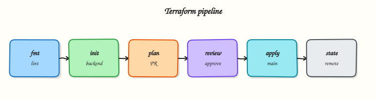

# Terraform Pipelines with GitHub Actions

## Overview

Running `terraform apply` from a laptop does not scale. GitHub Actions should run **init → validate → plan** on every pull request, upload the **plan artefact**, and only **apply** on protected branches after human approval — using **remote state** with locking and short-lived cloud roles (OpenID Connect (OIDC)) instead of long-lived access keys. Labs must also practise **destroy** discipline so sandbox resources do not leak cost.

This is **Tutorial 9** in **Module 9: Terraform Pipelines** of the REBASH Academy **GitHub Actions for Cloud & DevOps Engineers** series — written for Cloud, DevOps, Platform, and Site Reliability Engineering (SRE) engineers.

## Prerequisites

- [Kubernetes Deployments with GitHub Actions](kubernetes-deployments-with-github-actions.md)
- [Terraform workflow — init, plan, apply](../terraform/terraform-workflow-init-plan-apply.md)
- Terraform CLI 1.5+ (or Docker image `hashicorp/terraform`)
- Optional cloud account — the lab uses a local/null backend mock

## Learning Objectives

By the end of this tutorial, you will be able to:

- [ ] Structure a GitHub Actions workflow for Terraform init/validate/plan/apply
- [ ] Explain remote state and locking in CI
- [ ] Gate production apply behind environment protection — never auto-apply without approval
- [ ] Upload and consume plan files as workflow artefacts
- [ ] Document destroy rules for lab environments

## Architecture

Pull requests plan only; apply on `main` consumes the saved plan after environment approval.



## Theory

### What it is

| Stage | Command intent |
|-------|----------------|
| Init | `terraform init` — backends and providers |
| Validate | `terraform validate` |
| Plan | `terraform plan -out=tfplan` |
| Apply | `terraform apply tfplan` |
| Destroy | `terraform destroy` (labs / teardown workflows) |

**Remote state** (Amazon Simple Storage Service (S3) + DynamoDB, Azure Storage, Google Cloud Storage with locking) is the production default so every runner shares one state file. The lab uses local state with clear warnings.

**Credentials:** inject cloud roles via OIDC federation (Modules 5 and 10) where possible. Static access keys in repository secrets work but need rotation and least privilege.

**Approvals:** GitHub **Environments** with required reviewers, or a separate `workflow_dispatch` apply job, or GitOps-style promotion. **Never auto-apply** random pull request plans to production.

### Why it matters

Unreviewed apply from a feature branch can delete databases. Plan artefacts prove what was approved. State locking prevents two workflow runs from corrupting state. Destroy workflows prevent abandoned lab Virtual Private Clouds (VPCs) from billing indefinitely.

### How it works

1. Checkout the Terraform root module.
2. `init` with backend config (often injected via `-backend-config` or environment variables).
3. `validate` + `plan -out=tfplan`.
4. `actions/upload-artifact` the binary `tfplan` (and human-readable `plan.txt` from `terraform show`).
5. On `main` (or after environment approval): `terraform apply -auto-approve tfplan` using **the same plan file**.
6. Tear down labs with a dedicated destroy workflow and guardrails.

### Key concepts and comparisons

| Anti-pattern | Better |
|--------------|--------|
| `apply` without plan file | Apply saved `tfplan` |
| Auto-apply all branches | `if: github.ref == 'refs/heads/main'` + environment |
| State on runner disk only | Remote backend + lock |
| Admin cloud keys on pull request CI | Narrow roles; no apply on pull requests |

### Common pitfalls

- Applying a stale plan after newer commits merged.
- Different backend config between plan and apply jobs.
- Printing secret variable values in plan logs.
- No locking → concurrent applies corrupt state.
- Forgetting destroy for ephemeral labs.

## Hands-on Lab

### Objective

Create a Docker-backed Terraform module, run init/plan/apply/destroy locally, author GitHub Actions workflows with plan artefact upload and gated apply, and enforce destroy discipline with a shell script.

### Prerequisites

- Docker Engine running (`docker info`)
- Terraform CLI 1.5+ (`terraform version`)
- Python 3 with PyYAML for offline YAML validation
- Optional: test GitHub repository to push workflows

### Lab environment

Workspace: `~/rebash-github-actions/module-09`

```bash title="Terminal"
mkdir -p ~/rebash-github-actions/module-09/{.github/workflows,tf-demo} && cd ~/rebash-github-actions/module-09
set -euo pipefail
docker info | tee docker-info.txt
terraform version | tee terraform-version.txt
```

### Real-world scenario

Platform requires every infrastructure change to show a stored plan before apply. Production apply is manual-approved on `main` only through a protected `production` environment. Labs must destroy resources within 24 hours.

### Step-by-step tasks

#### Task 1 – Docker-backed Terraform module

Create `tf-demo/main.tf`:


```hcl
terraform {
  required_version = ">= 1.5.0"
  required_providers {
    docker = {
      source  = "kreuzwerker/docker"
      version = "~> 3.0"
    }
  }
}

provider "docker" {}

resource "docker_image" "nginx" {
  name         = "nginx:1.25-alpine"
  keep_locally = false
}

resource "docker_container" "rebash" {
  name  = "rebash-gha-tf-lab"
  image = docker_image.nginx.image_id

  ports {
    internal = 80
    external = 8080
  }
}

output "container_id" {
  value = docker_container.rebash.id
}

output "url" {
  value = "http://127.0.0.1:8080"
}
```


Validate and plan locally:

```bash title="Terminal"
cd ~/rebash-github-actions/module-09/tf-demo
set -euo pipefail
docker info >/dev/null
terraform init | tee ../init.txt
terraform validate | tee ../validate.txt
terraform plan -out=tfplan -input=false | tee ../plan.txt
terraform show -no-color tfplan > ../plan-show.txt
test -f tfplan
grep -q 'docker_container.rebash' ../plan.txt
cd ..
```

!!! example "Expected output"
    `plan.txt` shows `docker_container.rebash` will be created; `tfplan` exists.


#### Task 2 – Plan workflow (pull requests plan only)

Create `.github/workflows/terraform-plan.yml`:


```yaml
name: Terraform Plan
on:
  pull_request:
    paths:
      - 'tf-demo/**'
  workflow_dispatch:

permissions:
  contents: read
  pull-requests: write

jobs:
  plan:
    runs-on: ubuntu-latest
    defaults:
      run:
        working-directory: tf-demo
    steps:
      - uses: actions/checkout@v4
      - uses: hashicorp/setup-terraform@v3
        with:
          terraform_version: 1.5.7
      - name: Terraform Init
        run: terraform init -input=false
      - name: Terraform Validate
        run: terraform validate
      - name: Terraform Plan
        run: |
          terraform plan -input=false -out=tfplan
          terraform show -no-color tfplan > plan.txt
      - name: Upload plan artefact
        uses: actions/upload-artifact@v4
        with:
          name: tfplan-${{ github.event.pull_request.number || github.run_id }}
          path: |
            tf-demo/tfplan
            tf-demo/plan.txt
          retention-days: 7
```


Validate offline:

```bash title="Terminal"
cd ~/rebash-github-actions/module-09
set -euo pipefail
python3 -c "import yaml; yaml.safe_load(open('.github/workflows/terraform-plan.yml')); print('plan workflow OK')"
grep -q 'upload-artifact' .github/workflows/terraform-plan.yml
```

!!! example "Expected output"
    `plan workflow OK`; artefact upload step present.


#### Task 3 – Gated apply workflow (main + environment)

Create `.github/workflows/terraform-apply.yml`:


```yaml
name: Terraform Apply
on:
  workflow_dispatch:
    inputs:
      plan_run_id:
        description: 'Run ID of plan workflow that produced tfplan'
        required: true
        type: string

permissions:
  contents: read

jobs:
  apply:
    runs-on: ubuntu-latest
    environment: production
    defaults:
      run:
        working-directory: tf-demo
    steps:
      - uses: actions/checkout@v4
      - uses: hashicorp/setup-terraform@v3
        with:
          terraform_version: 1.5.7
      - name: Download plan artefact
        uses: actions/download-artifact@v4
        with:
          name: tfplan-${{ inputs.plan_run_id }}
          path: tf-demo
      - name: Terraform Init
        run: terraform init -input=false
      - name: Terraform Apply saved plan
        run: terraform apply -input=false -auto-approve tfplan
```


Validate offline:

```bash title="Terminal"
cd ~/rebash-github-actions/module-09
set -euo pipefail
python3 -c "import yaml; yaml.safe_load(open('.github/workflows/terraform-apply.yml')); print('apply workflow OK')"
grep -q 'environment: production' .github/workflows/terraform-apply.yml
grep -q 'terraform apply' .github/workflows/terraform-apply.yml
```

!!! example "Expected output"
    `apply workflow OK`; environment protection hook present.


#### Task 4 – Apply, prove, destroy, and record policy

Create `destroy-checks.sh`:


```bash title="Terminal"
#!/usr/bin/env bash
set -euo pipefail
LAB_TTL_HOURS=24
echo "lab_ttl_hours=${LAB_TTL_HOURS}" | tee destroy-policy.txt
echo "backend=local-docker-provider" >> destroy-policy.txt
echo "production_backend=S3/GCS/Azure-with-locking" >> destroy-policy.txt
echo "pull_request=plan-only-no-apply-credentials" >> destroy-policy.txt
echo "production_destroy=separate-workflow-dual-approval" >> destroy-policy.txt
grep -q 'plan-only' destroy-policy.txt
docker info >/dev/null
cd tf-demo
terraform init -input=false
terraform validate
terraform plan -input=false -out=tfplan
terraform apply -input=false -auto-approve tfplan
docker ps --filter name=rebash-gha-tf-lab --format '{{.Names}} {{.Status}}' | tee ../container-proof.txt
grep -q 'rebash-gha-tf-lab' ../container-proof.txt
curl -sf http://127.0.0.1:8080 >/dev/null
terraform destroy -input=false -auto-approve
cd ..
echo "destroy_attempted=yes" >> destroy-policy.txt
echo 'destroy-checks passed'
```


Run and archive:

```bash title="Terminal"
cd ~/rebash-github-actions/module-09
set -euo pipefail
chmod +x destroy-checks.sh
./destroy-checks.sh | tee destroy-checks-output.txt

tar -czf module-09-evidence.tgz tf-demo/main.tf .github/workflows/*.yml destroy-policy.txt container-proof.txt *.txt tf-demo/tfplan 2>/dev/null || \
tar -czf module-09-evidence.tgz tf-demo/main.tf .github/workflows/*.yml destroy-policy.txt container-proof.txt *.txt
ls -l module-09-evidence.tgz | tee evidence.txt
```

!!! example "Expected output"
    `destroy-checks passed`; `container-proof.txt` shows the lab container; evidence archive created.


### Validation steps

- [ ] Docker module plans and applies locally via `destroy-checks.sh`
- [ ] Plan workflow uploads `tfplan` artefact
- [ ] Apply workflow uses `environment: production` and saved plan
- [ ] `container-proof.txt` shows the lab container before destroy

### Common errors and fixes

| Error | Cause | Fix |
|-------|-------|-----|
| `Cannot connect to the Docker daemon` | Docker not running | Start Docker Desktop or `sudo systemctl start docker` |
| Backend changed between plan/apply | Different env vars | Pin backend config in both workflows |
| Stale plan | New commits after plan | Re-plan before apply |
| State locked | Parallel workflow runs | Use concurrency group; investigate lock holder |
| Secrets in plan output | Misconfigured providers | Mark sensitive; restrict log access |
| Fork pull request exfiltration | Over-broad OIDC trust | Restrict `sub` claim; no secrets on forks |

### Challenge exercise

Add a `concurrency:` group keyed on `terraform-${{ github.ref }}` to both workflows so only one Terraform run executes per branch. Extend `destroy-checks.sh` to grep both workflow files for the concurrency key.

### Learning outcomes

- Ran Terraform plan/apply/destroy against real Docker resources
- Gated apply with environment protection and `workflow_dispatch`
- Proved the container with `docker ps` and `curl` before destroy
- Separated lab destroy policy from production practice via executable script

### Cleanup

```bash title="Terminal"
cd ~/rebash-github-actions/module-09/tf-demo
terraform destroy -auto-approve 2>/dev/null || true
docker rm -f rebash-gha-tf-lab 2>/dev/null || true
ls ~/rebash-github-actions/module-09
```

## Validation

- [ ] Lab completed under `~/rebash-github-actions/module-09/`
- [ ] You can explain why apply uses a saved plan file
- [ ] You can refuse auto-apply on pull request branches
- [ ] You can describe state locking's purpose

## Code Walkthrough

1. **Plan always, apply rarely** — artefacts plus environment approvals.
2. **Identical backend** — plan and apply jobs must agree on backend config.
3. **Pull request = plan only** — no production roles on untrusted code.
4. **Upload tfplan** — auditors see what was proposed for that run.
5. **Destroy labs on a timer** — cost control.

## Security Considerations

- Cloud credentials in GitHub secrets are production power — scope tightly per environment.
- Plan logs can reveal sensitive attributes — limit workflow visibility.
- Environment approvals need authenticated reviewers, not open repositories.
- Remote state buckets need encryption and strict Identity and Access Management (IAM).
- Destroy workflows must not be triggerable from fork pull requests.

## Common Mistakes

!!! warning "Auto-apply on every branch"
    Feature branches mutate production. **Fix:** restrict apply to `main` or tags plus environment protection.

!!! warning "Apply without `-out` plan file"
    Drift between reviewed plan and apply. **Fix:** `terraform apply tfplan`.

!!! warning "Long-lived admin keys for pull request CI"
    Leak equals account takeover. **Fix:** OIDC with narrow roles; plan-only on pull requests.

!!! warning "No destroy for labs"
    Bill shock. **Fix:** TTL plus dedicated destroy workflow.

## Best Practices

- One root module per workflow path; use workspaces deliberately.
- Use `concurrency` groups for stateful applies.
- Run policy-as-code (Open Policy Agent (OPA), tfsec, Checkov) before apply.
- Tag cloud resources with `managed-by=terraform` and owner.
- Promote plans across environments with explicit hand-off of artefact run IDs.

## Troubleshooting

| Symptom | Likely cause | Fix |
|---------|--------------|-----|
| Provider auth fail | Missing OIDC/secret | Check `permissions: id-token: write` and role trust |
| Plan empty unexpectedly | Wrong directory | Pin `working-directory` or `-chdir` |
| Apply forbidden | Branch/environment gates | Expected for pull requests |
| Corrupt local state | Interrupted apply | Prefer remote state + lock |
| Artefact not found | Wrong run ID or retention | Re-run plan; check artefact name |

## Summary

GitHub Actions makes Terraform reviewable: plan artefacts on pull requests, gated apply through protected environments, remote state awareness, and strict destroy rules for labs. Next: [Multi-Cloud Deployments with GitHub Actions](multi-cloud-deployments-with-github-actions.md).

## Interview Questions

**1. Why upload `tfplan` as a workflow artefact?**

??? success "Reveal answer"
    So the exact binary plan that was reviewed is what apply uses, and auditors can retrieve what change set was proposed for that workflow run.

**2. Why should pull requests not auto-apply to production?**

??? success "Reveal answer"
    Pull request code and untrusted authors (especially from forks) must not mutate production infrastructure. Pull requests should plan with read-only roles; apply stays on protected branches with environment approvals.

**3. What problem does remote state locking solve?**

??? success "Reveal answer"
    It prevents two concurrent Terraform runs from corrupting state by serialising writes against the same state file.

**4. What is the risk of applying without a saved plan file?**

??? success "Reveal answer"
    The apply may compute a different change set than the one humans reviewed if configuration, variables, or provider versions drifted between plan and apply.

**5. How does OIDC improve on static cloud access keys in Terraform workflows?**

??? success "Reveal answer"
    GitHub mints a short-lived JSON Web Token (JWT) per job; the cloud trusts it and returns temporary credentials, reducing long-lived secret sprawl and enabling trust policies tied to repository, branch, and environment.

**6. Where should `terraform destroy` live in production workflows?**

??? success "Reveal answer"
    In tightly controlled workflows with strong approvals and narrow roles — not as a casual checkbox on pull request pipelines. Labs may use destroy flags with clear TTL policies.

**7. Why use workflow concurrency groups for Terraform?**

??? success "Reveal answer"
    Concurrent applies against one state increase lock contention and human confusion; serialising reduces race risk and makes failures easier to diagnose.

**8. What should a Terraform workflow do when plan fails?**

??? success "Reveal answer"
    Fail the job, publish logs, do not run apply, and notify owners. Fix the configuration or credentials, then re-plan from a clean run.

## Related Tutorials

- [Secrets, Variables, and OIDC](secrets-variables-and-oidc.md)
- [Multi-Cloud Deployments with GitHub Actions](multi-cloud-deployments-with-github-actions.md)
- [Terraform workflow — init, plan, apply](../terraform/terraform-workflow-init-plan-apply.md)

## References

- [Terraform CLI](https://developer.hashicorp.com/terraform/cli)
- [Remote backends](https://developer.hashicorp.com/terraform/language/settings/backends/configuration)
- [GitHub Environments](https://docs.github.com/en/actions/deployment/targeting-different-environments/using-environments-for-deployment)
- [hashicorp/setup-terraform action](https://github.com/hashicorp/setup-terraform)
