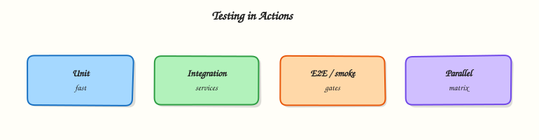

# Testing in GitHub Actions

## Overview


Design a test pyramid in GitHub Actions with unit, integration, smoke, and end-to-end (e2e) jobs, parallel matrix execution, and quality gates that fail the workflow when thresholds are missed.

Tests are the cheapest production incident you never ship. GitHub Actions runs **unit**, **integration**, **smoke**, and selective **e2e** jobs on pull requests; publishes reports as artefacts; and enforces **quality gates** so red tests block merge. A **matrix** fans the same job across runtimes or shards so feedback stays fast as the suite grows.

This is a core tutorial in **Module 12 · Testing** of the REBASH Academy **GitHub Actions for Cloud & DevOps Engineers** series — written for Cloud, DevOps, Platform, and SRE engineers.


## Prerequisites


- [Security Scanning and Supply Chain](security-scanning-and-supply-chain.md)
- Comfortable with jobs, `needs`, and artefacts from earlier modules


## Learning Objectives


By the end of this tutorial, you will be able to:

- [ ] Map unit / integration / smoke / e2e to workflow jobs  
- [ ] Parallelise with `strategy.matrix` or shards  
- [ ] Upload test reports and coverage artefacts  
- [ ] Fail the workflow on failed tests or coverage floors


## Architecture


This topic’s control points and relationships are shown below.




## Theory


### What it is

**Testing in GitHub Actions** means every meaningful change runs automated checks before it becomes a deployable artefact. Jobs invoke your language’s test runners, collect machine-readable reports, and upload them with `actions/upload-artifact` (or native report integrations). A **quality gate** turns a soft signal into a hard failure — non-zero exit codes, coverage below a floor, or required status checks on a protected branch.

| Layer | Typical scope | CI cost |
|-------|---------------|---------|
| Unit | Functions / packages, mocked I/O | Fast, run always |
| Integration | Service + DB / API contracts | Medium |
| Smoke | Post-deploy health of a thin path | Short, after deploy |
| E2E | Browser or full user path | Slow, selective |

### Why it matters

Cloud services fail in integration, not in unit isolation. Pipelines that only build an image ship regressions at promotion time. Pull-request-visible failures and coverage make review concrete. Quality gates protect trunk — flaky or missing tests become a platform problem, not a Friday surprise in production.

### How it works

Recommended shape:

1. **Fail fast** — lint and unit tests before expensive builds or image pushes.  
2. **Parallelise** — `strategy.matrix` over Python/Node versions, OS, or shard indexes.  
3. **Report** — write JUnit XML or language-native reports; upload with `if: always()` so failed suites still leave artefacts.  
4. **Gate** — job exit code non-zero on failure; optional follow-on job that compares coverage to a minimum.  
5. **Select e2e** — full e2e on `main` / schedule; smoke or subset on pull requests with `paths` / event filters.

Use `needs` so unit jobs start without waiting for unrelated deploy work. Keep report paths stable for reviewers.

### Key concepts and comparisons

| Mechanism | Purpose |
|-----------|---------|
| Job exit code | Primary gate (failed tests → failed check) |
| Matrix / shards | Parallel wall-clock reduction |
| Artefacts (`if: always()`) | Debug failed suites after the job dies |
| Required status checks | Branch protection hard gate |

Unit proves logic; integration proves wiring; smoke proves “it is up”; e2e proves the user path.

### Common pitfalls

- Publishing reports while `continue-on-error: true` keeps the check green.  
- One monolithic e2e job on every commit — burns minutes and creates flaky noise.  
- Uploading artefacts only on success — failed suites never leave XML for debugging.  
- Matrix explosion without a deliberate `fail-fast` policy.


## Hands-on Lab


Create a workspace for this tutorial.

```bash
mkdir -p ~/rebash-github-actions/module-12/{.github/workflows,tests} && cd ~/rebash-github-actions/module-12/{.github/workflows,tests}
```

**Focus:** run pytest with JUnit and fail the job on test failure

### Step 1 – Test workflow with reporting

```bash
mkdir -p .github/workflows
cat > test_sample.py << 'EOF'
def test_truth():
    assert 2 + 2 == 4
EOF
cat > .github/workflows/test.yml << 'EOF'
name: Testing
on: [push, pull_request]
permissions:
  contents: read
jobs:
  unit:
    runs-on: ubuntu-latest
    steps:
      - uses: actions/checkout@v4
      - uses: actions/setup-python@v5
        with:
          python-version: "3.12"
      - run: |
          pip install pytest
          pytest --junitxml=junit.xml -q
      - uses: actions/upload-artifact@v4
        if: always()
        with:
          name: junit
          path: junit.xml
EOF
```

### Step 2 – Local pytest + junit

```bash
python3 -m pytest --junitxml=junit.xml -q 2>/dev/null || python3 -c "assert 2+2==4"
test -f junit.xml || echo '<testsuite/>' > junit.xml
grep junit.xml .github/workflows/test.yml
```

### Final step – Cleanup note

```bash
# Keep ~/rebash-github-actions/ for later tutorials
```


## Validation


- [ ] Lab commands run under `~/rebash-github-actions/module-12/{.github/workflows,tests}/`
- [ ] You can explain each Theory section in your own words
- [ ] You used modern tooling where it applies to this topic
- [ ] You can describe one production failure mode for this topic


## Code Walkthrough


Production practice for **Testing in GitHub Actions** always combines:

1. Inspect before you change (status, plan, logs, dry-run)
2. Prefer reversible, documented changes (Git, IaC, drop-ins, version pins)
3. Capture evidence (command output, pipeline logs) for handovers
4. Prefer current tools and APIs over legacy shortcuts
5. Least privilege — escalate credentials only when required

Keep runbooks short enough to follow under pressure. Automate checks; keep humans for judgement.


## Security Considerations


- Treat credentials and tokens for github-actions as privileged — never commit them
- Prefer short-lived auth (OIDC, roles, SSO) over long-lived keys
- Validate blast radius before apply/deploy/delete operations
- Restrict who can approve production changes
- Collect audit logs; limit who can read sensitive traces


## Common Mistakes


!!! warning "Publishing reports while `continue-on-error: true` keeps the check green.  "
    Validate assumptions against the Theory section and official docs before changing production.

!!! warning "One monolithic e2e job on every commit — burns minutes and creates flaky noise.  "
    Lab shortcuts (open security groups, admin roles, skip approvals) must not ship unchanged.

!!! warning "Changing production without a rollback path"
    Always know how to revert (previous artefact, prior release, state rollback, DNS failback).


## Best Practices


- Encode Testing in GitHub Actions changes as code and review them in pull requests
- Pin versions (images, modules, actions, provider plugins)
- Separate environments with clear promotion gates
- Alert on symptoms with runbooks attached
- Destroy lab resources; tag everything with owner and expiry where possible


## Troubleshooting


| Symptom | Likely cause | Fix |
|---------|--------------|-----|
| Auth / permission denied | Wrong identity, policy, or scope | Check caller identity, roles, and least-privilege policies |
| Timeout / no route | Network, DNS, security group, or endpoint | Trace path, DNS, and allow-lists before retrying |
| Drift / unexpected plan | Manual change or wrong state/workspace | Reconcile desired vs actual; avoid click-ops on managed resources |
| Pipeline/job red | Flaky step, cache, or missing secret | Read failing step logs; bisect recent workflow/config changes |
| Cost spike | Idle load balancer, NAT, oversized compute | Inventory billable resources; stop/delete labs promptly |


## Summary


**Testing in GitHub Actions** is essential for Cloud and DevOps engineers working with github-actions. Practise the lab until the inspection and change path is muscle memory, then continue the track.


## Interview Questions


1. How do you surface pytest failures clearly in PRs?
2. Flaky tests in CI only — what is your approach?
3. Why upload JUnit with if always?
4. How do path filters interact with required checks?
5. What belongs in unit versus integration jobs?

!!! tip "Sample answer — question 2"
    Read the pytest/JUnit output first, then compare dependency versions with local runs. Quarantine flakes with an owner.

!!! tip "Sample answer — question 4"
    Keep test jobs free of production secrets when possible; use ephemeral credentials for integration tests.


## Related Tutorials


- [Course overview](index.md)
- [Release Management and Versioning](release-management-and-versioning.md)


## References


- [Workflow commands / exit codes](https://docs.github.com/en/actions/using-workflows/workflow-commands-for-github-actions)  
- [Matrix strategy](https://docs.github.com/en/actions/using-jobs/using-a-matrix-for-your-jobs)  
- [Storing workflow data as artefacts](https://docs.github.com/en/actions/using-workflows/storing-workflow-data-as-artifacts)
