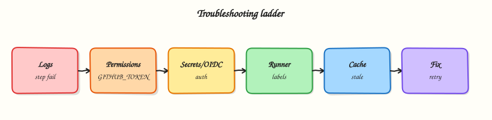

# Troubleshooting GitHub Actions

## Overview

Green workflows are quiet; failed workflows need a **systematic ladder** — read the failed step log, reproduce locally, isolate runner vs auth vs cache vs deploy, then optimise slow paths. This tutorial gives a production troubleshooting method for GitHub Actions operators.

This is **Tutorial 16** in **Module 16: Troubleshooting** of the REBASH Academy **GitHub Actions for Cloud & DevOps Engineers** series — written for Cloud, DevOps, Platform, and SRE engineers.

## Prerequisites

- [Production Pipelines and Environments](production-pipelines-and-environments.md)
- [GitHub Hosted and Self-hosted Runners](github-hosted-and-self-hosted-runners.md)
- [Artifacts and Caching](artifacts-and-caching.md)

## Learning Objectives

By the end of this tutorial, you will be able to:

- [ ] Follow a failed-job ladder from log to root cause
- [ ] Diagnose runner capacity, labels, and self-hosted connectivity issues
- [ ] Fix OIDC and secret permission failures
- [ ] Resolve cache miss/hit and corrupt cache problems
- [ ] Triage deploy failures and workflow performance bottlenecks

## Architecture

Start at the failed step; branch by category (runner, auth, cache, deploy, perf); fix and add guardrails.



## Theory

### What it is

| Layer | Common symptoms | First checks |
|-------|-----------------|--------------|
| Workflow syntax | Workflow not run / invalid | Actions tab annotation; `actionlint` locally |
| Job / step | Red X on one step | Expand step log; exit code |
| Runner | Queued forever / offline | Labels; self-hosted service; org minutes |
| Auth | 403 AssumeRole / login fail | `permissions:`; OIDC trust; secret scope |
| Cache | Slow builds; wrong deps | Cache key; branch scope; path |
| Deploy | Health check fail | Same digest? kube creds? environment gate |
| Performance | 45 min CI | Parallelise; cache; shrink matrix |

**Failed-job ladder:**

1. Identify first failing step (not last warning).
2. Read stderr; enable debug logging (`ACTIONS_STEP_DEBUG`, `ACTIONS_RUNNER_DEBUG`) temporarily.
3. Re-run failed jobs only (`Re-run failed jobs`).
4. Reproduce shell commands locally on same OS image where possible.
5. Classify: runner / auth / cache / test flake / deploy.
6. Fix + add assert/gate so failure cannot silently pass again.

### Why it matters

Random fixes waste hours and repeat incidents. Platform teams need shared runbooks. Performance issues burn runner minutes and slow delivery. Auth misconfigurations look like "flaky CI" until production deploy fails.

### How it works

**Runners:** GitHub-hosted runners are ephemeral Ubuntu/Windows/macOS VMs. Self-hosted runners need outbound GitHub connectivity, correct labels (`runs-on: [self-hosted, linux, gpu]`), and non-conflicting work directories.

**Auth:** OIDC requires `id-token: write`; secrets unavailable to fork pull requests unless `pull_request_target` (risky). Environment secrets require `environment:` on the job.

**Cache:** `actions/cache@v4` keys should include lockfile hash; restore keys for partial hits; caches are branch-scoped by default.

**Deploy failures:** Often wrong artefact, missing smoke test, or cloud role not scoped to target cluster/account.

**Performance:** Split jobs, cache dependencies, avoid redundant checkouts, use matrix `fail-fast`, consider larger runners or self-hosted pools for heavy builds.

### Key concepts and comparisons

| Debug tool | Use |
|------------|-----|
| Job summary (`$GITHUB_STEP_SUMMARY`) | Human-readable report in UI |
| Artifacts | Download test traces, plans |
| `gh run view --log-failed` | CLI log tail |
| actionlint | Static workflow lint |
| Re-run failed jobs | Skip green work |

### Common pitfalls

- Chasing the last log line instead of first failing step.
- Enabling debug logging permanently — noisy and leaky.
- Clearing all caches instead of fixing keys — hides root cause briefly.
- Re-running entire workflow for flake without quarantine.
- Self-hosted runner disk full — cryptic tool failures.

## Hands-on Lab

### Objective

Simulate failure categories locally, build a diagnostic shell script that emits `diagnose.txt`, and author a diagnostic workflow stub with job summary output — validated offline.

### Prerequisites

- Bash, Python 3 with PyYAML
- Optional: [actionlint](https://github.com/rhysd/actionlint) installed

### Lab environment

Workspace: `~/rebash-github-actions/module-16`

```bash title="Terminal"
mkdir -p ~/rebash-github-actions/module-16/.github/workflows && cd ~/rebash-github-actions/module-16
set -euo pipefail
```

### Real-world scenario

On-call engineer receives alert: workflow failed. You produce a diagnostic script that writes structured evidence and a workflow that surfaces a step summary table for common checks.

### Step-by-step tasks

#### Task 1 – Simulate failure classes locally

Create `simulate-failures.sh`:

```bash title="simulate-failures.sh"
#!/usr/bin/env bash
set -euo pipefail
echo '=== auth fail simulation ==='
( export AWS_ACCESS_KEY_ID=''; aws sts get-caller-identity 2>&1 || true ) | head -1 | tee auth-fail-sample.txt
echo '=== cache key demo ==='
LOCK_HASH=$(sha256sum <<< 'fake-lock-v1' | awk '{print $1}')
echo "cache-key=deps-${LOCK_HASH}" | tee cache-key-sample.txt
echo '=== first failing step rule ==='
echo 'If step A and B fail, fix A first' | tee ladder-rule.txt
```

Run it:

```bash title="Terminal"
cd ~/rebash-github-actions/module-16
set -euo pipefail
chmod +x simulate-failures.sh
./simulate-failures.sh
```

!!! example "Expected output"
    Sample files `auth-fail-sample.txt`, `cache-key-sample.txt`, `ladder-rule.txt` created.


#### Task 2 – Troubleshooting diagnostic script

Create `troubleshoot.sh`:

```bash title="troubleshoot.sh"
#!/usr/bin/env bash
set -euo pipefail
{
  echo "# GitHub Actions diagnostic report"
  echo "generated_at=$(date -u +%Y-%m-%dT%H:%M:%SZ)"
  echo ""
  echo "## Ladder"
  echo "1. Open failed run — first red step"
  echo "2. Read stderr and exit code"
  echo "3. Re-run failed jobs only"
  echo "4. Reproduce run locally (ubuntu-latest ≈ bash for simple scripts)"
  echo "5. Classify: runner | auth | cache | test | deploy | perf"
  echo ""
  echo "## Runner checks"
  echo "queued_long=org concurrency / billing / label mismatch"
  echo "self_hosted_offline=service status; github.com connectivity"
  echo ""
  echo "## Auth checks"
  echo "oidc=id-token write + trust subject"
  echo "secrets=environment scoped; fork PR isolation"
  echo ""
  echo "## Cache checks"
  echo "key_includes_lockfile_hash=yes"
  echo "post_job_save_required=yes"
  echo ""
  echo "## Deploy checks"
  echo "same_digest_as_staging=verify"
  echo "rollout_status=required"
  echo ""
  echo "## Performance"
  echo "parallel_jobs=yes; cache_deps=yes; shrink_matrix_on_pr=yes"
} | tee diagnose.txt
grep -q 'first red step' diagnose.txt
grep -q 'oidc=' diagnose.txt
echo 'troubleshoot.sh OK'
```

Run it:

```bash title="Terminal"
cd ~/rebash-github-actions/module-16
set -euo pipefail
chmod +x troubleshoot.sh
./troubleshoot.sh
```

!!! example "Expected output"
    `troubleshoot.sh OK`; `diagnose.txt` contains ladder and auth sections.


#### Task 3 – Diagnostic workflow with job summary

Create `.github/workflows/diagnostics.yml`:

```yaml title="diagnostics.yml"
name: Diagnostics
on:
  workflow_dispatch:

permissions:
  contents: read

jobs:
  diagnose:
    runs-on: ubuntu-latest
    steps:
      - uses: actions/checkout@v4
      - name: Write troubleshooting summary
        run: |
          {
            echo "## Troubleshooting checklist"
            echo "| Check | Status |"
            echo "|-------|--------|"
            echo "| Workflow parses | OK |"
            echo "| Runner online | OK |"
            echo "| Secrets/OIDC | manual |"
          } >> "$GITHUB_STEP_SUMMARY"
      - name: Intentional assert for lab
        run: test -f diagnose.txt
```

Validate offline:

```bash title="Terminal"
cd ~/rebash-github-actions/module-16
set -euo pipefail
python3 -c "import yaml; yaml.safe_load(open('.github/workflows/diagnostics.yml')); print('diagnostics workflow OK')"
grep -q 'GITHUB_STEP_SUMMARY' .github/workflows/diagnostics.yml
```

!!! example "Expected output"
    `diagnostics workflow OK`


#### Task 4 – Lint workflows and bundle evidence

```bash title="Terminal"
cd ~/rebash-github-actions/module-16
set -euo pipefail

if command -v actionlint >/dev/null; then
  actionlint .github/workflows/diagnostics.yml | tee actionlint.txt || true
else
  echo 'actionlint not installed — skipped' | tee actionlint.txt
fi

tar -czf module-16-evidence.tgz diagnose.txt troubleshoot.sh .github/workflows/diagnostics.yml simulate-failures.sh *.txt
ls -l module-16-evidence.tgz | tee evidence.txt
```

!!! example "Expected output"
    Evidence archive listed in `evidence.txt`.


### Validation steps

- [ ] `troubleshoot.sh` writes `diagnose.txt` with failed-job ladder
- [ ] Simulation script produces sample failure notes
- [ ] Diagnostics workflow parses and asserts `diagnose.txt` exists
- [ ] Evidence tarball created

### Common errors and fixes

| Error | Cause | Fix |
|-------|-------|-----|
| Cannot reproduce locally | OS/service mismatch | Use container job or match runner image |
| Intermittent pass | Flaky test/resource | Quarantine; increase timeout; retry budget |
| OIDC works on main not PR | Trust subject branch filter | Expected; adjust trust or use staging |
| Cache always miss | Key changes every commit | Stabilise key prefix + lock hash |
| Self-hosted stale tools | No image refresh | Reimage runner; pin tool versions in workflow |

### Challenge exercise

Add a workflow job that deliberately fails auth check in a safe way (mock) and extend `troubleshoot.sh` to append a `gh run view RUN_ID --log-failed` usage hint to `diagnose.txt`.

### Learning outcomes

- Built `troubleshoot.sh` that emits structured `diagnose.txt` evidence
- Simulated auth/cache failure notes
- Authored diagnostics workflow with step summary
- Optional actionlint on workflow YAML

### Cleanup

```bash title="Terminal"
ls ~/rebash-github-actions/module-16
```

## Validation

- [ ] Lab completed under `~/rebash-github-actions/module-16/`
- [ ] You can walk the failed-job ladder without skipping steps
- [ ] You can list three auth failure checks
- [ ] You can name two performance optimisations

## Code Walkthrough

1. **First red step** — root cause usually here.
2. **Re-run failed jobs** — save runner minutes.
3. **Debug logging temporary** — disable after fix.
4. **Step summary** — operational context for on-call.
5. **Lint workflows in CI** — catch syntax before merge.

## Security Considerations

- Debug logs may expose secrets — scrub before sharing externally.
- Do not paste production logs into public issues without redaction.
- Self-hosted runners retain workspace disk — clean between jobs.
- Fork PR workflows must not echo secrets in "diagnostic" steps.
- Limit who can enable org-wide debug logging.

## Common Mistakes

!!! warning "Fixing symptoms not first failure"
    Later steps cascade. **Fix:** always expand the earliest failed step.

!!! warning "Permanent debug logging"
    Noise and leak risk. **Fix:** enable only for targeted re-run.

!!! warning "Deleting cache randomly"
    Slow builds return. **Fix:** fix cache key logic.

!!! warning "Ignoring queued time"
    Assume code bug. **Fix:** check runner pool and billing first.

## Best Practices

- Add `$GITHUB_STEP_SUMMARY` tables for deploy/test outcomes.
- Upload artefacts on failure (`if: always()`).
- Pin runner tool versions (`setup-node`, `setup-python` with exact version).
- Monitor workflow duration trends in org insights.
- Maintain troubleshooting runbook linked from platform repo README.

## Troubleshooting

| Symptom | Likely cause | Fix |
|---------|--------------|-----|
| Job queued hours | No matching runner / limits | Fix labels; purchase minutes; scale self-hosted |
| `Error: Resource not accessible by integration` | GITHUB_TOKEN permissions | Add required `permissions:` |
| Cache not found | First run or key change | Expected once; verify restore-keys |
| Works on re-run only | Flake/timing | Stabilise tests; add wait-for healthy |
| Slow npm/pip every run | Cache miss | Lockfile-hash cache key |
| Deploy 401/403 | OIDC trust/role | Fix subject; environment secrets |

## Summary

Troubleshooting GitHub Actions follows a ladder: first failing step, classify runner/auth/cache/deploy/performance, fix with evidence, and harden with linting and summaries. You have completed the 16-module GitHub Actions course — revisit [Course overview](index.md) for labs, capstone, and interview prep.

## Interview Questions

**1. What is the first thing you check when a workflow fails?**

??? success "Reveal answer"
    The earliest failing step in the job graph — expand its log for stderr and exit code; later failures are often cascading symptoms.

**2. How do you debug OIDC authentication failures in Actions?**

??? success "Reveal answer"
    Verify `permissions: id-token: write`, cloud trust policy subject/audience matches repo/ref/environment, role ARN is correct, and the job is not a fork pull request excluded by trust.

**3. Why might a job stay queued indefinitely?**

??? success "Reveal answer"
    No runner matches `runs-on` labels, organisation concurrency limits, billing/minutes exhaustion, or self-hosted runner offline/disconnected.

**4. How do cache keys cause apparent flaky CI?**

??? success "Reveal answer"
    Overly broad keys serve wrong dependencies; overly narrow keys always miss — symptoms look like random build failures until keys align with lockfiles and paths.

**5. When should you use re-run failed jobs vs re-run all jobs?**

??? success "Reveal answer"
    Re-run failed jobs when earlier steps succeeded and artefacts remain valid; re-run all when upstream outputs (build artefacts, plan files) may be stale or missing.

**6. What do ACTIONS_STEP_DEBUG and ACTIONS_RUNNER_DEBUG do?**

??? success "Reveal answer"
    Repository variables enabling verbose step and runner diagnostic logging — useful temporarily for deep investigation, not for permanent production settings.

**7. How can deploy failures be mistaken for test failures?**

??? success "Reveal answer"
    Smoke tests fail after deploy when health endpoints, digests, or environment secrets differ — classify by checking deploy job logs and whether staging used the same artefact.

**8. Name three performance optimisations for slow workflows.**

??? success "Reveal answer"
    Parallelise independent jobs with matrices, cache dependencies with stable lockfile-based keys, and avoid redundant checkouts/builds by promoting artefacts between jobs.

## Related Tutorials

- [GitHub Hosted and Self-hosted Runners](github-hosted-and-self-hosted-runners.md)
- [Artifacts and Caching](artifacts-and-caching.md)
- [Production Pipelines and Environments](production-pipelines-and-environments.md)

## References

- [Enabling debug logging](https://docs.github.com/en/actions/monitoring-and-troubleshooting-workflows/enabling-debug-logging)
- [Workflow run logs](https://docs.github.com/en/actions/monitoring-and-troubleshooting-workflows/using-workflow-run-logs)
- [actionlint](https://github.com/rhysd/actionlint)
- [GitHub CLI run view](https://cli.github.com/manual/gh_run_view)
- [Caching dependencies](https://docs.github.com/en/actions/using-workflows/caching-dependencies-to-speed-up-workflows)
