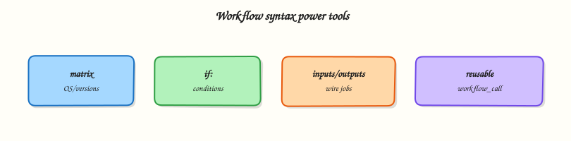

# Workflow Syntax: Matrix, Conditionals, and Reusable Workflows

## Overview

Production pipelines rarely run one configuration. You test on multiple Node versions, deploy only from `main`, skip docs-only changes, and share a standard deploy workflow across fifty repositories. **Matrix builds**, **conditionals**, **inputs/outputs**, and **reusable workflows** are the power tools that keep YAML DRY without sacrificing clarity.

This module teaches syntax you will use daily: fan-out testing with `strategy.matrix`, guard rails with `if:`, pass data between jobs via `outputs`, and call central workflows with `workflow_call`.

This is **Tutorial 4** in **Module 4: Workflow Syntax** of the REBASH Academy **GitHub Actions for Cloud & DevOps Engineers** series. The lab builds matrix and reusable workflow stubs validated offline under `~/rebash-github-actions/module-04`.

## Prerequisites

- [GitHub-hosted and Self-hosted Runners](github-hosted-and-self-hosted-runners.md)
- [GitHub Actions Basics](github-actions-basics-workflows-jobs-steps.md)
- Python 3 with PyYAML

## Learning Objectives

By the end of this tutorial, you will be able to:

- [ ] Configure `strategy.matrix` for multi-version or multi-OS testing
- [ ] Use `if:` conditions on jobs and steps safely
- [ ] Pass job outputs to downstream jobs with `needs` and `outputs`
- [ ] Author a reusable workflow (`on: workflow_call`) and call it from a caller workflow
- [ ] Validate matrix and reusable YAML structure locally

## Architecture

Caller workflows invoke reusable callees; matrix jobs fan out; conditionals filter execution; outputs chain jobs.



## Theory

### What it is

**Matrix strategy** duplicates a job across combinations:


```yaml
strategy:
  fail-fast: false
  matrix:
    node: [18, 20, 22]
    os: [ubuntu-latest]
```


Each combination becomes a separate job instance. Access values with the matrix context expression for `matrix.node` (dollar-brace-brace form in real workflow YAML).

**Conditionals** skip jobs or steps when expressions are false:


```yaml
if: github.ref == 'refs/heads/main' && github.event_name == 'push'
```


**Job outputs** export values to dependent jobs:


```yaml
jobs:
  build:
    outputs:
      version: ${{ steps.meta.outputs.version }}
    steps:
      - id: meta
        run: echo "version=1.2.3" >> "$GITHUB_OUTPUT"
  deploy:
    needs: build
    steps:
      - run: echo "Deploying ${{ needs.build.outputs.version }}"
```


**Reusable workflows** — callee defines `on: workflow_call` with `inputs` and `secrets`; caller uses `uses: org/repo/.github/workflows/deploy.yml@v1`.

### Why it matters

Without matrices, teams copy-paste jobs per Node version — fixes miss a copy. Without conditionals, deploy jobs fire on every pull request. Without reusable workflows, platform standards drift across repositories.

Enterprise platform teams publish one **callee** workflow (build, scan, deploy) and let product repos maintain thin **caller** files — twenty lines instead of four hundred.

### How it works

**Matrix exclusions and includes:**


```yaml
strategy:
  matrix:
    node: [18, 20]
    os: [ubuntu-latest, windows-latest]
    exclude:
      - node: 18
        os: windows-latest
    include:
      - node: 22
        os: ubuntu-latest
        experimental: true
```


**`fail-fast`:** when `true` (default), one failing matrix leg cancels siblings. Set `false` to see all failures — useful for compatibility testing.

**Reusable workflow callee skeleton:**


```yaml
on:
  workflow_call:
    inputs:
      environment:
        required: true
        type: string
    secrets:
      DEPLOY_TOKEN:
        required: true
jobs:
  deploy:
    runs-on: ubuntu-latest
    environment: ${{ inputs.environment }}
    steps:
      - run: echo "Deploy to ${{ inputs.environment }}"
```


**Caller:**


```yaml
jobs:
  call-deploy:
    uses: my-org/pipelines/.github/workflows/deploy.yml@v2
    with:
      environment: staging
    secrets:
      DEPLOY_TOKEN: ${{ secrets.DEPLOY_TOKEN }}
```


### Key concepts and comparisons

| Feature | Scope | Typical use |
|---------|-------|-------------|
| Matrix | One job definition, many instances | Test Node 18/20/22 |
| `if:` | Job or step | Skip deploy on PR |
| `outputs` | Job-to-job data | Pass version tag to deploy |
| Reusable workflow | Workflow-to-workflow | Central platform pipeline |

| Anti-pattern | Better approach |
|--------------|-----------------|
| Copy-paste three identical jobs | Matrix |
| Shell `if` inside one giant step | Job-level `if:` for clarity |
| Monolithic 800-line workflow | Reusable callee + thin caller |

### Common pitfalls

- Matrix variables in `runs-on` require matching runner labels for each OS axis.
- `if:` expressions use GitHub expression syntax, not bare shell tests in the `if:` field.
- Reusable workflows cannot be nested more than one level deep in some enterprise policies — check org rules.
- Forgetting `secrets:` mapping on caller — callee secrets are not inherited automatically.
- Actions expressions inside workflow YAML — wrap tutorial fences in raw Jinja blocks so MkDocs does not interpret expressions.

## Hands-on Lab

### Objective

Build a matrix CI workflow, a conditional deploy stub, and a reusable workflow pair (callee + caller) under `~/rebash-github-actions/module-04`, validated with Python asserts.

### Prerequisites

- Modules 1–3
- Python 3 with PyYAML

### Lab environment

```bash title="Terminal"
mkdir -p ~/rebash-github-actions/module-04/.github/workflows && cd ~/rebash-github-actions/module-04
set -euo pipefail
```

### Real-world scenario

Platform engineering wants a standard test matrix (Node 18 and 20) and a reusable deploy workflow product teams can call with one job. You prototype both patterns offline before publishing to the `platform-pipelines` repository.

### Step-by-step tasks

#### Task 1 – Matrix CI workflow

Create `.github/workflows/matrix-ci.yml`:


```yaml
name: Matrix CI
on:
  pull_request:
  workflow_dispatch:
permissions:
  contents: read
jobs:
  test:
    runs-on: ubuntu-latest
    strategy:
      fail-fast: false
      matrix:
        node: [18, 20]
    steps:
      - uses: actions/checkout@v4
      - name: Simulate Node ${{ matrix.node }}
        run: |
          set -euo pipefail
          echo "node-version=${{ matrix.node }}" > node-${{ matrix.node }}.txt
          test -s node-${{ matrix.node }}.txt
          grep -q "${{ matrix.node }}" node-${{ matrix.node }}.txt
```


Validate offline:

```bash title="Terminal"
cd ~/rebash-github-actions/module-04
set -euo pipefail
grep -q 'strategy:' .github/workflows/matrix-ci.yml
grep -q 'matrix:' .github/workflows/matrix-ci.yml
python3 -c "import yaml; d=yaml.safe_load(open('.github/workflows/matrix-ci.yml')); assert 'node' in d['jobs']['test']['strategy']['matrix']; print('matrix OK')"
```

!!! example "Expected output"
    `matrix OK`


#### Task 2 – Conditional deploy stub

Create `.github/workflows/conditional-deploy.yml`:

```yaml title="conditional-deploy.yml"
name: Conditional deploy stub
on:
  push:
    branches: [main]
  workflow_dispatch:
permissions:
  contents: read
jobs:
  deploy:
    if: github.ref == 'refs/heads/main' && github.event_name == 'push'
    runs-on: ubuntu-latest
    steps:
      - name: Deploy stub
        run: |
          set -euo pipefail
          echo "deploy-main-only" > deploy.txt
          test -s deploy.txt
  notify-skipped:
    if: github.event_name == 'workflow_dispatch'
    runs-on: ubuntu-latest
    steps:
      - run: echo "Manual dispatch — deploy job skipped by design"
```

Validate offline:

```bash title="Terminal"
cd ~/rebash-github-actions/module-04
set -euo pipefail
grep -q "if: github.ref ==" .github/workflows/conditional-deploy.yml
python3 -c "import yaml; yaml.safe_load(open('.github/workflows/conditional-deploy.yml')); print('conditional OK')"
```

!!! example "Expected output"
    `conditional OK`


#### Task 3 – Reusable workflow callee and caller

Create `.github/workflows/reusable-deploy.yml`:


```yaml
name: Reusable deploy (callee)
on:
  workflow_call:
    inputs:
      target_env:
        required: true
        type: string
    outputs:
      deploy_status:
        description: Result marker
        value: ${{ jobs.deploy.outputs.status }}
jobs:
  deploy:
    runs-on: ubuntu-latest
    outputs:
      status: ${{ steps.mark.outputs.status }}
    steps:
      - id: mark
        run: |
          echo "status=ok-${{ inputs.target_env }}" >> "$GITHUB_OUTPUT"
          echo "status=ok-${{ inputs.target_env }}" > callee-out.txt
```


Create `.github/workflows/caller-pipeline.yml`:

```yaml title="caller-pipeline.yml"
name: Caller pipeline
on:
  workflow_dispatch:
permissions:
  contents: read
jobs:
  invoke-deploy:
    uses: ./.github/workflows/reusable-deploy.yml
    with:
      target_env: staging
```

Validate offline:

```bash title="Terminal"
cd ~/rebash-github-actions/module-04
set -euo pipefail
grep -q 'workflow_call' .github/workflows/reusable-deploy.yml
grep -q 'uses: ./.github/workflows/reusable-deploy.yml' .github/workflows/caller-pipeline.yml
python3 -c "
import yaml
callee = yaml.safe_load(open('.github/workflows/reusable-deploy.yml'))
caller = yaml.safe_load(open('.github/workflows/caller-pipeline.yml'))
assert 'workflow_call' in callee['on']
assert callee['on']['workflow_call']['inputs']['target_env']['required'] is True
job = caller['jobs']['invoke-deploy']
assert job['uses'].endswith('reusable-deploy.yml')
assert job['with']['target_env'] == 'staging'
print('reusable OK')
"
```

!!! example "Expected output"
    `reusable OK`


#### Task 4 – Simulate matrix outputs locally and archive

```bash title="Terminal"
cd ~/rebash-github-actions/module-04
set -euo pipefail

for v in 18 20; do
  echo "node-version=${v}" > "node-${v}.txt"
  grep -q "${v}" "node-${v}.txt"
done
echo "ok-staging" > callee-out.txt
grep -q 'ok-staging' callee-out.txt

tar -czf module-04-evidence.tgz .github/workflows/ node-*.txt callee-out.txt
ls -l module-04-evidence.tgz | tee evidence.txt
```

!!! example "Expected output"
    Tarball created; greps succeed.


### Validation steps

- [ ] Matrix workflow defines Node 18 and 20 axes
- [ ] Conditional workflow uses `if:` on deploy job
- [ ] Reusable callee exposes `workflow_call` inputs
- [ ] Caller references local reusable path with `with:` mapping
- [ ] Python asserts pass for all three patterns

### Common errors and fixes

| Error | Cause | Fix |
|-------|-------|-----|
| `workflow_call` not recognised | Typo in `on:` key | Must be exact `workflow_call:` at workflow root |
| Caller secrets missing | Callee declares required secrets | Add `secrets:` block on caller job |
| Matrix job cancelled early | `fail-fast: true` | Set `fail-fast: false` for full signal |
| Invalid `if:` syntax | Shell syntax in expression field | Use `github.ref == 'refs/heads/main'` form |

### Challenge exercise

Add a job output chain: a `version` job writes `1.0.0` to `GITHUB_OUTPUT`, a `package` job with `needs: version` reads it via `needs.version.outputs`. Validate with Python that `outputs` keys exist.

### Learning outcomes

- Authored matrix CI with multiple Node versions
- Applied job-level conditionals for main-only deploy
- Created reusable callee and local caller workflows
- Validated structure without GitHub push

### Cleanup

```bash
# Retain module-04 for later modules
```

## Validation

- [ ] Lab completed under `~/rebash-github-actions/module-04/`
- [ ] You can explain `fail-fast` behaviour in matrix jobs
- [ ] You can describe how caller passes secrets to callee
- [ ] You can name when reusable workflows beat composite actions

## Code Walkthrough

1. **Matrix for variation** — OS, language version, shard index; keep axes meaningful.
2. **Conditionals at job level** — clearer Actions UI than nested shell `if`.
3. **Outputs for handoff** — version, artefact name, plan result — typed strings only.
4. **Reusable for standards** — one callee maintained by platform team.
5. **Validate locally** — Python YAML load plus grep for matrix expression patterns before push.

## Security Considerations

- Matrix deploy combinations can accidentally deploy experimental axes — exclude prod from experimental includes.
- Reusable workflows from external repos (`uses: foreign-org/...`) execute with caller permissions — pin commit SHA.
- Conditional `if:` on secrets usage does not hide secrets from malicious steps in the same job — split trust boundaries by job.
- Limit `workflow_call` inputs — validate allowed environment names against an allow-list expression.
- Organisation rulesets can restrict reusable workflow sources — align with InfoSec policy.

## Common Mistakes

!!! warning "Using matrix without fail-fast consideration"
    One broken leg can hide other failures when `fail-fast: true`. **Fix:** Set `fail-fast: false` during compatibility work; enable `true` only when legs are redundant checks.

!!! warning "Caller forgets to pass required secrets"
    Callee fails at parse time or runtime. **Fix:** Mirror callee `secrets:` declarations exactly on the caller job.

!!! warning "Deploy conditional on wrong event"
    `pull_request` merge ref may not match `push` to main semantics. **Fix:** Use `if: github.ref == 'refs/heads/main' && github.event_name == 'push'` for post-merge deploys, or `workflow_run` for chain triggers.

## Best Practices

- Keep matrix axes small — combinatorial explosion costs minutes and attention.
- Document reusable workflow inputs in a table in the platform repository README.
- Version reusable workflows with tags (`@v1`) — callers pin intentionally.
- Use `include:` for one-off combinations instead of expanding entire matrix.
- Export only stable outputs — version strings, artefact IDs, not log fragments.

## Troubleshooting

| Symptom | Likely cause | Fix |
|---------|--------------|-----|
| Matrix job missing | Excluded by `exclude:` rule | Review `strategy.matrix.exclude` |
| Reusable workflow not found | Wrong path or ref | Same-repo calls use `./.github/workflows/name.yml` |
| Output empty in downstream job | Step did not write `GITHUB_OUTPUT` | Use `echo "key=value" >> "$GITHUB_OUTPUT"` |
| Conditional job skipped unexpectedly | Expression false | Log `github.*` context in prior step |
| Too many concurrent matrix jobs | Org concurrency limit | Reduce matrix or use `max-parallel` |

## Summary

**Matrix**, **conditionals**, **outputs**, and **reusable workflows** turn repetitive YAML into maintainable platform patterns. Module 4’s lab gives you offline-validated stubs for each. Continue to [Secrets, Variables, and OIDC](secrets-variables-and-oidc.md) for secure credential handling.

## Interview Questions

**1. How does a matrix strategy affect billing and parallelism?**

??? success "Reveal answer"
    Each matrix combination spawns a separate job, each consuming runner minutes concurrently (subject to concurrency limits). A 3×2 matrix creates six parallel jobs — fast feedback but six times the minute cost of a single job. Use `max-parallel` to throttle and `exclude`/`include` to avoid useless combinations.

**2. When would you use a reusable workflow instead of a composite action?**

??? success "Reveal answer"
    Reusable workflows orchestrate **multiple jobs**, environments, and permissions — full pipeline segments. Composite actions bundle **steps within one job**. Choose reusable workflows for org-standard CI/CD templates; composite actions for shared step sequences (lint setup, tool install).

**3. Explain job outputs versus step outputs.**

??? success "Reveal answer"
    **Step outputs** come from `echo "name=value" >> "$GITHUB_OUTPUT"` and are referenced as `steps.<id>.outputs.name`. **Job outputs** expose selected step outputs at the job boundary via `jobs.<id>.outputs`, then downstream jobs read `needs.<job>.outputs.name`. Job outputs are the handoff mechanism between jobs.

**4. What is `fail-fast` in matrix builds?**

??? success "Reveal answer"
    When `true`, the first failing matrix leg cancels all in-progress and pending siblings. When `false`, all legs run to completion — useful to see every broken Node version rather than stopping at the first failure.

**5. Can a reusable workflow call another reusable workflow?**

??? success "Reveal answer"
    Yes, a callee can include a job that `uses:` another reusable workflow, but organisations may restrict nesting depth or external sources via rulesets. Prefer a flat design — one platform callee — unless nesting clearly reduces duplication.

**6. How do you skip CI for documentation-only changes?**

??? success "Reveal answer"
    Use path filters on `on.push` and `on.pull_request` (`paths` / `paths-ignore`), or a job-level `if:` checking `git diff` output from a paths-filter action. Path filters at the trigger level avoid starting the workflow entirely — cheaper than starting and skipping jobs.

**7. Why pin reusable workflow refs to tags or SHAs?**

??? success "Reveal answer"
    `@main` on a reusable workflow can change behaviour for every caller without their review — a supply-chain and stability risk. Pin `@v1` or a commit SHA so platform changes roll out through explicit caller bumps and changelogs.

## Related Tutorials

- [GitHub Actions Basics](github-actions-basics-workflows-jobs-steps.md)
- [Secrets, Variables, and OIDC](secrets-variables-and-oidc.md)
- [Composite Actions and Reusable Workflows](composite-actions-and-reusable-workflows.md)

## References

- [Workflow syntax — strategy](https://docs.github.com/en/actions/using-workflows/workflow-syntax-for-github-actions#jobsjob_idstrategy)
- [Reusing workflows](https://docs.github.com/en/actions/using-workflows/reusing-workflows)
- [Expressions](https://docs.github.com/en/actions/learn-github-actions/expressions)
- [Contexts — needs](https://docs.github.com/en/actions/learn-github-actions/contexts#needs-context)
