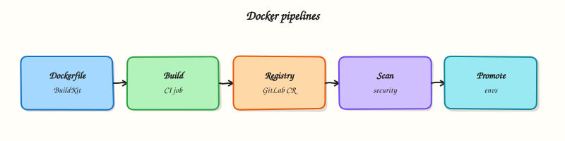

# Building Docker Images in CI

## Overview


Author a GitLab CI job that builds a multi-stage Dockerfile (BuildKit-friendly), tags the image with the commit SHA, and documents promotion from registry to later environments without rebuilding.

CI builds containers so every merge produces a **reproducible image**. GitLab provides a **Container Registry** per project (`$CI_REGISTRY_IMAGE`). Prefer **BuildKit** (or Kaniko/buildah on locked-down runners) over ad-hoc Docker-in-Docker. Tag with `$CI_COMMIT_SHA` (and optionally a digest); promote that same image through staging and production.

This is a core tutorial in **Module 8 · Docker Pipelines** of the REBASH Academy **GitLab CI/CD for Cloud & DevOps Engineers** series — written for Cloud, DevOps, Platform, and SRE engineers.

## Prerequisites


- [Artifacts, Caches, and Dependencies](artifacts-caches-and-dependencies.md)

## Learning Objectives


By the end of this tutorial, you will be able to:

- [ ] Sketch a Docker / BuildKit CI job using `$CI_REGISTRY_*`  
- [ ] Write a minimal multi-stage Dockerfile  
- [ ] Explain SHA tags vs floating `latest`  
- [ ] Describe image promotion without rebuild  
- [ ] Note DinD vs rootless / Kaniko trade-offs

## Architecture


This topic’s control points and relationships are shown below.



## Theory


### What it is

A **Docker pipeline** compiles application code into an OCI image inside a GitLab job, then pushes it to a registry. Common builders:

| Builder | Typical setup | Notes |
|---------|---------------|-------|
| Docker + BuildKit | `docker:cli` + `docker:dind` service | Familiar; needs privileged or socket carefully |
| Kaniko / buildah | No daemon | Better for restricted Kubernetes runners |
| GitLab Container Registry | `$CI_REGISTRY` + job token | Default home for project images |

**Multi-stage** Dockerfiles keep build tools out of the final runtime image. **Promotion** means retagging or deploying the same digest — never “rebuild on main with different base layers” for production.

### Why it matters

Laptop-built images drift from CI and skip scanners. Registry-hosted, SHA-tagged images are the unit of deploy for Kubernetes and cloud services. Layer caching and BuildKit cut minutes; digest pins stop surprise base-image moves. Without promotion discipline, staging and production silently diverge.

### How it works

1. Job authenticates to `$CI_REGISTRY` with `$CI_REGISTRY_USER` / `$CI_REGISTRY_PASSWORD` (or job token).  
2. BuildKit builds the Dockerfile (`DOCKER_BUILDKIT=1` or `docker buildx`).  
3. Tag `$CI_REGISTRY_IMAGE:$CI_COMMIT_SHA` (and maybe a branch tag for non-prod).  
4. Push; optionally record digest as an artefact or release note.  
5. Deploy jobs pull that SHA/digest; production never rebuilds from source for the same commit.

Cache mounts and registry pull-through caches accelerate rebuilds; they do not replace pinning base images by digest in production Dockerfiles.

### Key concepts and comparisons

| Practice | Prefer | Avoid |
|----------|--------|-------|
| Tags | Commit SHA / semver / digest | Only `latest` |
| Stages | Multi-stage slim runtime | Single fat image with compilers |
| Auth | CI job token / short-lived | Long-lived personal tokens in Git |
| Promote | Same digest across envs | Rebuild per environment |

### Common pitfalls

- Privileged DinD on shared runners without isolation.  
- Pushing `latest` from every MR.  
- Baking secrets into image layers (`ENV` with API keys).  
- Assuming cache guarantees bit-identical images across builders.  
- Rebuilding for production instead of promoting the tested digest.

## Hands-on Lab

### Objective

Create a `Dockerfile`, author a `.gitlab-ci.yml` with a Docker-in-Docker build stub using pinned images, and validate YAML offline — optionally building the image locally if Docker Engine is available.

### Prerequisites

- Python 3 with PyYAML (`pip install pyyaml`)
- Optional: Docker Engine locally to run `docker build`
- Optional: GitLab runner with `docker:dind` service for live builds

### Lab environment

Workspace: `~/rebash-gitlab/module-08`

File-first lab. YAML validates without Docker; build steps are optional locally.

``` {.bash .ra-terminal title="Terminal"}
mkdir -p ~/rebash-gitlab/module-08/src && cd ~/rebash-gitlab/module-08
```

### Real-world scenario

Your team ships containerised services. Security requires pinned base images and CI builds that push to the GitLab Container Registry. You create a minimal Dockerfile and a `docker:dind` job stub that builds and tags an image — validated offline before consuming runner capacity.

### Step-by-step tasks

#### Task 1 – Create the application and Dockerfile

Create `src/app.py`:

```python title="app.py"
print("docker-ci ok")
```

Create `Dockerfile`:

```dockerfile title="Dockerfile"
FROM python:3.12-alpine
WORKDIR /app
COPY src/app.py .
CMD ["python", "app.py"]
```

Verify Dockerfile syntax offline:

``` {.bash .ra-terminal title="Terminal"}
cd ~/rebash-gitlab/module-08
grep -q 'FROM python:3.12-alpine' Dockerfile
grep -q 'COPY src/app.py' Dockerfile
```

!!! example "Expected output"
    Both greps succeed silently.


#### Task 2 – Author the Docker build pipeline stub

Create `.gitlab-ci.yml`:

```yaml title=".gitlab-ci.yml"
variables:
  DOCKER_DRIVER: overlay2
  IMAGE_TAG: $CI_REGISTRY_IMAGE:$CI_COMMIT_SHORT_SHA

stages:
  - build

docker_build:
  stage: build
  image: docker:27-cli
  services:
    - name: docker:27-dind
      alias: docker
  variables:
    DOCKER_TLS_CERTDIR: "/certs"
  before_script:
    - docker info
  script:
    - docker build -t "$IMAGE_TAG" .
    - echo "Built image $IMAGE_TAG"
  rules:
    - if: $CI_COMMIT_BRANCH == $CI_DEFAULT_BRANCH
```

Validate offline:

``` {.bash .ra-terminal title="Terminal"}
cd ~/rebash-gitlab/module-08
python3 -c "
import yaml
d = yaml.safe_load(open('.gitlab-ci.yml'))
assert d['docker_build']['image'] == 'docker:27-cli'
assert d['docker_build']['services'][0]['name'] == 'docker:27-dind'
print('OK docker build stub')
"
```

!!! example "Expected output"
    Prints `OK docker build stub`.


#### Task 3 – Optional local build; required offline simulation

If Docker Engine is installed:

``` {.bash .ra-terminal title="Terminal"}
cd ~/rebash-gitlab/module-08
docker build -t rebash-module-08:lab .
docker run --rm rebash-module-08:lab | tee docker-out.txt
grep -q 'docker-ci ok' docker-out.txt
```

If Docker is not available, simulate the run path:

``` {.bash .ra-terminal title="Terminal"}
cd ~/rebash-gitlab/module-08
python3 src/app.py | tee docker-out.txt
grep -q 'docker-ci ok' docker-out.txt
```

!!! example "Expected output"
    `docker-out.txt` contains `docker-ci ok`.


### Validation steps

- [ ] `Dockerfile` pins `python:3.12-alpine`
- [ ] CI job uses pinned `docker:27-cli` and `docker:27-dind`
- [ ] `.gitlab-ci.yml` parses with PyYAML
- [ ] Build output contains `docker-ci ok` (local Docker or Python simulation)
- [ ] No registry credentials hard-coded in YAML

### Common errors and fixes

| Error | Cause | Fix |
|-------|-------|-----|
| `Cannot connect to Docker daemon` | DinD service missing or TLS misconfigured | Add `docker:27-dind` service and `DOCKER_TLS_CERTDIR` |
| Wrong architecture image | Unpinned `docker:latest` | Pin `docker:27-cli` and matching dind tag |
| Push fails with 403 | `CI_REGISTRY` login not run | Add `docker login` with `CI_JOB_TOKEN` before push (next module pattern) |
| Build context too large | No `.dockerignore` | Add `.dockerignore` excluding `.git` and caches |

### Challenge exercise

Add a `kaniko_build` job using `gcr.io/kaniko-project/executor:v1.23.2-debug` as an alternative that does not require DinD. Keep both jobs behind different `rules` so only one runs per pipeline.

### Learning outcomes

- Wrote a minimal production-style Dockerfile with pinned base image
- Modelled Docker-in-Docker build jobs with pinned CI images
- Validated pipeline YAML offline before runner execution
- Understood when local `docker build` substitutes for CI

### Cleanup

``` {.bash .ra-terminal title="Terminal"}
docker rmi rebash-module-08:lab 2>/dev/null || true
rm -f ~/rebash-gitlab/module-08/docker-out.txt
# Keep Dockerfile and .gitlab-ci.yml for module 09
```

## Validation


- [ ] Lab commands run under `~/rebash-gitlab/module-08/`
- [ ] You can explain each Theory section in your own words
- [ ] You used modern tooling where it applies to this topic
- [ ] You can describe one production failure mode for this topic

## Code Walkthrough


Production practice for **Building Docker Images in CI** always combines:

1. Inspect before you change (status, plan, logs, dry-run)
2. Prefer reversible, documented changes (Git, IaC, drop-ins, version pins)
3. Capture evidence (command output, pipeline logs) for handovers
4. Prefer current tools and APIs over legacy shortcuts
5. Least privilege — escalate credentials only when required

Keep runbooks short enough to follow under pressure. Automate checks; keep humans for judgement.

## Security Considerations


- Treat credentials and tokens for gitlab as privileged — never commit them
- Prefer short-lived auth (OIDC, roles, SSO) over long-lived keys
- Validate blast radius before apply/deploy/delete operations
- Restrict who can approve production changes
- Collect audit logs; limit who can read sensitive traces

## Common Mistakes


!!! warning "Privileged DinD on shared runners without isolation.  "
    Validate assumptions against the Theory section and official docs before changing production.

!!! warning "Pushing `latest` from every MR.  "
    Lab shortcuts (open security groups, admin roles, skip approvals) must not ship unchanged.

!!! warning "Changing production without a rollback path"
    Always know how to revert (previous artefact, prior release, state rollback, DNS failback).

## Best Practices


- Encode Building Docker Images in CI changes as code and review them in pull requests
- Pin versions (images, modules, actions, provider plugins)
- Separate environments with clear promotion gates
- Alert on symptoms with runbooks attached
- Destroy lab resources; tag everything with owner and expiry where possible

## Troubleshooting


| Symptom | Likely cause | Fix |
|---------|--------------|-----|
| Auth / permission denied | Wrong identity, policy, or scope | Check caller identity, roles, and least-privilege policies |
| Timeout / no route | Network, DNS, security group, or endpoint | Trace path, DNS, and allow-lists before retrying |
| Drift / unexpected plan | Manual change or wrong state/workspace | Reconcile desired vs actual; avoid click-ops on managed resources |
| Pipeline/job red | Flaky step, cache, or missing secret | Read failing step logs; bisect recent workflow/config changes |
| Cost spike | Idle load balancer, NAT, oversized compute | Inventory billable resources; stop/delete labs promptly |

## Summary


**Building Docker Images in CI** is essential for Cloud and DevOps engineers working with gitlab. Practise the lab until the inspection and change path is muscle memory, then continue the track.

## Interview Questions


1. Why is Docker-in-Docker often avoided in favour of Kaniko/Buildah?
2. How should image tags be chosen for traceability?
3. What does --no-push buy you while learning CI image builds?
4. How do you keep registry credentials out of the Dockerfile?
5. What base-image practices reduce supply-chain risk?

!!! tip "Sample answer — question 2"
    Check Dockerfile path/context, registry auth, and whether the executor may spawn builders. Confirm destination before enabling push.

!!! tip "Sample answer — question 4"
    Authenticate via CI variables or OIDC-linked tokens, never ENV passwords in the image. Prefer minimal bases and non-root users.

## Related Tutorials


- [Course overview](index.md)
- [Kubernetes Deploys and GitLab Agent](kubernetes-deploys-and-gitlab-agent.md)

## References


- [Build Docker images with GitLab CI](https://docs.gitlab.com/ee/ci/docker/using_docker_build.html) · [GitLab Container Registry](https://docs.gitlab.com/ee/user/packages/container_registry/) · [BuildKit](https://docs.docker.com/build/buildkit/)
