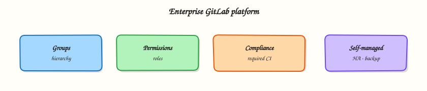

# Enterprise GitLab

## Overview

Structure groups and permissions, enforce compliance pipelines and governance, and outline self-managed operations including backup and restore.

Enterprise GitLab is a **platform**: org hierarchy, least-privilege access, mandatory CI templates, auditability, and operable self-managed (or SaaS) control planes. CI YAML alone is not enough — governance decides what every project inherits.

This is a core tutorial in **Module 18 · Enterprise GitLab** of the REBASH Academy **GitLab CI/CD for Cloud & DevOps Engineers** series — written for Cloud, DevOps, Platform, and SRE engineers.

## Prerequisites

- [Troubleshooting GitLab CI](troubleshooting-gitlab-ci.md)
- Comfort with groups, protected branches, and security scanning from earlier modules

## Learning Objectives

By the end of this tutorial, you will be able to:

- [ ] Design group hierarchy and role mapping  
- [ ] Apply compliance / required pipeline configuration patterns  
- [ ] Contrast SaaS vs self-managed operational duties  
- [ ] List backup & restore essentials for GitLab data

## Architecture

This topic’s control points and relationships are shown below.



## Theory

### What it is

**Enterprise GitLab** covers how organisations scale from a few projects to hundreds: **groups** and subgroups for ownership, **roles** (Guest → Owner) and custom permissions, **compliance pipelines** / required CI configuration, shared runners and templates, and — for **self-managed** — upgrades, HA, object storage, and **backup & restore**. Governance answers: Who can merge? Who can deploy production? Which scans are mandatory?

| Concern | Enterprise control |
|---------|-------------------|
| Structure | Top-level groups per org/BU; subgroups per product |
| Access | Least privilege; SSO/SAML; audit events |
| CI policy | Organisation/group templates; compliance frameworks |
| Runners | Fleet ownership, tags, network isolation |
| Continuity | Backups, restore drills, DR targets |

### Why it matters

Without structure, every team invents CI and secrets handling — security and cost explode. Platform teams provide paved roads: shared includes, OIDC to cloud, protected environments, and evidence for auditors. Self-managed operators own availability of the control plane that every pipeline depends on — treat GitLab like a tier-0 service.

### How it works

1. **Model groups** — company → platform/product → repos; avoid flat thousands of root projects.
2. **Map roles** — Developers push MRs; Maintainers merge protected branches; deploy to production via protected environments / approvers.
3. **Inherit CI** — group-level includes or compliance pipelines inject SAST, secret detection, and licence policies.
4. **Centralise runners** — group runners with tags; isolate privileged / Docker-in-Docker; monitor minutes and saturation.
5. **Govern** — branch protection, CODEOWNERS, push rules, approval rules, audit streaming where licensed.
6. **Operate self-managed** — Omnibus or Helm chart; object storage for artefacts/LFS; scheduled backups (`backup-utility` / Omnibus backup); test restore to a scratch instance.
7. **Align GitOps** — desired state in Git; agents or external CD reconcile; GitLab remains source of truth for change review.

Document RPO/RTO for GitLab itself — application DR is useless if you cannot restore the forge.

### Key concepts and comparisons

| Hosting | You operate | GitLab operates |
|---------|-------------|-----------------|
| GitLab.com SaaS | Projects, runners (optional), access | Control plane, upgrades |
| Self-managed | Full stack, backups, HA | Software + support (licensed) |

| Governance artefact | Purpose |
|---------------------|---------|
| Compliance pipeline | Mandatory jobs regardless of project YAML |
| Instance/group template | Shared best-practice CI |
| Audit events | Who changed what |
| Protected env / branch | Change control |

### Common pitfalls

- Granting Owner widely “for convenience” — breaks least privilege and audit stories.
- Compliance jobs that teams can override with `allow_failure` everywhere — policy theatre.
- Backups without restore tests — unproven RTO.
- One shared privileged runner for all groups — lateral movement risk.

## Hands-on Lab

Create a workspace for this tutorial.

```bash
mkdir -p ~/rebash-gitlab/module-18 && cd ~/rebash-gitlab/module-18
```

**Focus:** hands-on practice for Enterprise GitLab

### Step 1 – Skeleton

```bash
cat > lab.sh << 'EOF'
#!/usr/bin/env bash
set -euo pipefail
echo "lab: Enterprise GitLab"
EOF
chmod +x lab.sh
./lab.sh
```

### Step 2 – Core exercise

```bash
mkdir -p ~/rebash-gitlab/module-18 && cd ~/rebash-gitlab/module-18
mkdir -p ci
cat > ci/compliance.yml << 'EOF'
# Example include enforced at group level (conceptually)
stages:
  - compliance

 compulsory_secret_check:
  stage: compliance
  image: alpine:3.20
  script:
    - echo "Organisation-required secret detection placeholder"
    - echo "Wire real scanner via GitLab templates / Semgrep / etc."
  rules:
    - when: always
EOF

cat > .gitlab-ci.yml << 'EOF'
include:
  - local: ci/compliance.yml

stages:
  - compliance
  - build

build:
  stage: build
  image: alpine:3.20
  script:
    - echo "Product job runs after inherited compliance stage"
EOF

cat > enterprise-checklist.md << 'EOF'
- [ ] Group hierarchy documented (org → product → project)
- [ ] Role matrix: who merges / who deploys production
- [ ] SSO/SAML (or equivalent) for humans
- [ ] Required CI / compliance include path agreed
- [ ] Shared runner tags and network zones documented
- [ ] Backup schedule + last successful restore drill date
- [ ] RPO/RTO for GitLab control plane written down
EOF

python3 - << 'PY'
import yaml
yaml.safe_load(open(".gitlab-ci.yml"))
yaml.safe_load(open("ci/compliance.yml"))
print("Enterprise skeleton OK")
PY
```

### Final step – Cleanup note

```bash
# Keep ~/rebash-gitlab/ for later labs; destroy cloud resources you created
./lab.sh || true
```

## Validation

- [ ] Lab commands run under `~/rebash-gitlab/module-18/`
- [ ] You can explain each Theory section in your own words
- [ ] You used modern tooling where it applies to this topic
- [ ] You can describe one production failure mode for this topic

## Code Walkthrough

Production practice for **Enterprise GitLab** always combines:

1. Inspect before you change (status, plan, logs, dry-run)
2. Prefer reversible, documented changes (Git, IaC, drop-ins, version pins)
3. Capture evidence (command output, pipeline logs) for handovers
4. Prefer current tools and APIs over legacy shortcuts
5. Least privilege — escalate credentials only when required

Keep runbooks short enough to follow under pressure. Automate checks; keep humans for judgement.

## Security Considerations

- Treat credentials and tokens for gitlab as privileged — never commit them
- Prefer short-lived auth (OIDC, roles, SSO) over long-lived keys
- Validate blast radius before apply/deploy/delete operations
- Restrict who can approve production changes
- Collect audit logs; limit who can read sensitive traces

## Common Mistakes

!!! warning "Granting Owner widely “for convenience” — breaks least privilege and audit stories."
    Validate assumptions against the Theory section and official docs before changing production.

!!! warning "Compliance jobs that teams can override with `allow_failure` everywhere — policy theatre."
    Lab shortcuts (open security groups, admin roles, skip approvals) must not ship unchanged.

!!! warning "Changing production without a rollback path"
    Always know how to revert (previous artefact, prior release, state rollback, DNS failback).

## Best Practices

- Encode Enterprise GitLab changes as code and review them in pull requests
- Pin versions (images, modules, actions, provider plugins)
- Separate environments with clear promotion gates
- Alert on symptoms with runbooks attached
- Destroy lab resources; tag everything with owner and expiry where possible

## Troubleshooting

| Symptom | Likely cause | Fix |
|---------|--------------|-----|
| Auth / permission denied | Wrong identity, policy, or scope | Check caller identity, roles, and least-privilege policies |
| Timeout / no route | Network, DNS, security group, or endpoint | Trace path, DNS, and allow-lists before retrying |
| Drift / unexpected plan | Manual change or wrong state/workspace | Reconcile desired vs actual; avoid click-ops on managed resources |
| Pipeline/job red | Flaky step, cache, or missing secret | Read failing step logs; bisect recent workflow/config changes |
| Cost spike | Idle load balancer, NAT, oversized compute | Inventory billable resources; stop/delete labs promptly |

## Summary

**Enterprise GitLab** is essential for Cloud and DevOps engineers working with gitlab. Practise the lab until the inspection and change path is muscle memory, then continue the track.

## Interview Questions

1. How does **Enterprise GitLab** show up when operating Cloud or production platforms?
2. What would you check first if this area misbehaves in production?
3. Which modern tools or APIs replace older equivalents here?
4. What security control should accompany this capability?
5. How would you automate verification of this topic in CI?

!!! tip "Sample answer — question 2"
    Start with blast radius and recent changes, gather evidence (logs, status, plan/diff), then fix forward with a known rollback path — not guesswork.

## Related Tutorials

- [Course overview](index.md)
- - [Course overview](index.md) · [DevOps Engineer path](../career-paths/devops-engineer/index.md)

## References

- [Groups](https://docs.gitlab.com/ee/user/group/)  
- [Compliance pipelines](https://docs.gitlab.com/ee/user/group/compliance_pipelines.html)  
- [Backing up GitLab](https://docs.gitlab.com/ee/administration/backup_restore/backup_gitlab.html)  
- [GitLab architecture](https://docs.gitlab.com/ee/development/architecture.html)
