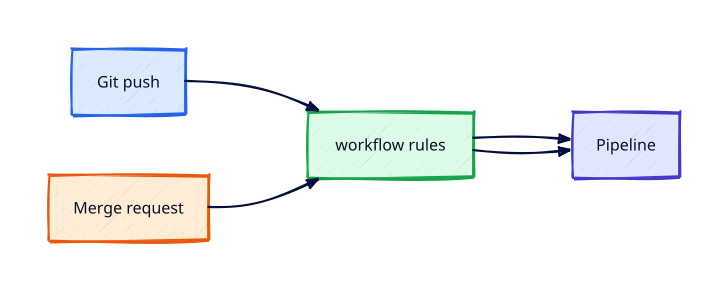

# GitLab Merge Requests and Pipeline Triggers

## Overview

GitLab Merge Requests and Pipeline Triggers is essential for engineers who operate GitLab CI in production — not only the team
that maintains runners. This lesson covers **merge request pipelines, `CI_PIPELINE_SOURCE`, and branch push triggers** with practical
`.gitlab-ci.yml` examples you can lint locally and run on GitLab.com free tier.

Other CI platforms exist and are covered in later REBASH tracks; here GitLab CI is the
focus. You will relate concepts to [Git](../git/index.md) merge requests, and prepare for
secure deploy patterns connecting to [Docker](../docker/index.md),
[Kubernetes](../kubernetes/index.md), and
[Terraform](../terraform/terraform-in-ci-cd-pipelines.md).

This is **Tutorial 4** in **Module 1: Foundations** of the REBASH Academy **GitLab CI/CD** track.

!!! tip "Free-tier and local lab options"
    Use **GitLab.com** free tier for real pipeline runs. Where a cloud runner is optional,
    each lab includes a **lint / dry-run** path with `glab ci lint`, Python YAML parsing, or
    **gitlab-ci-local** so you can validate `.gitlab-ci.yml` without spending CI minutes.


## Prerequisites

- Completed tutorial 3 in this track (or equivalent GitLab CI awareness)
- Lab repository from prior tutorials or a fresh `git init` workspace

## Learning Objectives

By the end of this tutorial, you will be able to:

- [ ] Explain how gitlab merge requests and pipeline triggers applies in GitLab CI production pipelines
- [ ] Author and validate `.gitlab-ci.yml` for the concepts in this tutorial
- [ ] Choose appropriate runners, tags, and variables for the workload
- [ ] Connect this topic to merge request workflows and branch protection
- [ ] Troubleshoot a failed GitLab CI job using logs and lint tools

## Architecture



| Layer | Responsibility |
|-------|----------------|
| **Trigger** | Git push, MR, tag, schedule, manual |
| **Pipeline** | `.gitlab-ci.yml` automation definition in Git |
| **Runner** | Isolated compute executing job scripts |
| **Artefacts & cache** | Outputs and dependency acceleration |
| **Deploy target** | GitLab environment, cluster, or cloud account |

## Theory

### Merge request pipelines

When you open or update a merge request (MR), GitLab can run a **merge request pipeline**
with `CI_PIPELINE_SOURCE=merge_request_event`. This is the primary feedback loop for code review:
lint, unit tests, and security scans run before merge.

### Branch pipelines

Pushes to branches (including `main`) create **branch pipelines** with
`CI_PIPELINE_SOURCE=push`. After merge, the default branch pipeline often builds releasable
artefacts and triggers deploy stages.

### Combining triggers with rules

Typical pattern for trunk-based flow:

```yaml
workflow:
  rules:
    - if: $CI_PIPELINE_SOURCE == "merge_request_event"
    - if: $CI_COMMIT_BRANCH == $CI_DEFAULT_BRANCH

test:
  stage: test
  script: pytest -q
  rules:
    - if: $CI_PIPELINE_SOURCE == "merge_request_event"
    - if: $CI_COMMIT_BRANCH == $CI_DEFAULT_BRANCH
```

### MR widgets and merge checks

GitLab surfaces pipeline status on the MR. Combine with **merge request approvals** and
**protected branches** so green pipelines are required before merge — see
[Triggers, Rules, and Branch Protection](triggers-rules-and-branch-protection.md).


        ### Minimal GitLab CI test pipeline

        ```yaml
        stages:
  - test

unit-test:
  stage: test
  image: python:3.12-slim
  script:
    - pip install -r requirements.txt
    - pytest -q
  rules:
    - if: $CI_PIPELINE_SOURCE == "merge_request_event"
    - if: $CI_COMMIT_BRANCH == $CI_DEFAULT_BRANCH
        ```


### Production notes for GitLab Merge Requests and Pipeline Triggers

Teams standardise GitLab CI templates but still integrate with external systems — container
registries, Kubernetes clusters, and cloud OIDC roles. Document **merge request pipelines, `CI_PIPELINE_SOURCE`, and branch push triggers** in your
internal runbook: who approves `.gitlab-ci.yml` changes, which runners touch production
credentials, and how rollbacks interact with [Git](../git/index.md) revert versus forward fix.

### Related tutorials in this module

Module progression builds depth: earlier tutorials establish vocabulary; later ones add security
scanning, environment gates, and cloud deploy identities. If a job fails, read the job trace
top-down and compare `rules:` against `CI_*` predefined variables — avoid deprecated
`only/except` syntax from older examples.

## Hands-on Lab

### Step 1 — Lab workspace

```bash
mkdir -p ~/rebash-cicd/gitlab-merge-requests-and-pipeline-triggers && cd ~/rebash-cicd/gitlab-merge-requests-and-pipeline-triggers
git init -b main
echo "# GitLab Merge Requests and Pipeline Triggers" > README.md
```

### Step 2 — GitLab CI configuration

Add `.gitlab-ci.yml` using the example in Theory. Tailor scripts to a minimal Python project:

```bash
echo 'print("ok")' > app.py
echo 'def test_ok(): assert True' > test_app.py
pip freeze > requirements.txt 2>/dev/null || echo pytest > requirements.txt
```

### Step 3 — Push to GitLab.com or dry-run locally

**GitLab.com (free tier):** create a private project, add the remote, push, and open a merge
request. Confirm pipeline stages in the MR widget.

**Local dry-run:** validate YAML without spending CI minutes (see Lint section below).

### Step 4 — Evidence capture

Save a screenshot or log excerpt to `evidence/notes.md` describing stage order, artefact names,
runner tags used, and any manual approval you configured.


### Step 5 — Merge request pipeline lab

Create a feature branch, push, and open an MR:

```bash
git checkout -b feature/pipeline-demo
echo "# demo" >> README.md
git add README.md .gitlab-ci.yml
git commit -m "Add GitLab CI pipeline"
git push -u origin feature/pipeline-demo
```

In GitLab, open the MR and confirm a **merge request pipeline** runs. Merge to `main` and
confirm a **branch pipeline** on the default branch.


        ### Lint / dry-run alternative

        Validate pipeline syntax without executing jobs:

        ```bash
        glab ci lint .gitlab-ci.yml 2>/dev/null || python3 -c "import yaml; yaml.safe_load(open('.gitlab-ci.yml'))"
gitlab-ci-local --file .gitlab-ci.yml 2>/dev/null || echo 'Optional: npm i -g gitlab-ci-local'
        ```

        Dry-run paths prove structure and variable references; they do not replace an end-to-end run
        on a real runner when you are learning job isolation and artefact behaviour.

## Validation

| Check | Pass criteria |
|-------|---------------|
| `.gitlab-ci.yml` | Valid YAML; `glab ci lint` or equivalent passes |
| Lint/dry-run | Local validation documented in lab notes |
| Optional CI run | Pipeline green on MR or default branch |
| Notes | `evidence/notes.md` explains stages, runners, and credentials used |

## Code Walkthrough

| Section | GitLab CI detail |
|---------|------------------|
| Entry file | `.gitlab-ci.yml` at repository root |
| Isolation | `image:` keyword and runner executor |
| Conditional execution | `rules:` and `workflow:rules` |
| Manual gate | `when: manual` or protected environment |
| MR integration | Pipeline widget, test reports, coverage |

Read job traces top-down: clone failure, missing variable, script non-zero exit, artefact
upload error, runner tag mismatch.

## Security Considerations

- Never print secrets; verify GitLab masking in job logs after first run
- Scope CI/CD variables to environments and protected branches
- Pin container images to semver or digest
- Run untrusted MR jobs on isolated runners without production credentials
- Rotate tokens used in tutorial labs; they are not production patterns

## Common Mistakes

!!! warning "Using deprecated `only/except`"
    Breaks on upgrade and confuses reviewers. **Fix:** Use `rules:` and `workflow:rules`.

!!! warning "Secrets in Git"
    Credential leak and audit failure. **Fix:** Use GitLab CI/CD variables and OIDC.

!!! warning "Skipping lint locally"
    Wasted runner minutes. **Fix:** Run `glab ci lint` or `gitlab-ci-local` before push.

## Best Practices

- Pin runner images; schedule periodic base image upgrades
- Keep pipelines fast — cache dependencies, split slow integration tests
- Use merge request pipelines for feedback before merging to default branch
- Document rollback: revert commit vs redeploy previous image digest
- Align pipeline changes with [Git](../git/index.md) branch protection rules

## Troubleshooting

| Issue | Cause | Fix |
|-------|-------|-----|
| Job skipped | `rules:` mismatch | Log `CI_PIPELINE_SOURCE` and branch variables |
| Permission denied | Wrong variable scope or OIDC trust | Fix protected variable or cloud role |
| Docker daemon error | DinD misconfiguration | Set `DOCKER_TLS_CERTDIR`; verify `services:` |
| Stuck pending | No runner matches tags | Add tagged runner or fix job `tags:` |
| MR pipeline missing | `workflow:rules` too strict | Allow `merge_request_event` source |

## Production Patterns and Deep Dive

        ### How `GitLab Merge Requests and Pipeline Triggers` fits in real environments

        Teams shipping through **Module 1: Foundations** concepts use these patterns in design reviews, pipeline
        migrations, and incident retrospectives. The lab proves you can author valid GitLab CI
        configuration; this section connects those files to trade-offs you will defend in interviews
        and on-call handovers focused on **merge request pipelines, `CI_PIPELINE_SOURCE`, and branch push triggers**.

        Production GitLab CI programmes typically document:

        | Artefact | Purpose |
        |----------|---------|
        | Pipeline architecture diagram | Stages, triggers, credentials, and deploy targets |
        | Runbook | How to re-run, roll back, or disable a job safely |
        | Credential rotation procedure | Who rotates tokens, OIDC trust, and protected variables |
        | Cost / minute budget | Runner sizing, cache strategy, and concurrency limits |

        Always pair automation with **least privilege**, **branch protection**, and **auditable**
        deploy gates. The REBASH GitLab CI/CD track uses British English and assumes you completed
        [Git](../git/index.md) fundamentals first.

        ### Extended CLI and validation reference

        The commands below extend the lab — run lint and dry-run variants first, then execute on
        GitLab.com or a self-hosted runner when you need to observe artefacts, caches, and environment
        propagation.

        ```bash
glab mr list --per-page 5
glab ci list --source merge_request_event 2>/dev/null || glab ci list
grep -E 'workflow:|rules:|CI_PIPELINE_SOURCE' .gitlab-ci.yml
```

        ### Operational scenario (table-top)

        **Scenario:** A teammate merges to `main` and production deploy fails with "permission denied"
        on a step related to **GitLab Merge Requests and Pipeline Triggers**.

        | Step | Action | Why |
        |------|--------|-----|
        | 1 | Open the failed job trace; note stage, image, runner, and identity used | Wrong credential is the top cause |
        | 2 | Compare branch protection and protected environment rules | Protected branches block secrets or deploys |
        | 3 | Re-run the job with `CI_DEBUG_TRACE=true` where appropriate | Surfaces masked variable issues |
        | 4 | Diff `.gitlab-ci.yml` against last green commit | Recent YAML change is likely |
        | 5 | Roll forward with a fix or revert merge | Document in incident ticket |
        | 6 | Add a lint gate so the misconfiguration fails in the MR pipeline | Prevents repeat |

        ### Hardening checklist before production

        - [ ] Short-lived credentials (OIDC) preferred over long-lived PATs or access keys
        - [ ] Secrets in GitLab CI/CD variables — never committed to Git
        - [ ] Untrusted MR pipelines run on runners without production credentials
        - [ ] Deploy jobs require manual approval or protected environments
        - [ ] Container images pinned by digest where feasible
        - [ ] SBOM or vulnerability scan stage on default branch
        - [ ] Cross-links reviewed: [Docker](../docker/index.md), [Kubernetes](../kubernetes/index.md), [Terraform](../terraform/index.md)

        ### Terraform handoff note

        Infrastructure changes belong in [Terraform](../terraform/index.md). After this track,
        reproduce deploy and plan/apply gates using
        [Terraform in CI/CD Pipelines](../terraform/terraform-in-ci-cd-pipelines.md): plan on merge
        requests, apply on protected branches with OIDC, and store remote state with locking.

        ### Review questions (self-check)

        Before moving to the next tutorial, answer without looking at notes:

        1. Which `.gitlab-ci.yml` keywords implement this concept?
        2. What is the least-privilege identity this job should use?
        3. How would you validate YAML locally before pushing?
        4. Where do artefacts and caches differ in retention and security?
        5. Which [Git](../git/index.md) workflow rule prevents broken `main`?

        ### Additional references

        Bookmark official GitLab documentation for **GitLab Merge Requests and Pipeline Triggers**. Note default runner images, quota
        limits, and which pipeline sources consume shared runner minutes so your team can forecast cost
        alongside [Docker](../docker/index.md) build times.

## Summary

- GitLab Merge Requests and Pipeline Triggers is implemented in GitLab CI through `.gitlab-ci.yml`, runners, and merge request workflows
- Validate locally with `glab ci lint` or `gitlab-ci-local` before spending runner minutes
- Security and branch protection are part of pipeline design, not an afterthought
- Continue sequentially or jump to related [Docker](../docker/index.md) and [Terraform](../terraform/index.md) material when ready

## Interview Questions

1. How does GitLab Merge Requests and Pipeline Triggers work in GitLab CI?
2. Where should secrets live in GitLab CI/CD?
3. What triggers merge request pipelines vs branch pipelines?
4. How do artefacts differ from container images in GitLab?
5. Explain least privilege for a GitLab deploy job.
6. What is the blast radius of a compromised runner?
7. How would you roll back a bad deploy in GitLab?
8. When is matrix parallelism worth the runner cost?
9. How do protected environments help in GitLab?
10. What comes after this track in the REBASH curriculum?

!!! tip "Sample answer — question 1"
    GitLab CI expresses GitLab Merge Requests and Pipeline Triggers through `.gitlab-ci.yml` jobs, `stages`, and `rules:`. Merge request pipelines use `CI_PIPELINE_SOURCE=merge_request_event`; default branch pipelines use push sources. Map each concept to the predefined variables GitLab injects.


!!! tip "Sample answer — question 5"
    Deploy jobs should use protected environment-scoped variables and dedicated runners — never a broad admin cloud key on shared MR runners.


## Related Tutorials

- Track overview: [GitLab CI/CD](index.md)
- Previous: [GitLab CI Fundamentals](gitlab-ci-fundamentals.md)
- Next: [GitLab Runners and Executors](gitlab-runners-and-executors.md)

## Cross-track links

- [Git](../git/index.md) — branching, merge requests, and review workflows pipelines depend on
- [Docker](../docker/index.md) — images built and scanned in CI
- [Kubernetes](../kubernetes/index.md) — deploy targets for GitOps and progressive delivery
- [Terraform](../terraform/index.md) — especially [Terraform in CI/CD Pipelines](../terraform/terraform-in-ci-cd-pipelines.md)
- [AWS](../aws/index.md) — cloud credentials, OIDC, and deployment targets

## References

1. [GitLab CI/CD YAML reference](https://docs.gitlab.com/ee/ci/yaml/)
2. [GitLab Runner documentation](https://docs.gitlab.com/runner/)
3. [GitLab CI/CD variables](https://docs.gitlab.com/ee/ci/variables/)
4. [REBASH Terraform in CI/CD](https://rebash.academy/terraform/terraform-in-ci-cd-pipelines/)
