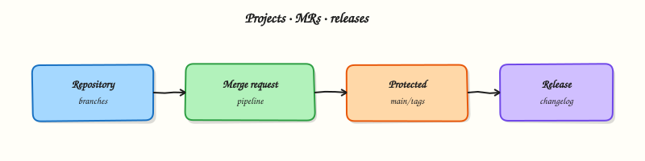

# GitLab Projects, Merge Requests, and Releases

## Overview


Connect repositories, branches, merge requests, protected branches, tags, and releases to how pipelines start and what they are allowed to change.

GitLab CI/CD is useless without a clear **project** model. A project owns the Git repository, CI settings, protected branches, variables, and release records. Merge requests (MRs) are the review surface; tags and **Releases** mark shippable versions.

This is a core tutorial in **Module 2 · GitLab Projects** of the REBASH Academy **GitLab CI/CD for Cloud & DevOps Engineers** series — written for Cloud, DevOps, Platform, and SRE engineers.

## Prerequisites


- [GitLab CI/CD Fundamentals](gitlab-ci-fundamentals.md)

## Learning Objectives


By the end of this tutorial, you will be able to:

- [ ] Describe project vs group vs repository settings that affect CI  
- [ ] Explain MR pipelines vs branch pipelines  
- [ ] Configure protected branches and protected tags mentally  
- [ ] Relate Git tags to GitLab Releases

## Architecture


This topic’s control points and relationships are shown below.



## Theory


### What it is

A **GitLab project** wraps a Git repository plus integrations (CI/CD, issues, packages, environments). **Branches** hold work in progress; **merge requests** propose integrating a source branch into a target (often `main`). **Protected branches** restrict who can push or merge and which runners / variables apply. A **tag** marks a commit; a **Release** is a GitLab object that attaches notes, assets, and often a changelog to that tag.

| Concept | CI impact |
|---------|-----------|
| Branch push | May start a branch pipeline |
| Merge request | Often starts an MR pipeline (`merge_request_event`) |
| Protected branch | Can unlock protected variables / environments |
| Tag / Release | Common trigger for publish and deploy jobs |

### Why it matters

Production mistakes usually start as process gaps: anyone can push to `main`, deploy jobs run on every feature branch, or release tags are created without CI. Protected branches plus MR-required pipelines give you **reviewable change** before production. Release tags give ops a stable handle for rollbacks and artefact promotion.

### How it works

Typical flow:

1. Developer pushes a feature branch; optional branch pipeline runs lint/tests.
2. They open an MR; GitLab runs an MR pipeline (prefer `rules` on `merge_request_event`).
3. Reviewers approve; protected-branch rules require a successful pipeline before merge.
4. Merge to `main` may run a post-merge pipeline (build, publish).
5. Cutting `v1.2.3` (and optionally creating a GitLab Release) triggers release/publish jobs.

Predefined variables such as `$CI_MERGE_REQUEST_IID`, `$CI_COMMIT_BRANCH`, `$CI_COMMIT_TAG`, and `$CI_COMMIT_REF_PROTECTED` tell jobs which context they are in.

### Key concepts and comparisons

| Trigger | Typical use |
|---------|-------------|
| Branch pipeline | Fast feedback on every push |
| MR pipeline | Required checks before merge |
| Tag pipeline | Versioned publish / deploy |
| Schedule / manual | Nightly scans, promotions |

**Protected branch vs protected variable:** protecting `main` alone is incomplete — pair it with **protected CI/CD variables** and **protected environments** so secrets never appear on unprotected feature branches.

### Common pitfalls

- Assuming “pipeline on push” equals “pipeline on MR” — configure `rules` explicitly.
- Creating Releases without tags (or tags without CI) — keep one SemVer tag → one Release.
- Leaving `main` unprotected on shared projects.
- Treating GitLab Releases as a replacement for artefact registries — Releases point at assets; registries store images/packages.

## Hands-on Lab

### Objective

Create an MR policy checklist, a project README, and a `.gitlab-ci.yml` with `workflow:rules` that runs different jobs on merge requests versus the default branch — all validated offline.

### Prerequisites

- Python 3 with PyYAML (`pip install pyyaml`)
- Completed [GitLab CI/CD Fundamentals](gitlab-ci-fundamentals.md) lab files (optional starting point)
- Optional: GitLab project with protected `main` branch

### Lab environment

Workspace: `~/rebash-gitlab/module-02`

File-first lab. Push to GitLab only when you want MR and branch pipelines on a runner.

```bash
mkdir -p ~/rebash-gitlab/module-02 && cd ~/rebash-gitlab/module-02
```

### Real-world scenario

Your platform team requires every service repo to document MR expectations and encode branch-aware CI. Feature branches must run fast lint checks on merge requests; the default branch runs an additional compliance job after merge. You ship reviewable YAML and a machine-readable MR policy before opening the first merge request.

### Step-by-step tasks

#### Task 1 – Create the project README

Create `README.md`:

```markdown
# rebash-gitlab-module-02

Sample service for GitLab projects, merge requests, and releases.

## Branch policy

- Feature work lands via merge request into `main`
- `main` is protected; direct pushes are blocked
- Tags matching `v*.*.*` trigger release pipelines
```

Verify the file exists:

```bash
cd ~/rebash-gitlab/module-02
test -s README.md
head -3 README.md | tee readme-head.txt
```

**Expected output:** `readme-head.txt` shows the project title and description lines.

#### Task 2 – Define the MR checklist policy

Create `mr-policy.yaml` — a machine-readable checklist reviewers use before approving:

```yaml
version: 1
merge_request:
  required_checks:
    - pipeline_must_pass
    - at_least_one_approval
    - no_wip_title_prefix
  blocked_if:
    - target_branch_unprotected
  notes:
    - "MR pipelines run on merge_request_event only"
    - "Release tags require protected tag rules in GitLab UI"
branch_protection:
  default_branch: main
  allow_force_push: false
  require_ci_pass_before_merge: true
```

Validate:

```bash
cd ~/rebash-gitlab/module-02
python3 -c "
import yaml
p = yaml.safe_load(open('mr-policy.yaml'))
assert p['merge_request']['required_checks'][0] == 'pipeline_must_pass'
assert p['branch_protection']['default_branch'] == 'main'
print('OK mr-policy', p['version'])
"
```

**Expected output:** Prints `OK mr-policy 1`.

#### Task 3 – Author branch-aware CI with workflow rules

Create `src/app.py`:

```python
print("module-02 ok")
```

Create `.gitlab-ci.yml`:

```yaml
workflow:
  rules:
    - if: $CI_PIPELINE_SOURCE == "merge_request_event"
    - if: $CI_COMMIT_BRANCH == $CI_DEFAULT_BRANCH

stages:
  - validate
  - release

mr_lint:
  stage: validate
  image: python:3.12-alpine
  rules:
    - if: $CI_PIPELINE_SOURCE == "merge_request_event"
  script:
    - python -m py_compile src/app.py
    - echo "MR pipeline for branch $CI_COMMIT_REF_NAME"

main_compliance:
  stage: validate
  image: python:3.12-alpine
  rules:
    - if: $CI_COMMIT_BRANCH == $CI_DEFAULT_BRANCH
  script:
    - python src/app.py
    - test -f README.md
    - test -f mr-policy.yaml

release_job:
  stage: release
  image: registry.gitlab.com/gitlab-org/release-cli:latest
  rules:
    - if: $CI_COMMIT_TAG
  script:
    - echo "Would create GitLab Release for tag $CI_COMMIT_TAG"
```

Validate offline:

```bash
cd ~/rebash-gitlab/module-02
python3 -c "
import yaml
d = yaml.safe_load(open('.gitlab-ci.yml'))
assert 'workflow' in d
jobs = [k for k in d if k not in ('workflow', 'stages')]
assert set(jobs) == {'mr_lint', 'main_compliance', 'release_job'}
print('OK', jobs)
"
```

**Expected output:** Prints `OK` with the three job names.

#### Task 4 – Simulate default-branch scripts locally

Prove the compliance job logic without a runner:

```bash
cd ~/rebash-gitlab/module-02
python3 -m py_compile src/app.py
python3 src/app.py | tee branch-out.txt
test -f README.md && test -f mr-policy.yaml
grep -q 'module-02 ok' branch-out.txt
```

**Expected output:** Compile succeeds; `branch-out.txt` contains `module-02 ok`; policy files exist.

### Validation steps

- [ ] `README.md` documents branch and tag policy
- [ ] `mr-policy.yaml` parses and lists required MR checks
- [ ] `.gitlab-ci.yml` defines `workflow:rules` for MR and default branch
- [ ] `release_job` runs only when `$CI_COMMIT_TAG` is set
- [ ] Local simulation passes compile, run, and file checks

### Common errors and fixes

| Error | Cause | Fix |
|-------|-------|-----|
| Duplicate pipelines on MR push | Missing `workflow:rules` | Add MR-only and default-branch rules as shown |
| `release_job` runs on every branch | `rules` omitted on release job | Gate with `- if: $CI_COMMIT_TAG` |
| MR pipeline never starts | Push without opening MR | Open a merge request or simulate with `merge_request_event` on GitLab |
| Compliance job fails on feature branch | Wrong `rules` on `main_compliance` | Restrict to `$CI_COMMIT_BRANCH == $CI_DEFAULT_BRANCH` |

### Challenge exercise

Add `CHANGELOG.md` with a `## 0.1.0` section and extend `release_job` to `cat CHANGELOG.md` in its script. Validate YAML still parses.

### Learning outcomes

- Documented MR expectations in a reviewable README and YAML policy file
- Separated MR pipelines from default-branch pipelines with `workflow:rules`
- Modelled tag-triggered release jobs without running them on every push
- Validated all project YAML offline before pushing

### Cleanup

```bash
rm -f ~/rebash-gitlab/module-02/readme-head.txt ~/rebash-gitlab/module-02/branch-out.txt
# Keep project files for module 03
```

## Validation


- [ ] Lab commands run under `~/rebash-gitlab/module-02/`
- [ ] You can explain each Theory section in your own words
- [ ] You used modern tooling where it applies to this topic
- [ ] You can describe one production failure mode for this topic

## Code Walkthrough


Production practice for **GitLab Projects, Merge Requests, and Releases** always combines:

1. Inspect before you change (status, plan, logs, dry-run)
2. Prefer reversible, documented changes (Git, IaC, drop-ins, version pins)
3. Capture evidence (command output, pipeline logs) for handovers
4. Prefer current tools and APIs over legacy shortcuts
5. Least privilege — escalate credentials only when required

Keep runbooks short enough to follow under pressure. Automate checks; keep humans for judgement.

## Security Considerations


- Treat credentials and tokens for gitlab as privileged — never commit them
- Prefer short-lived auth (OIDC, roles, SSO) over long-lived keys
- Validate blast radius before apply/deploy/delete operations
- Restrict who can approve production changes
- Collect audit logs; limit who can read sensitive traces

## Common Mistakes


!!! warning "Assuming “pipeline on push” equals “pipeline on MR” — configure `rules` explicitly."
    Validate assumptions against the Theory section and official docs before changing production.

!!! warning "Creating Releases without tags (or tags without CI) — keep one SemVer tag → one Release."
    Lab shortcuts (open security groups, admin roles, skip approvals) must not ship unchanged.

!!! warning "Changing production without a rollback path"
    Always know how to revert (previous artefact, prior release, state rollback, DNS failback).

## Best Practices


- Encode GitLab Projects, Merge Requests, and Releases changes as code and review them in pull requests
- Pin versions (images, modules, actions, provider plugins)
- Separate environments with clear promotion gates
- Alert on symptoms with runbooks attached
- Destroy lab resources; tag everything with owner and expiry where possible

## Troubleshooting


| Symptom | Likely cause | Fix |
|---------|--------------|-----|
| Auth / permission denied | Wrong identity, policy, or scope | Check caller identity, roles, and least-privilege policies |
| Timeout / no route | Network, DNS, security group, or endpoint | Trace path, DNS, and allow-lists before retrying |
| Drift / unexpected plan | Manual change or wrong state/workspace | Reconcile desired vs actual; avoid click-ops on managed resources |
| Pipeline/job red | Flaky step, cache, or missing secret | Read failing step logs; bisect recent workflow/config changes |
| Cost spike | Idle load balancer, NAT, oversized compute | Inventory billable resources; stop/delete labs promptly |

## Summary


**GitLab Projects, Merge Requests, and Releases** is essential for Cloud and DevOps engineers working with gitlab. Practise the lab until the inspection and change path is muscle memory, then continue the track.

## Interview Questions


1. Why prefer merge request pipelines over duplicate branch pipelines?
2. What is detached merge request pipeline behaviour?
3. How do draft MRs change your required checks strategy?
4. Who should be allowed to merge to protected branches?
5. How do releases relate to tags and permissions?

!!! tip "Sample answer — question 2"
    Check workflow rules and whether both branch and MR pipelines fired. Confirm required status checks match jobs that run on merge_request_event.

!!! tip "Sample answer — question 4"
    Protected branches, CODEOWNERS, and required pipelines enforce review. Keep secret variables away from untrusted fork MRs.

## Related Tutorials


- [Course overview](index.md)
- [GitLab Runners and Executors](gitlab-runners-and-executors.md)

## References


- [Merge request pipelines](https://docs.gitlab.com/ee/ci/pipelines/merge_request_pipelines.html)  
- [Releases](https://docs.gitlab.com/ee/user/project/releases/)
