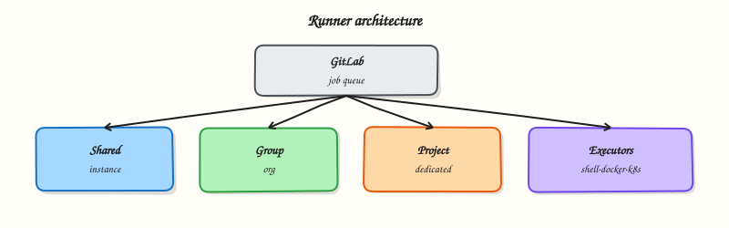

# GitLab Runners and Executors

## Overview


Distinguish shared, group, and project runners; pick an executor for isolation; and use job tags so the right capacity picks up production work.

A **GitLab Runner** is the agent that executes jobs. The **executor** decides *how* isolation works (host shell, Docker container, Kubernetes Pod, and others). Scope (instance/shared, group, project) decides *who* can use the runner. Tags bind jobs to capable fleets.

This is a core tutorial in **Module 3 · GitLab Runners** of the REBASH Academy **GitLab CI/CD for Cloud & DevOps Engineers** series — written for Cloud, DevOps, Platform, and SRE engineers.

## Prerequisites


- [GitLab Projects, Merge Requests, and Releases](gitlab-projects-mrs-and-releases.md)

## Learning Objectives


By the end of this tutorial, you will be able to:

- [ ] Contrast shared vs group vs project runners  
- [ ] Choose shell, Docker, or Kubernetes executors for a workload  
- [ ] Use `tags` so jobs land on the right fleet  
- [ ] Outline why autoscaling exists (cost and queue depth)

## Architecture


This topic’s control points and relationships are shown below.



## Theory


### What it is

GitLab schedules jobs; **runners** claim them over the Runner API. Registration associates a runner with an instance, group, or project (modern registration uses authentication tokens and runner types). The **executor** plugin runs the job:

| Executor | Isolation | Typical use |
|----------|-----------|-------------|
| Shell | Process on the runner host | Legacy / carefully locked hosts |
| Docker | Container per job | Most SaaS and self-managed CI |
| Kubernetes | Pod per job | Cluster-backed platforms |
| Docker Machine / autoscaler | Ephemeral VMs | Burst capacity (evolving tooling) |

**Shared (instance) runners** serve many projects (GitLab.com shared runners). **Group runners** serve all projects in a group. **Project runners** are scoped to one project — useful for privileged or regulated workloads.

### Why it matters

Wrong executor choices create security and reliability debt: shell executors share a host filesystem; untagged “any runner” jobs can land on laptops registered as runners; missing capacity creates hour-long queues. Platform teams treat runners as **product infrastructure** — sized, tagged, monitored, and patched like any other fleet.

### How it works

1. Admin registers a runner with GitLab (token / runner authentication).
2. Runner polls for jobs that match its tags and access scope.
3. For Docker: pull `image:` (or default), mount the build directory, run `script`.
4. For Kubernetes: create a build Pod in a configured namespace, stream logs, clean up.
5. Status and artefacts return to GitLab; autoscalers add/remove runner capacity from queue metrics.

Job authors select capacity with `tags: [docker, linux]` (example). Without tags, any untagged runner in scope may take the job — usually undesirable in production.

You can study YAML without owning runners: GitLab.com free tier provides shared runners; **gitlab-ci-local** runs many jobs on your laptop; `glab ci lint` validates syntax.

### Key concepts and comparisons

| Scope | Who can use it | Ops note |
|-------|----------------|----------|
| Shared / instance | Broad set of projects | Minute quotas, noisy neighbour |
| Group | Projects under the group | Standard platform fleet |
| Project | One project | Privileged / air-gapped builds |

**Autoscaling overview:** idle VMs or cluster nodes cost money; static fleets waste capacity. Autoscaling adds runners when the pending queue grows and removes them when idle — design for warm pools if cold starts hurt MR feedback.

### Common pitfalls

- Registering a personal laptop as an unprotected shared runner.
- Using the shell executor for untrusted open-source MRs.
- Forgetting tags so GPU or privileged jobs never run (or run everywhere).
- Equating “Docker executor” with “Docker-in-Docker” — DinD is a separate, higher-risk pattern.

## Hands-on Lab

### Objective

Document runner capacity in `runner-tags.yaml`, author a `.gitlab-ci.yml` where jobs target specific runner tags, and validate executor choices offline with PyYAML.

### Prerequisites

- Python 3 with PyYAML (`pip install pyyaml`)
- Optional: GitLab project with group or project runners registered

### Lab environment

Workspace: `~/rebash-gitlab/module-03`

File-first lab. Push to GitLab only when tagged runners exist to claim jobs.

``` {.bash .ra-terminal title="Terminal"}
mkdir -p ~/rebash-gitlab/module-03 && cd ~/rebash-gitlab/module-03
```

### Real-world scenario

Your platform team operates two runner fleets: `docker-linux` runners for containerised builds and `shell-legacy` runners for a locked-down deployment host. Untagged jobs caused production deploys to land on developer laptops. You encode the runner matrix in YAML and tag every job explicitly.

### Step-by-step tasks

#### Task 1 – Document the runner fleet matrix

Create `runner-tags.yaml`:

```yaml title="runner-tags.yaml"
runners:
  - name: shared-docker-linux
    scope: group
    executor: docker
    tags:
      - docker-linux
    image_default: docker:27-cli
    notes: "Default fleet for build and test jobs"
  - name: deploy-shell-host
    scope: project
    executor: shell
    tags:
      - shell-legacy
    notes: "Single locked host — never use for untrusted MRs"
policy:
  require_tags_on_production_jobs: true
  forbid_untagged_jobs: true
```

Validate:

``` {.bash .ra-terminal title="Terminal"}
cd ~/rebash-gitlab/module-03
python3 -c "
import yaml
m = yaml.safe_load(open('runner-tags.yaml'))
assert m['runners'][0]['executor'] == 'docker'
assert m['runners'][1]['executor'] == 'shell'
print('OK executors', [r['executor'] for r in m['runners']])
"
```

!!! example "Expected output"
    Prints `OK executors ['docker', 'shell']`.


#### Task 2 – Create tagged pipeline jobs

Create `src/check.py`:

```python title="check.py"
print("runner-tags ok")
```

Create `.gitlab-ci.yml`:

```yaml title=".gitlab-ci.yml"
stages:
  - build
  - deploy

docker_build:
  stage: build
  tags:
    - docker-linux
  image: docker:27-cli
  script:
    - docker version
    - python3 -c "print('build on docker executor')"

shell_deploy_stub:
  stage: deploy
  tags:
    - shell-legacy
  script:
    - echo "Deploy stub — shell executor on locked host"
    - uname -a
  rules:
    - if: $CI_COMMIT_BRANCH == $CI_DEFAULT_BRANCH

# Anti-pattern example — commented for review; do not enable in production
# untagged_job:
#   stage: build
#   script:
#     - echo "Any runner may claim this — avoid"
```

Validate offline:

``` {.bash .ra-terminal title="Terminal"}
cd ~/rebash-gitlab/module-03
python3 -c "
import yaml
d = yaml.safe_load(open('.gitlab-ci.yml'))
assert d['docker_build']['tags'] == ['docker-linux']
assert d['shell_deploy_stub']['tags'] == ['shell-legacy']
print('OK tagged jobs')
"
```

!!! example "Expected output"
    Prints `OK tagged jobs`.


#### Task 3 – Simulate docker-stage logic locally

Run the build script path without a runner:

``` {.bash .ra-terminal title="Terminal"}
cd ~/rebash-gitlab/module-03
python3 src/check.py | tee runner-out.txt
python3 -c "print('build on docker executor')" | tee -a runner-out.txt
grep -q 'runner-tags ok' runner-out.txt
```

!!! example "Expected output"
    `runner-out.txt` contains both `runner-tags ok` and `build on docker executor`.


### Validation steps

- [ ] `runner-tags.yaml` lists docker and shell executors with tags
- [ ] `docker_build` requires tag `docker-linux`
- [ ] `shell_deploy_stub` requires tag `shell-legacy` and runs only on default branch
- [ ] No production job is left untagged
- [ ] Local simulation of build output succeeds

### Common errors and fixes

| Error | Cause | Fix |
|-------|-------|-----|
| Job stuck `pending` | No runner with matching tag | Register a runner with `docker-linux` or `shell-legacy` tags |
| Job runs on wrong host | Tag typo | Match tags exactly between runner config and `.gitlab-ci.yml` |
| Shell executor on public MR | Untrusted code on host filesystem | Use Docker or Kubernetes executors for MR pipelines |
| `docker: command not found` in job | Shell executor used for docker job | Ensure `docker_build` lands on a Docker executor runner |

### Challenge exercise

Add a `lint_mr` job tagged `docker-linux` with `rules: [{ if: $CI_PIPELINE_SOURCE == "merge_request_event" }]` so MR feedback never uses the shell executor.

### Learning outcomes

- Documented runner capacity and executor types in version-controlled YAML
- Routed jobs to tagged runners instead of accepting any available runner
- Understood when shell versus Docker executors are appropriate
- Validated pipeline and matrix YAML offline

### Cleanup

``` {.bash .ra-terminal title="Terminal"}
rm -f ~/rebash-gitlab/module-03/runner-out.txt
# Keep runner-tags.yaml and .gitlab-ci.yml for module 04
```

## Validation


- [ ] Lab commands run under `~/rebash-gitlab/module-03/`
- [ ] You can explain each Theory section in your own words
- [ ] You used modern tooling where it applies to this topic
- [ ] You can describe one production failure mode for this topic

## Code Walkthrough


Production practice for **GitLab Runners and Executors** always combines:

1. Inspect before you change (status, plan, logs, dry-run)
2. Prefer reversible, documented changes (Git, IaC, drop-ins, version pins)
3. Capture evidence (command output, pipeline logs) for handovers
4. Prefer current tools and APIs over legacy shortcuts
5. Least privilege — escalate credentials only when required

Keep runbooks short enough to follow under pressure. Automate checks; keep humans for judgement.

## Security Considerations


- Treat credentials and tokens for gitlab as privileged — never commit them
- Prefer short-lived auth (OIDC, roles, SSO) over long-lived keys
- Validate blast radius before apply/deploy/delete operations
- Restrict who can approve production changes
- Collect audit logs; limit who can read sensitive traces

## Common Mistakes


!!! warning "Registering a personal laptop as an unprotected shared runner."
    Validate assumptions against the Theory section and official docs before changing production.

!!! warning "Using the shell executor for untrusted open-source MRs."
    Lab shortcuts (open security groups, admin roles, skip approvals) must not ship unchanged.

!!! warning "Changing production without a rollback path"
    Always know how to revert (previous artefact, prior release, state rollback, DNS failback).

## Best Practices


- Encode GitLab Runners and Executors changes as code and review them in pull requests
- Pin versions (images, modules, actions, provider plugins)
- Separate environments with clear promotion gates
- Alert on symptoms with runbooks attached
- Destroy lab resources; tag everything with owner and expiry where possible

## Troubleshooting


| Symptom | Likely cause | Fix |
|---------|--------------|-----|
| Auth / permission denied | Wrong identity, policy, or scope | Check caller identity, roles, and least-privilege policies |
| Timeout / no route | Network, DNS, security group, or endpoint | Trace path, DNS, and allow-lists before retrying |
| Drift / unexpected plan | Manual change or wrong state/workspace | Reconcile desired vs actual; avoid click-ops on managed resources |
| Pipeline/job red | Flaky step, cache, or missing secret | Read failing step logs; bisect recent workflow/config changes |
| Cost spike | Idle load balancer, NAT, oversized compute | Inventory billable resources; stop/delete labs promptly |

## Summary


**GitLab Runners and Executors** is essential for Cloud and DevOps engineers working with gitlab. Practise the lab until the inspection and change path is muscle memory, then continue the track.

## Interview Questions


1. Compare shell, Docker, and Kubernetes executors for isolation and cost.
2. Jobs stuck in pending — what runner factors do you verify first?
3. Why tag runners instead of relying on shared untagged runners?
4. What security risk does a privileged Docker runner introduce?
5. How do protected runners interact with protected branches/variables?

!!! tip "Sample answer — question 2"
    Check runner online status, matching tags, concurrent job limits, and whether the project may use that runner. Pending almost always means no eligible runner.

!!! tip "Sample answer — question 4"
    Privileged mode and Docker socket mounts can let jobs escape to the host. Prefer unprivileged executors and dedicated tags for production.

## Related Tutorials


- [Course overview](index.md)
- [Pipeline Syntax (.gitlab-ci.yml)](pipeline-syntax-gitlab-ci-yml.md)

## References


- [GitLab Runner](https://docs.gitlab.com/runner/)  
- [Executors](https://docs.gitlab.com/runner/executors/)
