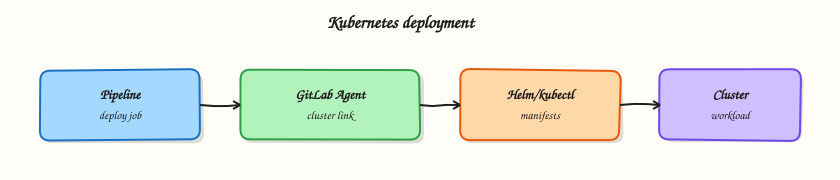

# Kubernetes Deploys and GitLab Agent

## Overview


Describe how the GitLab Agent connects CI to a cluster, sketch a Helm or kubectl deploy job, and contrast push deploys with GitOps pull controllers — including canary, blue-green, and rollback.

Pipelines that **push** manifests with `kubectl` or **Helm** need a secure path into the cluster. The **GitLab Agent for Kubernetes** (`agentk`) establishes a reverse tunnel so runners never hold long-lived kubeconfigs in CI variables. Progressive delivery (canary, blue-green) and rollbacks sit on top of Deployments or Helm releases. **GitOps** (Flux/Argo CD) inverts the model: the cluster pulls desired state from Git (conceptual flow in `gitlab-gitops.svg`).

This is a core tutorial in **Module 9 · Kubernetes Deployments** of the REBASH Academy **GitLab CI/CD for Cloud & DevOps Engineers** series — written for Cloud, DevOps, Platform, and SRE engineers.

## Prerequisites


- [Building Docker Images in CI](building-docker-images-in-ci.md)

## Learning Objectives


By the end of this tutorial, you will be able to:

- [ ] Explain the GitLab Agent trust boundary vs stored kubeconfig  
- [ ] Sketch a deploy job using `kubectl` or Helm  
- [ ] Compare canary and blue-green  
- [ ] Outline rollback (Helm revision / prior image digest)  
- [ ] State when push CI ends and GitOps begins

## Architecture


This topic’s control points and relationships are shown below.



## Theory


### What it is

**Kubernetes deployment from GitLab** means a job updates cluster state after images are built and scanned. The **GitLab Agent** is a lightweight process in the cluster that authenticates to GitLab and receives CI/`ci_access` connections — CI jobs request Kubernetes API access through the agent rather than embedding admin kubeconfigs.

| Mode | Who applies changes | Fit |
|------|---------------------|-----|
| Push CI (`kubectl` / Helm) | Pipeline job | Simple apps, demos, controlled envs |
| GitOps pull | Controller (Argo CD / Flux) | Multi-cluster, strong drift control |
| Hybrid | CI updates Git; controller syncs | Common enterprise pattern |

### Why it matters

Static kubeconfigs in CI are high-value secrets and hard to rotate. Agents shrink blast radius and support environment-scoped access. Progressive delivery reduces blast radius of bad releases; rollbacks need a practised path (previous Helm revision or prior digest). Confusing push CI with GitOps causes double-writes and drift fights.

### How it works

1. Install `agentk` in the cluster; register it to a GitLab project/group.  
2. Grant `ci_access` (or GitOps access) for selected projects.  
3. CI job uses the agent context to run `kubectl set image` / `helm upgrade --install` with the SHA-tagged image from Module 8.  
4. **Canary**: shift a fraction of traffic (Ingress weight / Flagger / service mesh). **Blue-green**: two full stacks; switch Service or Ingress when healthy.  
5. **Rollback**: `helm rollback`, or redeploy the last known-good digest; GitOps reverts the Git commit and lets the controller sync.

Keep production behind protected environments and manual or approval gates.

### Key concepts and comparisons

| Pattern | Idea | Rollback |
|---------|------|----------|
| Rolling update | Default Deployment surge | Roll back ReplicaSet / Helm |
| Canary | Partial traffic to new version | Shift weight back |
| Blue-green | Two environments, cut over | Point traffic at blue again |
| GitOps | Desired state in Git | Revert commit |

### Common pitfalls

- Cluster-admin credentials in unprotected CI variables.  
- Deploying `latest` instead of the SHA built in the same pipeline.  
- Running canary without metrics or automatic abort.  
- Both CI and Argo CD applying the same Deployment (duelling controllers).  
- Skipping `helm history` / revision notes so rollback targets are unclear.

## Hands-on Lab

### Objective

Create Kubernetes manifests under `manifests/`, author a deploy job stub for the GitLab Agent or kubeconfig placeholder, and validate all YAML offline.

### Prerequisites

- Python 3 with PyYAML (`pip install pyyaml`)
- Optional: kind or minikube cluster for live `kubectl apply`
- Optional: GitLab Agent connected to a cluster

### Lab environment

Workspace: `~/rebash-gitlab/module-09` with manifests in `manifests/`

File-first lab. YAML validates without a cluster; apply steps are optional.

```bash
mkdir -p ~/rebash-gitlab/module-09/manifests && cd ~/rebash-gitlab/module-09
```

### Real-world scenario

Your platform team deploys microservices with the GitLab Agent for Kubernetes instead of long-lived kubeconfig secrets in CI variables. You add Deployment and Service manifests plus a deploy job stub that references the agent context — validated locally before any cluster access.

### Step-by-step tasks

#### Task 1 – Create Kubernetes manifests

Create `manifests/deployment.yaml`:

```yaml
apiVersion: apps/v1
kind: Deployment
metadata:
  name: rebash-gitlab-lab
  labels:
    app: rebash-gitlab-lab
spec:
  replicas: 1
  selector:
    matchLabels:
      app: rebash-gitlab-lab
  template:
    metadata:
      labels:
        app: rebash-gitlab-lab
    spec:
      containers:
        - name: app
          image: python:3.12-alpine
          command: ["python", "-c", "print('k8s deploy ok')"]
```

Create `manifests/service.yaml`:

```yaml
apiVersion: v1
kind: Service
metadata:
  name: rebash-gitlab-lab
spec:
  selector:
    app: rebash-gitlab-lab
  ports:
    - port: 80
      targetPort: 8080
  type: ClusterIP
```

Validate manifests:

```bash
cd ~/rebash-gitlab/module-09
python3 -c "
import yaml, pathlib
for f in ['manifests/deployment.yaml', 'manifests/service.yaml']:
    d = yaml.safe_load(pathlib.Path(f).read_text())
    print('OK', f, d['kind'])
"
```

**Expected output:** Two lines: `OK manifests/deployment.yaml Deployment` and `OK manifests/service.yaml Service`.

#### Task 2 – Create deploy pipeline stub

Create `.gitlab-ci.yml`:

```yaml
stages:
  - validate
  - deploy

variables:
  KUBE_NAMESPACE: rebash-gitlab-lab
  MANIFEST_DIR: manifests

validate_manifests:
  stage: validate
  image: python:3.12-alpine
  script:
    - python -c "import yaml, pathlib; [yaml.safe_load(p.read_text()) for p in pathlib.Path('manifests').glob('*.yaml')]"
    - echo "Manifests valid"

deploy_staging:
  stage: deploy
  image:
    name: bitnami/kubectl:1.30.2
    entrypoint: [""]
  environment:
    name: staging
    kubernetes:
      namespace: rebash-gitlab-lab
      agent: my-group/rebash-cluster:rebash-agent
  rules:
    - if: $CI_COMMIT_BRANCH == $CI_DEFAULT_BRANCH
  script:
    - kubectl apply -f "$MANIFEST_DIR/" --dry-run=client
    - echo "Agent deploy stub — replace agent path with your GitLab Agent record"
  # Alternative without agent: mount KUBECONFIG from protected CI variable (avoid in production)
```

Validate offline:

```bash
cd ~/rebash-gitlab/module-09
python3 -c "
import yaml
d = yaml.safe_load(open('.gitlab-ci.yml'))
assert d['deploy_staging']['environment']['kubernetes']['agent']
assert d['variables']['MANIFEST_DIR'] == 'manifests'
print('OK k8s deploy stub')
"
```

**Expected output:** Prints `OK k8s deploy stub`.

#### Task 3 – Optional cluster dry-run or offline manifest check

If `kubectl` is available:

```bash
cd ~/rebash-gitlab/module-09
kubectl apply -f manifests/ --dry-run=client | tee k8s-dryrun.txt
grep -q 'deployment.apps/rebash-gitlab-lab' k8s-dryrun.txt
```

If no cluster is available:

```bash
cd ~/rebash-gitlab/module-09
python3 -c "
import yaml, pathlib
kinds = [yaml.safe_load(p.read_text())['kind'] for p in pathlib.Path('manifests').glob('*.yaml')]
assert kinds == ['Deployment', 'Service']
print('offline manifest check ok')
" | tee k8s-dryrun.txt
```

**Expected output:** Dry-run output lists the Deployment, or `k8s-dryrun.txt` contains `offline manifest check ok`.

### Validation steps

- [ ] Deployment and Service manifests parse with PyYAML
- [ ] Deploy job references GitLab Agent path under `environment.kubernetes.agent`
- [ ] `validate_manifests` job checks all files in `manifests/`
- [ ] `kubectl apply --dry-run=client` succeeds or offline check passes
- [ ] No kubeconfig content committed to Git

### Common errors and fixes

| Error | Cause | Fix |
|-------|-------|-----|
| Agent deploy fails | Wrong agent path | Copy exact agent record from GitLab **Infrastructure > Kubernetes** |
| `kubectl` cannot reach cluster | Agent not installed | Install GitLab Agent in cluster first |
| Namespace mismatch | `KUBE_NAMESPACE` differs from manifest | Align namespace in environment block and manifests |
| Dry-run fails validation | Invalid manifest schema | Re-validate YAML keys and indentation |

### Challenge exercise

Add `manifests/kustomization.yaml` listing both resources and change the deploy script to `kubectl apply -k manifests/ --dry-run=client`. Validate the kustomization file with PyYAML.

### Learning outcomes

- Authored Deployment and Service manifests for a sample workload
- Modelled GitLab Agent-based deploy jobs without committing kubeconfig
- Validated Kubernetes and CI YAML offline
- Used client-side dry-run before applying to a cluster

### Cleanup

```bash
rm -f ~/rebash-gitlab/module-09/k8s-dryrun.txt
# Keep manifests/ and .gitlab-ci.yml for later modules
```

## Validation


- [ ] Lab commands run under `~/rebash-gitlab/module-09/`
- [ ] You can explain each Theory section in your own words
- [ ] You used modern tooling where it applies to this topic
- [ ] You can describe one production failure mode for this topic

## Code Walkthrough


Production practice for **Kubernetes Deploys and GitLab Agent** always combines:

1. Inspect before you change (status, plan, logs, dry-run)
2. Prefer reversible, documented changes (Git, IaC, drop-ins, version pins)
3. Capture evidence (command output, pipeline logs) for handovers
4. Prefer current tools and APIs over legacy shortcuts
5. Least privilege — escalate credentials only when required

Keep runbooks short enough to follow under pressure. Automate checks; keep humans for judgement.

## Security Considerations


- Treat credentials and tokens for gitlab as privileged — never commit them
- Prefer short-lived auth (OIDC, roles, SSO) over long-lived keys
- Validate blast radius before apply/deploy/delete operations
- Restrict who can approve production changes
- Collect audit logs; limit who can read sensitive traces

## Common Mistakes


!!! warning "Cluster-admin credentials in unprotected CI variables.  "
    Validate assumptions against the Theory section and official docs before changing production.

!!! warning "Deploying `latest` instead of the SHA built in the same pipeline.  "
    Lab shortcuts (open security groups, admin roles, skip approvals) must not ship unchanged.

!!! warning "Changing production without a rollback path"
    Always know how to revert (previous artefact, prior release, state rollback, DNS failback).

## Best Practices


- Encode Kubernetes Deploys and GitLab Agent changes as code and review them in pull requests
- Pin versions (images, modules, actions, provider plugins)
- Separate environments with clear promotion gates
- Alert on symptoms with runbooks attached
- Destroy lab resources; tag everything with owner and expiry where possible

## Troubleshooting


| Symptom | Likely cause | Fix |
|---------|--------------|-----|
| Auth / permission denied | Wrong identity, policy, or scope | Check caller identity, roles, and least-privilege policies |
| Timeout / no route | Network, DNS, security group, or endpoint | Trace path, DNS, and allow-lists before retrying |
| Drift / unexpected plan | Manual change or wrong state/workspace | Reconcile desired vs actual; avoid click-ops on managed resources |
| Pipeline/job red | Flaky step, cache, or missing secret | Read failing step logs; bisect recent workflow/config changes |
| Cost spike | Idle load balancer, NAT, oversized compute | Inventory billable resources; stop/delete labs promptly |

## Summary


**Kubernetes Deploys and GitLab Agent** is essential for Cloud and DevOps engineers working with gitlab. Practise the lab until the inspection and change path is muscle memory, then continue the track.

## Interview Questions


1. What problem does the GitLab Agent solve versus storing kubeconfig in CI?
2. How do you validate manifests before a real apply?
3. Why scope agent access per environment/namespace?
4. What RBAC should a deploy job assume in-cluster?
5. How do you roll back a bad GitLab-driven deploy?

!!! tip "Sample answer — question 2"
    Start with kubectl dry-run/client validation and agent connectivity: wrong context, namespace, or missing RBAC explains most failures.

!!! tip "Sample answer — question 4"
    Prefer short-lived agent sessions and least-privilege ServiceAccounts per environment.

## Related Tutorials


- [Course overview](index.md)
- [Terraform Pipelines in GitLab](terraform-pipelines-in-gitlab.md)

## References


- [GitLab Agent for Kubernetes](https://docs.gitlab.com/ee/user/clusters/agent/) · [CI/CD with agent](https://docs.gitlab.com/ee/user/clusters/agent/ci_cd_workflow.html) · [Environments](https://docs.gitlab.com/ee/ci/environments/)
