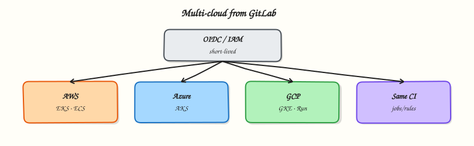

# Multi-Cloud Deployments with GitLab

## Overview


Sketch OIDC-oriented GitLab CI patterns for AWS (IAM / EKS / ECS), Azure (login / AKS), and Google Cloud (Workload Identity / GKE / Cloud Run) without embedding long-lived cloud keys in the repository.

Modern GitLab deploy jobs **federate identity**: the job presents a GitLab-issued OIDC token; the cloud exchanges it for a short-lived role. That role then updates EKS/ECS, AKS, GKE, or Cloud Run. Patterns differ by cloud, but the CI shape is the same — authenticate, deploy immutable artefact, protect production.

This is a core tutorial in **Module 11 · Cloud Deployments** of the REBASH Academy **GitLab CI/CD for Cloud & DevOps Engineers** series — written for Cloud, DevOps, Platform, and SRE engineers.

## Prerequisites


- [Terraform Pipelines in GitLab](terraform-pipelines-in-gitlab.md)

## Learning Objectives


By the end of this tutorial, you will be able to:

- [ ] Explain OIDC federation vs static access keys  
- [ ] Map AWS IAM roles to EKS/ECS deploy jobs  
- [ ] Sketch Azure login + AKS kubectl context  
- [ ] Sketch GCP Workload Identity + GKE/Cloud Run  
- [ ] Scope identities per environment and branch

## Architecture


This topic’s control points and relationships are shown below.



## Theory


### What it is

**Multi-cloud deployment from GitLab** means pipelines call cloud APIs with least-privilege, short-lived credentials:

| Cloud | Identity pattern | Common targets |
|-------|------------------|----------------|
| AWS | IAM OIDC provider → assume role | EKS (`aws eks update-kubeconfig`), ECS update-service |
| Azure | Federated credentials → `az login` | AKS `kubelogin` / kubeconfig |
| Google Cloud | Workload Identity Federation | GKE, Cloud Run deploy |

GitLab’s JWT (`CI_JOB_JWT_V2` / id tokens, depending on version) is trusted by a cloud identity provider you configure once. Jobs request `id_tokens` and exchange them in `before_script`.

### Why it matters

Static keys in CI variables leak, rarely rotate, and often are over-privileged. OIDC binds trust to project, branch, and environment claims so a compromised MR runner cannot assume production roles. Multi-cloud teams need one mental model — federate, deploy SHA artefact, gate production — even when CLIs differ.

### How it works

1. Configure cloud trust for your GitLab issuer and subject conditions (project path, `ref`, environment).  
2. Job declares an id token and assumes/exchanges into a cloud role.  
3. Deploy uses that session: update ECS task definition, `helm upgrade` on EKS/AKS/GKE, or `gcloud run deploy` with a digest.  
4. Staging roles allow MR or default-branch pipelines; production roles require protected environments.  
5. Terraform (Module 10) often creates the OIDC providers and roles; deploy pipelines only consume them.

Never print tokens. Prefer environment-scoped variables for account IDs and cluster names, not secrets, when using federation.

### Key concepts and comparisons

| Approach | Pros | Cons |
|----------|------|------|
| OIDC / federation | Short-lived, auditable, branch-aware | Initial IdP setup |
| Static keys / PATs | Simple demos | Rotation, leak blast radius |
| Per-cloud deploy jobs | Clear ownership | Duplicate pipeline structure — use templates |

### Common pitfalls

- Trusting `*` subjects on the OIDC provider (any project can assume the role).  
- Giving one role rights to all accounts and clusters.  
- Running production deploy jobs on shared MR runners.  
- Mixing long-lived keys “just for break-glass” without separate process.  
- Redeploying different image digests per cloud “environment” for the same commit.

## Hands-on Lab


### Objective

Author a multi-cloud OIDC comparison matrix and GitLab CI deploy job stubs for AWS, Azure, and Google Cloud — then validate structure offline with Python.

### Prerequisites

- Python 3 with PyYAML (`pip install pyyaml`)
- Optional: GitLab project with cloud OIDC trusts configured

### Lab environment

Workspace: `~/rebash-gitlab/module-11`

File-first lab. Push to GitLab only when cloud identity providers are configured.

``` {.bash .ra-terminal title="Terminal"}
mkdir -p ~/rebash-gitlab/module-11 && cd ~/rebash-gitlab/module-11
set -euo pipefail
```

### Real-world scenario

A platform team standardises multi-cloud deploy patterns before cloud admins wire OpenID Connect (OIDC) trust in each account. You deliver reviewed YAML stubs and a validated comparison matrix — no long-lived access keys in Git.

### Step-by-step tasks

#### Task 1 – Multi-cloud OIDC matrix

Create `multi-cloud-oidc.yaml`:

```yaml title="multi-cloud-oidc.yaml"
# Module 11 — OIDC deploy comparison (offline reference)
clouds:
  aws:
    identity: IAM OIDC provider → assume role
    gitlab_id_token_aud: https://gitlab.com
    deploy_targets: [EKS, ECS]
    stub_role_arn: arn:aws:iam::000000000000:role/PLACEHOLDER-gitlab-oidc
    region: eu-west-1
  azure:
    identity: federated credentials → az login
    gitlab_id_token_aud: api://AzureADTokenExchange
    deploy_targets: [AKS]
    stub_client_id: PLACEHOLDER-CLIENT-ID
    stub_tenant_id: PLACEHOLDER-TENANT-ID
  gcp:
    identity: Workload Identity Federation
    gitlab_id_token_aud: https://gitlab.com
    deploy_targets: [GKE, Cloud Run]
    stub_project: placeholder-project
    stub_pool: gitlab-pool
    stub_provider: gitlab-provider
environments:
  staging:
    allowed_refs: [merge_request, default_branch]
  production:
    allowed_refs: [default_branch]
    manual_gate: true
```

Validate offline:

``` {.bash .ra-terminal title="Terminal"}
cd ~/rebash-gitlab/module-11
set -euo pipefail
python3 -c "
import yaml
doc = yaml.safe_load(open('multi-cloud-oidc.yaml'))
assert set(doc['clouds']) == {'aws', 'azure', 'gcp'}
assert doc['environments']['production']['manual_gate'] is True
print('multi-cloud-oidc.yaml OK')
"
```

!!! example "Expected output"
    `multi-cloud-oidc.yaml OK`


#### Task 2 – GitLab CI deploy stubs per cloud

Create `.gitlab-ci.yml`:


```yaml
stages:
  - deploy

.deploy_stub:
  stage: deploy
  image: alpine:3.20
  id_tokens:
    GITLAB_OIDC_TOKEN:
      aud: https://gitlab.com
  script:
    - echo "Cloud ${CLOUD} deploy stub — OIDC token present, no static keys"
    - test -n "${GITLAB_OIDC_TOKEN:-}" || echo "Token available on GitLab runner only"

deploy-aws-stub:
  extends: .deploy_stub
  variables:
    CLOUD: aws
  environment:
    name: staging-aws
  rules:
    - when: manual
      allow_failure: true

deploy-azure-stub:
  extends: .deploy_stub
  variables:
    CLOUD: azure
  environment:
    name: staging-azure
  rules:
    - when: manual
      allow_failure: true

deploy-gcp-stub:
  extends: .deploy_stub
  variables:
    CLOUD: gcp
  environment:
    name: staging-gcp
  rules:
    - when: manual
      allow_failure: true
```


Validate offline:

``` {.bash .ra-terminal title="Terminal"}
cd ~/rebash-gitlab/module-11
set -euo pipefail
python3 -c "
import yaml
d = yaml.safe_load(open('.gitlab-ci.yml'))
for job in ('deploy-aws-stub', 'deploy-azure-stub', 'deploy-gcp-stub'):
    assert job in d, job
    assert 'id_tokens' in d['.deploy_stub']
print('gitlab-ci OK', [k for k in d if k.startswith('deploy-')])
"
grep -q 'alpine:3.20' .gitlab-ci.yml
grep -q 'id_tokens' .gitlab-ci.yml
```

!!! example "Expected output"
    `gitlab-ci OK` with three deploy stub job names; pinned Alpine image and `id_tokens` present.


#### Task 3 – Cross-check matrix against pipeline

Create `validate-multi-cloud.sh`:

```bash title="validate-multi-cloud.sh"
#!/usr/bin/env bash
set -euo pipefail
python3 -c "
import yaml
matrix = yaml.safe_load(open('multi-cloud-oidc.yaml'))
ci = yaml.safe_load(open('.gitlab-ci.yml'))
clouds = set(matrix['clouds'])
jobs = {j.split('-')[1] for j in ci if j.startswith('deploy-') and j.endswith('-stub')}
assert clouds == jobs, (clouds, jobs)
print('matrix matches CI stubs')
"
grep -q 'PLACEHOLDER' multi-cloud-oidc.yaml && echo 'no real secrets committed'
echo 'module-11 multi-cloud lab passed'
```

Run it:

``` {.bash .ra-terminal title="Terminal"}
cd ~/rebash-gitlab/module-11
set -euo pipefail
chmod +x validate-multi-cloud.sh
./validate-multi-cloud.sh | tee validation.txt
```

!!! example "Expected output"
    `matrix matches CI stubs` then `module-11 multi-cloud lab passed`


### Validation steps

- [ ] `multi-cloud-oidc.yaml` defines AWS, Azure, and GCP with placeholder identities only
- [ ] Three manual deploy stub jobs extend a shared template with `id_tokens`
- [ ] Pinned image `alpine:3.20` present
- [ ] Python cross-check confirms matrix clouds match job names
- [ ] No real account IDs, keys, or tokens in committed files

### Common errors and fixes

| Error | Cause | Fix |
|-------|-------|-----|
| OIDC job fails immediately | Trust not configured in cloud | Expected offline; stubs use `allow_failure: true` |
| Wrong audience in token | `aud` mismatch | Align `id_tokens.aud` with cloud provider docs |
| One role for all clouds | Over-privileged pattern | Separate roles per cloud and environment |
| Production deploy on MR | Permissive `rules` | Restrict production to default branch + manual |
| Static keys in variables | Legacy pattern | Remove keys; use federation only |

### Challenge exercise

Add a `parallel: matrix` job that reads cloud names from `multi-cloud-oidc.yaml` at runtime (via a small Python script in `before_script`) and echoes the deploy target list per cloud.

### Learning outcomes

- Documented OIDC patterns per cloud in a reviewable matrix
- Authored GitLab CI stubs with `id_tokens` instead of static keys
- Validated YAML structure offline before cloud trust exists
- Understood environment-scoped manual gates for production

### Cleanup

``` {.bash .ra-terminal title="Terminal"}
ls ~/rebash-gitlab/module-11
# Keep YAML for Module 12
```

## Validation


- [ ] Lab commands run under `~/rebash-gitlab/module-11/`
- [ ] You can explain each Theory section in your own words
- [ ] You used modern tooling where it applies to this topic
- [ ] You can describe one production failure mode for this topic

## Code Walkthrough


Production practice for **Multi-Cloud Deployments with GitLab** always combines:

1. Inspect before you change (status, plan, logs, dry-run)
2. Prefer reversible, documented changes (Git, IaC, drop-ins, version pins)
3. Capture evidence (command output, pipeline logs) for handovers
4. Prefer current tools and APIs over legacy shortcuts
5. Least privilege — escalate credentials only when required

Keep runbooks short enough to follow under pressure. Automate checks; keep humans for judgement.

## Security Considerations


- Treat credentials and tokens for gitlab as privileged — never commit them
- Prefer short-lived auth (OIDC, roles, SSO) over long-lived keys
- Validate blast radius before apply/deploy/delete operations
- Restrict who can approve production changes
- Collect audit logs; limit who can read sensitive traces

## Common Mistakes


!!! warning "Trusting `*` subjects on the OIDC provider (any project can assume the role).  "
    Validate assumptions against the Theory section and official docs before changing production.

!!! warning "Giving one role rights to all accounts and clusters.  "
    Lab shortcuts (open security groups, admin roles, skip approvals) must not ship unchanged.

!!! warning "Changing production without a rollback path"
    Always know how to revert (previous artefact, prior release, state rollback, DNS failback).

## Best Practices


- Encode Multi-Cloud Deployments with GitLab changes as code and review them in pull requests
- Pin versions (images, modules, actions, provider plugins)
- Separate environments with clear promotion gates
- Alert on symptoms with runbooks attached
- Destroy lab resources; tag everything with owner and expiry where possible

## Troubleshooting


| Symptom | Likely cause | Fix |
|---------|--------------|-----|
| Auth / permission denied | Wrong identity, policy, or scope | Check caller identity, roles, and least-privilege policies |
| Timeout / no route | Network, DNS, security group, or endpoint | Trace path, DNS, and allow-lists before retrying |
| Drift / unexpected plan | Manual change or wrong state/workspace | Reconcile desired vs actual; avoid click-ops on managed resources |
| Pipeline/job red | Flaky step, cache, or missing secret | Read failing step logs; bisect recent workflow/config changes |
| Cost spike | Idle load balancer, NAT, oversized compute | Inventory billable resources; stop/delete labs promptly |

## Summary


**Multi-Cloud Deployments with GitLab** is essential for Cloud and DevOps engineers working with gitlab. Practise the lab until the inspection and change path is muscle memory, then continue the track.

## Interview Questions


1. How do you parameterise one pipeline for AWS and GCP deploys?
2. What OIDC claim conditions should differ per cloud role?
3. When is a matrix job better than separate deploy jobs?
4. How do you avoid cross-cloud credential mix-ups in logs?
5. What shared gates should every cloud deploy still pass?

!!! tip "Sample answer — question 2"
    Verify the job's cloud selector variables, matching OIDC trust, and that the correct provider CLI is in the image.

!!! tip "Sample answer — question 4"
    Isolate roles per cloud and environment; keep deploy jobs manual for production. File-only validation is enough until cloud trusts exist.

## Related Tutorials


- [Course overview](index.md)
- [Security Scanning and DevSecOps](security-scanning-and-devsecops.md)

## References


- [OIDC with GitLab CI/CD](https://docs.gitlab.com/ee/ci/cloud_services/) · [AWS IAM OIDC](https://docs.aws.amazon.com/IAM/latest/UserGuide/id_roles_providers_create_oidc.html) · [Azure workload identity](https://learn.microsoft.com/en-us/azure/aks/workload-identity-overview) · [GCP Workload Identity Federation](https://cloud.google.com/iam/docs/workload-identity-federation)
