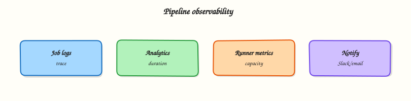

# Pipeline Monitoring and Observability

## Overview


Observe pipeline health with analytics, job logs, runner and pipeline metrics, and actionable notifications — without drowning the team in noise.

CI/CD is a production system. **Observability** means you can answer: Are pipelines slower? Which jobs fail most? Are runners saturated? GitLab provides pipeline analytics and logs; runners and external metrics complete the picture.

This is a core tutorial in **Module 16 · Monitoring & Observability** of the REBASH Academy **GitLab CI/CD for Cloud & DevOps Engineers** series — written for Cloud, DevOps, Platform, and SRE engineers.

## Prerequisites


- [Production Pipelines and Environments](production-pipelines-and-environments.md)
- [GitLab Runners and Executors](gitlab-runners-and-executors.md) (runner capacity awareness)

## Learning Objectives


By the end of this tutorial, you will be able to:

- [ ] Read pipeline duration and failure trends  
- [ ] Use job logs and artefacts for diagnosis  
- [ ] Identify runner queue / capacity signals  
- [ ] Configure useful notifications (MR, Slack, email)

## Architecture


This topic’s control points and relationships are shown below.



## Theory


### What it is

**Pipeline monitoring** watches CI as a service: success rate, duration, queue time, and flaky jobs. **Observability** adds context — job logs, artefacts, runner host metrics, and correlation with deploy outcomes. GitLab surfaces **pipeline analytics**, per-job timing, and failure reasons; notifications push status to humans and chat ops.

| Signal | Question it answers |
|--------|---------------------|
| Success rate | Are we shipping or stuck? |
| Duration / p95 | Is feedback too slow? |
| Queue time | Runner capacity enough? |
| Job failure taxonomy | Test vs infra vs auth? |
| Notifications | Who must act now? |

### Why it matters

Slow or flaky CI is a platform outage for developers. Without metrics you scale runners blindly or ignore a single job that causes half of MR delays. SRE-style error budgets apply to pipelines: treat “time to green on main” as a service level indicator (SLI). Notifications that fire on every retry create alert fatigue; notifications that miss production deploy failures create silence risk.

### How it works

1. **Baseline** — note median and p95 pipeline duration for `main` and MRs weekly.
2. **Analytics** — use GitLab’s CI/CD analytics (and Value Stream where licensed) to find slowest jobs.
3. **Logs** — failed job → raw log → last error; keep artefacts (`when: always`) for reports.
4. **Runners** — watch concurrency, executor errors, disk, and image pull latency; scale or retag workloads.
5. **Export** — optional Prometheus metrics from GitLab / runners for Grafana dashboards.
6. **Notify** — pipeline emails, Slack/Teams integrations, or `after_script` webhooks on deploy stages only.

Separate **developer feedback** (MR failed tests) from **platform pages** (shared runners down). Correlate deploy jobs with application SLOs after promotion.

### Key concepts and comparisons

| Layer | Primary tool |
|-------|----------------|
| Pipeline UX | GitLab job log + analytics |
| Runner health | Runner metrics / host monitoring |
| Org trends | CI minutes, queue, flaky rate |
| ChatOps | Webhooks / integrations |

| Good alert | Poor alert |
|------------|------------|
| Production deploy failed | Any job retried |
| Runner fleet < N idle for 15m | Single flaky unit test once |

### Common pitfalls

- Equating “green pipeline rate” with product quality — skipped tests inflate success.
- Logging secrets into job output — observability must not leak credentials.
- Alerting on every `allow_failure` job — reserve pages for customer-impacting stages.
- Ignoring queue time while chasing script micro-optimisations.

## Hands-on Lab


### Objective

Create a local pipeline evidence collector script and a metrics export stub YAML — then run the collector against sample pipeline metadata offline.

### Prerequisites

- Python 3 with PyYAML (`pip install pyyaml`)
- Bash 4+
- Optional: GitLab API token for live pipeline queries (not required for this lab)

### Lab environment

Workspace: `~/rebash-gitlab/module-16`

File-first lab. Metrics export integrates with observability stacks when pushed to GitLab.

``` {.bash .ra-terminal title="Terminal"}
mkdir -p ~/rebash-gitlab/module-16 && cd ~/rebash-gitlab/module-16
set -euo pipefail
```

### Real-world scenario

Site Reliability Engineering (SRE) needs pipeline duration, queue time, and failure stage captured as evidence for incident reviews — without logging secrets. You deliver a collector script and metrics stub YAML validated locally.

### Step-by-step tasks

#### Task 1 – Pipeline evidence collector

Create `collect-pipeline-evidence.sh`:

```bash title="collect-pipeline-evidence.sh"
#!/usr/bin/env bash
set -euo pipefail
out="${1:-pipeline-evidence.json}"
pipeline_id="${CI_PIPELINE_ID:-local-sim-001}"
project="${CI_PROJECT_PATH:-rebash/lab}"
duration="${CI_PIPELINE_DURATION:-42}"
status="${CI_PIPELINE_STATUS:-success}"
failed_job="${CI_FAILED_JOB:-}"

python3 - <<'PY' "${out}" "${pipeline_id}" "${project}" "${duration}" "${status}" "${failed_job}"
import json, sys
out, pid, project, duration, status, failed = sys.argv[1:7]
doc = {
    "pipeline_id": pid,
    "project": project,
    "duration_seconds": int(duration),
    "status": status,
    "failed_job": failed or None,
    "collector": "module-16-lab",
}
with open(out, "w") as f:
    json.dump(doc, f, indent=2)
print(f"wrote {out}")
PY
```

Run with simulated variables:

``` {.bash .ra-terminal title="Terminal"}
cd ~/rebash-gitlab/module-16
set -euo pipefail
chmod +x collect-pipeline-evidence.sh
CI_PIPELINE_ID=9001 CI_PIPELINE_DURATION=87 CI_PIPELINE_STATUS=failed CI_FAILED_JOB=unit-tests \
  ./collect-pipeline-evidence.sh evidence.json | tee collect.txt
python3 -c "import json; d=json.load(open('evidence.json')); assert d['status']=='failed'; print('evidence OK', d['pipeline_id'])"
```

!!! example "Expected output"
    `wrote evidence.json` then `evidence OK 9001`


#### Task 2 – Metrics export stub

Create `metrics-export.yaml`:

```yaml title="metrics-export.yaml"
# Module 16 — pipeline metrics stub (offline)
exporter: gitlab-ci-metrics-stub
metrics:
  - name: gitlab_pipeline_duration_seconds
    type: gauge
    labels: [project, ref, status]
  - name: gitlab_job_queue_seconds
    type: gauge
    labels: [project, runner_type]
  - name: gitlab_pipeline_failed_total
    type: counter
    labels: [project, failed_stage]
alerts:
  - name: PipelineFailureRateHigh
    condition: failed / total > 0.2 over 1h
    severity: warning
  - name: RunnerQueueSaturated
    condition: queue_seconds_p95 > 300
    severity: critical
```

Validate offline:

``` {.bash .ra-terminal title="Terminal"}
cd ~/rebash-gitlab/module-16
set -euo pipefail
python3 -c "
import yaml
m = yaml.safe_load(open('metrics-export.yaml'))
assert m['metrics'][0]['name'] == 'gitlab_pipeline_duration_seconds'
assert len(m['alerts']) == 2
print('metrics-export.yaml OK')
"
```

!!! example "Expected output"
    `metrics-export.yaml OK`


#### Task 3 – GitLab CI observability job stub

Create `.gitlab-ci.yml`:


```yaml
stages:
  - observe

collect-evidence:
  stage: observe
  image: python:3.12-alpine
  script:
    - chmod +x collect-pipeline-evidence.sh
    - ./collect-pipeline-evidence.sh "${CI_PROJECT_DIR}/pipeline-evidence.json"
    - test -s pipeline-evidence.json
  artifacts:
    paths:
      - pipeline-evidence.json
    expire_in: 7 days
    when: always
  rules:
    - if: $CI_PIPELINE_SOURCE == "merge_request_event"
    - if: $CI_COMMIT_BRANCH == $CI_DEFAULT_BRANCH
```


Validate offline:

``` {.bash .ra-terminal title="Terminal"}
cd ~/rebash-gitlab/module-16
set -euo pipefail
python3 -c "
import yaml
d = yaml.safe_load(open('.gitlab-ci.yml'))
assert d['collect-evidence']['artifacts']['when'] == 'always'
print('gitlab-ci OK')
"
grep -q 'python:3.12-alpine' .gitlab-ci.yml
```

!!! example "Expected output"
    `gitlab-ci OK`


#### Task 4 – Bundle validation

Create `validate-observability.sh`:

```bash title="validate-observability.sh"
#!/usr/bin/env bash
set -euo pipefail
./collect-pipeline-evidence.sh /tmp/evidence-check.json
python3 -c "import yaml; yaml.safe_load(open('.gitlab-ci.yml')); yaml.safe_load(open('metrics-export.yaml'))"
grep -q 'PipelineFailureRateHigh' metrics-export.yaml
echo 'module-16 observability lab passed'
```

Run it:

``` {.bash .ra-terminal title="Terminal"}
cd ~/rebash-gitlab/module-16
set -euo pipefail
chmod +x validate-observability.sh
./validate-observability.sh | tee validation.txt
```

!!! example "Expected output"
    `module-16 observability lab passed`


### Validation steps

- [ ] Collector writes JSON evidence without secrets
- [ ] Metrics stub defines duration, queue, and failure counters
- [ ] CI job uploads evidence with `when: always`
- [ ] Pinned image `python:3.12-alpine`
- [ ] Local simulation with env vars produces parseable JSON

### Common errors and fixes

| Error | Cause | Fix |
|-------|-------|-----|
| Empty evidence file | Script not executable | `chmod +x collect-pipeline-evidence.sh` |
| Secrets in job logs | Echoing tokens | Log pipeline IDs only; redact variables |
| Alerts on every retry | No deduplication | Alert on stage failure rate, not single retry |
| Missing queue metrics | Runner API not queried | Extend collector when API access exists |
| False green rate | Skipped tests | Track required job success separately |

### Challenge exercise

Extend `collect-pipeline-evidence.sh` to accept a second argument — path to a GitLab job log file — and count lines matching `ERROR` without printing credential-like strings (`AKIA`, `glpat-`).

### Learning outcomes

- Collected pipeline evidence as structured JSON locally
- Defined metrics and alert stubs for SRE review
- Authored CI job to attach evidence artefacts on every pipeline
- Understood observability without leaking CI secrets

### Cleanup

``` {.bash .ra-terminal title="Terminal"}
rm -f ~/rebash-gitlab/module-16/evidence.json /tmp/evidence-check.json 2>/dev/null || true
ls ~/rebash-gitlab/module-16
```

## Validation


- [ ] Lab commands run under `~/rebash-gitlab/module-16/`
- [ ] You can explain each Theory section in your own words
- [ ] You used modern tooling where it applies to this topic
- [ ] You can describe one production failure mode for this topic

## Code Walkthrough


Production practice for **Pipeline Monitoring and Observability** always combines:

1. Inspect before you change (status, plan, logs, dry-run)
2. Prefer reversible, documented changes (Git, IaC, drop-ins, version pins)
3. Capture evidence (command output, pipeline logs) for handovers
4. Prefer current tools and APIs over legacy shortcuts
5. Least privilege — escalate credentials only when required

Keep runbooks short enough to follow under pressure. Automate checks; keep humans for judgement.

## Security Considerations


- Treat credentials and tokens for gitlab as privileged — never commit them
- Prefer short-lived auth (OIDC, roles, SSO) over long-lived keys
- Validate blast radius before apply/deploy/delete operations
- Restrict who can approve production changes
- Collect audit logs; limit who can read sensitive traces

## Common Mistakes


!!! warning "Equating “green pipeline rate” with product quality — skipped tests inflate success."
    Validate assumptions against the Theory section and official docs before changing production.

!!! warning "Logging secrets into job output — observability must not leak credentials."
    Lab shortcuts (open security groups, admin roles, skip approvals) must not ship unchanged.

!!! warning "Changing production without a rollback path"
    Always know how to revert (previous artefact, prior release, state rollback, DNS failback).

## Best Practices


- Encode Pipeline Monitoring and Observability changes as code and review them in pull requests
- Pin versions (images, modules, actions, provider plugins)
- Separate environments with clear promotion gates
- Alert on symptoms with runbooks attached
- Destroy lab resources; tag everything with owner and expiry where possible

## Troubleshooting


| Symptom | Likely cause | Fix |
|---------|--------------|-----|
| Auth / permission denied | Wrong identity, policy, or scope | Check caller identity, roles, and least-privilege policies |
| Timeout / no route | Network, DNS, security group, or endpoint | Trace path, DNS, and allow-lists before retrying |
| Drift / unexpected plan | Manual change or wrong state/workspace | Reconcile desired vs actual; avoid click-ops on managed resources |
| Pipeline/job red | Flaky step, cache, or missing secret | Read failing step logs; bisect recent workflow/config changes |
| Cost spike | Idle load balancer, NAT, oversized compute | Inventory billable resources; stop/delete labs promptly |

## Summary


**Pipeline Monitoring and Observability** is essential for Cloud and DevOps engineers working with gitlab. Practise the lab until the inspection and change path is muscle memory, then continue the track.

## Interview Questions


1. Which pipeline metrics matter for platform teams?
2. Job duration doubled overnight — where do you look first?
3. How can artifacts support auditability of CI behaviour?
4. What should you alert on versus only dashboard?
5. How do you keep observability from leaking secrets?

!!! tip "Sample answer — question 2"
    Compare recent commits to the job definition, runner load, and external dependency latency before changing timeouts blindly.

!!! tip "Sample answer — question 4"
    Redact tokens from exported logs/metrics and limit who can read job traces with secrets.

## Related Tutorials


- [Course overview](index.md)
- [Troubleshooting GitLab CI](troubleshooting-gitlab-ci.md)

## References


- [CI/CD analytics](https://docs.gitlab.com/ee/user/analytics/ci_cd_analytics.html)  
- [Pipeline efficiency](https://docs.gitlab.com/ee/ci/pipelines/pipeline_efficiency.html)  
- [GitLab Runner monitoring](https://docs.gitlab.com/runner/monitoring/)
