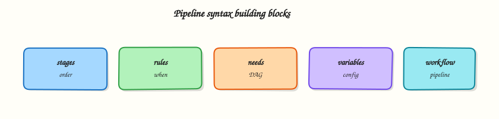

# Pipeline Syntax (.gitlab-ci.yml)

## Overview


Write clear `.gitlab-ci.yml` using variables, `workflow` and job `rules`, and understand `needs` vs `dependencies` for ordering and artefact flow.

GitLab reads **`.gitlab-ci.yml`** (or an alternate CI config path) to define pipelines. Prefer **`rules`** over legacy `only` / `except`. Use **`workflow:rules`** to decide whether a pipeline is created at all. Use **`needs`** for DAG edges; use **`dependencies`** to control which job artefacts download.

This is a core tutorial in **Module 4 · Pipeline Syntax** of the REBASH Academy **GitLab CI/CD for Cloud & DevOps Engineers** series — written for Cloud, DevOps, Platform, and SRE engineers.


## Prerequisites


- [GitLab Runners and Executors](gitlab-runners-and-executors.md)


## Learning Objectives


By the end of this tutorial, you will be able to:

- [ ] Structure stages, default, variables, and jobs  
- [ ] Prefer `rules` over `only`/`except`  
- [ ] Control pipeline creation with `workflow`  
- [ ] Contrast `needs` (ordering) with `dependencies` (artefacts)


## Architecture


This topic’s control points and relationships are shown below.




## Theory


### What it is

Top-level keys commonly include `stages`, `default`, `variables`, `workflow`, `include`, and job names. A job needs at least a `script` (or `trigger` / `trigger:include` patterns covered later). Predefined variables such as `$CI_COMMIT_SHA`, `$CI_PIPELINE_SOURCE`, and `$CI_DEFAULT_BRANCH` are injected by GitLab — prefer them over hard-coded branch names where possible.

| Keyword | Role |
|---------|------|
| `variables` | Pipeline or job env (plus UI/group vars) |
| `rules` | When a job is added to the pipeline |
| `workflow:rules` | Whether any pipeline is created |
| `needs` | Start job early; optional artefact download |
| `dependencies` | Which prior jobs’ artefacts to fetch (stage model) |

### Why it matters

Ambiguous YAML creates **ghost pipelines** (double branch + MR pipelines), skipped deploy jobs, or jobs that download every artefact and waste minutes. Precise `rules` and lean `dependencies` cut cost and confusion. Reviewers can reason about production risk from the YAML alone.

### How it works

1. GitLab loads YAML (and includes).
2. `workflow:rules` decide if this event creates a pipeline.
3. For each job, `rules` decide inclusion; variables expand.
4. Default graph: all jobs in a stage finish before the next stage starts.
5. `needs` can start a job as soon as listed jobs finish (DAG), optionally with `artifacts: true/false`.
6. Without `dependencies`, jobs may download all artefacts from previous stages; set `dependencies: []` or an explicit list to stay lean.

Migrate away from `only` / `except` — they still work but compose poorly with complex sources.

### Key concepts and comparisons

| Approach | Prefer when |
|----------|-------------|
| Stage ordering only | Simple linear build → test → deploy |
| `needs` DAG | Long pipelines; parallel fans; skip empty stages |
| `dependencies` | Control artefact download under stage ordering |

| Legacy | Modern |
|--------|--------|
| `only: [main]` | `rules: [{ if: $CI_COMMIT_BRANCH == $CI_DEFAULT_BRANCH }]` |
| `except: [schedules]` | `rules` with `when: never` for that source |

### Common pitfalls

- Combining `only` and `rules` on the same job — pick one model (`rules`).
- Forgetting `workflow` and paying for duplicate MR + branch pipelines.
- Using `needs` but still assuming stage barriers apply the same way.
- Putting secrets in YAML `variables:` — use masked/protected UI vars or OIDC (Module 6).


## Hands-on Lab


Create a workspace for this tutorial.

```bash
mkdir -p ~/rebash-gitlab/module-04 && cd ~/rebash-gitlab/module-04
```

**Focus:** practise rules, needs, and artefacts in .gitlab-ci.yml

### Step 1 – DAG-friendly pipeline

```bash
cat > .gitlab-ci.yml << 'EOF'
stages: [build, test]

build:
  stage: build
  script:
    - mkdir -p dist && echo artefact > dist/app.txt
  artifacts:
    paths: [dist/]
    expire_in: 1 hour

test:
  stage: test
  needs: [build]
  script:
    - test -f dist/app.txt && cat dist/app.txt
EOF
python3 -c "import yaml; yaml.safe_load(open('.gitlab-ci.yml')); print('OK')"
grep -n 'needs:\|artifacts:' .gitlab-ci.yml
```

### Final step – Cleanup note

```bash
# File-only lab
```


## Validation


- [ ] Lab commands run under `~/rebash-gitlab/module-04/`
- [ ] You can explain each Theory section in your own words
- [ ] You used modern tooling where it applies to this topic
- [ ] You can describe one production failure mode for this topic


## Code Walkthrough


Production practice for **Pipeline Syntax (.gitlab-ci.yml)** always combines:

1. Inspect before you change (status, plan, logs, dry-run)
2. Prefer reversible, documented changes (Git, IaC, drop-ins, version pins)
3. Capture evidence (command output, pipeline logs) for handovers
4. Prefer current tools and APIs over legacy shortcuts
5. Least privilege — escalate credentials only when required

Keep runbooks short enough to follow under pressure. Automate checks; keep humans for judgement.


## Security Considerations


- Treat credentials and tokens for gitlab as privileged — never commit them
- Prefer short-lived auth (OIDC, roles, SSO) over long-lived keys
- Validate blast radius before apply/deploy/delete operations
- Restrict who can approve production changes
- Collect audit logs; limit who can read sensitive traces


## Common Mistakes


!!! warning "Combining `only` and `rules` on the same job — pick one model (`rules`)."
    Validate assumptions against the Theory section and official docs before changing production.

!!! warning "Forgetting `workflow` and paying for duplicate MR + branch pipelines."
    Lab shortcuts (open security groups, admin roles, skip approvals) must not ship unchanged.

!!! warning "Changing production without a rollback path"
    Always know how to revert (previous artefact, prior release, state rollback, DNS failback).


## Best Practices


- Encode Pipeline Syntax (.gitlab-ci.yml) changes as code and review them in pull requests
- Pin versions (images, modules, actions, provider plugins)
- Separate environments with clear promotion gates
- Alert on symptoms with runbooks attached
- Destroy lab resources; tag everything with owner and expiry where possible


## Troubleshooting


| Symptom | Likely cause | Fix |
|---------|--------------|-----|
| Auth / permission denied | Wrong identity, policy, or scope | Check caller identity, roles, and least-privilege policies |
| Timeout / no route | Network, DNS, security group, or endpoint | Trace path, DNS, and allow-lists before retrying |
| Drift / unexpected plan | Manual change or wrong state/workspace | Reconcile desired vs actual; avoid click-ops on managed resources |
| Pipeline/job red | Flaky step, cache, or missing secret | Read failing step logs; bisect recent workflow/config changes |
| Cost spike | Idle load balancer, NAT, oversized compute | Inventory billable resources; stop/delete labs promptly |


## Summary


**Pipeline Syntax (.gitlab-ci.yml)** is essential for Cloud and DevOps engineers working with gitlab. Practise the lab until the inspection and change path is muscle memory, then continue the track.


## Interview Questions


1. How does **Pipeline Syntax (.gitlab-ci.yml)** show up in a real GitLab delivery workflow?
2. A pipeline is stuck / red — what do you check first?
3. How do `needs`, stages, and artefacts interact?
4. How should secrets and cloud credentials be handled in GitLab CI?
5. How would you keep merge-request pipelines fast but still safe?

!!! tip "Sample answer — question 2"
    Open the failing job log, confirm runner tags/executor, then validate `.gitlab-ci.yml` with CI Lint. Check rules that skipped jobs and artefact dependencies.

!!! tip "Sample answer — question 4"
    Prefer masked/protected variables and OIDC (`id_tokens`) over long-lived keys. Limit who can run protected-branch pipelines.


## Related Tutorials


- [Course overview](index.md)
- [Pipeline Design: DAGs and Includes](pipeline-design-dags-and-includes.md)


## References


- [CI/CD YAML syntax](https://docs.gitlab.com/ee/ci/yaml/)  
- [Job rules](https://docs.gitlab.com/ee/ci/jobs/job_rules.html)
