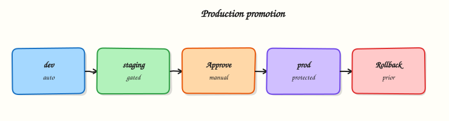

# Production Pipelines and Environments

## Overview


Design environment promotion (dev → staging → production) with protected environments, manual approvals, rollback paths, progressive delivery, and feature-flag controls.

Production CI/CD is controlled promotion of an **immutable artefact** through named **environments**, not “run deploy on every push to main”. GitLab environments, protection rules, and `when: manual` jobs encode who may promote and how you recover.

This is a core tutorial in **Module 15 · Production Pipelines** of the REBASH Academy **GitLab CI/CD for Cloud & DevOps Engineers** series — written for Cloud, DevOps, Platform, and SRE engineers.

## Prerequisites


- [Release Management and Versioning](release-management-and-versioning.md)
- Deploy awareness from [Kubernetes Deploys and GitLab Agent](kubernetes-deploys-and-gitlab-agent.md) or equivalent

## Learning Objectives


By the end of this tutorial, you will be able to:

- [ ] Model env promotion with `environment:` and sequential gates  
- [ ] Protect production with approvals and deployment permissions  
- [ ] Document rollback (previous version / previous release)  
- [ ] Outline progressive delivery and feature-flag separation

## Architecture


This topic’s control points and relationships are shown below.



## Theory


### What it is

A **production pipeline** promotes the same build (image digest, package version) across **environments** — logical targets such as `development`, `staging`, and `production`. GitLab tracks deployments per environment, supports **manual jobs**, and (on eligible tiers) **protected environments** that restrict who can deploy. **Progressive delivery** reduces blast radius (canary, blue/green, traffic shifting). **Feature flags** decouple *deploy* (ship binary) from *release* (enable behaviour).

| Control | Intent |
|---------|--------|
| Environment name | Track URL, status, history |
| Manual job | Human promote / confirm |
| Protected environment | Role / approval gate |
| Immutable artefact | Same SHA/digest every stage |
| Feature flag | Runtime expose without redeploy |

### Why it matters

Auto-deploying every merge to production maximises speed and incident rate. Enterprises need auditable promotion: who approved, which digest is live, and how to roll back in minutes. Progressive delivery and flags let platform teams ship continuously while product controls exposure — essential for multi-tenant cloud services and regulated workloads.

### How it works

1. **Build once** — tag image/package with commit SHA or SemVer; never rebuild for prod.
2. **Deploy to non-prod** automatically after tests; run smoke checks.
3. **Staging** — optional manual or auto; integration and acceptance tests against staging URLs.
4. **Production** — `when: manual` and/or protected environment approvals; deploy the same digest.
5. **Verify** — health checks, dashboards, error budgets; keep the previous revision ready.
6. **Rollback** — redeploy previous digest / `helm rollback` / traffic shift back; document the job.
7. **Flags** — risky features default off; enable gradually after deploy is healthy.

Keep production variables and runners scoped; production jobs should not share broad credentials with MR pipelines.

### Key concepts and comparisons

| Pattern | Blast radius | Complexity |
|---------|--------------|------------|
| All-at-once | High | Low |
| Blue/green | Medium (cutover) | Medium |
| Canary / progressive | Low (ramp traffic) | Higher |
| Feature flags | Behaviour-level | App + ops process |

| Continuous Delivery | Continuous Deployment |
|---------------------|------------------------|
| Ready to prod; human may gate | Auto to prod when green |

### Common pitfalls

- Rebuilding the image in the production job — digests diverge from what staging tested.
- Unprotected `production` environment — any Developer can click deploy.
- Rollback untested until an outage — practice in staging.
- Using feature flags as a substitute for broken deploy pipelines — flags hide, they do not fix bad artefacts.

## Hands-on Lab


### Objective

Author a promotion pipeline with **staging** and **production** GitLab environments, manual production gates, and the same artefact digest promoted — validated offline.

### Prerequisites

- Python 3 with PyYAML (`pip install pyyaml`)
- Optional: GitLab project with protected environments configured

### Lab environment

Workspace: `~/rebash-gitlab/module-15`

File-first lab. Environment approvals apply when pushed to GitLab.

``` {.bash .ra-terminal title="Terminal"}
mkdir -p ~/rebash-gitlab/module-15 && cd ~/rebash-gitlab/module-15
set -euo pipefail
```

### Real-world scenario

Release managers require automatic staging deploy on the default branch, smoke checks, then a **manual** production deploy using the same image digest — never a rebuild in production. You deliver pipeline YAML for review before environment protection rules are set.

### Step-by-step tasks

#### Task 1 – Promotion pipeline with environments

Create `.gitlab-ci.yml`:


```yaml
stages:
  - build
  - deploy
  - verify

variables:
  APP_NAME: rebash-lab

build:
  stage: build
  image: alpine:3.20
  script:
    - echo "sha256:lab-${CI_COMMIT_SHORT_SHA}" > digest.txt
    - cat digest.txt
  artifacts:
    paths:
      - digest.txt
    expire_in: 1 day
  rules:
    - if: $CI_COMMIT_BRANCH == $CI_DEFAULT_BRANCH

deploy-staging:
  stage: deploy
  image: alpine:3.20
  needs: [build]
  environment:
    name: staging
    url: https://staging.example.com
  script:
    - echo "Deploy $(cat digest.txt) to staging"
  rules:
    - if: $CI_COMMIT_BRANCH == $CI_DEFAULT_BRANCH

smoke-staging:
  stage: verify
  image: alpine:3.20
  needs: [deploy-staging]
  script:
    - echo "Smoke check staging — HTTP 200 stub"
    - test 0 -eq 0
  rules:
    - if: $CI_COMMIT_BRANCH == $CI_DEFAULT_BRANCH

deploy-production:
  stage: deploy
  image: alpine:3.20
  needs: [build, smoke-staging]
  environment:
    name: production
    url: https://app.example.com
  script:
    - echo "Deploy SAME digest $(cat digest.txt) to production"
  when: manual
  rules:
    - if: $CI_COMMIT_BRANCH == $CI_DEFAULT_BRANCH
```


Validate offline:

``` {.bash .ra-terminal title="Terminal"}
cd ~/rebash-gitlab/module-15
set -euo pipefail
python3 -c "
import yaml
d = yaml.safe_load(open('.gitlab-ci.yml'))
assert d['deploy-production']['when'] == 'manual'
assert d['deploy-production']['needs'] == ['build', 'smoke-staging']
assert d['deploy-staging']['environment']['name'] == 'staging'
print('gitlab-ci OK')
"
grep -q 'alpine:3.20' .gitlab-ci.yml
grep -q 'SAME digest' .gitlab-ci.yml
```

!!! example "Expected output"
    `gitlab-ci OK`; manual production gate and digest promotion present.


#### Task 2 – Deployment strategies reference

Create `deployment-strategies.yaml`:

```yaml title="deployment-strategies.yaml"
strategies:
  blue_green:
    description: Maintain blue (current) and green (new) stacks
    rollback: switch traffic back to blue without rebuild
  canary:
    description: Route small traffic percentage to new version
    initial_weight_percent: 10
gitlab_environments:
  staging:
    deploy_trigger: auto on default branch
  production:
    required_approvers: true
    promotion: same digest from build job artefact
```

Validate offline:

``` {.bash .ra-terminal title="Terminal"}
cd ~/rebash-gitlab/module-15
set -euo pipefail
python3 -c "
import yaml
doc = yaml.safe_load(open('deployment-strategies.yaml'))
assert 'blue_green' in doc['strategies']
assert doc['gitlab_environments']['production']['promotion'].startswith('same digest')
print('deployment-strategies.yaml OK')
"
```

!!! example "Expected output"
    `deployment-strategies.yaml OK`


#### Task 3 – Simulate digest promotion locally

Create `simulate-promote.sh`:

```bash title="simulate-promote.sh"
#!/usr/bin/env bash
set -euo pipefail
echo 'sha256:lab-local' > digest.txt
staging_digest="$(cat digest.txt)"
prod_digest="$(cat digest.txt)"
test "${staging_digest}" = "${prod_digest}"
grep -q 'when: manual' .gitlab-ci.yml
echo 'module-15 promotion lab passed'
```

Run it:

``` {.bash .ra-terminal title="Terminal"}
cd ~/rebash-gitlab/module-15
set -euo pipefail
chmod +x simulate-promote.sh
./simulate-promote.sh | tee validation.txt
```

!!! example "Expected output"
    `module-15 promotion lab passed`


### Validation steps

- [ ] Staging deploy runs before production in the stage graph
- [ ] Production job is `when: manual` with `environment: production`
- [ ] Build artefact `digest.txt` referenced in both deploy jobs
- [ ] `deployment-strategies.yaml` documents blue/green and canary
- [ ] Pinned image `alpine:3.20` on all jobs

### Common errors and fixes

| Error | Cause | Fix |
|-------|-------|-----|
| Production deploy without approval | Environment not protected | Add required approvers in GitLab settings |
| Staging/prod different digests | Rebuild in prod job | Pass `digest.txt` artefact from build |
| Manual job never appears | Wrong branch rules | Confirm default-branch pipeline |
| Rollback untested | No runbook | Add manual rollback job with prior tag input |
| Unprotected production env | Missing access control | Restrict deploy rights to release managers |

### Challenge exercise

Add a `rollback-production` manual job that accepts a `PRIOR_DIGEST` variable and documents the Kubernetes `helm rollback` or `kubectl rollout undo` command it would run.

### Learning outcomes

- Configured staging and production GitLab environments
- Gated production with manual deploy and smoke verification
- Promoted the same digest artefact without rebuild
- Documented deployment strategies in reviewable YAML

### Cleanup

``` {.bash .ra-terminal title="Terminal"}
rm -f ~/rebash-gitlab/module-15/digest.txt 2>/dev/null || true
ls ~/rebash-gitlab/module-15
```

## Validation


- [ ] Lab commands run under `~/rebash-gitlab/module-15/`
- [ ] You can explain each Theory section in your own words
- [ ] You used modern tooling where it applies to this topic
- [ ] You can describe one production failure mode for this topic

## Code Walkthrough


Production practice for **Production Pipelines and Environments** always combines:

1. Inspect before you change (status, plan, logs, dry-run)
2. Prefer reversible, documented changes (Git, IaC, drop-ins, version pins)
3. Capture evidence (command output, pipeline logs) for handovers
4. Prefer current tools and APIs over legacy shortcuts
5. Least privilege — escalate credentials only when required

Keep runbooks short enough to follow under pressure. Automate checks; keep humans for judgement.

## Security Considerations


- Treat credentials and tokens for gitlab as privileged — never commit them
- Prefer short-lived auth (OIDC, roles, SSO) over long-lived keys
- Validate blast radius before apply/deploy/delete operations
- Restrict who can approve production changes
- Collect audit logs; limit who can read sensitive traces

## Common Mistakes


!!! warning "Rebuilding the image in the production job — digests diverge from what staging tested."
    Validate assumptions against the Theory section and official docs before changing production.

!!! warning "Unprotected `production` environment — any Developer can click deploy."
    Lab shortcuts (open security groups, admin roles, skip approvals) must not ship unchanged.

!!! warning "Changing production without a rollback path"
    Always know how to revert (previous artefact, prior release, state rollback, DNS failback).

## Best Practices


- Encode Production Pipelines and Environments changes as code and review them in pull requests
- Pin versions (images, modules, actions, provider plugins)
- Separate environments with clear promotion gates
- Alert on symptoms with runbooks attached
- Destroy lab resources; tag everything with owner and expiry where possible

## Troubleshooting


| Symptom | Likely cause | Fix |
|---------|--------------|-----|
| Auth / permission denied | Wrong identity, policy, or scope | Check caller identity, roles, and least-privilege policies |
| Timeout / no route | Network, DNS, security group, or endpoint | Trace path, DNS, and allow-lists before retrying |
| Drift / unexpected plan | Manual change or wrong state/workspace | Reconcile desired vs actual; avoid click-ops on managed resources |
| Pipeline/job red | Flaky step, cache, or missing secret | Read failing step logs; bisect recent workflow/config changes |
| Cost spike | Idle load balancer, NAT, oversized compute | Inventory billable resources; stop/delete labs promptly |

## Summary


**Production Pipelines and Environments** is essential for Cloud and DevOps engineers working with gitlab. Practise the lab until the inspection and change path is muscle memory, then continue the track.

## Interview Questions


1. How do GitLab environments help track deployments?
2. Why make production deploy when manual even if staging is automatic?
3. What should stop an automatic promote from staging to production?
4. How do protected environments reduce risk?
5. What evidence do you keep for a production change?

!!! tip "Sample answer — question 2"
    Check environment name/url, deployment job rules, and whether the commit is on the allowed branch. Read the job log and app health next.

!!! tip "Sample answer — question 4"
    Limit who can run production jobs, require approvals on protected environments, and inject production secrets only into those jobs.

## Related Tutorials


- [Course overview](index.md)
- [Pipeline Monitoring and Observability](pipeline-monitoring-and-observability.md)

## References


- [Environments and deployments](https://docs.gitlab.com/ee/ci/environments/)  
- [Protected environments](https://docs.gitlab.com/ee/ci/environments/protected_environments.html)  
- [Deployment safety](https://docs.gitlab.com/ee/ci/environments/deployment_safety.html)
