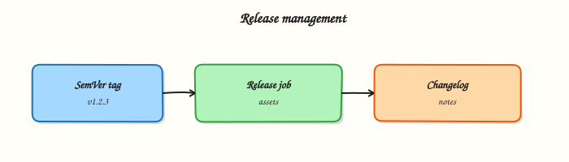

# Release Management and Versioning

## Overview


Create annotated Git tags, publish GitLab Releases with notes and assets, and apply Semantic Versioning (SemVer) with changelog discipline from CI.

A **release** is more than a green pipeline: it is an immutable Git reference, human-readable notes, and optional binaries or package links. GitLab ties **tags**, **Releases**, and CI so the same SHA you tested becomes the version you promote.

This is a core tutorial in **Module 14 · Release Management** of the REBASH Academy **GitLab CI/CD for Cloud & DevOps Engineers** series — written for Cloud, DevOps, Platform, and SRE engineers.

## Prerequisites


- [Testing, Reports, and Quality Gates](testing-reports-and-quality-gates.md)
- [GitLab Projects, Merge Requests, and Releases](gitlab-projects-mrs-and-releases.md) (or equivalent awareness)

## Learning Objectives


By the end of this tutorial, you will be able to:

- [ ] Choose SemVer bumps (MAJOR / MINOR / PATCH) intentionally  
- [ ] Tag from CI or release trains with protected tags  
- [ ] Create a GitLab Release with description and links  
- [ ] Generate or attach a changelog for operators

## Architecture


This topic’s control points and relationships are shown below.



## Theory


### What it is

**Release management** in GitLab combines **Git tags** (pointers to commits) with the **Releases** API/UI (title, description, milestones, evidence, asset links). **Semantic Versioning** (`MAJOR.MINOR.PATCH`) communicates compatibility: breaking API or ops contract → MAJOR; backwards-compatible features → MINOR; fixes → PATCH. Changelogs explain *what operators and consumers must know* — not every commit message.

| Artefact | Role |
|----------|------|
| Git tag | Immutable commit pointer (`v1.4.2`) |
| GitLab Release | Notes, assets, audit-friendly package |
| Changelog | Human summary of user-facing change |
| Pipeline on tag | Build/publish artefacts for that version |

### Why it matters

Cloud deployments and GitOps consume versions, not branch tips. Without SemVer and release notes, rollbacks and incident communication degrade into archaeology. Automating tags and Releases from CI removes “who remembered to click Publish?” and keeps evidence next to the code that produced the artefact.

### How it works

Typical automation loop:

1. Merge to the release branch / `main` after tests and security gates pass.
2. Decide the next SemVer (manual input, conventional commits, or a release bot).
3. Create an annotated tag (`vX.Y.Z`); protect tag patterns so only maintainers or CI can push.
4. A **tag pipeline** builds images/packages with that version as the immutable tag.
5. A `release:` job (or API call) creates the GitLab Release, attaches links (container digest, package URL), and embeds changelog content.
6. Downstream environments promote that exact version.

Prefer **annotated tags** over lightweight tags for release history. Keep changelog generation deterministic (Conventional Commits, `git-cliff`, or GitLab’s release notes from MRs).

### Key concepts and comparisons

| Approach | When to use |
|----------|-------------|
| Tag only | Simple libs; consumers track Git |
| Tag + GitLab Release | Product teams, ops handoffs, assets |
| Continuous deploy every commit | Internal apps with strong progressive delivery |
| Release train (calendar) | Coordinated multi-service cuts |

| SemVer part | Bump when |
|-------------|-----------|
| MAJOR | Breaking behaviour or config contract |
| MINOR | Compatible new capability |
| PATCH | Compatible fix |

### Common pitfalls

- Moving or retagging `v1.2.0` after publish — consumers and digests diverge; always cut a new patch.
- Using `latest` as the only production pin — releases should be immutable versions.
- Changelog that lists every chore commit — operators need impact, not noise.
- Creating Releases without a matching successful tag pipeline — notes without artefacts.

## Hands-on Lab


### Objective

Practise Semantic Versioning (SemVer) with a `VERSION` file, author a GitLab **release** job triggered by tags, and generate a changelog stub — all validated offline.

### Prerequisites

- Python 3 with PyYAML (`pip install pyyaml`)
- Git (optional, for local tag practice)
- Optional: GitLab project with release permissions

### Lab environment

Workspace: `~/rebash-gitlab/module-14`

File-first lab. Release jobs execute on GitLab when tags are pushed.

``` {.bash .ra-terminal title="Terminal"}
mkdir -p ~/rebash-gitlab/module-14 && cd ~/rebash-gitlab/module-14
set -euo pipefail
```

### Real-world scenario

Release managers require every production cut to be an immutable SemVer tag with a GitLab Release, changelog evidence, and attached artefacts — only after tests pass. You deliver version files and pipeline YAML for review.

### Step-by-step tasks

#### Task 1 – Version and changelog files

Create `VERSION`:

```text title="VERSION"
0.1.0
```

Create `CHANGELOG.md`:

```markdown title="CHANGELOG.md"
# Changelog

## Unreleased

- Module 14 lab release scaffolding

## 0.1.0

- Initial lab release
```

Verify locally:

``` {.bash .ra-terminal title="Terminal"}
cd ~/rebash-gitlab/module-14
set -euo pipefail
grep -E '^[0-9]+\.[0-9]+\.[0-9]+$' VERSION | tee version-check.txt
test -s CHANGELOG.md
head -5 CHANGELOG.md
```

!!! example "Expected output"
    `0.1.0` in `version-check.txt`; changelog headings visible.


#### Task 2 – Changelog generator script

Create `generate-changelog.sh`:

```bash title="generate-changelog.sh"
#!/usr/bin/env bash
set -euo pipefail
version="$(tr -d '[:space:]' < VERSION)"
out="${1:-RELEASE_NOTES.md}"
{
  echo "# Release ${version}"
  echo
  sed -n '/^## Unreleased/,$p' CHANGELOG.md | tail -n +3
} > "${out}"
echo "wrote ${out} for v${version}"
```

Run it:

``` {.bash .ra-terminal title="Terminal"}
cd ~/rebash-gitlab/module-14
set -euo pipefail
chmod +x generate-changelog.sh
./generate-changelog.sh RELEASE_NOTES.md | tee changelog-gen.txt
test -s RELEASE_NOTES.md
grep -q '0.1.0' RELEASE_NOTES.md
```

!!! example "Expected output"
    `wrote RELEASE_NOTES.md for v0.1.0`


#### Task 3 – GitLab release pipeline

Create `.gitlab-ci.yml`:


```yaml
stages:
  - test
  - release

test-gate:
  stage: test
  image: alpine:3.20
  script:
    - test -f VERSION
    - test -f CHANGELOG.md
    - grep -E '^[0-9]+\.[0-9]+\.[0-9]+$' VERSION
  rules:
    - if: $CI_COMMIT_TAG

release:
  stage: release
  image: registry.gitlab.com/gitlab-org/release-cli:latest
  needs: [test-gate]
  script:
    - ./generate-changelog.sh RELEASE_NOTES.md
    - mkdir -p dist
    - cp VERSION CHANGELOG.md RELEASE_NOTES.md dist/
    - echo "${CI_COMMIT_TAG}" > dist/TAG.txt
  artifacts:
    paths:
      - dist/
    expire_in: 30 days
  release:
    tag_name: $CI_COMMIT_TAG
    description: "Release $CI_COMMIT_TAG — see RELEASE_NOTES.md"
  rules:
    - if: $CI_COMMIT_TAG
```


Validate offline:

``` {.bash .ra-terminal title="Terminal"}
cd ~/rebash-gitlab/module-14
set -euo pipefail
python3 -c "
import yaml
d = yaml.safe_load(open('.gitlab-ci.yml'))
assert d['release']['needs'] == ['test-gate']
assert 'release' in d['release']
assert 'CI_COMMIT_TAG' in d['release']['rules'][0]['if']
print('gitlab-ci OK')
"
grep -q 'release-cli:latest' .gitlab-ci.yml
grep -q 'generate-changelog.sh' .gitlab-ci.yml
```

!!! example "Expected output"
    `gitlab-ci OK`; release-cli image and changelog script referenced.


#### Task 4 – Simulate tag metadata locally

``` {.bash .ra-terminal title="Terminal"}
cd ~/rebash-gitlab/module-14
set -euo pipefail
echo 'v0.1.0-lab' > TAG.sim
grep -E 'CI_COMMIT_TAG|release:' .gitlab-ci.yml | tee tag-rules.txt
./generate-changelog.sh dist-notes.md
test -f dist-notes.md
echo 'module-14 release lab passed' | tee validation.txt
```

!!! example "Expected output"
    Tag rules listed; `module-14 release lab passed`


### Validation steps

- [ ] `VERSION` holds valid SemVer (`0.1.0`)
- [ ] Release job `needs: test-gate` and triggers on `$CI_COMMIT_TAG`
- [ ] Changelog generator produces non-empty release notes
- [ ] Pinned images: `alpine:3.20`, `release-cli:latest`
- [ ] Dist artefacts include VERSION, CHANGELOG, and notes

### Common errors and fixes

| Error | Cause | Fix |
|-------|-------|-----|
| Release without tests | Missing gate job | Keep `needs: [test-gate]` |
| Empty release notes | Blank CHANGELOG | Populate Unreleased section before tag |
| Retagging published version | Immutable tag violated | Cut new patch version instead |
| Release job skipped | Not a tag pipeline | Push annotated tag `v0.1.0` |
| Wrong asset paths | Typo in `artifacts.paths` | Verify `dist/` contents in job log |

### Challenge exercise

Add a `workflow: rules` block so release pipelines run only on tags matching `/^v\d+\.\d+\.\d+$/`. Document how protected tags enforce this in GitLab project settings.

### Learning outcomes

- Maintained SemVer in a committed `VERSION` file
- Authored a gated GitLab Release job with artefact bundle
- Generated release notes from changelog offline
- Understood tag-triggered pipelines vs branch pipelines

### Cleanup

``` {.bash .ra-terminal title="Terminal"}
rm -f ~/rebash-gitlab/module-14/TAG.sim ~/rebash-gitlab/module-14/dist-notes.md 2>/dev/null || true
ls ~/rebash-gitlab/module-14
```

## Validation


- [ ] Lab commands run under `~/rebash-gitlab/module-14/`
- [ ] You can explain each Theory section in your own words
- [ ] You used modern tooling where it applies to this topic
- [ ] You can describe one production failure mode for this topic

## Code Walkthrough


Production practice for **Release Management and Versioning** always combines:

1. Inspect before you change (status, plan, logs, dry-run)
2. Prefer reversible, documented changes (Git, IaC, drop-ins, version pins)
3. Capture evidence (command output, pipeline logs) for handovers
4. Prefer current tools and APIs over legacy shortcuts
5. Least privilege — escalate credentials only when required

Keep runbooks short enough to follow under pressure. Automate checks; keep humans for judgement.

## Security Considerations


- Treat credentials and tokens for gitlab as privileged — never commit them
- Prefer short-lived auth (OIDC, roles, SSO) over long-lived keys
- Validate blast radius before apply/deploy/delete operations
- Restrict who can approve production changes
- Collect audit logs; limit who can read sensitive traces

## Common Mistakes


!!! warning "Moving or retagging `v1.2.0` after publish — consumers and digests diverge; always cut a n"
    Validate assumptions against the Theory section and official docs before changing production.

!!! warning "Using `latest` as the only production pin — releases should be immutable versions."
    Lab shortcuts (open security groups, admin roles, skip approvals) must not ship unchanged.

!!! warning "Changing production without a rollback path"
    Always know how to revert (previous artefact, prior release, state rollback, DNS failback).

## Best Practices


- Encode Release Management and Versioning changes as code and review them in pull requests
- Pin versions (images, modules, actions, provider plugins)
- Separate environments with clear promotion gates
- Alert on symptoms with runbooks attached
- Destroy lab resources; tag everything with owner and expiry where possible

## Troubleshooting


| Symptom | Likely cause | Fix |
|---------|--------------|-----|
| Auth / permission denied | Wrong identity, policy, or scope | Check caller identity, roles, and least-privilege policies |
| Timeout / no route | Network, DNS, security group, or endpoint | Trace path, DNS, and allow-lists before retrying |
| Drift / unexpected plan | Manual change or wrong state/workspace | Reconcile desired vs actual; avoid click-ops on managed resources |
| Pipeline/job red | Flaky step, cache, or missing secret | Read failing step logs; bisect recent workflow/config changes |
| Cost spike | Idle load balancer, NAT, oversized compute | Inventory billable resources; stop/delete labs promptly |

## Summary


**Release Management and Versioning** is essential for Cloud and DevOps engineers working with gitlab. Practise the lab until the inspection and change path is muscle memory, then continue the track.

## Interview Questions


1. How do tag pipelines differ from branch pipelines?
2. What should a release job publish besides a version number?
3. Semantic versioning vs calendar versioning — when does each fit?
4. How do you prevent a rewritten tag from republishing artifacts?
5. Where do changelogs belong in the release process?

!!! tip "Sample answer — question 2"
    Confirm the pipeline ran on CI_COMMIT_TAG, artifacts uploaded, and the release object points at the intended commit SHA.

!!! tip "Sample answer — question 4"
    Protect release tags, sign artifacts when required, and keep provenance (commit SHA, pipeline ID). Do not reuse tags.

## Related Tutorials


- [Course overview](index.md)
- [Production Pipelines and Environments](production-pipelines-and-environments.md)

## References


- [GitLab Releases](https://docs.gitlab.com/ee/user/project/releases/)  
- [CI `release` keyword](https://docs.gitlab.com/ee/ci/yaml/#release)  
- [Semantic Versioning](https://semver.org/)
