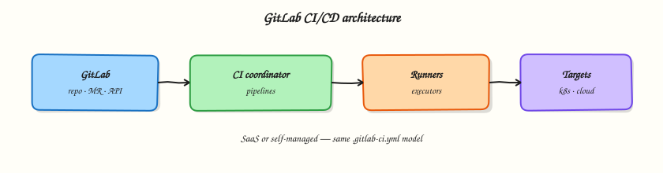
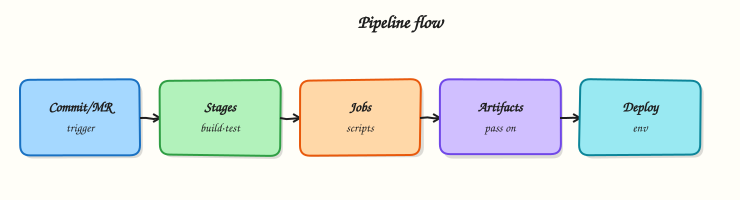

# GitLab CI/CD — Learning Roadmap

Follow the course in order:

1. **Course overview** — scope, prerequisites, outcomes
2. **Modules 1–18** — tutorials in sequence
3. **Labs / quizzes / projects** — practice
4. **Capstone** — production GitLab CI/CD platform
5. **Interview & certifications** — GitLab CI/CD Associate / DevOps Professional





## Modules

| # | Focus | Tutorials |
|---|-------|-----------|
| 1 | Fundamentals | [Fundamentals](gitlab-ci-fundamentals.md) |
| 2 | Projects | [MRs & releases](gitlab-projects-mrs-and-releases.md) |
| 3 | Runners | [Runners & executors](gitlab-runners-and-executors.md) |
| 4 | Pipeline syntax | [`.gitlab-ci.yml`](pipeline-syntax-gitlab-ci-yml.md) |
| 5 | Pipeline design | [DAGs & includes](pipeline-design-dags-and-includes.md) |
| 6 | Variables & secrets | [Variables · OIDC](variables-secrets-and-oidc.md) |
| 7 | Artifacts & cache | [Artifacts & cache](artifacts-caches-and-dependencies.md) |
| 8 | Docker pipelines | [Docker builds](building-docker-images-in-ci.md) |
| 9 | Kubernetes | [Agent & deploys](kubernetes-deploys-and-gitlab-agent.md) |
| 10 | Terraform | [TF pipelines](terraform-pipelines-in-gitlab.md) |
| 11 | Cloud deployments | [AWS · Azure · GCP](multi-cloud-deployments-with-gitlab.md) |
| 12 | DevSecOps | [Security scanning](security-scanning-and-devsecops.md) |
| 13 | Testing | [Tests & gates](testing-reports-and-quality-gates.md) |
| 14 | Releases | [Tags & releases](release-management-and-versioning.md) |
| 15 | Production | [Promotion & approvals](production-pipelines-and-environments.md) |
| 16 | Monitoring | [Observability](pipeline-monitoring-and-observability.md) |
| 17 | Troubleshooting | [Troubleshooting](troubleshooting-gitlab-ci.md) |
| 18 | Enterprise | [Groups & governance](enterprise-gitlab.md) |

## Diagrams

```bash title="Terminal"
python3 scripts/generate-excalidraw-svg.py
```
