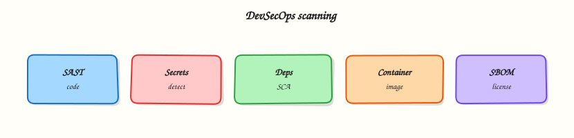

# Security Scanning and DevSecOps

## Overview


Assemble a DevSecOps stage that runs secret detection and SAST early, dependency and container scanning on build outputs, and documents where DAST, licence policies, and Software Bill of Materials (SBOM) fit before production deploy.

**DevSecOps** embeds security scanners into the same pipeline that builds and deploys. GitLab analysers cover Static Application Security Testing (SAST), Dynamic Application Security Testing (DAST), dependency scanning, container scanning, secret detection, licence compliance, and SBOM export. Fail the pipeline on policy severity — do not treat scanners as optional decoration.

This is a core tutorial in **Module 12 · DevSecOps** of the REBASH Academy **GitLab CI/CD for Cloud & DevOps Engineers** series — written for Cloud, DevOps, Platform, and SRE engineers.


## Prerequisites


- [Multi-Cloud Deployments with GitLab](multi-cloud-deployments-with-gitlab.md)


## Learning Objectives


By the end of this tutorial, you will be able to:

- [ ] Place secret detection and SAST before expensive builds  
- [ ] Run dependency and container scanning on real artefacts  
- [ ] Explain DAST’s need for a running target  
- [ ] Outline licence / SBOM outputs for supply-chain review  
- [ ] Gate merges on severity thresholds


## Architecture


This topic’s control points and relationships are shown below.




## Theory


### What it is

Security jobs produce machine-readable findings in the merge request and Security dashboards:

| Scanner | Looks at | When |
|---------|----------|------|
| Secret detection | Git history / diffs | Earliest — every pipeline |
| SAST | Source / bytecode patterns | Early on MR |
| Dependency scanning | Lockfiles / manifests | With resolve / build |
| Container scanning | Built image | After image push |
| DAST | Running HTTP app | Staging / review app |
| Licence / SBOM | Dependencies & image | Compliance / attestations |

Templates such as `Security/SAST.gitlab-ci.yml` and `Jobs/Secret-Detection.gitlab-ci.yml` wire analysers; teams tune allowlists and severity gates.

### Why it matters

Vulnerabilities found after production are incidents. Secrets in Git are credentials for attackers. Dependency and container CVEs dominate modern findings; SBOM and licence data answer “what did we ship?” for auditors. Pipelines that only deploy without scanning train teams to ignore risk.

### How it works

1. Include official security templates or pinned analyser jobs.  
2. Run **secret detection** on every MR; block on verified leaks.  
3. Run **SAST** in parallel with unit tests where possible.  
4. After lockfile install / image build: **dependency** and **container** scans against the Module 8 SHA artefact.  
5. Optional **DAST** against a review app or staging URL.  
6. Publish **SBOM** (CycloneDX/SPDX) and licence reports; enforce policies on the default branch.

Treat false positives with tracked allowlists — not by disabling scanners globally.

### Key concepts and comparisons

| Control | Strength | Limit |
|---------|----------|-------|
| Secret detection | Stops key commits | Still rotate if already leaked |
| SAST | Fast, no runtime | Noise without triage |
| DAST | Runtime issues | Needs a deployable target |
| Container scan | Matches what you ship | Base-image debt accumulates |
| SBOM | Inventory for response | Must tie to release digest |

### Common pitfalls

- Enabling scanners but never failing on Critical/High.  
- Scanning `latest` while deploying a different tag.  
- Allowlisting secrets instead of rotating them.  
- Running DAST only in production.  
- Generating an SBOM not attached to the released digest.


## Hands-on Lab


Create a workspace for this tutorial.

```bash
mkdir -p ~/rebash-gitlab/module-12 && cd ~/rebash-gitlab/module-12
```

**Focus:** SAST/secret-detection style jobs and a security gate

### Step 1 – Security scanning pipeline

```bash
echo 'PASSWORD_PLACEHOLDER = "replace-me"' > app.py
cat > .gitlab-ci.yml << 'EOF'
include:
  - template: Security/SAST.gitlab-ci.yml
  - template: Security/Secret-Detection.gitlab-ci.yml
stages: [test, security, gate]
unit:
  stage: test
  image: alpine:3.20
  script: ["echo unit"]
secret_review:
  stage: security
  image: alpine:3.20
  script:
    - echo "Review Security tab reports"
    - test -f app.py
security_gate:
  stage: gate
  image: alpine:3.20
  needs: [secret_review]
  script: ["echo Fail when critical findings exceed policy"]
EOF
```

### Step 2 – Hunt for accidental secrets

```bash
grep -RInE '(AKIA[0-9A-Z]{16}|BEGIN (RSA |OPENSSH )?PRIVATE KEY)' . || echo "no obvious secrets"
grep -E 'Secret-Detection|SAST|security_gate' .gitlab-ci.yml
```

### Final step – Cleanup note

```bash
# Keep ~/rebash-gitlab/ for later tutorials
```


## Validation


- [ ] Lab commands run under `~/rebash-gitlab/module-12/`
- [ ] You can explain each Theory section in your own words
- [ ] You used modern tooling where it applies to this topic
- [ ] You can describe one production failure mode for this topic


## Code Walkthrough


Production practice for **Security Scanning and DevSecOps** always combines:

1. Inspect before you change (status, plan, logs, dry-run)
2. Prefer reversible, documented changes (Git, IaC, drop-ins, version pins)
3. Capture evidence (command output, pipeline logs) for handovers
4. Prefer current tools and APIs over legacy shortcuts
5. Least privilege — escalate credentials only when required

Keep runbooks short enough to follow under pressure. Automate checks; keep humans for judgement.


## Security Considerations


- Treat credentials and tokens for gitlab as privileged — never commit them
- Prefer short-lived auth (OIDC, roles, SSO) over long-lived keys
- Validate blast radius before apply/deploy/delete operations
- Restrict who can approve production changes
- Collect audit logs; limit who can read sensitive traces


## Common Mistakes


!!! warning "Enabling scanners but never failing on Critical/High.  "
    Validate assumptions against the Theory section and official docs before changing production.

!!! warning "Scanning `latest` while deploying a different tag.  "
    Lab shortcuts (open security groups, admin roles, skip approvals) must not ship unchanged.

!!! warning "Changing production without a rollback path"
    Always know how to revert (previous artefact, prior release, state rollback, DNS failback).


## Best Practices


- Encode Security Scanning and DevSecOps changes as code and review them in pull requests
- Pin versions (images, modules, actions, provider plugins)
- Separate environments with clear promotion gates
- Alert on symptoms with runbooks attached
- Destroy lab resources; tag everything with owner and expiry where possible


## Troubleshooting


| Symptom | Likely cause | Fix |
|---------|--------------|-----|
| Auth / permission denied | Wrong identity, policy, or scope | Check caller identity, roles, and least-privilege policies |
| Timeout / no route | Network, DNS, security group, or endpoint | Trace path, DNS, and allow-lists before retrying |
| Drift / unexpected plan | Manual change or wrong state/workspace | Reconcile desired vs actual; avoid click-ops on managed resources |
| Pipeline/job red | Flaky step, cache, or missing secret | Read failing step logs; bisect recent workflow/config changes |
| Cost spike | Idle load balancer, NAT, oversized compute | Inventory billable resources; stop/delete labs promptly |


## Summary


**Security Scanning and DevSecOps** is essential for Cloud and DevOps engineers working with gitlab. Practise the lab until the inspection and change path is muscle memory, then continue the track.


## Interview Questions


1. What is the difference between SAST and secret detection?
2. Security job is red on a dependency CVE — how do you respond in CI?
3. When is an allowlist acceptable for scanner findings?
4. How do you stop developers from disabling scanners on their branch?
5. What belongs in the pipeline versus a central security platform?

!!! tip "Sample answer — question 2"
    Triage by severity and exploitability: confirm the component is shipped, check for a fixed version, document temporary exceptions with expiry.

!!! tip "Sample answer — question 4"
    Keep scanners required on protected branches and never commit secrets to “fix” the detector.


## Related Tutorials


- [Course overview](index.md)
- [Testing, Reports, and Quality Gates](testing-reports-and-quality-gates.md)


## References


- [Application security](https://docs.gitlab.com/ee/user/application_security/) · [Secret detection](https://docs.gitlab.com/ee/user/application_security/secret_detection/) · [SAST](https://docs.gitlab.com/ee/user/application_security/sast/) · [Container scanning](https://docs.gitlab.com/ee/user/application_security/container_scanning/)
