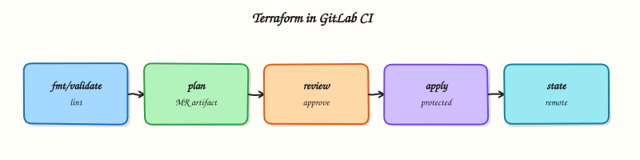

# Terraform Pipelines in GitLab

## Overview

Design a GitLab pipeline that runs `init` → `validate` → `plan` on merge requests (with a plan artefact) and a protected `apply` on the default branch — with remote state outside the runner workspace.

Terraform in GitLab CI automates Infrastructure as Code (IaC): every change is planned in review, then applied under gates. Store **remote state** with locking. Attach the binary **plan** as a job artefact so apply executes what reviewers saw. Never leave state only on the runner disk.

This is a core tutorial in **Module 10 · Terraform Pipelines** of the REBASH Academy **GitLab CI/CD for Cloud & DevOps Engineers** series — written for Cloud, DevOps, Platform, and SRE engineers.

## Prerequisites

- [Kubernetes Deploys and GitLab Agent](kubernetes-deploys-and-gitlab-agent.md)

## Learning Objectives

By the end of this tutorial, you will be able to:

- [ ] Sequence init, validate, plan, apply, and optional destroy  
- [ ] Store plan output as a GitLab artefact for MR review  
- [ ] Gate apply with a protected environment  
- [ ] Explain remote state + locking in CI  
- [ ] Use `TF_IN_AUTOMATION` and non-interactive flags

## Architecture

This topic’s control points and relationships are shown below.



## Theory

### What it is

A **Terraform pipeline** maps CLI phases onto GitLab stages: `fmt`/`validate` and `plan -out=` on every MR (low / plan privilege); reviewed **apply** of the saved plan on the default branch or a protected environment; rare, heavily gated **destroy**. State lives in a **remote backend** with locking. CI uses short-lived credentials (often OIDC — Module 11). `TF_IN_AUTOMATION=true` and `-input=false` keep jobs non-interactive.

### Why it matters

Laptop apply bypasses review and uses personal cloud keys. MR plans give reviewers a concrete diff; protected apply prevents unreviewed infrastructure changes. Plan artefacts stop “plan on Tuesday, apply Thursday’s different config.” State locking prevents two pipelines from corrupting the same workspace.

### How it works

1. On MR: pin Terraform → `init` → `validate` → `plan -out=tfplan` → upload artefact (short `expire_in`).  
2. Job log shows `terraform show` summary for reviewers.  
3. On merge (or after environment approval): download the same artefact → `apply -input=false tfplan`.  
4. Destroy jobs are manual and environment-protected.  
5. Backend config comes from CI variables or a committed backend block — no secrets in Git.

Prefer apply-of-saved-plan for production.

### Key concepts and comparisons

| Concern | Good practice | Risk |
|---------|---------------|------|
| State | Remote + lock | Local state on runner |
| Plan | Artefact tied to MR SHA | Fresh plan at apply with drift |
| Apply | Protected environment | Auto-apply on every push |
| Secrets | OIDC / masked vars | Static admin keys |

### Common pitfalls

- Committing `.terraform/` or `terraform.tfstate` to Git.  
- Applying without the reviewed plan artefact.  
- Logging plans that include secret attribute values.  
- One shared state key for all environments; fork MRs with apply roles.

## Hands-on Lab
Create a workspace for this tutorial.

```bash
mkdir -p ~/rebash-gitlab/module-10 && cd ~/rebash-gitlab/module-10
git init -q
```

**Focus:** author and validate CI config for Terraform Pipelines in GitLab

### Step 1 – Write a minimal pipeline

```bash
cat > .gitlab-ci.yml << 'EOF'
stages: [validate]
validate:
  stage: validate
  image: alpine:3.20
  script:
    - echo "pipeline ok"
    - uname -a
EOF
ls -la
sed -n '1,80p' .gitlab-ci.yml
```

### Step 2 – Static checks before push

```bash
# Syntax / structure sanity (no runner required)
test -s .gitlab-ci.yml
grep -E 'script:|runs-on:|steps:' .gitlab-ci.yml
# When a runner is available, push a branch and confirm the job is green
```

### Final step – Cleanup note

```bash
# Keep ~/rebash-gitlab-ci/ for later tutorials; delete remote test branches when finished
```

## Validation

- [ ] Lab commands run under `~/rebash-gitlab/module-10/`
- [ ] You can explain each Theory section in your own words
- [ ] You used modern tooling where it applies to this topic
- [ ] You can describe one production failure mode for this topic

## Code Walkthrough

Production practice for **Terraform Pipelines in GitLab** always combines:

1. Inspect before you change (status, plan, logs, dry-run)
2. Prefer reversible, documented changes (Git, IaC, drop-ins, version pins)
3. Capture evidence (command output, pipeline logs) for handovers
4. Prefer current tools and APIs over legacy shortcuts
5. Least privilege — escalate credentials only when required

Keep runbooks short enough to follow under pressure. Automate checks; keep humans for judgement.

## Security Considerations

- Treat credentials and tokens for gitlab as privileged — never commit them
- Prefer short-lived auth (OIDC, roles, SSO) over long-lived keys
- Validate blast radius before apply/deploy/delete operations
- Restrict who can approve production changes
- Collect audit logs; limit who can read sensitive traces

## Common Mistakes

!!! warning "Committing `.terraform/` or `terraform.tfstate` to Git.  "
    Validate assumptions against the Theory section and official docs before changing production.

!!! warning "Applying without the reviewed plan artefact.  "
    Lab shortcuts (open security groups, admin roles, skip approvals) must not ship unchanged.

!!! warning "Changing production without a rollback path"
    Always know how to revert (previous artefact, prior release, state rollback, DNS failback).

## Best Practices

- Encode Terraform Pipelines in GitLab changes as code and review them in pull requests
- Pin versions (images, modules, actions, provider plugins)
- Separate environments with clear promotion gates
- Alert on symptoms with runbooks attached
- Destroy lab resources; tag everything with owner and expiry where possible

## Troubleshooting

| Symptom | Likely cause | Fix |
|---------|--------------|-----|
| Auth / permission denied | Wrong identity, policy, or scope | Check caller identity, roles, and least-privilege policies |
| Timeout / no route | Network, DNS, security group, or endpoint | Trace path, DNS, and allow-lists before retrying |
| Drift / unexpected plan | Manual change or wrong state/workspace | Reconcile desired vs actual; avoid click-ops on managed resources |
| Pipeline/job red | Flaky step, cache, or missing secret | Read failing step logs; bisect recent workflow/config changes |
| Cost spike | Idle load balancer, NAT, oversized compute | Inventory billable resources; stop/delete labs promptly |

## Summary

**Terraform Pipelines in GitLab** is essential for Cloud and DevOps engineers working with gitlab. Practise the lab until the inspection and change path is muscle memory, then continue the track.

## Interview Questions

1. How does **Terraform Pipelines in GitLab** show up when operating Cloud or production platforms?
2. What would you check first if this area misbehaves in production?
3. Which modern tools or APIs replace older equivalents here?
4. What security control should accompany this capability?
5. How would you automate verification of this topic in CI?

!!! tip "Sample answer — question 2"
    Start with blast radius and recent changes, gather evidence (logs, status, plan/diff), then fix forward with a known rollback path — not guesswork.

## Related Tutorials

- [Course overview](index.md)
- - [Multi-Cloud Deployments with GitLab](multi-cloud-deployments-with-gitlab.md)

## References

- [Terraform and GitLab](https://docs.gitlab.com/ee/user/infrastructure/iac/) · [Automating Terraform](https://developer.hashicorp.com/terraform/cli/run/automating-terraform) · [Environments](https://docs.gitlab.com/ee/ci/environments/)
