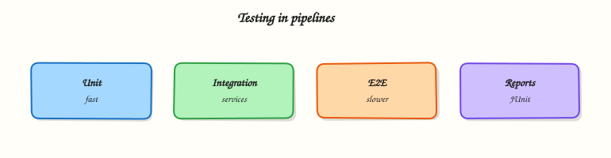

# Testing, Reports, and Quality Gates

## Overview


Design a test pyramid in GitLab CI with parallel jobs, JUnit and coverage reports in merge requests, and quality gates that fail the pipeline when thresholds are missed.

Tests are the cheapest production incident you never ship. GitLab CI runs **unit**, **integration**, **end-to-end (e2e)**, and optional **performance** jobs; publishes **JUnit** and coverage artefacts into the merge request (MR); and enforces **quality gates** so red tests block merge.

This is a core tutorial in **Module 13 · Testing** of the REBASH Academy **GitLab CI/CD for Cloud & DevOps Engineers** series — written for Cloud, DevOps, Platform, and SRE engineers.

## Prerequisites


- [Security Scanning and DevSecOps](security-scanning-and-devsecops.md)
- Comfortable with stages, `needs`, and artefacts from earlier modules

## Learning Objectives


By the end of this tutorial, you will be able to:

- [ ] Map unit / integration / e2e / performance to CI stages or `needs`  
- [ ] Parallelise suites with `parallel` or `parallel:matrix`  
- [ ] Publish JUnit reports and coverage for MR widgets  
- [ ] Fail the pipeline on failed tests or coverage thresholds

## Architecture


This topic’s control points and relationships are shown below.



## Theory


### What it is

**Testing in GitLab CI** means every change runs automated checks before it reaches a deployable environment. Jobs execute your test runners (pytest, Jest, Go `testing`, and so on), collect machine-readable reports, and attach them with `artifacts:reports`. A **quality gate** is any rule that turns a soft signal into a hard failure — non-zero exit codes, coverage below a floor, or required jobs that must succeed before merge.

| Layer | Typical scope | CI cost |
|-------|---------------|---------|
| Unit | Functions / packages, mocked I/O | Fast, run always |
| Integration | Service + DB / API contracts | Medium |
| E2E | Browser or full path | Slow, selective |
| Performance | Latency / throughput smoke | Scheduled or nightly |

### Why it matters

Cloud services fail in integration, not in unit isolation. Pipelines that only “build the image” ship regressions at promotion time. MR-visible JUnit and coverage make review concrete: reviewers see which cases failed and whether coverage slipped. Quality gates protect trunk — flaky or missing tests become a platform problem, not a Friday surprise in production.

### How it works

Recommended shape:

1. **Fail fast** — lint and unit tests before expensive builds.
2. **Parallelise** — split unit/integration with `parallel: 4` or a matrix of OS/runtime variants.
3. **Report** — write JUnit XML; set `artifacts:reports:junit` (and `coverage_report` / `coverage` regex as needed).
4. **Gate** — job exit code non-zero on failure; optional script that compares coverage to `$COVERAGE_MIN`.
5. **Select e2e** — run full e2e on `main` / nightly; smoke e2e on MRs with `rules`.

Use `needs` so unit jobs start as soon as their build artefact exists, without waiting for unrelated stages. Keep report paths stable so the MR widget always finds them.

### Key concepts and comparisons

| Mechanism | Purpose |
|-----------|---------|
| Job exit code | Primary gate (failed tests → failed job) |
| `artifacts:reports:junit` | MR test summary UI |
| Coverage regex / report | Coverage widget and trends |
| `allow_failure: true` | Soft signal only — use sparingly |
| Required pipeline success | Project setting / protected branch |

Unit tests prove logic; integration proves wiring; e2e proves the user path. Performance belongs after functional green, usually on a schedule.

### Common pitfalls

- Publishing JUnit but using `allow_failure: true` on the test job — the report appears while the pipeline stays green.
- One monolithic e2e job on every commit — burns minutes and creates flaky noise.
- Coverage gates without excluding generated code — false negatives block good changes.
- Forgetting `when: always` on report artefacts — failed suites never upload XML for debugging.

## Hands-on Lab


### Objective

Author a valid `.gitlab-ci.yml` that models **Testing, Reports, and Quality Gates** and validate it locally before pushing.

### Prerequisites

- Python 3 with PyYAML (`pip install pyyaml`)
- Optional: GitLab project to run the pipeline

### Lab environment

Workspace: `~/rebash-gitlab/module-13`

File-first lab. Push to GitLab only when you want a runner to execute jobs.

```bash
mkdir -p ~/rebash-gitlab/module-13 && cd ~/rebash-gitlab/module-13
```

### Real-world scenario

Your squad is encoding **Testing, Reports, and Quality Gates** as CI. Reviewers reject YAML that does not parse or that skips artefacts/needs incorrectly.

### Step-by-step tasks

#### Task 1 – Write pipeline YAML

Stages and jobs must be explicit so MR pipelines are predictable.

```bash
mkdir -p src && echo 'print("ok")' > src/app.py
cat > .gitlab-ci.yml << 'EOF'
stages: [lint, test]
lint:
  stage: lint
  image: python:3.12-alpine
  script:
    - python -m py_compile src/app.py
test:
  stage: test
  image: python:3.12-alpine
  needs: [lint]
  script:
    - python src/app.py
EOF
python3 -c "import yaml; d=yaml.safe_load(open('.gitlab-ci.yml')); assert d['stages']==['lint','test']; print('OK', list(d))"
```

**Expected output:** Prints `OK` and job names; no YAML exception.

#### Task 2 – Simulate the scripts locally

Prove the job script works before burning runner minutes.

```bash
python3 -m py_compile src/app.py
python3 src/app.py | tee out.txt
test "$(cat out.txt)" = 'ok'
```

**Expected output:** Compile succeeds; out.txt is `ok`.

### Validation steps

- [ ] `.gitlab-ci.yml` parses
- [ ] Local script path matches job intent

### Common errors and fixes

| Error | Cause | Fix |
|-------|-------|-----|
| yaml.scanner.ScannerError | Indentation | Use 2-space indent; re-validate with PyYAML |
| job stuck pending | No runner / tags | Check runner tags match job tags |
| needs not found | Typo in job name | Align `needs` with actual job keys |

### Challenge exercise

Add an `artifacts:` path from lint to test and document expire_in.

### Learning outcomes

- Produced reviewable GitLab CI YAML
- Validated structure and scripts locally

### Cleanup

```bash
# File-only lab — keep YAML for the next tutorial
```

## Validation


- [ ] Lab commands run under `~/rebash-gitlab/module-13/`
- [ ] You can explain each Theory section in your own words
- [ ] You used modern tooling where it applies to this topic
- [ ] You can describe one production failure mode for this topic

## Code Walkthrough


Production practice for **Testing, Reports, and Quality Gates** always combines:

1. Inspect before you change (status, plan, logs, dry-run)
2. Prefer reversible, documented changes (Git, IaC, drop-ins, version pins)
3. Capture evidence (command output, pipeline logs) for handovers
4. Prefer current tools and APIs over legacy shortcuts
5. Least privilege — escalate credentials only when required

Keep runbooks short enough to follow under pressure. Automate checks; keep humans for judgement.

## Security Considerations


- Treat credentials and tokens for gitlab as privileged — never commit them
- Prefer short-lived auth (OIDC, roles, SSO) over long-lived keys
- Validate blast radius before apply/deploy/delete operations
- Restrict who can approve production changes
- Collect audit logs; limit who can read sensitive traces

## Common Mistakes


!!! warning "Publishing JUnit but using `allow_failure: true` on the test job — the report appears whil"
    Validate assumptions against the Theory section and official docs before changing production.

!!! warning "One monolithic e2e job on every commit — burns minutes and creates flaky noise."
    Lab shortcuts (open security groups, admin roles, skip approvals) must not ship unchanged.

!!! warning "Changing production without a rollback path"
    Always know how to revert (previous artefact, prior release, state rollback, DNS failback).

## Best Practices


- Encode Testing, Reports, and Quality Gates changes as code and review them in pull requests
- Pin versions (images, modules, actions, provider plugins)
- Separate environments with clear promotion gates
- Alert on symptoms with runbooks attached
- Destroy lab resources; tag everything with owner and expiry where possible

## Troubleshooting


| Symptom | Likely cause | Fix |
|---------|--------------|-----|
| Auth / permission denied | Wrong identity, policy, or scope | Check caller identity, roles, and least-privilege policies |
| Timeout / no route | Network, DNS, security group, or endpoint | Trace path, DNS, and allow-lists before retrying |
| Drift / unexpected plan | Manual change or wrong state/workspace | Reconcile desired vs actual; avoid click-ops on managed resources |
| Pipeline/job red | Flaky step, cache, or missing secret | Read failing step logs; bisect recent workflow/config changes |
| Cost spike | Idle load balancer, NAT, oversized compute | Inventory billable resources; stop/delete labs promptly |

## Summary


**Testing, Reports, and Quality Gates** is essential for Cloud and DevOps engineers working with gitlab. Practise the lab until the inspection and change path is muscle memory, then continue the track.

## Interview Questions


1. How do JUnit report artifacts improve merge request feedback?
2. A quality gate flakes intermittently — what evidence do you gather?
3. Where should coverage thresholds live: CI job or shared policy?
4. Why keep allow_failure rare on security/unit gates?
5. How do you prevent skipped tests from counting as green?

!!! tip "Sample answer — question 2"
    Open the JUnit report and job log together: distinguish assertion failures from environment errors. Quarantine flakes with an owner rather than silently allow_failure.

!!! tip "Sample answer — question 4"
    Gates that protect production should fail closed. Ensure forks cannot skip required jobs while consuming protected variables.

## Related Tutorials


- [Course overview](index.md)
- [Release Management and Versioning](release-management-and-versioning.md)

## References


- [Unit test reports](https://docs.gitlab.com/ee/ci/testing/unit_test_reports.html)  
- [Code coverage](https://docs.gitlab.com/ee/ci/testing/code_coverage.html)  
- [Parallel jobs](https://docs.gitlab.com/ee/ci/yaml/#parallel)
