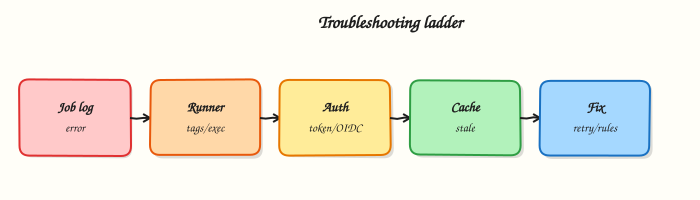

# Troubleshooting GitLab CI

## Overview

Diagnose failed jobs, runner problems, auth errors, cache misses, and slow pipelines with a fixed order: lint → config → runner → credentials → cache → performance.

Most “CI is broken” tickets are YAML `rules`, missing tags, expired tokens, or poisoned caches — not mysterious GitLab bugs. Separate **definition** failures from **execution** failures before changing production variables.

This is a core tutorial in **Module 17 · Troubleshooting** of the REBASH Academy **GitLab CI/CD for Cloud & DevOps Engineers** series — written for Cloud, DevOps, Platform, and SRE engineers.

## Prerequisites

- [Pipeline Monitoring and Observability](pipeline-monitoring-and-observability.md)
- Runner and variables modules completed (or equivalent)

## Learning Objectives

By the end of this tutorial, you will be able to:

- [ ] Classify config vs runner vs auth vs cache failures  
- [ ] Use lint, job logs, and `CI_*` context systematically  
- [ ] Recover from stuck/pending jobs and executor errors  
- [ ] Apply a performance triage for slow pipelines

## Architecture

This topic’s control points and relationships are shown below.



## Theory

### What it is

**Troubleshooting GitLab CI** is locating which layer failed: YAML/workflow, runner availability, executor runtime, secrets/OIDC, artefacts/cache, or external systems (registry, cloud APIs). A failed job log is necessary but not sufficient — pending jobs never produce a script log.

| Symptom | First checks |
|---------|----------------|
| Pipeline not created | `workflow:rules`, `.gitlab-ci.yml` syntax, CI enabled |
| Job pending forever | Runner online, tags, protected branches, concurrency |
| Script exit ≠ 0 | Last error in log, image, deps |
| 401 / forbidden | Token, OIDC, protected var, registry login |
| Flaky / slow | Cache keys, image pulls, serial stages |

### Why it matters

Mean time to recovery for delivery depends on CI as much as production apps. Platform on-call needs a playbook juniors can follow under pressure. The same checks belong in shift-left tooling: `glab ci lint` and local runners catch definition errors before they burn SaaS minutes.

### How it works

Use this order every time:

1. **Lint / parse** — `glab ci lint` or YAML load; confirm the job exists for this ref (`rules`).
2. **Scope** — Is the job pending or failed? Pending → runners/tags/protection. Failed → log.
3. **Log** — Read from the bottom; note image, `before_script`, and the failing command.
4. **Auth** — Masked variables present on protected branches? OIDC audience/role correct? `CI_JOB_TOKEN` permissions for cross-project?
5. **Cache / artefacts** — Wrong `cache:key` → cold builds; missing `dependencies`/`needs` → missing files.
6. **Runner** — `gitlab-runner status`, executor errors, disk full, Docker privilege, Kubernetes pod events.
7. **Performance** — largest jobs by duration; parallelise; slim images; avoid unnecessary `needs` chains.

Reproduce with a minimal job when possible. Prefer fixing root cause over `retry: 2` as a product strategy.

### Key concepts and comparisons

| Failure class | Looks like | Not fixed by |
|---------------|------------|--------------|
| Definition | Job absent / wrong `rules` | Restarting runners |
| Capacity | Pending, “no runners” | Editing script only |
| Runtime | Red job, script error | Adding more runners alone |
| Auth | 401/403 mid-job | Clearing cache |
| Cache | Intermittent missing modules | Random `retry` |

### Common pitfalls

- Blaming GitLab.com when the job never matched a runner tag.
- Clearing all caches as step one — hides the bad key design.
- Putting secrets in logs “just to debug” on shared runners.
- Using `allow_failure: true` to silence a broken gate permanently.

## Hands-on Lab

Create a workspace for this tutorial.

```bash
mkdir -p ~/rebash-gitlab/module-17 && cd ~/rebash-gitlab/module-17
```

**Focus:** hands-on practice for Troubleshooting GitLab CI

### Step 1 – Core exercise

```bash
mkdir -p ~/rebash-gitlab/module-17 && cd ~/rebash-gitlab/module-17
cat > .gitlab-ci.yml << 'EOF'
stages:
  - debug

# Intentional mismatch demo: tag "gpu" with no such runner in most labs
broken_tag_example:
  stage: debug
  tags: ["gpu"]
  script:
    - echo "This stays pending without a gpu runner"
  rules:
    - when: never   # disabled by default — set when: always to demo pending

auth_checklist:
  stage: debug
  image: alpine:3.20
  script:
    - echo "Check CI_JOB_TOKEN, registry login, protected variables"
    - echo "Protected branch? Variables protected? Runner privileged?"

cache_key_demo:
  stage: debug
  image: alpine:3.20
  cache:
    key: "$CI_COMMIT_REF_SLUG-demo"
    paths:
      - .cache/
  script:
    - mkdir -p .cache
    - echo "ok" > .cache/marker
    - test -f .cache/marker
EOF

cat > playbook.md << 'EOF'
1. Lint / YAML parse — does the job exist for this ref?
2. Pending vs failed — tags, runners, protection
3. Read job log from the bottom
4. Auth — tokens, OIDC, protected vars, registry
5. Cache/artefacts — keys, needs, dependencies
6. Runner host — disk, executor, privileges
7. Performance — slowest jobs, pulls, serial stages
EOF

python3 - << 'PY'
import yaml
yaml.safe_load(open(".gitlab-ci.yml"))
print("YAML parse OK")
print("Playbook:", open("playbook.md").read().count("\n"), "lines")
PY
```

### Final step – Cleanup note

```bash
# Keep ~/rebash-gitlab/ for later tutorials; destroy disposable cloud resources from this lab
```

## Validation

- [ ] Lab commands run under `~/rebash-gitlab/module-17/`
- [ ] You can explain each Theory section in your own words
- [ ] You used modern tooling where it applies to this topic
- [ ] You can describe one production failure mode for this topic

## Code Walkthrough

Production practice for **Troubleshooting GitLab CI** always combines:

1. Inspect before you change (status, plan, logs, dry-run)
2. Prefer reversible, documented changes (Git, IaC, drop-ins, version pins)
3. Capture evidence (command output, pipeline logs) for handovers
4. Prefer current tools and APIs over legacy shortcuts
5. Least privilege — escalate credentials only when required

Keep runbooks short enough to follow under pressure. Automate checks; keep humans for judgement.

## Security Considerations

- Treat credentials and tokens for gitlab as privileged — never commit them
- Prefer short-lived auth (OIDC, roles, SSO) over long-lived keys
- Validate blast radius before apply/deploy/delete operations
- Restrict who can approve production changes
- Collect audit logs; limit who can read sensitive traces

## Common Mistakes

!!! warning "Blaming GitLab.com when the job never matched a runner tag."
    Validate assumptions against the Theory section and official docs before changing production.

!!! warning "Clearing all caches as step one — hides the bad key design."
    Lab shortcuts (open security groups, admin roles, skip approvals) must not ship unchanged.

!!! warning "Changing production without a rollback path"
    Always know how to revert (previous artefact, prior release, state rollback, DNS failback).

## Best Practices

- Encode Troubleshooting GitLab CI changes as code and review them in pull requests
- Pin versions (images, modules, actions, provider plugins)
- Separate environments with clear promotion gates
- Alert on symptoms with runbooks attached
- Destroy lab resources; tag everything with owner and expiry where possible

## Troubleshooting

| Symptom | Likely cause | Fix |
|---------|--------------|-----|
| Auth / permission denied | Wrong identity, policy, or scope | Check caller identity, roles, and least-privilege policies |
| Timeout / no route | Network, DNS, security group, or endpoint | Trace path, DNS, and allow-lists before retrying |
| Drift / unexpected plan | Manual change or wrong state/workspace | Reconcile desired vs actual; avoid click-ops on managed resources |
| Pipeline/job red | Flaky step, cache, or missing secret | Read failing step logs; bisect recent workflow/config changes |
| Cost spike | Idle load balancer, NAT, oversized compute | Inventory billable resources; stop/delete labs promptly |

## Summary

**Troubleshooting GitLab CI** is essential for Cloud and DevOps engineers working with gitlab. Practise the lab until the inspection and change path is muscle memory, then continue the track.

## Interview Questions

1. How does **Troubleshooting GitLab CI** show up when operating Cloud or production platforms?
2. What would you check first if this area misbehaves in production?
3. Which modern tools or APIs replace older equivalents here?
4. What security control should accompany this capability?
5. How would you automate verification of this topic in CI?

!!! tip "Sample answer — question 2"
    Start with blast radius and recent changes, gather evidence (logs, status, plan/diff), then fix forward with a known rollback path — not guesswork.

## Related Tutorials

- [Course overview](index.md)
- - [Enterprise GitLab](enterprise-gitlab.md)

## References

- [Debugging CI/CD jobs](https://docs.gitlab.com/ee/ci/debugging.html)  
- [Job log](https://docs.gitlab.com/ee/ci/jobs/job_logs.html)  
- [Runner troubleshooting](https://docs.gitlab.com/runner/faq/)
