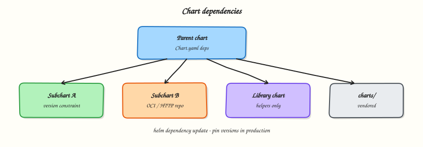

# Helm Chart Dependencies

## Overview

Declare a dependency in `Chart.yaml`, run `helm dependency update`, and explain library charts vs application subcharts.

Parent charts compose subcharts (databases, shared libraries). Pin versions. Prefer OCI or controlled repos in enterprise networks.

This is a core tutorial in **Module 6 · Chart Dependencies** of the REBASH Academy **Helm for Kubernetes Engineers** series — written for Cloud, DevOps, Platform, and SRE engineers.

## Prerequisites

- [Helm Values and Overrides](helm-values-and-overrides.md)

## Learning Objectives

By the end of this tutorial, you will be able to:

- [ ] Add a `dependencies` entry  
- [ ] Run `helm dependency update`  
- [ ] Contrast library charts  
- [ ] Pin version constraints

## Architecture

This topic’s control points and relationships are shown below.



## Theory

### What it is

A **chart dependency** lets a parent chart compose other charts — for example an application chart that also installs a Redis subchart, or a platform chart that pulls shared **library charts** (helpers only, `type: library`). You declare dependencies in `Chart.yaml`, run `helm dependency update`, and Helm downloads packages into `charts/` while recording exact versions in `Chart.lock`.

| Kind | Purpose |
|------|---------|
| Application subchart | Ships real Kubernetes resources |
| Library chart | Shared templates/helpers; no workload objects |
| OCI / HTTP dependency | Where the subchart package is fetched from |

### Why it matters

Composition beats copy-paste. Teams reuse vetted database or messaging charts instead of re-authoring StatefulSets. Lock files and pinned constraints make builds reproducible — critical for supply-chain review and incident rollback. Without dependency discipline you get “works today” charts that break when a floating tag moves.

### How it works

1. Add a `dependencies` entry in `Chart.yaml` with `name`, `version` constraint, and `repository` (HTTPS or `oci://…`).
2. Run `helm dependency update ./mychart` (or `helm dep up`).
3. Helm writes archives under `charts/` and updates `Chart.lock`.
4. On install, Helm renders the parent and enabled subcharts together; values for a subchart are nested under the subchart’s name (or alias) in the parent values file.
5. Conditions/`tags` in the dependency stanza can enable or disable subcharts from values.

Prefer committing `Chart.lock` (and often the vendored `charts/*.tgz` in regulated environments) so CI does not need live internet access to resolve versions.

### Key concepts and comparisons

| Approach | Pros | Cons |
|----------|------|------|
| Subchart dependency | Reuse, version pins | Values nesting complexity |
| Separate releases | Clear ownership, independent upgrade | More GitOps apps to manage |
| Library chart | DRY helpers across app charts | Requires packaging discipline |

**Alias** renames the values key. **`global`** values are a convention for keys shared across parent and subcharts — use sparingly and document them.

### Common pitfalls

- Editing unpacked files under `charts/` instead of bumping the dependency and re-running update.
- Using floating version ranges without a lock file in CI.
- Enabling a heavy subchart in every environment by default (databases in local CI clusters).
- Assuming library charts install workloads — they must not.

## Hands-on Lab

Create a workspace for this tutorial.

```bash
mkdir -p ~/rebash-helm/module-06 && cd ~/rebash-helm/module-06
```

**Focus:** hands-on practice for Helm Chart Dependencies

### Step 1 – Core exercise

```bash
mkdir -p ~/rebash-helm/module-06 && cd ~/rebash-helm/module-06
helm create rebash-parent
# Example dependency (optional network):
# Edit Chart.yaml dependencies to include a pinned chart, then:
# helm dependency update ./rebash-parent
# ls rebash-parent/charts
cat >> rebash-parent/NOTES.txt << 'EOF'
Lab note: pin subchart versions; commit Chart.lock when using deps.
EOF
helm lint ./rebash-parent
```

Document your dependency policy in `deps-policy.md` (who owns versions, update cadence).

### Final step – Cleanup note

```bash
# Keep ~/rebash-helm/ for later tutorials; destroy disposable cloud resources from this lab
```

## Validation

- [ ] Lab commands run under `~/rebash-helm/module-06/`
- [ ] You can explain each Theory section in your own words
- [ ] You used modern tooling where it applies to this topic
- [ ] You can describe one production failure mode for this topic

## Code Walkthrough

Production practice for **Helm Chart Dependencies** always combines:

1. Inspect before you change (status, plan, logs, dry-run)
2. Prefer reversible, documented changes (Git, IaC, drop-ins, version pins)
3. Capture evidence (command output, pipeline logs) for handovers
4. Prefer current tools and APIs over legacy shortcuts
5. Least privilege — escalate credentials only when required

Keep runbooks short enough to follow under pressure. Automate checks; keep humans for judgement.

## Security Considerations

- Treat credentials and tokens for helm as privileged — never commit them
- Prefer short-lived auth (OIDC, roles, SSO) over long-lived keys
- Validate blast radius before apply/deploy/delete operations
- Restrict who can approve production changes
- Collect audit logs; limit who can read sensitive traces

## Common Mistakes

!!! warning "Editing unpacked files under `charts/` instead of bumping the dependency and re-running up"
    Validate assumptions against the Theory section and official docs before changing production.

!!! warning "Using floating version ranges without a lock file in CI."
    Lab shortcuts (open security groups, admin roles, skip approvals) must not ship unchanged.

!!! warning "Changing production without a rollback path"
    Always know how to revert (previous artefact, prior release, state rollback, DNS failback).

## Best Practices

- Encode Helm Chart Dependencies changes as code and review them in pull requests
- Pin versions (images, modules, actions, provider plugins)
- Separate environments with clear promotion gates
- Alert on symptoms with runbooks attached
- Destroy lab resources; tag everything with owner and expiry where possible

## Troubleshooting

| Symptom | Likely cause | Fix |
|---------|--------------|-----|
| Auth / permission denied | Wrong identity, policy, or scope | Check caller identity, roles, and least-privilege policies |
| Timeout / no route | Network, DNS, security group, or endpoint | Trace path, DNS, and allow-lists before retrying |
| Drift / unexpected plan | Manual change or wrong state/workspace | Reconcile desired vs actual; avoid click-ops on managed resources |
| Pipeline/job red | Flaky step, cache, or missing secret | Read failing step logs; bisect recent workflow/config changes |
| Cost spike | Idle load balancer, NAT, oversized compute | Inventory billable resources; stop/delete labs promptly |

## Summary

**Helm Chart Dependencies** is essential for Cloud and DevOps engineers working with helm. Practise the lab until the inspection and change path is muscle memory, then continue the track.

## Interview Questions

1. How does **Helm Chart Dependencies** show up when operating Cloud or production platforms?
2. What would you check first if this area misbehaves in production?
3. Which modern tools or APIs replace older equivalents here?
4. What security control should accompany this capability?
5. How would you automate verification of this topic in CI?

!!! tip "Sample answer — question 2"
    Start with blast radius and recent changes, gather evidence (logs, status, plan/diff), then fix forward with a known rollback path — not guesswork.

## Related Tutorials

- [Course overview](index.md)
- - [Helm Releases and Lifecycle](helm-releases-and-lifecycle.md)

## References

- [Chart dependencies](https://helm.sh/docs/helm/helm_dependency/)
