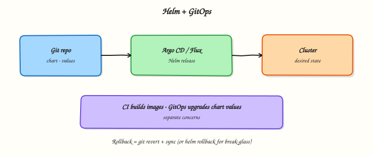

# Helm GitOps Integration

## Overview

Design a GitOps layout where Argo CD or Flux renders a Helm chart from Git (or OCI) with per-environment values — CI builds images, GitOps upgrades values.

GitOps controllers can install Helm charts as first-class releases. Keep chart source and env values in Git; avoid `helm upgrade` from laptops for production.

This is a core tutorial in **Module 10 · GitOps Integration** of the REBASH Academy **Helm for Kubernetes Engineers** series — written for Cloud, DevOps, Platform, and SRE engineers.

## Prerequisites

- [Helm Security](helm-security.md)
- [GitOps fundamentals](../git/gitops-fundamentals.md)

## Learning Objectives

By the end of this tutorial, you will be able to:

- [ ] Separate image CI from Helm GitOps  
- [ ] Sketch Argo CD Application (Helm) fields  
- [ ] Lay out multi-env values  
- [ ] Explain progressive delivery options

## Architecture

This topic’s control points and relationships are shown below.



## Theory

### What it is

**GitOps with Helm** means a controller in the cluster (commonly **Argo CD** or **Flux**) reconciles desired state from Git (or OCI) by rendering and applying Helm charts. Humans merge pull requests; the controller performs the equivalent of `helm upgrade`. Per-environment values files (or Application/HelmRelease parameters) select replicas, image tags, and ingress hosts without forking the chart.

| Piece | Role |
|-------|------|
| Chart source | Path in Git or OCI chart artefact |
| Env values | `values-dev.yaml` / `values-prod.yaml` (or overlays) |
| Controller | Argo CD Application / Flux HelmRelease |
| Image CI | Builds/pushes images; updates tag/digest in Git |

### Why it matters

Laptop `helm upgrade` does not scale for production auditability. GitOps makes desired state reviewable, reversible, and continuous. Separating **image CI** (build/test/push) from **deploy GitOps** (merge values bump → controller upgrades) is the standard platform pattern: pipelines produce artefacts; Git records what should run where.

### How it works

1. Chart lives in a repo (or is published to OCI).
2. Environment values live beside it or in an env repo.
3. An Application / HelmRelease points at chart + value files + destination cluster/namespace.
4. CI builds an image and opens a PR that changes `image.tag` or digest in the right values file.
5. On merge, the controller detects drift from desired state and upgrades the Helm release.
6. Rollback is a Git revert (and/or controller rollback) rather than an untracked CLI action.

Progressive delivery (Argo Rollouts, Flagger) can sit in front of Services while Helm still owns the base chart resources — canaries are complementary, not a replacement for chart packaging.

### Key concepts and comparisons

| Pattern | When to use |
|---------|-------------|
| Mono-repo chart + `envs/` | Small platforms, single team |
| Chart OCI + env Git repo | Strong separation of package vs config |
| App-of-apps / root HelmRelease | Many services, fleet management |

Prefer controller-managed upgrades for production; reserve direct Helm CLI for break-glass and local labs.

### Common pitfalls

- Embedding environment URLs inside the chart templates instead of values.
- Letting CI call `helm upgrade` *and* GitOps manage the same release — dual controllers fight.
- Putting secrets in Git “because GitOps needs them” — use sealed/SOPS/external secrets patterns.
- Path mistakes in Argo CD `valueFiles` (relative paths are easy to get wrong).

## Hands-on Lab

Create a workspace for this tutorial.

```bash
mkdir -p ~/rebash-helm/module-10/{charts/rebash-app,envs/dev,envs/prod} && cd ~/rebash-helm/module-10/{charts/rebash-app,envs/dev,envs/prod}
```

**Focus:** hands-on practice for Helm GitOps Integration

### Step 1 – Skeleton

```bash
cat > lab.sh << 'EOF'
#!/usr/bin/env bash
set -euo pipefail
echo "lab: Helm GitOps Integration"
EOF
chmod +x lab.sh
./lab.sh
```

### Step 2 – Core exercise

```bash
mkdir -p ~/rebash-helm/module-10/{charts/rebash-app,envs/dev,envs/prod}
cd ~/rebash-helm/module-10
helm create charts/rebash-app
cat > envs/dev/values.yaml << 'EOF'
replicaCount: 1
image:
  tag: "dev"
EOF
cat > envs/prod/values.yaml << 'EOF'
replicaCount: 3
image:
  tag: "1.0.0"
EOF
cat > envs/dev/application-example.yaml << 'EOF'
# Illustrative Argo CD Application (Helm)
apiVersion: argoproj.io/v1alpha1
kind: Application
metadata:
  name: rebash-app-dev
spec:
  source:
    repoURL: https://git.example.com/platform/helm-gitops.git
    path: charts/rebash-app
    helm:
      valueFiles:
        - ../../envs/dev/values.yaml
  destination:
    server: https://kubernetes.default.svc
    namespace: rebash-dev
EOF
helm template gitops ./charts/rebash-app -f envs/dev/values.yaml | head -n 20
```

### Final step – Cleanup note

```bash
# Keep ~/rebash-helm/ for later labs; destroy cloud resources you created
./lab.sh || true
```

## Validation

- [ ] Lab commands run under `~/rebash-helm/module-10/{charts/rebash-app,envs/dev,envs/prod}/`
- [ ] You can explain each Theory section in your own words
- [ ] You used modern tooling where it applies to this topic
- [ ] You can describe one production failure mode for this topic

## Code Walkthrough

Production practice for **Helm GitOps Integration** always combines:

1. Inspect before you change (status, plan, logs, dry-run)
2. Prefer reversible, documented changes (Git, IaC, drop-ins, version pins)
3. Capture evidence (command output, pipeline logs) for handovers
4. Prefer current tools and APIs over legacy shortcuts
5. Least privilege — escalate credentials only when required

Keep runbooks short enough to follow under pressure. Automate checks; keep humans for judgement.

## Security Considerations

- Treat credentials and tokens for helm as privileged — never commit them
- Prefer short-lived auth (OIDC, roles, SSO) over long-lived keys
- Validate blast radius before apply/deploy/delete operations
- Restrict who can approve production changes
- Collect audit logs; limit who can read sensitive traces

## Common Mistakes

!!! warning "Embedding environment URLs inside the chart templates instead of values."
    Validate assumptions against the Theory section and official docs before changing production.

!!! warning "Letting CI call `helm upgrade` *and* GitOps manage the same release — dual controllers fig"
    Lab shortcuts (open security groups, admin roles, skip approvals) must not ship unchanged.

!!! warning "Changing production without a rollback path"
    Always know how to revert (previous artefact, prior release, state rollback, DNS failback).

## Best Practices

- Encode Helm GitOps Integration changes as code and review them in pull requests
- Pin versions (images, modules, actions, provider plugins)
- Separate environments with clear promotion gates
- Alert on symptoms with runbooks attached
- Destroy lab resources; tag everything with owner and expiry where possible

## Troubleshooting

| Symptom | Likely cause | Fix |
|---------|--------------|-----|
| Auth / permission denied | Wrong identity, policy, or scope | Check caller identity, roles, and least-privilege policies |
| Timeout / no route | Network, DNS, security group, or endpoint | Trace path, DNS, and allow-lists before retrying |
| Drift / unexpected plan | Manual change or wrong state/workspace | Reconcile desired vs actual; avoid click-ops on managed resources |
| Pipeline/job red | Flaky step, cache, or missing secret | Read failing step logs; bisect recent workflow/config changes |
| Cost spike | Idle load balancer, NAT, oversized compute | Inventory billable resources; stop/delete labs promptly |

## Summary

**Helm GitOps Integration** is essential for Cloud and DevOps engineers working with helm. Practise the lab until the inspection and change path is muscle memory, then continue the track.

## Interview Questions

1. How does **Helm GitOps Integration** show up when operating Cloud or production platforms?
2. What would you check first if this area misbehaves in production?
3. Which modern tools or APIs replace older equivalents here?
4. What security control should accompany this capability?
5. How would you automate verification of this topic in CI?

!!! tip "Sample answer — question 2"
    Start with blast radius and recent changes, gather evidence (logs, status, plan/diff), then fix forward with a known rollback path — not guesswork.

## Related Tutorials

- [Course overview](index.md)
- - [Production Helm Practices](production-helm-practices.md)

## References

- [Argo CD Helm](https://argo-cd.readthedocs.io/en/stable/user-guide/helm/) · [Flux HelmRelease](https://fluxcd.io/flux/components/helm/helmreleases/)
