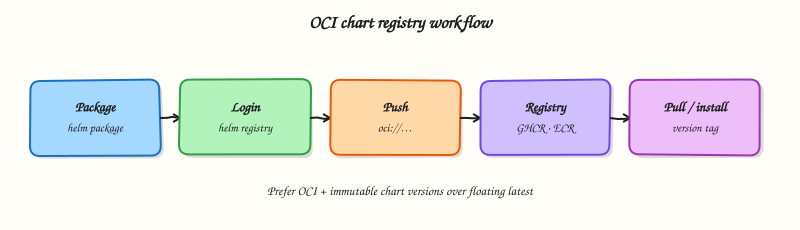

# Helm Security

## Overview


Apply a Helm security baseline: no secrets in charts, least-privilege deploy identity, pinned images/charts, and OCI provenance where available.

Charts often tempt teams to bake passwords into `values.yaml`. Prefer external secret stores. Restrict who can create releases. Prefer signed/verified OCI charts in regulated environments.

This is a core tutorial in **Module 9 · Security** of the REBASH Academy **Helm for Kubernetes Engineers** series — written for Cloud, DevOps, Platform, and SRE engineers.


## Prerequisites


- [Testing and Validation](helm-testing-and-validation.md)


## Learning Objectives


By the end of this tutorial, you will be able to:

- [ ] List secret anti-patterns  
- [ ] Outline RBAC for Helm users / CI  
- [ ] Pin image digests or immutable tags in values  
- [ ] Describe OCI + provenance / signing options


## Architecture


This topic’s control points and relationships are shown below.




## Theory


### What it is

**Helm security** covers how charts and releases affect cluster risk: secret handling in values, who is allowed to install releases (**RBAC**), which charts and images you trust, and whether packages are pulled from approved **OCI** or HTTP sources with verification. Helm itself is a powerful client — equivalent to applying arbitrary YAML — so the identity that runs Helm is part of your threat model.

| Concern | Secure default |
|---------|----------------|
| Secrets | Externalise; never commit plaintext |
| Identity | Least-privilege ServiceAccount / CI kubeconfig |
| Charts | Pin versions; approved repos/OCI only |
| Images | Immutable tags or digests in prod values |
| Provenance | Signed charts / cosign where required |

### Why it matters

Charts are a supply-chain vector: a compromised dependency or a chart that embeds credentials can open namespaces you thought were locked down. DevSecOps reviews treat Helm the same as container images — provenance, pinning, and least privilege. Regulated environments increasingly expect OCI artefacts with signatures, not ad-hoc tarball downloads from the public internet.

### How it works

1. **Secrets:** keep `values.yaml` free of passwords; inject via sealed secrets, SOPS, external-secrets, or CI-masked `--set` only when necessary. Prefer mounting Secrets created outside the chart.
2. **RBAC:** grant CI/GitOps identities create/update/delete only on the namespaces and API groups they manage — including permissions for Helm’s release Secrets/ConfigMaps.
3. **Pinning:** lock chart versions (`Chart.lock`) and pin container images (`tag` or digest) in production values.
4. **Sources:** pull from internal mirrors or verified OCI registries; disable unchecked `helm repo add` on production runners.
5. **Signing / provenance:** where policy requires it, verify chart signatures or OCI attestations before upgrade.

Security is layered: a signed chart that still embeds a default admin password is not “secure”.

### Key concepts and comparisons

| Anti-pattern | Better pattern |
|--------------|----------------|
| Password in committed values | External secret store + reference |
| Cluster-admin CI token | Namespace-scoped deploy role |
| `:latest` in prod values | Digest or immutable tag |
| Random Bitnami bump unpinned | Approved version + changelog review |

### Common pitfalls

- Believing `helm package` encrypts secrets — it does not.
- Storing kubeconfigs with broad rights in CI variables “temporarily”.
- Trusting chart provenance while ignoring the image the chart deploys.
- Disabling admission controls so a chart “just installs” — fix the chart or request an exception with review.


## Hands-on Lab


Create a workspace for this tutorial.

```bash
mkdir -p ~/rebash-helm/module-09 && cd ~/rebash-helm/module-09
```

**Focus:** Review rendered RBAC/service account settings before install

### Step 1 – Render and audit privileged-looking defaults

```bash
kubectl create namespace rebash-helm
helm create secure-demo
helm template demo ./secure-demo -n rebash-helm   --set serviceAccount.create=true   --set podSecurityContext.runAsNonRoot=true   --set podSecurityContext.runAsUser=1000 | tee rendered.yaml | head -n 60
grep -nE 'ServiceAccount|runAsNonRoot|allowPrivilegeEscalation|ClusterRole' rendered.yaml || true
```

### Step 2 – Install hardened values and verify objects

```bash
cat > secure-values.yaml <<'EOF'
serviceAccount:
  create: true
podSecurityContext:
  runAsNonRoot: true
  runAsUser: 1000
EOF
helm upgrade --install demo ./secure-demo -n rebash-helm -f secure-values.yaml
kubectl -n rebash-helm get sa,deploy
kubectl -n rebash-helm get deploy -o jsonpath='{.items[0].spec.template.spec.securityContext}{"
"}'
```

### Final step – Cleanup note

```bash
helm uninstall demo -n rebash-helm --ignore-not-found || true
kubectl delete namespace rebash-helm --ignore-not-found
# Workspace kept for notes; remove with: rm -rf "$(pwd)" when finished
```


## Validation


- [ ] Lab commands run under `~/rebash-helm/module-09/`
- [ ] You can explain each Theory section in your own words
- [ ] You used modern tooling where it applies to this topic
- [ ] You can describe one production failure mode for this topic


## Code Walkthrough


Production practice for **Helm Security** always combines:

1. Inspect before you change (status, plan, logs, dry-run)
2. Prefer reversible, documented changes (Git, IaC, drop-ins, version pins)
3. Capture evidence (command output, pipeline logs) for handovers
4. Prefer current tools and APIs over legacy shortcuts
5. Least privilege — escalate credentials only when required

Keep runbooks short enough to follow under pressure. Automate checks; keep humans for judgement.


## Security Considerations


- Treat credentials and tokens for helm as privileged — never commit them
- Prefer short-lived auth (OIDC, roles, SSO) over long-lived keys
- Validate blast radius before apply/deploy/delete operations
- Restrict who can approve production changes
- Collect audit logs; limit who can read sensitive traces


## Common Mistakes


!!! warning "Believing `helm package` encrypts secrets — it does not."
    Validate assumptions against the Theory section and official docs before changing production.

!!! warning "Storing kubeconfigs with broad rights in CI variables “temporarily”."
    Lab shortcuts (open security groups, admin roles, skip approvals) must not ship unchanged.

!!! warning "Changing production without a rollback path"
    Always know how to revert (previous artefact, prior release, state rollback, DNS failback).


## Best Practices


- Encode Helm Security changes as code and review them in pull requests
- Pin versions (images, modules, actions, provider plugins)
- Separate environments with clear promotion gates
- Alert on symptoms with runbooks attached
- Destroy lab resources; tag everything with owner and expiry where possible


## Troubleshooting


| Symptom | Likely cause | Fix |
|---------|--------------|-----|
| Auth / permission denied | Wrong identity, policy, or scope | Check caller identity, roles, and least-privilege policies |
| Timeout / no route | Network, DNS, security group, or endpoint | Trace path, DNS, and allow-lists before retrying |
| Drift / unexpected plan | Manual change or wrong state/workspace | Reconcile desired vs actual; avoid click-ops on managed resources |
| Pipeline/job red | Flaky step, cache, or missing secret | Read failing step logs; bisect recent workflow/config changes |
| Cost spike | Idle load balancer, NAT, oversized compute | Inventory billable resources; stop/delete labs promptly |


## Summary


**Helm Security** is essential for Cloud and DevOps engineers working with helm. Practise the lab until the inspection and change path is muscle memory, then continue the track.


## Interview Questions


1. What chart features should you audit before install?
2. How do ServiceAccounts and RBAC in charts expand cluster rights?
3. Why pin image digests or immutable tags in production values?
4. What is chart provenance, and when does it help?
5. How should secrets be supplied to Helm releases?

!!! tip "Sample answer — question 2"
    Charts may create ClusterRoles, privileged pods, or hostPath mounts. Rendering and reviewing these objects prevents accidental cluster-admin paths.

!!! tip "Sample answer — question 4"
    Mutable tags like latest can change under you. Pin versions/digests so rollbacks and audits know exactly what ran, reducing supply-chain surprise.


## Related Tutorials


- [Course overview](index.md)
- [Helm GitOps Integration](helm-gitops-integration.md)


## References


- [Helm security](https://helm.sh/docs/topics/security/) · [OCI registries](https://helm.sh/docs/topics/registries/)
