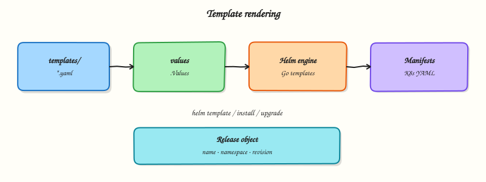

# Helm Templates and Go Templating

## Overview


Author templates that use values, `if`/`range`, and named helpers — then render with `helm template` to verify output.

Helm uses the **Go template** language plus Sprig-like functions. Keep logic thin; push complexity into values schema and helpers.

This is a core tutorial in **Module 4 · Templates** of the REBASH Academy **Helm for Kubernetes Engineers** series — written for Cloud, DevOps, Platform, and SRE engineers.

## Prerequisites


- [Working with Helm Charts](working-with-helm-charts.md)

## Learning Objectives


By the end of this tutorial, you will be able to:

- [ ] Use `.Values`, `.Release`, `.Chart`  
- [ ] Apply pipelines and common functions  
- [ ] Write `if` / `range`  
- [ ] Define and `include` named templates

## Architecture


This topic’s control points and relationships are shown below.



## Theory


### What it is

Helm templates are **Go templates** plus a rich function library (Sprig-style helpers such as `default`, `quote`, `toYaml`, and `nindent`). Files under `templates/` mix YAML structure with actions delimited by double braces. At render time Helm evaluates those actions against a **root context** (often written as a lone dot) that exposes objects such as `.Values`, `.Release`, and `.Chart`.

Core objects you will use constantly:

| Object | Typical fields | Role |
|--------|----------------|------|
| `.Values` | Your config tree | User-facing knobs |
| `.Release` | `Name`, `Namespace`, `Service` | Instance identity |
| `.Chart` | `Name`, `Version`, `AppVersion` | Package metadata |
| `.Files` | chart file helpers | Embed non-template files |
| `.Capabilities` | API versions | Gate resources by cluster APIs |

### Why it matters

Templates are where parameterisation becomes real manifests. Weak templates produce silent misconfigurations (wrong labels, missing quotes, nil pointer panics) that only appear at deploy time. Strong templates stay thin: prefer clear values schemas and named helpers over deep nested logic. Reviewers should be able to predict output from values alone.

### How it works

Helm walks template files, executes actions, and emits YAML documents separated by `---`. Pipelines pass values through functions left to right. Conditionals (`if` / `else`) and loops (`range`) control optional blocks and repeated items. Named templates in `_helpers.tpl` are defined with `define` and reused with `include` — the usual place for standard labels and fully qualified names.


Example shape (not a full chart):

```yaml
metadata:
  name: {{ include "mychart.fullname" . }}
  labels:
    {{- include "mychart.labels" . | nindent 4 }}
data:
  APP_ENV: {{ .Values.appEnv | quote }}
```


Always render locally with `helm template` (and lint) before installing. Whitespace-control dashes on template delimiters matter — stray newlines can break YAML indentation.

### Key concepts and comparisons

- **Pipelines** compose functions: `default`, `required`, `toYaml`, `nindent`, `quote`.
- **`include` vs `template`:** `include` returns a string you can pipeline (preferred for helpers); `template` writes directly.
- **Logic budget:** if you need complex branching for every environment, push more into values files or split charts — do not build a programming language inside YAML.

### Common pitfalls

- Forgetting to `quote` values that become labels or annotation strings.
- Dereferencing a missing key (`nil pointer evaluating interface…`) — use `default` or `dig`-style patterns carefully.
- Incorrect `nindent` levels after `toYaml`, producing invalid YAML.
- Putting executable business logic in templates that belongs in the application or in values schema validation.

## Hands-on Lab

### Objective

Author templates that use `if`, `range`, and `include`/`define` helpers, drive optional Ingress and extra environment variables from values, and prove conditionals with `helm template`.

### Prerequisites

- Helm 3.x (`helm version`)
- kubectl optional for install step
- Writable workspace at `~/rebash-helm/module-04`

### Lab environment

Workspace: `~/rebash-helm/module-04` on your workstation.

```bash
mkdir -p ~/rebash-helm/module-04/rebash-tpl/templates && cd ~/rebash-helm/module-04
```

### Real-world scenario

Your chart must expose optional Ingress for production while staying minimal in dev, and inject a list of extra environment variables from values. Reviewers require rendered proof that toggling values adds or removes entire YAML documents.

### Step-by-step tasks

#### Task 1 – Values schema with toggles and lists

Create `rebash-tpl/Chart.yaml`:

```yaml
apiVersion: v2
name: rebash-tpl
description: Template features lab chart
type: application
version: 0.1.0
appVersion: "1.27"
```

Create `rebash-tpl/values.yaml`:

```yaml
replicaCount: 1
image:
  repository: nginxinc/nginx-unprivileged
  tag: "1.27-alpine"
service:
  port: 8080
ingress:
  enabled: false
  host: tpl.example.com
extraEnv:
  - name: LOG_LEVEL
    value: info
  - name: FEATURE_X
    value: "off"
```

#### Task 2 – Helpers, Deployment with range, optional Ingress

Create `rebash-tpl/templates/_helpers.tpl`:


```
{{- define "rebash-tpl.name" -}}
{{- default .Chart.Name .Values.nameOverride | trunc 63 | trimSuffix "-" }}
{{- end }}

{{- define "rebash-tpl.fullname" -}}
{{- printf "%s-%s" .Release.Name .Chart.Name | trunc 63 | trimSuffix "-" }}
{{- end }}

{{- define "rebash-tpl.env" -}}
{{- range .Values.extraEnv }}
- name: {{ .name }}
  value: {{ .value | quote }}
{{- end }}
{{- end }}
```


Create `rebash-tpl/templates/deployment.yaml`:


```yaml
apiVersion: apps/v1
kind: Deployment
metadata:
  name: {{ include "rebash-tpl.fullname" . }}
spec:
  replicas: {{ .Values.replicaCount }}
  selector:
    matchLabels:
      app: {{ include "rebash-tpl.name" . }}
  template:
    metadata:
      labels:
        app: {{ include "rebash-tpl.name" . }}
    spec:
      containers:
        - name: web
          image: "{{ .Values.image.repository }}:{{ .Values.image.tag }}"
          ports:
            - containerPort: {{ .Values.service.port }}
          env:
            {{- include "rebash-tpl.env" . | nindent 12 }}
```


Create `rebash-tpl/templates/service.yaml`:


```yaml
apiVersion: v1
kind: Service
metadata:
  name: {{ include "rebash-tpl.fullname" . }}
spec:
  ports:
    - port: {{ .Values.service.port }}
      targetPort: {{ .Values.service.port }}
  selector:
    app: {{ include "rebash-tpl.name" . }}
```


Create `rebash-tpl/templates/ingress.yaml`:


```yaml
{{- if .Values.ingress.enabled }}
apiVersion: networking.k8s.io/v1
kind: Ingress
metadata:
  name: {{ include "rebash-tpl.fullname" . }}
spec:
  rules:
    - host: {{ .Values.ingress.host | quote }}
      http:
        paths:
          - path: /
            pathType: Prefix
            backend:
              service:
                name: {{ include "rebash-tpl.fullname" . }}
                port:
                  number: {{ .Values.service.port }}
{{- end }}
```


#### Task 3 – Prove conditionals with template output

Create `values-ingress.yaml`:

```yaml
ingress:
  enabled: true
  host: tpl.lab.example.com
extraEnv:
  - name: LOG_LEVEL
    value: debug
  - name: FEATURE_X
    value: "on"
```

```bash
cd ~/rebash-helm/module-04
helm lint rebash-tpl | tee lint-m04.txt
helm template tpl-off rebash-tpl --namespace rebash-helm-m04 | tee render-off-m04.yaml
helm template tpl-on rebash-tpl -f values-ingress.yaml --namespace rebash-helm-m04 | tee render-on-m04.yaml
grep -c 'kind: Ingress' render-off-m04.yaml | tee ingress-off-count-m04.txt
grep -c 'kind: Ingress' render-on-m04.yaml | tee ingress-on-count-m04.txt
grep 'value: debug' render-on-m04.yaml | tee env-debug-m04.txt
test "$(cat ingress-off-count-m04.txt)" -eq 0
test "$(cat ingress-on-count-m04.txt)" -eq 1
```

**Expected output:** Ingress absent when disabled (`ingress-off-count-m04.txt` is `0`); Ingress present when enabled (`ingress-on-count-m04.txt` is `1`); `env-debug-m04.txt` shows `LOG_LEVEL` overridden to `debug`.

#### Task 4 – Optional cluster install (ingress disabled)

Create `namespace.yaml`:

```yaml
apiVersion: v1
kind: Namespace
metadata:
  name: rebash-helm-m04
```

```bash
cd ~/rebash-helm/module-04
if command -v helm >/dev/null && kubectl cluster-info >/dev/null 2>&1; then
  kubectl apply -f namespace.yaml
  helm upgrade --install tpl-off rebash-tpl -n rebash-helm-m04 --wait --timeout 120s | tee install-m04.txt
  kubectl get deploy,svc -n rebash-helm-m04 | tee objects-m04.txt
else
  echo "Skipping install — cluster unavailable" | tee install-m04.txt
fi
```

**Expected output:** Deployment and Service Ready in `rebash-helm-m04`; no Ingress object when defaults apply.

### Validation steps

- [ ] `include`/`define` helpers render env vars from a list
- [ ] Ingress omitted when `ingress.enabled: false`
- [ ] Ingress rendered when override file enables it
- [ ] `helm lint` passes without errors
- [ ] Optional install succeeds in `rebash-helm-m04`

### Common errors and fixes

| Error | Cause | Fix |
|-------|-------|-----|
| `nil pointer evaluating` | Missing values key | Add defaults in `values.yaml` or use `default` in template |
| Ingress always present | Condition inverted | Ensure an ingress-enabled conditional wraps the entire Ingress template file |
| Broken YAML indentation after `range` | Missing `nindent` on include | Use `include "rebash-tpl.env" . \| nindent 12` |
| MkDocs build error | Unescaped template delimiters | Wrap template fences in raw Jinja blocks in tutorials |

### Challenge exercise

Add a `required` helper call so rendering fails when `ingress.enabled` is true but `ingress.host` is empty; prove failure with `helm template` exit code non-zero.

### Learning outcomes

- Used `if` to gate optional Kubernetes resources
- Used `range` to iterate values lists into manifest fields
- Reused env rendering via `define` and `include`
- Verified conditional output offline before cluster apply

### Cleanup

```bash
helm uninstall tpl-off -n rebash-helm-m04 2>/dev/null || true
kubectl delete namespace rebash-helm-m04 --ignore-not-found
```

## Validation


- [ ] Lab commands run under `~/rebash-helm/module-04/`
- [ ] You can explain each Theory section in your own words
- [ ] You used modern tooling where it applies to this topic
- [ ] You can describe one production failure mode for this topic

## Code Walkthrough


Production practice for **Helm Templates and Go Templating** always combines:

1. Inspect before you change (status, plan, logs, dry-run)
2. Prefer reversible, documented changes (Git, IaC, drop-ins, version pins)
3. Capture evidence (command output, pipeline logs) for handovers
4. Prefer current tools and APIs over legacy shortcuts
5. Least privilege — escalate credentials only when required

Keep runbooks short enough to follow under pressure. Automate checks; keep humans for judgement.

## Security Considerations


- Treat credentials and tokens for helm as privileged — never commit them
- Prefer short-lived auth (OIDC, roles, SSO) over long-lived keys
- Validate blast radius before apply/deploy/delete operations
- Restrict who can approve production changes
- Collect audit logs; limit who can read sensitive traces

## Common Mistakes


!!! warning "Forgetting to `quote` values that become labels or annotation strings."
    Validate assumptions against the Theory section and official docs before changing production.

!!! warning "Dereferencing a missing key (`nil pointer evaluating interface…`) — use `default` or `dig`"
    Lab shortcuts (open security groups, admin roles, skip approvals) must not ship unchanged.

!!! warning "Changing production without a rollback path"
    Always know how to revert (previous artefact, prior release, state rollback, DNS failback).

## Best Practices


- Encode Helm Templates and Go Templating changes as code and review them in pull requests
- Pin versions (images, modules, actions, provider plugins)
- Separate environments with clear promotion gates
- Alert on symptoms with runbooks attached
- Destroy lab resources; tag everything with owner and expiry where possible

## Troubleshooting


| Symptom | Likely cause | Fix |
|---------|--------------|-----|
| Auth / permission denied | Wrong identity, policy, or scope | Check caller identity, roles, and least-privilege policies |
| Timeout / no route | Network, DNS, security group, or endpoint | Trace path, DNS, and allow-lists before retrying |
| Drift / unexpected plan | Manual change or wrong state/workspace | Reconcile desired vs actual; avoid click-ops on managed resources |
| Pipeline/job red | Flaky step, cache, or missing secret | Read failing step logs; bisect recent workflow/config changes |
| Cost spike | Idle load balancer, NAT, oversized compute | Inventory billable resources; stop/delete labs promptly |

## Summary


**Helm Templates and Go Templating** is essential for Cloud and DevOps engineers working with helm. Practise the lab until the inspection and change path is muscle memory, then continue the track.

## Interview Questions


1. What engine does Helm use for templates?
2. Why use `include` with helpers instead of duplicating labels?
3. How do `required` and `default` functions improve chart safety?
4. What dangers exist with `| safe` / unescaped HTML-like injection into manifests?
5. How do you debug a failing template render?

!!! tip "Sample answer — question 2"
    Helpers keep names and labels consistent across templates, which Services and selectors rely on. Duplication invites subtle mismatches that break traffic.

!!! tip "Sample answer — question 4"
    Careless sprig usage or piping untrusted values into YAML can break structure or inject unexpected fields. Validate inputs, quote carefully, and render in CI before apply.

## Related Tutorials


- [Course overview](index.md)
- [Helm Values and Overrides](helm-values-and-overrides.md)

## References


- [Chart template guide](https://helm.sh/docs/chart_template_guide/)
