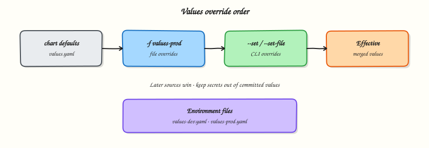

# Helm Values and Overrides

## Overview


Merge chart defaults with environment files and CLI overrides, and keep secrets out of Git-committed values.

Later sources win. Production teams keep `values.yaml` safe defaults, then `values-<env>.yaml` per environment, and inject secrets at deploy time (sealed secrets, SOPS, external secrets — not plaintext in Git).

This is a core tutorial in **Module 5 · Values** of the REBASH Academy **Helm for Kubernetes Engineers** series — written for Cloud, DevOps, Platform, and SRE engineers.


## Prerequisites


- [Helm Templates](helm-templates-and-go-templating.md)


## Learning Objectives


By the end of this tutorial, you will be able to:

- [ ] Explain override precedence  
- [ ] Use `-f` and `--set`  
- [ ] Structure env-specific files  
- [ ] Avoid committing secrets


## Architecture


This topic’s control points and relationships are shown below.




## Theory


### What it is

**Values** are the configuration interface of a chart. Defaults live in the chart’s `values.yaml`. At install or upgrade time you override those defaults with extra YAML files (`-f` / `--values`) and fine-grained CLI flags (`--set`, `--set-string`, `--set-file`). The result is one merged tree that templates read as `.Values`.

Think of values as the “API” of your package: stable keys, documented defaults, and environment-specific overlays that do not fork the templates.

### Why it matters

Most production incidents blamed on “Helm” are actually values mistakes — wrong image tag, replica count, or ingress host for an environment. Clear override practice lets the same chart ship to many clusters safely. It also keeps secrets out of Git: defaults stay non-secret, and sensitive material is injected by CI, sealed-secrets, SOPS, or external-secrets operators at deploy time.

### How it works

Helm merges sources in a defined order. Later sources win on conflicting keys (deep merge for maps; exact behaviour for lists is “replace”, not element-wise merge — design list values carefully).

Typical precedence (simplified):

1. Chart `values.yaml` defaults  
2. Parent chart values for subcharts (when composing)  
3. `-f values-a.yaml -f values-b.yaml` (left to right; later file wins)  
4. `--set` / `--set-string` / `--set-file` (highest common CLI priority)

Mental model for teams: **safe defaults in the chart → env files in Git → secrets from a secret manager at deploy**. Use `helm template … -f … --set …` to inspect the effective render before you apply.

### Key concepts and comparisons

| Mechanism | Best for | Caution |
|-----------|----------|---------|
| Chart `values.yaml` | Safe, documented defaults | No production secrets |
| `values-<env>.yaml` | Replicas, hosts, non-secret env diffs | Keep files small and reviewed |
| `--set` | CI one-offs, image digests | Harder to audit than files |
| External secrets | Passwords, tokens, certs | Do not commit plaintext |

`--set` parses types loosely; prefer `--set-string` when you need a literal string (for example versions that look like numbers).

### Common pitfalls

- Believing list values deep-merge — they usually replace entirely.
- Committing database passwords “just for the demo chart” that later become production defaults.
- Overusing `--set` in tribal wiki commands instead of checked-in env files.
- Forgetting that subcharts read values under their chart name key unless aliases/`global` are designed intentionally.


## Hands-on Lab


Create a workspace for this tutorial.

```bash
mkdir -p ~/rebash-helm/module-05 && cd ~/rebash-helm/module-05
```

**Focus:** Override chart values via flags and values files

### Step 1 – Create a chart and environment values file

```bash
kubectl create namespace rebash-helm
helm create values-demo
cat > lab-values.yaml <<'EOF'
replicaCount: 2
service:
  type: ClusterIP
EOF
helm template demo ./values-demo -n rebash-helm -f lab-values.yaml | grep -A2 'replicas:'
```

### Step 2 – Install with layered overrides

```bash
helm upgrade --install demo ./values-demo -n rebash-helm -f lab-values.yaml --set image.tag=1.27-alpine
helm -n rebash-helm get values demo
kubectl -n rebash-helm get deploy demo-values-demo -o jsonpath='{.spec.replicas}{"
"}' 2>/dev/null || kubectl -n rebash-helm get deploy -o wide
```

### Final step – Cleanup note

```bash
helm uninstall demo -n rebash-helm --ignore-not-found || true
kubectl delete namespace rebash-helm --ignore-not-found
# Workspace kept for notes; remove with: rm -rf "$(pwd)" when finished
```


## Validation


- [ ] Lab commands run under `~/rebash-helm/module-05/`
- [ ] You can explain each Theory section in your own words
- [ ] You used modern tooling where it applies to this topic
- [ ] You can describe one production failure mode for this topic


## Code Walkthrough


Production practice for **Helm Values and Overrides** always combines:

1. Inspect before you change (status, plan, logs, dry-run)
2. Prefer reversible, documented changes (Git, IaC, drop-ins, version pins)
3. Capture evidence (command output, pipeline logs) for handovers
4. Prefer current tools and APIs over legacy shortcuts
5. Least privilege — escalate credentials only when required

Keep runbooks short enough to follow under pressure. Automate checks; keep humans for judgement.


## Security Considerations


- Treat credentials and tokens for helm as privileged — never commit them
- Prefer short-lived auth (OIDC, roles, SSO) over long-lived keys
- Validate blast radius before apply/deploy/delete operations
- Restrict who can approve production changes
- Collect audit logs; limit who can read sensitive traces


## Common Mistakes


!!! warning "Believing list values deep-merge — they usually replace entirely."
    Validate assumptions against the Theory section and official docs before changing production.

!!! warning "Committing database passwords “just for the demo chart” that later become production defau"
    Lab shortcuts (open security groups, admin roles, skip approvals) must not ship unchanged.

!!! warning "Changing production without a rollback path"
    Always know how to revert (previous artefact, prior release, state rollback, DNS failback).


## Best Practices


- Encode Helm Values and Overrides changes as code and review them in pull requests
- Pin versions (images, modules, actions, provider plugins)
- Separate environments with clear promotion gates
- Alert on symptoms with runbooks attached
- Destroy lab resources; tag everything with owner and expiry where possible


## Troubleshooting


| Symptom | Likely cause | Fix |
|---------|--------------|-----|
| Auth / permission denied | Wrong identity, policy, or scope | Check caller identity, roles, and least-privilege policies |
| Timeout / no route | Network, DNS, security group, or endpoint | Trace path, DNS, and allow-lists before retrying |
| Drift / unexpected plan | Manual change or wrong state/workspace | Reconcile desired vs actual; avoid click-ops on managed resources |
| Pipeline/job red | Flaky step, cache, or missing secret | Read failing step logs; bisect recent workflow/config changes |
| Cost spike | Idle load balancer, NAT, oversized compute | Inventory billable resources; stop/delete labs promptly |


## Summary


**Helm Values and Overrides** is essential for Cloud and DevOps engineers working with helm. Practise the lab until the inspection and change path is muscle memory, then continue the track.


## Interview Questions


1. In what order do default values, values files, and --set flags combine?
2. When should you prefer values files over long --set chains?
3. How do you see the values a release is currently using?
4. What security issue appears when secrets are placed in values files?
5. How do you manage values across staging and production?

!!! tip "Sample answer — question 2"
    Later sources override earlier ones: chart defaults, then -f files in order, then --set. Knowing precedence prevents surprise configuration.

!!! tip "Sample answer — question 4"
    Values files in Git often leak credentials. Keep secrets in sealed/external secret systems and reference them; treat values repos as sensitive if they contain any secrets.


## Related Tutorials


- [Course overview](index.md)
- [Helm Chart Dependencies](helm-chart-dependencies.md)


## References


- [Values files](https://helm.sh/docs/chart_template_guide/values_files/)
