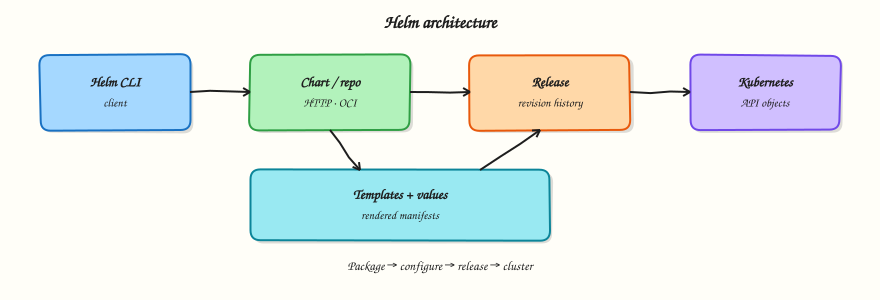

# Helm — Learning Roadmap

Follow the course in order:

1. **Course overview** — scope, prerequisites, outcomes  
2. **Modules 1–12** — tutorials in sequence  
3. **Labs / quizzes / projects** — practice  
4. **Capstone** — production Helm platform  
5. **Interview & certifications** — CKAD / CKA chart skills  




## Modules

| # | Focus | Tutorials |
|---|-------|-----------|
| 1 | Fundamentals | [Introduction](introduction-to-helm.md) · [Architecture](helm-architecture-and-components.md) |
| 2 | Installing Helm | [Install & repos](installing-helm-and-repositories.md) |
| 3 | Charts | [Working with charts](working-with-helm-charts.md) |
| 4 | Templates | [Go templating](helm-templates-and-go-templating.md) |
| 5 | Values | [Values & overrides](helm-values-and-overrides.md) |
| 6 | Dependencies | [Chart dependencies](helm-chart-dependencies.md) |
| 7 | Releases | [Release lifecycle](helm-releases-and-lifecycle.md) |
| 8 | Testing | [Testing & validation](helm-testing-and-validation.md) |
| 9 | Security | [Helm security](helm-security.md) |
| 10 | GitOps | [GitOps integration](helm-gitops-integration.md) |
| 11 | Production | [Production practices](production-helm-practices.md) |
| 12 | Troubleshooting | [Troubleshooting](troubleshooting-helm.md) |

## Diagrams

```bash
python3 scripts/generate-excalidraw-svg.py
```
