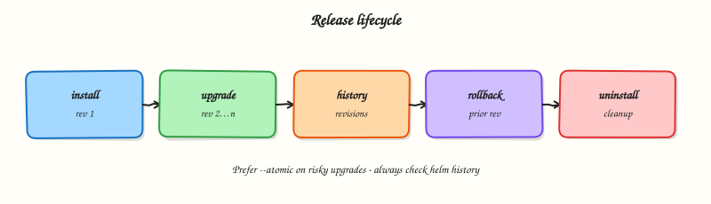

# Troubleshooting Helm

## Overview


Diagnose common Helm failures with a fixed order: lint → template → dry-run → release status → Kubernetes events.

Most “Helm is broken” tickets are template nil pointers, values typos, or cluster admission errors. Separate **render** failures from **apply** failures.

This is a core tutorial in **Module 12 · Troubleshooting** of the REBASH Academy **Helm for Kubernetes Engineers** series — written for Cloud, DevOps, Platform, and SRE engineers.

## Prerequisites


- [Production Helm Practices](production-helm-practices.md)

## Learning Objectives


By the end of this tutorial, you will be able to:

- [ ] Fix template nil / type errors  
- [ ] Read `helm status` / `helm history`  
- [ ] Recover failed upgrades (`--atomic`, rollback)  
- [ ] Debug dependency / repo fetch issues

## Architecture


This topic’s control points and relationships are shown below.



## Theory


### What it is

**Troubleshooting Helm** is a disciplined split between **render failures** (templates/values/dependencies) and **apply failures** (Kubernetes API, RBAC, admission, runtime health). Most tickets that say “Helm is broken” are nil pointer template errors, mistyped values keys, repo auth problems, or cluster Events after a successful render. Your job is to locate which layer failed before changing random flags.

| Symptom | First checks |
|---------|----------------|
| Template error | `helm lint`, `helm template --debug`, nil `.Values` path |
| Install pending/failed | `helm status`, `kubectl get events`, hooks |
| Upgrade stuck | `--wait` timeout, image pull, PDB, probes |
| Rollback fails | `helm history`, resource ownership, empty revisions |
| Dep download fail | repo/OCI URL, credentials, version constraint |

### Why it matters

Mean time to recovery depends on not confusing a bad chart with a bad cluster. Platform on-call needs a fixed order that junior engineers can follow under pressure. The same playbook feeds CI: catch render errors before GitOps ever sees them, and keep `--atomic` upgrades so failed releases do not leave half-applied state without a path back.

### How it works

Use this order every time:

1. **Lint** — `helm lint ./chart`.
2. **Render** — `helm template NAME ./chart -f values-<env>.yaml` (add `--debug` on failure).
3. **Authz** — `kubectl auth can-i` for the deploy identity on required verbs/resources.
4. **Converge carefully** — `helm upgrade --install --atomic --wait` in non-prod first.
5. **Inspect cluster** — `helm status`, `kubectl describe`, Events on failing objects.
6. **History** — `helm history`; rollback to a known good revision if apply succeeded but behaviour is wrong.
7. **Dependencies** — `helm dependency build` / check repo login if fetch fails.

Separate questions: Did YAML render? Did the API accept it? Did Pods become Ready?

### Key concepts and comparisons

| Failure class | Looks like | Not fixed by |
|---------------|------------|--------------|
| Render | CLI error before resources change | Restarting nodes |
| Apply / admission | API reject, webhook errors | Editing unrelated values |
| Runtime | Release deployed, Pods crash | Another `helm template` alone |
| Fetch | Cannot download chart/deps | Rollback of a different release |

### Common pitfalls

- Jumping to `helm rollback` when the chart never rendered — there may be nothing valid to roll back to.
- Ignoring `--previous` container logs and Events while blaming Helm.
- Fixing production with `kubectl edit` on Helm-owned objects (drift returns on next reconcile).
- Assuming `--force` or deleting release Secrets is a routine fix — both are last resorts with data-loss risk.

## Hands-on Lab


### Objective

Diagnose a broken template, fix the render error, trigger a failed upgrade with a bad image, then recover with `helm history` and `helm rollback` evidence.

### Prerequisites

- Helm 3 CLI and kubectl configured for a lab cluster
- Completion of [Helm Releases and Lifecycle](helm-releases-and-lifecycle.md) lab

### Lab environment

Workspace: `~/rebash-helm/module-12`

Helm 3 against kind/minikube; release namespace `rebash-helm-m12`.

```bash title="Terminal"
mkdir -p ~/rebash-helm/module-12/triage-chart/templates && cd ~/rebash-helm/module-12
```

### Real-world scenario

On-call receives “Helm upgrade failed.” You must decide whether the failure is render-time (bad template) or runtime (bad image). The playbook: lint → template → fix → install → failed upgrade → history → rollback.

### Step-by-step tasks

#### Task 1 – Create a chart with an intentional template bug

Create `triage-chart/Chart.yaml`:

```yaml title="Chart.yaml"
apiVersion: v2
name: triage-chart
description: Lab chart for Helm troubleshooting
type: application
version: 0.1.0
appVersion: "1.27.4"
```

Create `triage-chart/values.yaml`:

```yaml title="values.yaml"
replicaCount: 1
image:
  repository: nginx
  tag: "1.27.4-alpine"
```

Create `triage-chart/templates/deployment.yaml` with a deliberate nil-pointer bug:

```yaml

apiVersion: apps/v1
kind: Deployment
metadata:
  name: {{ .Release.Name }}-web
spec:
  replicas: {{ .Values.replicaCount }}
  selector:
    matchLabels:
      app: {{ .Release.Name }}
  template:
    metadata:
      labels:
        app: {{ .Release.Name }}
    spec:
      containers:
        - name: web
          image: "{{ .Values.image.repository }}:{{ .Values.image.tag }}"
          env:
            - name: FEATURE_FLAG
              value: {{ .Values.feature.enabled | quote }}
          ports:
            - containerPort: 80

```

Capture the render failure (`.Values.feature` is undefined):

```bash title="Terminal"
cd ~/rebash-helm/module-12
helm lint ./triage-chart 2>&1 | tee lint-broken.txt || true
helm template triage-demo ./triage-chart --debug 2>&1 | tee template-broken.txt || true
grep -qi 'nil pointer\|error' template-broken.txt
```

!!! example "Expected output"
    Template fails with a nil pointer or similar error referencing `.Values.feature`.


#### Task 2 – Fix the template and prove clean render

Add defaults to `triage-chart/values.yaml`:

```yaml
replicaCount: 1
image:
  repository: nginx
  tag: "1.27.4-alpine"
feature:
  enabled: false
```

Re-run lint and template:

```bash title="Terminal"
cd ~/rebash-helm/module-12
helm lint ./triage-chart | tee lint-fixed.txt
helm template triage-demo ./triage-chart | grep -E '^kind:' | tee kinds-fixed.txt
grep -q '0 chart(s) failed' lint-fixed.txt
grep -q 'Deployment' kinds-fixed.txt
```

!!! example "Expected output"
    Lint passes; template renders a Deployment without errors.


#### Task 3 – Install, fail an upgrade, then roll back

Install the good release, attempt a bad-image upgrade, inspect history, and roll back.

Create `bad-image-values.yaml`:

```yaml title="bad-image-values.yaml"
replicaCount: 1
image:
  repository: nginx
  tag: "does-not-exist:9.9.9"
feature:
  enabled: false
```

Run the failed-upgrade drill:

```bash title="Terminal"
kubectl create namespace rebash-helm-m12 --dry-run=client -o yaml | kubectl apply -f -
helm upgrade --install triage-demo ./triage-chart \
  -n rebash-helm-m12 --wait --timeout 3m | tee install-good.txt
helm upgrade triage-demo ./triage-chart \
  -n rebash-helm-m12 -f bad-image-values.yaml --wait --timeout 2m 2>&1 | tee upgrade-bad.txt || true
helm status triage-demo -n rebash-helm-m12 | tee status-failed.txt
helm history triage-demo -n rebash-helm-m12 | tee history-failed.txt
kubectl get pods -n rebash-helm-m12 | tee pods-failed.txt
grep -qi 'ImagePull\|ErrImage\|failed' upgrade-bad.txt || grep -qi 'ImagePull' pods-failed.txt
```

Roll back to the last good revision:

```bash title="Terminal"
helm rollback triage-demo 1 -n rebash-helm-m12 --wait --timeout 3m | tee rollback.txt
helm history triage-demo -n rebash-helm-m12 | tee history-after-rollback.txt
helm status triage-demo -n rebash-helm-m12 | tee status-after-rollback.txt
kubectl rollout status deployment/triage-demo-web -n rebash-helm-m12 --timeout=120s | tee rollout-ok.txt
grep -q 'deployed' status-after-rollback.txt
grep -q 'superseded\|deployed' history-after-rollback.txt
```

!!! example "Expected output"
    Bad upgrade fails or leaves release in failed/pending state; rollback restores deployed status and Ready pods.


### Validation steps

- [ ] Broken template fails `helm template --debug` with a clear error
- [ ] Fixed chart passes lint and renders cleanly
- [ ] Bad-image upgrade produces failure evidence in status/history/pod list
- [ ] Rollback returns release to deployed with working pods

### Common errors and fixes

| Error | Cause | Fix |
|-------|-------|-----|
| Nil pointer evaluating interface | Missing nested values key | Add defaults in `values.yaml` or use `default`/`dig` in templates |
| Rollback when nothing rendered | No successful revision exists | Fix template first; install a good revision before rollback drills |
| `ImagePullBackOff` after rollback | Rollback target also bad | Roll back to a revision known good in `helm history` |
| Editing Helm-owned objects with kubectl | Drift on next upgrade | Fix chart/values; upgrade or rollback through Helm |

### Challenge exercise

Repeat the bad-image upgrade using `--atomic --wait` and capture that Helm auto-rolls back without manual `helm rollback`:

```bash title="Terminal"
cd ~/rebash-helm/module-12
helm upgrade triage-demo ./triage-chart \
  -n rebash-helm-m12 -f bad-image-values.yaml --atomic --wait --timeout 2m 2>&1 | tee atomic-fail.txt || true
helm status triage-demo -n rebash-helm-m12 | grep -E 'STATUS|REVISION' | tee status-atomic.txt
helm history triage-demo -n rebash-helm-m12 | tee history-atomic.txt
grep -q 'deployed' status-atomic.txt
```

!!! example "Expected output"
    Atomic upgrade fails; release remains on the last deployed revision without manual rollback.


### Learning outcomes

- Separated template render failures from runtime apply failures
- Used lint and debug template output to locate nil-pointer bugs
- Inspected `helm status` and `helm history` during a failed upgrade
- Recovered a release with rollback and verified pod readiness

### Cleanup

```bash title="Terminal"
helm uninstall triage-demo -n rebash-helm-m12 2>/dev/null || true
kubectl delete namespace rebash-helm-m12 --ignore-not-found
```

## Validation


- [ ] Lab commands run under `~/rebash-helm/module-12/`
- [ ] You fixed a template nil-pointer and re-ran lint/template successfully
- [ ] You captured failed-upgrade and rollback evidence from history/status
- [ ] You can describe one production failure mode for Helm troubleshooting

## Code Walkthrough


Production practice for **Troubleshooting Helm** always combines:

1. Inspect before you change (status, plan, logs, dry-run)
2. Prefer reversible, documented changes (Git, IaC, drop-ins, version pins)
3. Capture evidence (command output, pipeline logs) for handovers
4. Prefer current tools and APIs over legacy shortcuts
5. Least privilege — escalate credentials only when required

Keep runbooks short enough to follow under pressure. Automate checks; keep humans for judgement.

## Security Considerations


- Treat credentials and tokens for helm as privileged — never commit them
- Prefer short-lived auth (OIDC, roles, SSO) over long-lived keys
- Validate blast radius before apply/deploy/delete operations
- Restrict who can approve production changes
- Collect audit logs; limit who can read sensitive traces

## Common Mistakes


!!! warning "Jumping to `helm rollback` when the chart never rendered — there may be nothing valid to r"
    Validate assumptions against the Theory section and official docs before changing production.

!!! warning "Ignoring `--previous` container logs and Events while blaming Helm."
    Lab shortcuts (open security groups, admin roles, skip approvals) must not ship unchanged.

!!! warning "Changing production without a rollback path"
    Always know how to revert (previous artefact, prior release, state rollback, DNS failback).

## Best Practices


- Encode Troubleshooting Helm changes as code and review them in pull requests
- Pin versions (images, modules, actions, provider plugins)
- Separate environments with clear promotion gates
- Alert on symptoms with runbooks attached
- Destroy lab resources; tag everything with owner and expiry where possible

## Troubleshooting


| Symptom | Likely cause | Fix |
|---------|--------------|-----|
| Auth / permission denied | Wrong identity, policy, or scope | Check caller identity, roles, and least-privilege policies |
| Timeout / no route | Network, DNS, security group, or endpoint | Trace path, DNS, and allow-lists before retrying |
| Drift / unexpected plan | Manual change or wrong state/workspace | Reconcile desired vs actual; avoid click-ops on managed resources |
| Pipeline/job red | Flaky step, cache, or missing secret | Read failing step logs; bisect recent workflow/config changes |
| Cost spike | Idle load balancer, NAT, oversized compute | Inventory billable resources; stop/delete labs promptly |

## Summary


You can create, release, secure, GitOps-deploy, and troubleshoot production Helm charts end to end.

## Interview Questions


1. What commands start Helm release triage?
2. How do you distinguish a template failure from a Kubernetes runtime failure?
3. What does a pending-install/pending-upgrade state often indicate?
4. How can resources with `helm.sh/resource-policy: keep` surprise you during uninstall?
5. When should you use `helm rollback` during an incident?

!!! tip "Sample answer — question 2"
    Template failures happen at render time; runtime failures show after objects apply (ImagePullBackOff, CrashLoop). Use `helm status`, history, and kubectl describe/logs together.

!!! tip "Sample answer — question 4"
    Resources marked to keep remain after uninstall and can block reinstalls or leave credentials behind. Know which objects persist and delete them deliberately when appropriate.

## Related Tutorials


- [Course overview](index.md)
- [Course overview](index.md) · [Kubernetes Helm module](../kubernetes/helm-package-management.md) · [Argo CD](../argocd/index.md)

## References


- [Debugging templates](https://helm.sh/docs/chart_template_guide/debugging/)
