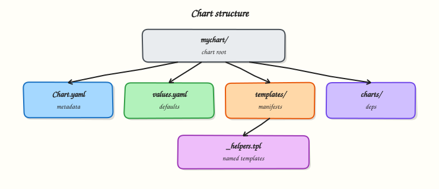

# Working with Helm Charts

## Overview


Scaffold a chart with `helm create`, walk the directory layout, and edit `Chart.yaml` metadata correctly.

A chart is a directory (or packaged `.tgz`) with a fixed layout. Know what belongs in `templates/` vs `values.yaml` vs `charts/`.

This is a core tutorial in **Module 3 · Working with Charts** of the REBASH Academy **Helm for Kubernetes Engineers** series — written for Cloud, DevOps, Platform, and SRE engineers.

## Prerequisites


- [Installing Helm and Repositories](installing-helm-and-repositories.md)

## Learning Objectives


By the end of this tutorial, you will be able to:

- [ ] Run `helm create`  
- [ ] Explain Chart.yaml fields  
- [ ] Locate values, templates, helpers  
- [ ] List files safely with `helm show`

## Architecture


This topic’s control points and relationships are shown below.



## Theory


### What it is

A **Helm chart** is a directory (or packaged `.tgz`) with a conventional layout. At minimum you care about `Chart.yaml` (metadata), `values.yaml` (defaults), and `templates/` (Kubernetes manifests written as Go templates). Optional pieces include `charts/` for vendored subcharts, `templates/_helpers.tpl` for shared named templates, `NOTES.txt` for post-install messages, and `.helmignore` to exclude files from the package.

| Path | Purpose |
|------|---------|
| `Chart.yaml` | name, `version`, `appVersion`, dependencies |
| `values.yaml` | Default configuration consumers override |
| `templates/` | Templated Kubernetes manifests |
| `templates/_helpers.tpl` | Named templates / labels helpers |
| `charts/` | Packaged subcharts after `helm dependency update` |
| `.helmignore` | Files excluded from `helm package` |

### Why it matters

Charts are how teams share a consistent Deployment/Service/Ingress shape. If you cannot read a chart’s layout quickly, you cannot review pull requests, debug a bad release, or decide what belongs in values versus hard-coded template text. Platform engineering lives or dies on clear chart boundaries: application charts for workloads, library charts for shared snippets, and disciplined SemVer for the package itself.

### How it works

`helm create mychart` scaffolds the layout. Authors edit templates and defaults; consumers override values at install time. `helm lint` checks structure and common mistakes. `helm package` builds a versioned archive using `Chart.yaml`’s `version` field. When dependencies are declared, `helm dependency update` downloads them into `charts/` and records pins in `Chart.lock`.

Distinguish two version fields:

- **`version`** — SemVer of the **chart package** (what you bump when templates/values change).
- **`appVersion`** — informational version of the **application** the chart deploys (not used by Helm’s dependency resolver as a SemVer constraint the same way).

### Key concepts and comparisons

Think of a chart like a software package: metadata (`Chart.yaml`), configuration knobs (`values.yaml`), and build inputs (`templates/`). The rendered output is ordinary Kubernetes YAML — charts do not invent a new runtime. Files under `templates/` whose names start with `_` are partials (helpers), not standalone manifests.

### Common pitfalls

- Treating `appVersion` as the image tag — image tags usually live under `values.yaml` (`image.tag`) and may differ from `appVersion`.
- Putting environment-specific hosts and secrets into the chart defaults and committing them.
- Editing files inside `charts/` by hand instead of declaring dependencies and running `helm dependency update`.
- Shipping huge non-template assets because `.helmignore` was never configured.

## Hands-on Lab

### Objective

Build a complete application chart layout — `Chart.yaml`, `values.yaml`, `_helpers.tpl`, Deployment, Service, and `NOTES.txt` — then lint, template, and inventory rendered Kubernetes kinds.

### Prerequisites

- Helm 3.x (`helm version`)
- kubectl optional until optional install
- Writable workspace at `~/rebash-helm/module-03`

### Lab environment

Workspace: `~/rebash-helm/module-03` on your workstation.

``` {.bash .ra-terminal title="Terminal"}
mkdir -p ~/rebash-helm/module-03/rebash-platform/templates && cd ~/rebash-helm/module-03
```

### Real-world scenario

Your platform team publishes a standard web chart for product squads. Reviewers expect the full directory layout — metadata, helpers, workload templates, and post-install notes — before the chart enters an internal registry.

### Step-by-step tasks

#### Task 1 – Chart metadata and defaults

Create `rebash-platform/Chart.yaml`:

```yaml title="Chart.yaml"
apiVersion: v2
name: rebash-platform
description: REBASH platform web chart with full layout
type: application
version: 0.2.0
appVersion: "1.27"
maintainers:
  - name: platform-team
    email: platform@example.com
```

Create `rebash-platform/values.yaml`:

```yaml title="values.yaml"
replicaCount: 1
nameOverride: ""
fullnameOverride: ""
image:
  repository: nginxinc/nginx-unprivileged
  tag: "1.27-alpine"
  pullPolicy: IfNotPresent
service:
  type: ClusterIP
  port: 8080
resources: {}
```

Create `.helmignore`:

```text title=".helmignore"
# VCS and editor noise
.git/
.idea/
*.swp
```

#### Task 2 – Helpers and workload templates

Create `rebash-platform/templates/_helpers.tpl`:


```
{{- define "rebash-platform.name" -}}
{{- default .Chart.Name .Values.nameOverride | trunc 63 | trimSuffix "-" }}
{{- end }}

{{- define "rebash-platform.fullname" -}}
{{- if .Values.fullnameOverride }}
{{- .Values.fullnameOverride | trunc 63 | trimSuffix "-" }}
{{- else }}
{{- printf "%s-%s" .Release.Name .Chart.Name | trunc 63 | trimSuffix "-" }}
{{- end }}
{{- end }}

{{- define "rebash-platform.labels" -}}
app.kubernetes.io/name: {{ include "rebash-platform.name" . }}
app.kubernetes.io/instance: {{ .Release.Name }}
app.kubernetes.io/version: {{ .Chart.AppVersion | quote }}
helm.sh/chart: {{ printf "%s-%s" .Chart.Name .Chart.Version | replace "+" "_" }}
{{- end }}
```


Create `rebash-platform/templates/deployment.yaml`:


```yaml
apiVersion: apps/v1
kind: Deployment
metadata:
  name: {{ include "rebash-platform.fullname" . }}
  labels:
    {{- include "rebash-platform.labels" . | nindent 4 }}
spec:
  replicas: {{ .Values.replicaCount }}
  selector:
    matchLabels:
      app.kubernetes.io/name: {{ include "rebash-platform.name" . }}
      app.kubernetes.io/instance: {{ .Release.Name }}
  template:
    metadata:
      labels:
        {{- include "rebash-platform.labels" . | nindent 8 }}
    spec:
      containers:
        - name: web
          image: "{{ .Values.image.repository }}:{{ .Values.image.tag }}"
          imagePullPolicy: {{ .Values.image.pullPolicy }}
          ports:
            - containerPort: {{ .Values.service.port }}
          resources:
            {{- toYaml .Values.resources | nindent 12 }}
```


Create `rebash-platform/templates/service.yaml`:


```yaml
apiVersion: v1
kind: Service
metadata:
  name: {{ include "rebash-platform.fullname" . }}
  labels:
    {{- include "rebash-platform.labels" . | nindent 4 }}
spec:
  type: {{ .Values.service.type }}
  ports:
    - port: {{ .Values.service.port }}
      targetPort: {{ .Values.service.port }}
      protocol: TCP
      name: http
  selector:
    app.kubernetes.io/name: {{ include "rebash-platform.name" . }}
    app.kubernetes.io/instance: {{ .Release.Name }}
```


Create `rebash-platform/templates/NOTES.txt`:


```
REBASH platform chart installed.

Release: {{ .Release.Name }}
Namespace: {{ .Release.Namespace }}
Service: {{ include "rebash-platform.fullname" . }}:{{ .Values.service.port }}

Check pods:
  kubectl get pods -n {{ .Release.Namespace }} -l app.kubernetes.io/instance={{ .Release.Name }}
```


#### Task 3 – Lint, template, and kind inventory

``` {.bash .ra-terminal title="Terminal"}
cd ~/rebash-helm/module-03
helm lint rebash-platform | tee lint-m03.txt
helm template platform-demo rebash-platform --namespace rebash-helm-m03 | tee render-m03.yaml
grep -E '^kind:' render-m03.yaml | sort | uniq -c | tee kinds-m03.txt
grep -q 'kind: Deployment' render-m03.yaml
grep -q 'kind: Service' render-m03.yaml
helm show chart rebash-platform | tee show-chart-m03.txt
helm show values rebash-platform | tee show-values-m03.txt
```

!!! example "Expected output"
    `lint-m03.txt` reports 0 failures; `kinds-m03.txt` shows exactly one Deployment and one Service.


#### Task 4 – Optional install and NOTES proof

Create `namespace.yaml`:

```yaml title="namespace.yaml"
apiVersion: v1
kind: Namespace
metadata:
  name: rebash-helm-m03
```

``` {.bash .ra-terminal title="Terminal"}
cd ~/rebash-helm/module-03
if command -v helm >/dev/null && kubectl cluster-info >/dev/null 2>&1; then
  kubectl apply -f namespace.yaml
  helm upgrade --install platform-demo rebash-platform -n rebash-helm-m03 --wait --timeout 120s | tee install-m03.txt
  helm get notes platform-demo -n rebash-helm-m03 | tee notes-m03.txt
  grep -q 'platform-demo' notes-m03.txt
else
  echo "Skipping install — cluster unavailable" | tee install-m03.txt
fi
```

!!! example "Expected output"
    `notes-m03.txt` contains release name and kubectl hint from `NOTES.txt`.


### Validation steps

- [ ] Chart includes `Chart.yaml`, `values.yaml`, `_helpers.tpl`, Deployment, Service, and `NOTES.txt`
- [ ] `helm lint` passes
- [ ] Kind inventory lists Deployment and Service only
- [ ] `helm show chart` and `helm show values` captured for review
- [ ] Optional install runs in `rebash-helm-m03`

### Common errors and fixes

| Error | Cause | Fix |
|-------|-------|-----|
| Lint warns on icon | Missing `icon` field | Safe to ignore for lab; add icon URL for production charts |
| Duplicate kind counts | Extra templates added | Keep lab scope to Deployment + Service |
| NOTES not shown | Install skipped | Run Task 4 or use `helm template --notes` locally |
| Invalid YAML after render | Bad `nindent` in helpers | Diff `render-m03.yaml` around labels block |

### Challenge exercise

Add a `templates/configmap.yaml` driven by `values.yaml` key `configMessage`, re-run lint and kind inventory, and assert a ConfigMap kind appears exactly once.

### Learning outcomes

- Assembled the conventional Helm chart directory layout by hand
- Centralised labels and names in `_helpers.tpl`
- Inventoried rendered kinds before any cluster apply
- Used `NOTES.txt` for operator-facing post-install guidance

### Cleanup

``` {.bash .ra-terminal title="Terminal"}
helm uninstall platform-demo -n rebash-helm-m03 2>/dev/null || true
kubectl delete namespace rebash-helm-m03 --ignore-not-found
```

## Validation


- [ ] Lab commands run under `~/rebash-helm/module-03/`
- [ ] You can explain each Theory section in your own words
- [ ] You used modern tooling where it applies to this topic
- [ ] You can describe one production failure mode for this topic

## Code Walkthrough


Production practice for **Working with Helm Charts** always combines:

1. Inspect before you change (status, plan, logs, dry-run)
2. Prefer reversible, documented changes (Git, IaC, drop-ins, version pins)
3. Capture evidence (command output, pipeline logs) for handovers
4. Prefer current tools and APIs over legacy shortcuts
5. Least privilege — escalate credentials only when required

Keep runbooks short enough to follow under pressure. Automate checks; keep humans for judgement.

## Security Considerations


- Treat credentials and tokens for helm as privileged — never commit them
- Prefer short-lived auth (OIDC, roles, SSO) over long-lived keys
- Validate blast radius before apply/deploy/delete operations
- Restrict who can approve production changes
- Collect audit logs; limit who can read sensitive traces

## Common Mistakes


!!! warning "Treating `appVersion` as the image tag — image tags usually live under `values.yaml` (`ima"
    Validate assumptions against the Theory section and official docs before changing production.

!!! warning "Putting environment-specific hosts and secrets into the chart defaults and committing them"
    Lab shortcuts (open security groups, admin roles, skip approvals) must not ship unchanged.

!!! warning "Changing production without a rollback path"
    Always know how to revert (previous artefact, prior release, state rollback, DNS failback).

## Best Practices


- Encode Working with Helm Charts changes as code and review them in pull requests
- Pin versions (images, modules, actions, provider plugins)
- Separate environments with clear promotion gates
- Alert on symptoms with runbooks attached
- Destroy lab resources; tag everything with owner and expiry where possible

## Troubleshooting


| Symptom | Likely cause | Fix |
|---------|--------------|-----|
| Auth / permission denied | Wrong identity, policy, or scope | Check caller identity, roles, and least-privilege policies |
| Timeout / no route | Network, DNS, security group, or endpoint | Trace path, DNS, and allow-lists before retrying |
| Drift / unexpected plan | Manual change or wrong state/workspace | Reconcile desired vs actual; avoid click-ops on managed resources |
| Pipeline/job red | Flaky step, cache, or missing secret | Read failing step logs; bisect recent workflow/config changes |
| Cost spike | Idle load balancer, NAT, oversized compute | Inventory billable resources; stop/delete labs promptly |

## Summary


**Working with Helm Charts** is essential for Cloud and DevOps engineers working with helm. Practise the lab until the inspection and change path is muscle memory, then continue the track.

## Interview Questions


1. What does `helm package` produce?
2. How do you inspect default values before installing?
3. What is the purpose of Chart.yaml versus values.yaml?
4. Why lint charts before sharing them with other teams?
5. How do semantic versions on charts help consumers?

!!! tip "Sample answer — question 2"
    `helm show values` or reading values.yaml reveals defaults. Always review before production installs so replica counts, images, and service types are intentional.

!!! tip "Sample answer — question 4"
    Lint catches template and metadata mistakes early. Sharing broken charts wastes cluster time and can leave failed releases that need cleanup.

## Related Tutorials


- [Course overview](index.md)
- [Helm Templates and Go Templating](helm-templates-and-go-templating.md)

## References


- [Charts](https://helm.sh/docs/topics/charts/)
