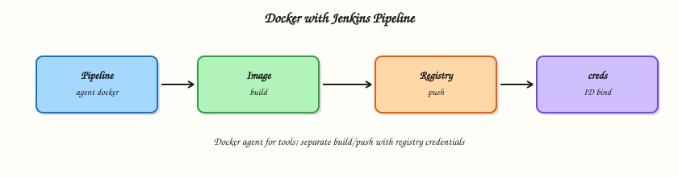

# Docker with Jenkins Pipeline

## Overview

Static agent images drift. **Docker Pipeline** lets a `Jenkinsfile` choose a container toolchain per stage: `agent { docker { image '…' } }`, `agent { dockerfile true }`, and image **build/push** patterns with registry credentials. You must also understand **Docker-in-Docker (DinD)** versus a **sibling Docker socket** — both work; both have sharp edges.

This is **Tutorial 8** in **Module 8: Docker with Pipeline** of the REBASH Academy **Jenkins for Cloud & DevOps Engineers** series — written for Cloud, DevOps, Platform, and Site Reliability Engineering (SRE) engineers. Official guide: [Using Docker with Pipeline](https://www.jenkins.io/doc/book/pipeline/docker/).

## Prerequisites

- [Multibranch Pipelines and Pull Requests](multibranch-pipelines-and-prs.md)
- [Docker](../docker/index.md) basics — images, Dockerfile, registries
- Docker Pipeline plugin on Jenkins
- An agent that can run Docker (labelled `docker` / `rebash-agent`) — not the locked-down built-in node without a socket

## Learning Objectives

By the end of this tutorial, you will be able to:

- [ ] Run stages inside `agent { docker { … } }` images
- [ ] Use `agent { dockerfile true }` for repo-defined toolchains
- [ ] Explain DinD versus mounting `docker.sock` (sibling daemon)
- [ ] Sketch a safe image build and registry push flow with credentials
- [ ] Apply `reuseNode` and cache mounts when workspaces must align

## Architecture

Jenkins agents invoke the Docker CLI/daemon to run language toolchains or build images for a registry.



## Theory

### What it is

With the **Docker Pipeline** plugin, Declarative Pipeline accepts:

```groovy
agent {
  docker {
    image 'maven:3.9.9-eclipse-temurin-21'
    args '-v $HOME/.m2:/root/.m2'
    reuseNode true
  }
}
```

Or build the agent from the repo:

```groovy
agent { dockerfile true }
```

Scripted helpers such as `docker.build('my-image:tag')` and `docker.withRegistry(...)` support build/push flows (also usable from careful Scripted blocks / shared libraries).

### Why it matters

Containers make CI reproducible: the same Maven/Node image on every agent. Registries become the hand-off to Kubernetes. Without a clear daemon model, labs fail with `Cannot connect to the Docker daemon`, or worse — PR builds inherit a writable host socket and escape the container.

### How it works

**`agent { docker }`:** Jenkins starts a container from `image`, mounts a workspace, and runs `steps` inside it. The agent machine still needs a working Docker daemon/CLI.

**`reuseNode true`:** keep the same node/workspace instead of allocating a fresh workspace for the containerised stage.

**`dockerfile true`:** `docker build` the adjacent `Dockerfile`, then run steps in that image — great for custom OS packages.

**Build and push pattern (conceptual):**

1. Build app tests in a language image.
2. `docker build` the app image.
3. Authenticate to a registry (credentials ID).
4. `docker push` immutable tags (`git-sha`), optionally `latest` for non-prod.

#### DinD versus sibling socket

| Approach | How | Upside | Risk |
|----------|-----|--------|------|
| Sibling socket | Mount `/var/run/docker.sock` into the agent/container | Fast; images land on host daemon | Container can control host Docker — root-equivalent |
| DinD | Privileged `docker:dind` sidecar | Isolated daemon | Privileged containers; TLS/setup complexity; storage drivers |

For **untrusted PR builds**, prefer remote builders, Kaniko/BuildKit in Kubernetes, or tightly locked agents — not a world-writable host socket.

**Registry credentials:** store Username/Password (or token) in Jenkins Credentials; reference by ID in `docker.withRegistry('https://registry.example.com', 'creds-id')` or equivalent Declarative credential bindings. Never commit registry passwords.

### Key concepts and comparisons

| Directive | Use |
|-----------|-----|
| `agent { docker { image } }` | Off-the-shelf toolchain |
| `agent { dockerfile true }` | Custom repo Dockerfile agent |
| `agent none` + per-stage docker | Multiple languages in one Pipeline |
| `args '-v …'` | Caches (`~/.m2`, yarn cache) |

| Tagging | Advice |
|---------|--------|
| Git SHA | Immutable prod-friendly |
| `BUILD_ID` | OK for labs |
| `latest` | Convenience only; not a sole prod pin |

### Common pitfalls

- Docker Pipeline plugin missing → invalid agent type.
- Agent without Docker CLI/daemon.
- Using `latest` tags for reproducibility theatre.
- Mounting `docker.sock` into Multibranch jobs that build fork PRs.
- Forgetting registry credentials scopes (push denied).

## Hands-on Lab

### Objective

Create a small app repo with Dockerfile + Declarative Pipeline that runs tests in a container image and builds an application image. Document your daemon model (socket vs DinD). Push only if you have a registry; otherwise load/tag locally.

### Prerequisites

- Docker Engine on the Jenkins **agent** host
- Docker Pipeline plugin
- Optional: registry credentials in Jenkins

### Lab environment

Workspace: `~/rebash-jenkins/module-08`

``` {.bash .ra-terminal title="Terminal"}
mkdir -p ~/rebash-jenkins/module-08 && cd ~/rebash-jenkins/module-08
set -euo pipefail
docker version | tee docker-version.txt
```

!!! example "Expected output"
    Client/server sections (agent host must see a daemon).


### Real-world scenario

Your Node service must build in CI with the same image developers use locally. Security asked you to write down whether agents use DinD or the host socket before any fork PR builds are enabled.

### Step-by-step tasks

#### Task 1 – Sample app, Dockerfile, and daemon decision record

Run:

``` {.bash .ra-terminal title="Terminal"}
cd ~/rebash-jenkins/module-08
set -euo pipefail

rm -rf docker-pipe-demo
mkdir -p docker-pipe-demo && cd docker-pipe-demo
```

Create `app.js`:

```javascript title="app.js"
console.log('rebash-module-08');
```

Create `package.json`:

```json title="package.json"
{
  "name": "docker-pipe-demo",
  "version": "0.1.0",
  "private": true,
  "scripts": {
    "test": "node -e \"require('fs').writeFileSync('test-ok.txt','ok'); console.log('test ok')\""
  }
}
```

Create `Dockerfile`:

```dockerfile title="Dockerfile"
FROM node:20-alpine
WORKDIR /app
COPY package.json ./
COPY app.js ./
CMD ["node", "app.js"]
```

Create `Dockerfile.ci`:

```dockerfile title="Dockerfile.ci"
FROM node:20-alpine
WORKDIR /app
RUN apk add --no-cache git
```

Create `daemon-model.yaml`:

```yaml title="daemon-model.yaml"
lab_choice: fill_socket_or_dind
options:
  sibling_socket:
    description: Agent has Docker CLI; mount /var/run/docker.sock
    risk: container control of host Docker
  dind_sidecar:
    description: docker:dind privileged service with DOCKER_HOST
    risk: privileged container; more moving parts
untrusted_pr_policy: no_host_socket_for_fork_prs
```

Validate and archive:

``` {.bash .ra-terminal title="Terminal"}
python3 -c "
import yaml
with open('daemon-model.yaml') as f:
    d = yaml.safe_load(f)
assert 'sibling_socket' in d['options']
print('daemon-model.yaml OK')
" | tee daemon-model-validate.txt

cd ..
test -f docker-pipe-demo/Dockerfile
```

!!! example "Expected output"
    App files and validated `daemon-model.yaml` exist.


#### Task 2 – Declarative Pipeline with docker agent + image build

Run:

``` {.bash .ra-terminal title="Terminal"}
cd ~/rebash-jenkins/module-08/docker-pipe-demo
set -euo pipefail
```

Create `Jenkinsfile`:

```groovy title="Jenkinsfile"
pipeline {
  agent none
  options { timestamps() }
  environment {
    IMAGE_NAME = 'rebash/docker-pipe-demo'
  }
  stages {
    stage('Test in Node container') {
      agent {
        docker {
          image 'node:20-alpine'
          reuseNode true
        }
      }
      steps {
        sh 'node --version'
        sh 'npm test'
        sh 'test -f test-ok.txt'
      }
    }
    stage('Build image') {
      agent { label 'rebash-agent || docker || any' }
      steps {
        sh 'docker version'
        sh 'docker build -t ${IMAGE_NAME}:${BUILD_NUMBER} .'
        sh 'docker image ls ${IMAGE_NAME}:${BUILD_NUMBER}'
      }
    }
  }
  post {
    always {
      echo "Docker Pipeline demo: ${currentBuild.currentResult}"
    }
  }
}
```

Verify:

``` {.bash .ra-terminal title="Terminal"}
# Note: label expression may need editing to match your Module 6 labels
grep -q 'docker {' Jenkinsfile
grep -q 'docker build' Jenkinsfile
```

!!! example "Expected output"
    Jenkinsfile contains docker agent and build stage.


Wire this repo into Jenkins (Pipeline from SCM or Multibranch). Ensure the **Build image** stage runs on an agent that can talk to Docker. Adjust the label to `rebash-agent` if that is your Module 6 label.

#### Task 3 – Optional dockerfile agent smoke

Run:

``` {.bash .ra-terminal title="Terminal"}
cd ~/rebash-jenkins/module-08/docker-pipe-demo
set -euo pipefail
```

Create `Jenkinsfile.dockerfile-agent`:

```groovy title="Jenkinsfile.dockerfile-agent"
pipeline {
  agent {
    dockerfile {
      filename 'Dockerfile.ci'
      reuseNode true
    }
  }
  stages {
    stage('Tool check') {
      steps {
        sh 'node --version'
        sh 'git --version'
      }
    }
  }
}
```

Verify:

``` {.bash .ra-terminal title="Terminal"}
test -f Jenkinsfile.dockerfile-agent
```

Create job `rebash-demo/dockerfile-agent-demo` using this script (SCM or paste) and run once.

!!! example "Expected output"
    Stage prints `node` and `git` versions from the built CI image.


#### Task 4 – Registry credentials pattern (Pipeline stub)

Run:

``` {.bash .ra-terminal title="Terminal"}
cd ~/rebash-jenkins/module-08
set -euo pipefail
```

Create `registry-push.Jenkinsfile`:

```groovy title="registry-push.Jenkinsfile"
// Credential ID registry-ci — do not commit passwords
stage('Push image') {
  steps {
    script {
      docker.withRegistry('https://ghcr.io', 'registry-ci') {
        def img = docker.build("ghcr.io/org/demo:${env.BUILD_NUMBER}")
        img.push()
      }
    }
  }
}
```

Validate and archive:

``` {.bash .ra-terminal title="Terminal"}
grep -q registry-ci registry-push.Jenkinsfile
grep -q 'docker.withRegistry' registry-push.Jenkinsfile

# Local docker build proof even without Jenkins
cd docker-pipe-demo
docker build -t rebash/docker-pipe-demo:local .
docker image ls rebash/docker-pipe-demo:local | tee ../image-ls.txt
cd ..

tar -czf module-08-evidence.tgz docker-pipe-demo/Jenkinsfile docker-pipe-demo/Dockerfile daemon-model.yaml registry-push.Jenkinsfile image-ls.txt
ls -l module-08-evidence.tgz | tee evidence.txt
```

!!! example "Expected output"
    Local image listed; evidence archive created.


### Validation steps

- [ ] `daemon-model.yaml` records socket vs DinD choice
- [ ] Pipeline defines a `docker { image }` test stage and a `docker build` stage
- [ ] Local or Jenkins build produced image `rebash/docker-pipe-demo:*`
- [ ] `registry-push.Jenkinsfile` describes credential ID usage without storing secrets

### Common errors and fixes

| Error | Cause | Fix |
|-------|-------|-----|
| `docker: not found` | Agent lacks CLI | Install Docker on agent or use different label |
| Cannot connect to daemon | No socket/DinD | Fix mount or DinD `DOCKER_HOST` |
| Invalid agent type `docker` | Plugin missing | Install Docker Pipeline |
| Workspace empty in container | `reuseNode` / allocation | Set `reuseNode true` when needed |
| Push denied | Auth/tag | Fix credential ID and repository name |

### Challenge exercise

Extend the Pipeline with a third stage that tags the image as `${IMAGE_NAME}:git-${GIT_COMMIT}` when `GIT_COMMIT` / `env.GIT_COMMIT` is available (Multibranch), otherwise `${IMAGE_NAME}:lab`. Do not push unless credentials exist.

### Learning outcomes

- Ran CI steps inside an official language image
- Built an application image from a Dockerfile
- Documented Docker daemon security trade-offs
- Described registry auth via Jenkins credentials

### Cleanup

``` {.bash .ra-terminal title="Terminal"}
docker rmi rebash/docker-pipe-demo:local 2>/dev/null || true
# Remove BUILD_NUMBER tags created in Jenkins as needed
ls ~/rebash-jenkins/module-08
```

## Validation

- [ ] Lab completed under `~/rebash-jenkins/module-08/`
- [ ] You can explain `docker` agent versus `dockerfile` agent
- [ ] You can contrast DinD and sibling socket risks
- [ ] You know where registry credentials should live

## Code Walkthrough

1. **Test in a language image** — reproducible toolchains.
2. **Build on a Docker-capable labelled agent** — not the controller.
3. **Write down the daemon model** — socket vs DinD is a security decision.
4. **Credential IDs for registries** — never passwords in Jenkinsfiles.
5. **Immutable tags** — SHA/`BUILD_NUMBER` over floating `latest` alone.

## Security Considerations

- Host Docker socket access is root-equivalent on the agent host.
- DinD usually needs privileged mode — limit to trusted builds.
- Untrusted PRs must not inherit privileged Docker.
- Registry tokens in credentials store; short-lived tokens when possible.
- Scan images before production deploy (policy / Module 12 themes).

## Common Mistakes

!!! warning "Mounting docker.sock for fork PR Multibranch jobs"
    Malicious Pipelines can build escape paths. **Fix:** separate agent pools; avoid socket mounts for untrusted code.

!!! warning "Building images on the built-in node"
    Controllers with Docker become high-value targets. **Fix:** labelled Docker agents only.

!!! warning "Registry password in Jenkinsfile"
    Leaks via Git and console. **Fix:** Credentials + `withRegistry` / bindings.

!!! warning "Only tagging latest"
    Cannot roll back safely. **Fix:** push immutable tags; move `latest` only as a pointer if needed.

## Best Practices

- Pin image digests or stable tags for CI toolchains.
- Cache mounts for Maven/npm where safe.
- `agent none` + per-stage containers for polyglot repos.
- Document Docker label restrictions (Manage Jenkins / folder Docker label).
- Prefer BuildKit/Kaniko in Kubernetes when socket mounts are unacceptable (Module 13 bridge).

## Troubleshooting

| Symptom | Likely cause | Fix |
|---------|--------------|-----|
| Permission denied on socket | Group/user mismatch | Add jenkins user to docker group (understand risk) |
| DinD TLS errors | Cert env mismatch | Align `DOCKER_TLS_CERTDIR` / client certs with jenkins.io Docker install docs |
| Slow builds | No dependency cache | Mount cache volumes carefully |
| `reuseNode` surprises | Stage landed elsewhere | Set reuseNode; pin labels |
| Image missing in later stage | Different agents | Push to registry or reuse same node |

## Summary

Docker Pipeline gives reproducible toolchains and a path to ship images. Choose socket versus DinD deliberately, keep builds off the controller, and authenticate to registries with credentials IDs. Next: [Shared Libraries](shared-libraries.md).

## Interview Questions

**1. What does `agent { docker { image 'maven:…' } }` do?**

??? success "Reveal answer"
    It runs the Pipeline stage(s) inside a container from that image on a Docker-capable agent, mounting a workspace so steps see your source with the image’s toolchain.

**2. When do you use `agent { dockerfile true }`?**

??? success "Reveal answer"
    When the repository’s Dockerfile defines a custom CI environment (extra packages, corporate base images) that you want built and used as the agent for those steps.

**3. What is the main security risk of mounting `/var/run/docker.sock`?**

??? success "Reveal answer"
    Processes in the container can control the host Docker daemon — effectively root on the host. Untrusted Pipelines can abuse that power.

**4. How does DinD differ from the sibling socket model?**

??? success "Reveal answer"
    DinD runs a separate Docker daemon (often privileged) for builds. The sibling model uses the host daemon via the mounted socket. DinD isolates the daemon more; socket is simpler but couples to the host.

**5. How should registry authentication be handled in Jenkins?**

??? success "Reveal answer"
    Store registry username/token in the credentials store and reference the credential ID from Pipeline (`docker.withRegistry` or bindings). Do not commit passwords.

**6. Why pin CI tool images instead of `node:latest`?**

??? success "Reveal answer"
    `latest` moves under you and breaks builds non-deterministically. Pinning versions or digests keeps CI reproducible and debuggable.

**7. What does `reuseNode true` change?**

??? success "Reveal answer"
    The containerised stage reuses the same agent node and workspace instead of allocating a new workspace on potentially another node, keeping files in sync across stages.

**8. Why build images on labelled agents rather than the controller?**

??? success "Reveal answer"
    Image builds are heavy and, with socket/DinD access, privileged. Keeping them on agents protects the controller’s `JENKINS_HOME` and credentials plane.

## Related Tutorials

- [Multibranch Pipelines and Pull Requests](multibranch-pipelines-and-prs.md)
- [Shared Libraries](shared-libraries.md)
- [Building images with Dockerfile](../docker/building-images-with-dockerfile.md)

## References

- [Using Docker with Pipeline](https://www.jenkins.io/doc/book/pipeline/docker/)
- [Pipeline Syntax — agent docker](https://www.jenkins.io/doc/book/pipeline/syntax/#agent-parameters)
- [Docker Pipeline plugin](https://plugins.jenkins.io/docker-workflow/)
