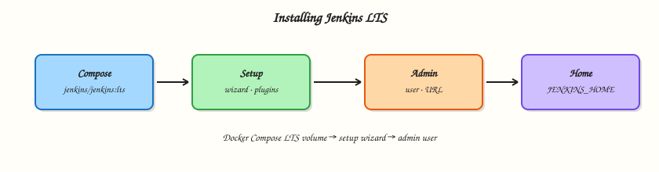

# Installing Jenkins LTS

## Overview

A Jenkins controller you cannot rebuild is a liability. Labs and production both need a **reproducible** Long-Term Support (LTS) install: pinned image, persistent **`JENKINS_HOME`**, and a documented first-boot path through the setup wizard.

This tutorial standardises on **Docker Compose** with the official [`jenkins/jenkins`](https://hub.docker.com/r/jenkins/jenkins) LTS image so every learner shares the same baseline. You will also know when package or Web Application Archive (WAR) installs make sense on bare metal. After the wizard you have an admin user, a Jenkins URL, suggested plugins, and a volume you must not delete casually.

This is **Tutorial 2** in **Module 2: Installing Jenkins LTS** of the REBASH Academy **Jenkins for Cloud & DevOps Engineers** series — written for Cloud, DevOps, Platform, and Site Reliability Engineering (SRE) engineers. Official reference: [Installing Jenkins with Docker](https://www.jenkins.io/doc/book/installing/docker/).

## Prerequisites

- [Introduction to Jenkins and CI/CD](introduction-to-jenkins-and-ci-cd.md)
- [Docker](../docker/index.md) Engine with Compose v2 (`docker compose`)
- Free host ports **8080** (UI) and **50000** (inbound agents) — or willingness to remap
- Browser for the setup wizard
- Optional: artefacts from `~/rebash-jenkins/module-01`

## Learning Objectives

By the end of this tutorial, you will be able to:

- [ ] Bring up Jenkins LTS with Docker Compose and a named volume for `JENKINS_HOME`
- [ ] Retrieve the initial admin password and complete the setup wizard safely
- [ ] Explain suggested plugins, admin user creation, and Jenkins URL
- [ ] Contrast Compose, package (deb/rpm), and WAR install paths
- [ ] Stop or destroy a lab controller without losing the mental model of what was persisted

## Architecture

Compose publishes the UI and agent port; a Docker volume mounts at `/var/jenkins_home` inside the container.



## Theory

### What it is

**Jenkins LTS** is the production support line of Jenkins core. The official container image `jenkins/jenkins` publishes LTS tags such as `lts` and `lts-jdk17`. Inside the container, **`JENKINS_HOME`** defaults to `/var/jenkins_home` and holds jobs, plugins, secrets, users, and build history.

**Docker Compose** describes the controller as code: image tag, ports, and volume. That is the lab default for this course. Alternatives:

| Path | When to use |
|------|-------------|
| Docker / Compose | Labs, many self-hosted starts, reproducible demos |
| Package (deb/rpm) | Dedicated VMs owned by Linux lifecycle tooling |
| WAR + supported JDK | Custom servlet hosting (advanced; follow Java requirements on jenkins.io) |

First boot runs the **setup wizard**: unlock with `secrets/initialAdminPassword`, install **suggested plugins** (or select plugins), create the first **admin** user, and set the **Jenkins URL**.

### Why it matters

Controllers die from “I ran a random `docker run` and lost the volume,” public `8080` without Transport Layer Security (TLS), and `latest` tags that jump majors under you. Platform teams pin LTS, back up `JENKINS_HOME`, and treat first-boot decisions (plugins, URL, admin identity) as part of the platform product.

Suggested plugins pull in Pipeline, Git, and credentials helpers so you are not stuck with an empty controller. Skipping them then wondering why Pipeline is missing is a common lab failure.

### How it works

1. Pull `jenkins/jenkins:lts-jdk17` (or a pinned LTS minor tag).
2. Start the container with a **named volume** on `/var/jenkins_home`.
3. Wait until Jenkins listens on HTTP port 8080 inside the container.
4. Read `/var/jenkins_home/secrets/initialAdminPassword` once.
5. Complete the wizard in the browser; admin credentials replace the unlock password.
6. Later modules reuse the same volume so jobs and plugins persist across `compose down` (without `-v`).

Agent port **50000** is for inbound agents using the Jenkins remoting protocol. You can remap host ports if 8080 is busy.

Official Docker docs also show a Docker-in-Docker sidecar for building images *from* Jenkins; that pattern belongs in Module 8. This module keeps the controller install minimal.

### Key concepts and comparisons

| Path / item | Role |
|-------------|------|
| `/var/jenkins_home` | `JENKINS_HOME` in the official image |
| `secrets/initialAdminPassword` | One-time unlock for the wizard |
| Plugin Manager | Adds features after (or during) the wizard |
| Jenkins URL | Root URL used in emails, webhooks, and redirects |
| Volume vs bind mount | Named volumes are simpler for labs; bind mounts need UID awareness (`jenkins` user in the image) |

| Tag style | Advice |
|-----------|--------|
| `lts-jdk17` | Good lab/production default for this course |
| `lts` | Tracks current LTS JDK line — still prefer pinning for prod |
| `latest` / weekly | Feature preview only — not this course’s production path |

### Common pitfalls

- Publishing `0.0.0.0:8080` on a public host without a reverse proxy and authentication hardening.
- Using `docker compose down -v` and deleting months of jobs by accident.
- Bind-mounting a host directory owned by root so the container user cannot write `JENKINS_HOME`.
- Skipping suggested plugins then blocking on missing Pipeline/Git.
- Treating the initial admin password as a long-lived secret after the wizard completes.

## Hands-on Lab

### Objective

Start Jenkins LTS with Compose, capture the initial admin password, complete the setup wizard, and prove the controller answers HTTP — with cleanup that preserves or destroys the volume deliberately.

### Prerequisites

- Docker Engine + Compose v2
- Browser
- Ports 8080/50000 free, or edit the Compose ports

### Lab environment

Workspace: `~/rebash-jenkins/module-02`

```bash title="Terminal"
mkdir -p ~/rebash-jenkins/module-02 && cd ~/rebash-jenkins/module-02
set -euo pipefail
docker version | tee docker-version.txt
docker compose version | tee compose-version.txt
```

!!! example "Expected output"
    Client/server version lines; Compose version printed.


### Real-world scenario

Your team needs a disposable but realistic Jenkins LTS for Pipeline labs. You must be able to rebuild the controller from Compose, keep `JENKINS_HOME` across restarts, and document the unlock path so a teammate can finish the wizard without pinging you.

### Step-by-step tasks

#### Task 1 – Write and start Compose for Jenkins LTS

Run:

```bash title="Terminal"
cd ~/rebash-jenkins/module-02
set -euo pipefail
```

Create `compose.yaml`:

```yaml title="compose.yaml"
services:
  jenkins:
    image: jenkins/jenkins:lts-jdk17
    restart: unless-stopped
    ports:
      - "8080:8080"
      - "50000:50000"
    volumes:
      - jenkins_home:/var/jenkins_home
    environment:
      - JAVA_OPTS=-Djenkins.install.runSetupWizard=true

volumes:
  jenkins_home:
```

Start and verify:

```bash title="Terminal"
docker compose pull
docker compose up -d
docker compose ps | tee compose-ps.txt
docker compose logs --tail=40 jenkins | tee boot.log
```

!!! example "Expected output"
    Service `running` (or healthy); logs show Jenkins starting. If port 8080 is busy, change the left-hand port mapping and re-up.


#### Task 2 – Wait for Jenkins and read the initial admin password

```bash title="Terminal"
cd ~/rebash-jenkins/module-02
set -euo pipefail

# Wait up to ~2 minutes for the unlock file
for i in $(seq 1 24); do
  if docker compose exec -T jenkins test -f /var/jenkins_home/secrets/initialAdminPassword; then
    echo "ready on attempt $i" | tee ready.txt
    break
  fi
  echo "waiting ($i)..."
  sleep 5
done

docker compose exec -T jenkins cat /var/jenkins_home/secrets/initialAdminPassword \
  | tr -d '\r' | tee initialAdminPassword.txt

test -s initialAdminPassword.txt
wc -c initialAdminPassword.txt | tee password-bytes.txt
```

!!! example "Expected output"
    Non-empty `initialAdminPassword.txt`. Open `http://127.0.0.1:8080/` and paste that password into **Unlock Jenkins**.


#### Task 3 – Complete the wizard and capture non-secret evidence

In the browser (do not automate credentials into Git):

1. Choose **Install suggested plugins** (recommended for this course).
2. Create the first admin user; store the password in your password manager — **not** in the lab directory.
3. Confirm the Jenkins URL (for local labs: `http://127.0.0.1:8080/`).
4. Finish and land on the dashboard.

Then capture non-secret evidence from the shell:

```bash title="Terminal"
cd ~/rebash-jenkins/module-02
set -euo pipefail

# HTTP smoke (may be 403/200/503 depending on auth and readiness — prove TCP/HTTP responds)
curl -sS -o /dev/null -w "%{http_code}\n" http://127.0.0.1:8080/login | tee http-login-code.txt \
  || curl -sS -o /dev/null -w "%{http_code}\n" http://127.0.0.1:8080/ | tee http-root-code.txt

docker compose exec -T jenkins bash -lc 'ls /var/jenkins_home | head' | tee jenkins-home-listing.txt
docker compose exec -T jenkins bash -lc 'test -d /var/jenkins_home/plugins && echo plugins_dir_ok' | tee wizard-plugins-check.txt
grep -qE '^(200|403|503)$' http-login-code.txt 2>/dev/null || grep -qE '^(200|403|503)$' http-root-code.txt
```

!!! example "Expected output"
    HTTP code file shows a response; listing includes paths such as `secrets`, `plugins`, or `users` after the wizard.


#### Task 4 – Prove persistence across restart (keep volume)

```bash title="Terminal"
cd ~/rebash-jenkins/module-02
set -euo pipefail

docker compose restart jenkins
sleep 20
docker compose ps | tee compose-ps-after-restart.txt
curl -sS -o /dev/null -w "%{http_code}\n" http://127.0.0.1:8080/login | tee http-after-restart.txt

# Volume still present
docker volume ls | grep jenkins | tee volumes.txt
test -s volumes.txt
```

!!! example "Expected output"
    Controller comes back; volume name containing `jenkins` still listed. You should still log in with the **admin user**, not the initial unlock password.


### Validation steps

- [ ] `compose.yaml` pins `jenkins/jenkins:lts-jdk17`
- [ ] Initial admin password was read once and wizard completed
- [ ] `http-login-code.txt` and `jenkins-home-listing.txt` prove the controller responds
- [ ] Restart kept the named volume; login still works with the admin user

### Common errors and fixes

| Error | Cause | Fix |
|-------|-------|-----|
| `Bind for 0.0.0.0:8080 failed` | Port in use | Map `"18080:8080"` (or free the port) |
| Unlock file missing | Jenkins still warming | Retry the wait loop; check `docker compose logs jenkins` |
| Permission errors on bind mount | Host dir ownership | Prefer the named volume in this lab |
| Wizard already completed | Reusing volume | Continue with admin login, or `down -v` to reset **lab** data only |

### Challenge exercise

Pin a specific LTS image digest or minor tag (for example check [Docker Hub tags](https://hub.docker.com/r/jenkins/jenkins/tags) and replace `lts-jdk17` with a dated tag in `compose.yaml`). Recreate the stack with `docker compose up -d --pull always` and prove the tag with:

```bash title="Terminal"
cd ~/rebash-jenkins/module-02
docker compose images | tee images.txt
grep jenkins images.txt
```

### Learning outcomes

- Installed Jenkins LTS reproducibly with Compose
- Completed unlock → plugins → admin → URL
- Distinguished volume persistence from container lifecycle
- Captured HTTP and volume evidence without committing secrets

### Cleanup

**Keep the controller for Modules 3+ (recommended):**

```bash title="Terminal"
cd ~/rebash-jenkins/module-02
docker compose stop
# volume jenkins_home retained
```

**Full lab reset (destroys JENKINS_HOME):**

```bash title="Terminal"
cd ~/rebash-jenkins/module-02
docker compose down -v
```

Remove `initialAdminPassword.txt` from shared machines after unlock:

```bash title="Terminal"
rm -f ~/rebash-jenkins/module-02/initialAdminPassword.txt
```

## Validation

- [ ] Lab completed under `~/rebash-jenkins/module-02/`
- [ ] You can explain what lives in `JENKINS_HOME` versus the container image
- [ ] You know when to use Compose vs package vs WAR
- [ ] You can describe the failure mode of `compose down -v` on a shared lab volume

## Code Walkthrough

1. **Pin the image** — `lts-jdk17` or a finer tag beats floating `latest`.
2. **Persist deliberately** — named volume for labs; backup strategy for production.
3. **Evidence without secrets** — HTTP codes, listings, and compose output — never commit admin passwords.
4. **Wizard once** — suggested plugins unblock Pipeline/Git for the rest of the course.
5. **Least exposure** — bind UI to localhost for labs; put TLS and access control in front for any shared host.

## Security Considerations

- The initial admin password is a bootstrap secret — delete local copies after unlock.
- Do not expose port 8080 to the public internet without TLS and hardened auth.
- Admin accounts are break-glass: use personal accounts and least privilege later (Module 11).
- Treat the Docker volume as sensitive as a VM disk — it contains credentials ciphertext and job configs.
- Prefer stopping Compose over leaving an unlocked wizard open on a shared network.

## Common Mistakes

!!! warning "Running `docker compose down -v` on a shared controller"
    The `-v` flag deletes the `jenkins_home` volume. **Fix:** use `stop` or `down` without `-v` unless you intend a full reset.

!!! warning "Publishing Jenkins on a public IP for “just a lab”"
    Scanners find open Jenkins UIs quickly. **Fix:** listen on `127.0.0.1` or use a VPN/SSH tunnel; add a reverse proxy with TLS for shared environments.

!!! warning "Skipping suggested plugins"
    Pipeline and Git arrive via plugins. **Fix:** install suggested plugins for this course, then govern extras via Plugin Manager later.

!!! warning "Bind-mounting `/var/jenkins_home` as root"
    The process inside the image runs as the `jenkins` user. **Fix:** use a named volume (this lab) or fix ownership to match the container UID.

## Best Practices

- Encode the controller in Compose (or later Jenkins Configuration as Code) from day one.
- Pin LTS image tags in production; document upgrade tickets.
- Back up `JENKINS_HOME` before plugin or core upgrades.
- Keep lab passwords out of Git; use a password manager.
- Separate test controllers from production controllers for plugin trials.

## Troubleshooting

| Symptom | Likely cause | Fix |
|---------|--------------|-----|
| Page never loads | Container crash / still starting | `docker compose logs -f jenkins` |
| Unlock password rejected | Wrong container / stale volume | Confirm `exec` target; reset volume only if disposable |
| `live` UI but empty plugins | Custom plugin choice | Plugin Manager → install Pipeline and Git |
| Disk pressure | Large build history in volume | Trim old builds; expand disk |
| Agent port confusion | 50000 not published | Add host mapping or use SSH/JNLP patterns later |

## Summary

Jenkins LTS on Docker Compose gives a reproducible controller with persistent `JENKINS_HOME`. Complete the wizard once, protect the volume, and keep admin secrets out of Git. Next: [Using Jenkins — Jobs, Views, and Folders](using-jenkins-jobs-views-and-folders.md).

## Interview Questions

**1. What is stored in `JENKINS_HOME`, and why must it be persisted?**

??? success "Reveal answer"
    Jobs, plugins, users, credentials ciphertext, secrets, and build history live under `JENKINS_HOME` ( `/var/jenkins_home` in the official image). If the volume is deleted, the controller configuration and history are gone even if you recreate the container from the same image.

**2. Why prefer Jenkins LTS container tags over `latest` for production?**

??? success "Reveal answer"
    LTS is the supported production line with a predictable upgrade cadence. `latest` or weekly tags can introduce breaking core/plugin combinations without a controlled change window.

**3. What is the initial admin password, and when does it stop mattering?**

??? success "Reveal answer"
    It unlocks the setup wizard from `secrets/initialAdminPassword` on first boot. After you create an admin user, you authenticate with that account; the unlock file should not be treated as the long-term password.

**4. When would you install Jenkins from OS packages instead of Docker?**

??? success "Reveal answer"
    When the organisation standardises on VM images, configuration management, and OS patching for the controller host, or when container networking/storage policies make Docker a poor fit. The trade-off is you own the JVM and OS lifecycle explicitly.

**5. What risk does publishing port 8080 on `0.0.0.0` create?**

??? success "Reveal answer"
    The UI (and setup wizard if unfinished) may be reachable from untrusted networks. Attackers scan for open Jenkins instances. Labs should bind to localhost; shared hosts need TLS termination and access control.

**6. How do you reset a disposable lab controller without affecting a volume you want to keep?**

??? success "Reveal answer"
    `docker compose down` removes containers/networks but keeps named volumes. Add `-v` only when you intentionally destroy `JENKINS_HOME`. Prefer `stop` between modules when you want the same controller state.

**7. Why install suggested plugins on a training controller?**

??? success "Reveal answer"
    They provide the common Pipeline, SCM, and credentials stack so learners are not blocked on missing plugins. Production still needs a governed plugin list — suggested plugins are a bootstrap, not an infinite allow-list.

**8. What is port 50000 used for in the Compose file?**

??? success "Reveal answer"
    It is the default inbound agent (remoting) port so agents can connect to the controller. You still must configure agents securely; opening 50000 widely without authentication controls is unsafe.

## Related Tutorials

- [Introduction to Jenkins and CI/CD](introduction-to-jenkins-and-ci-cd.md)
- [Using Jenkins — Jobs, Views, and Folders](using-jenkins-jobs-views-and-folders.md)
- [Docker Compose fundamentals](../docker/docker-compose-fundamentals.md)

## References

- [Installing Jenkins — Docker](https://www.jenkins.io/doc/book/installing/docker/)
- [Jenkins LTS downloads](https://www.jenkins.io/download/lts/)
- [Official jenkins/jenkins image](https://hub.docker.com/r/jenkins/jenkins)
- [Jenkins User Documentation](https://www.jenkins.io/doc/)
