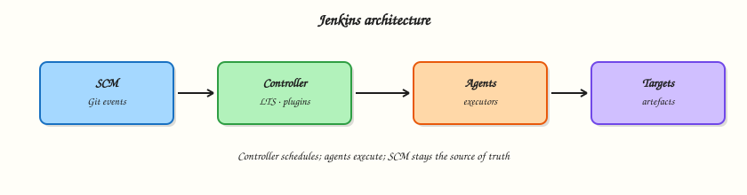

# Introduction to Jenkins and CI/CD

## Overview

Teams ship broken software when builds are tribal knowledge: “works on my machine,” undocumented deploy steps, and green checkboxes that never meant “safe to release.” **Continuous Integration (CI)** and **Continuous Delivery (CD)** turn every meaningful Git change into an automated, repeatable proof of health — and keep a releasable artefact ready when policy says go.

**Jenkins** is a self-managed automation server that runs that loop as jobs. A **controller** schedules work and stores configuration; **agents** execute the untrusted build steps. This course uses **Jenkins Long-Term Support (LTS)** and **Declarative Pipeline** as the production path. Blue Ocean is legacy UI only — do not treat it as the learning track.

This is **Tutorial 1** in **Module 1: Introduction to Jenkins and CI/CD** of the REBASH Academy **Jenkins for Cloud & DevOps Engineers** series — written for Cloud, DevOps, Platform, and Site Reliability Engineering (SRE) engineers. By the end you will map CI/CD vocabulary to a controller–agent model and leave a Pipeline sketch you can import after install.

## Prerequisites

- [Git](../git/index.md) — commits, branches, and pull requests
- [Docker](../docker/index.md) — for later modules that run Jenkins LTS in Compose
- A text editor and a shell (macOS, Linux, or Windows Subsystem for Linux (WSL))
- No running Jenkins controller required for this tutorial’s lab

## Learning Objectives

By the end of this tutorial, you will be able to:

- [ ] Define CI, Continuous Delivery, and how Jenkins implements each
- [ ] Sketch controller, agent (node), executor, plugin, and `JENKINS_HOME`
- [ ] Contrast Jenkins LTS with weekly releases for production use
- [ ] Decide when a self-managed Jenkins controller beats forge-native SaaS CI
- [ ] Produce a Declarative Pipeline stub and a CI stage map under `~/rebash-jenkins/module-01`

## Architecture

Source events enter the controller; labelled agents run stages; status and artefacts return to Jenkins.



## Theory

### What it is

**Continuous Integration (CI)** means every push or merge request runs a known script: checkout, build, test, and report status. The goal is a shared automated truth about branch health — not a nightly hope.

**Continuous Delivery (CD)** means the same system also produces a releasable artefact and can deploy it, with a person or policy deciding *when*. Continuous Deployment is the stricter variant where every green mainline change ships without a human gate; most enterprises stop at delivery for production.

**Jenkins** is an open-source automation server. A **controller** holds configuration, plugins, credentials *metadata*, the job catalogue, and build history under **`JENKINS_HOME`**. **Agents** (also called nodes) provide **executors** and workspaces where builds actually run. **Plugins** extend Source Control Management (SCM), Pipeline, credentials, cloud agents, and reporting. Prefer **Jenkins LTS** for production; **weekly** releases expose newer features earlier with more churn.

The [Pipeline Getting Started](https://www.jenkins.io/doc/pipeline/tour/getting-started/) “Guided Tour” mental model matches this loop: define a Pipeline, run it, inspect the stage view and console.

### Why it matters

Forge-native CI (GitHub Actions, GitLab CI) is excellent when your source of truth and identity already live there. Enterprises still run Jenkins when pipelines must reach private networks, custom toolchains, regulated environments, multi-SCM estates, or long-lived shared libraries owned by a platform team.

Platform and SRE teams treat the controller as a **product**: versioned configuration, agent isolation, plugin governance, and upgrade runbooks. If you only learn “click New Item,” you cannot recover after a disk failure or a bad plugin upgrade. CI/CD vocabulary first prevents treating Jenkins as a UI that builds instead of a scheduled, auditable delivery system.

### How it works

Mental model: **SCM event or schedule → controller selects a job → executor on an agent runs steps → status, artefacts, and logs return to Jenkins**.

1. Source changes land in Git (or another SCM).
2. A trigger starts a build: webhook, poll SCM, timer (`cron`), or manual.
3. The controller assigns an executor matching the job’s agent label or Pipeline `agent` directive.
4. The agent checks out code, runs stages and steps, and streams console output.
5. Post actions publish tests, archive artefacts, or notify chat; history stays on the controller.

Declarative Pipeline encodes that path in a `Jenkinsfile` reviewed like application code. Freestyle jobs still exist for contrast later; this course centres Pipeline-as-code.

### Key concepts and comparisons

| Term | Meaning |
|------|---------|
| Controller | Schedules jobs; stores config, plugins, and history in `JENKINS_HOME` |
| Agent / node | Machine or container that runs builds |
| Executor | Slot on a node that can run one concurrent build |
| Workspace | Checkout directory for a build on an agent |
| Plugin | Extension that adds SCM, Pipeline, cloud, or reporting features |
| LTS | Long-Term Support line recommended for production |

| Without CI/CD | With Jenkins Pipeline |
|---------------|------------------------|
| “Works on my machine” | Same agent image or label every run |
| Unreviewed production changes | `Jenkinsfile` in the pull request |
| Rebuild from memory after outage | Rebuild from a known Git SHA |

| Option | Strength | Trade-off |
|--------|----------|-----------|
| Jenkins (self-managed) | Flexible agents, private networks, shared libraries | You operate the control plane |
| GitHub Actions | Tight GitHub identity and marketplace | Harder for some private/on-prem toolchains |
| GitLab CI | Pipeline next to GitLab SCM | Best when GitLab is already the forge |

### Common pitfalls

- CI is not “the controller” — the controller schedules; agents execute.
- A green build is not a production release unless you designed deploy stages and approvals that way.
- Building on the **built-in node** couples untrusted Pipeline code to the control plane and credentials store.
- Running weekly Jenkins without a test controller is how plugin upgrades become outages.
- Treating Blue Ocean as the modern path — Declarative Pipeline in classic UI (or Configuration as Code) is the supported route.

## Hands-on Lab

### Objective

Create a CI/CD stage map and a minimal Declarative `Jenkinsfile` under `~/rebash-jenkins/module-01`, then prove both files with shell asserts. No live controller is required yet.

### Prerequisites

- Bash shell and `grep`, `test`
- Write access to your home directory

### Lab environment

Workspace: `~/rebash-jenkins/module-01`

``` {.bash .ra-terminal title="Terminal"}
mkdir -p ~/rebash-jenkins/module-01 && cd ~/rebash-jenkins/module-01
set -euo pipefail
pwd | tee pwd-start.txt
```

!!! example "Expected output"
    `pwd-start.txt` ends with `module-01`.


### Real-world scenario

Your platform team is introducing Jenkins LTS next sprint. Before anyone installs a controller, you must agree on CI versus CD language, document which stages belong in Pipeline, and leave a stub `Jenkinsfile` that Module 2 can run after Docker Compose comes up.

### Step-by-step tasks

#### Task 1 – Map CI stages to machine-readable YAML

Write a stage map that separates “prove the change” from “ship the change.”

Run:

``` {.bash .ra-terminal title="Terminal"}
cd ~/rebash-jenkins/module-01
set -euo pipefail
```

Create `ci-cd-stages.yaml`:

```yaml title="ci-cd-stages.yaml"
ci:
  description: Continuous Integration — every PR or push
  stages:
    - id: checkout
      action: fetch Git SHA
    - id: build
      action: compile or package
    - id: unit-test
      action: fast tests; fail the build on red
    - id: static-checks
      action: lint, format, secret scan as policy
cd:
  description: Continuous Delivery — main or release branch
  stages:
    - id: package
      action: versioned artefact
    - id: deploy-staging
      action: automated or gated
    - id: approve-production
      action: human or policy gate
    - id: deploy-production
      action: explicit stage with scoped credentials
ownership:
  controller: schedule, history, credentials metadata
  agents: execute untrusted steps off the built-in node
```

Validate and archive:

``` {.bash .ra-terminal title="Terminal"}
python3 -c "
import yaml
with open('ci-cd-stages.yaml') as f:
    d = yaml.safe_load(f)
assert 'ci' in d and 'cd' in d
assert len(d['ci']['stages']) >= 4
assert len(d['cd']['stages']) >= 4
print('ci-cd-stages.yaml OK')
" | tee stage-map-validate.txt
```

!!! example "Expected output"
    `stage-map-validate.txt` shows `ci-cd-stages.yaml OK`.


#### Task 2 – Sketch controller versus agent responsibilities

Run:

``` {.bash .ra-terminal title="Terminal"}
cd ~/rebash-jenkins/module-01
set -euo pipefail
```

Create `controller-agent.yaml`:

```yaml title="controller-agent.yaml"
controller:
  stores:
    - JENKINS_HOME
    - job definitions
    - plugin catalogue
    - credentials store (encrypted)
    - build history and logs index
agents:
  provide:
    - workspaces
    - toolchains (JDK, Node, Docker CLI as designed)
    - build processes
    - ephemeral build secrets in memory or env as injected
    - CPU, memory, network for compile and test
policy:
  builtin_node_executors_production: 0
  preferred_agent_label: "linux && docker"
```

Validate and archive:

``` {.bash .ra-terminal title="Terminal"}
python3 -c "
import yaml
with open('controller-agent.yaml') as f:
    d = yaml.safe_load(f)
assert d['policy']['builtin_node_executors_production'] == 0
assert 'JENKINS_HOME' in d['controller']['stores'][0]
print('controller-agent.yaml OK')
" | tee architecture-validate.txt
```

!!! example "Expected output"
    `architecture-validate.txt` shows validation OK.


#### Task 3 – Write a minimal Declarative Jenkinsfile stub

Run:

``` {.bash .ra-terminal title="Terminal"}
cd ~/rebash-jenkins/module-01
set -euo pipefail

mkdir -p demo-app
```

Create `demo-app/Jenkinsfile`:

```groovy title="Jenkinsfile"
// REBASH Academy — Module 1 Declarative stub (import in Module 2+)
pipeline {
  agent any
  options {
    timestamps()
    disableConcurrentBuilds()
  }
  stages {
    stage('Checkout info') {
      steps {
        echo "CI stub — replace agent any with a labelled agent before production"
        sh 'uname -a || ver'
      }
    }
    stage('Unit placeholder') {
      steps {
        echo 'Add real tests in later modules'
      }
    }
  }
  post {
    always {
      echo "Build finished: ${currentBuild.currentResult}"
    }
  }
}
```

Verify:

``` {.bash .ra-terminal title="Terminal"}
test -f demo-app/Jenkinsfile
grep -q 'pipeline {' demo-app/Jenkinsfile
grep -q 'stages {' demo-app/Jenkinsfile
grep -q 'post {' demo-app/Jenkinsfile
# Escape-safe check for agent directive
grep -E 'agent[[:space:]]+any' demo-app/Jenkinsfile
cp demo-app/Jenkinsfile ./Jenkinsfile
ls -l Jenkinsfile demo-app/Jenkinsfile | tee jenkinsfile-listing.txt
```

!!! example "Expected output"
    Listing shows both copies; `pipeline`, `stages`, `post`, and `agent any` present.


#### Task 4 – Record LTS choice for the track

Run:

``` {.bash .ra-terminal title="Terminal"}
cd ~/rebash-jenkins/module-01
set -euo pipefail
```

Create `lts-policy.yaml`:

```yaml title="lts-policy.yaml"
release_line:
  production: jenkins/jenkins:lts-jdk17
  labs: jenkins/jenkins:lts-jdk17
  weekly_preview: disposable controller only
upgrade:
  order:
    - test controller
    - production
  prerequisite: JENKINS_HOME backup
reference: https://www.jenkins.io/download/lts/
```

Validate and archive:

``` {.bash .ra-terminal title="Terminal"}
python3 -c "
import yaml
with open('lts-policy.yaml') as f:
    d = yaml.safe_load(f)
assert 'lts-jdk17' in d['release_line']['production']
print('lts-policy.yaml OK')
" | tee lts-validate.txt

tar -czf module-01-evidence.tgz ci-cd-stages.yaml controller-agent.yaml lts-policy.yaml Jenkinsfile demo-app/Jenkinsfile *.txt
ls -l module-01-evidence.tgz | tee evidence.txt
```

!!! example "Expected output"
    `module-01-evidence.tgz` exists; `evidence.txt` shows its size.


### Validation steps

- [ ] `ci-cd-stages.yaml` validates with Python and lists CI and CD stages separately
- [ ] `controller-agent.yaml` sets built-in node executors to 0 for production
- [ ] `Jenkinsfile` contains `pipeline`, `stages`, and `post`
- [ ] `module-01-evidence.tgz` archives the artefacts

### Common errors and fixes

| Error | Cause | Fix |
|-------|-------|-----|
| `set: pipefail: invalid option` | Old `/bin/sh` | Run under `bash` |
| `grep` fails on Jenkinsfile | Typo in stub | Re-run Task 3 heredoc |
| MacOS `uname` only | Expected | Lab allows `uname -a \|\| ver` |

### Challenge exercise

Extend `demo-app/Jenkinsfile` with a third stage named `Package placeholder` that echoes a semver-style version string (for example `0.1.0-module01`). Keep Declarative syntax valid. Re-run the `grep` checks from Task 3.

### Learning outcomes

- Separated CI proof stages from CD ship stages in validated YAML
- Mapped controller versus agent responsibilities in `controller-agent.yaml`
- Produced an importable Declarative Jenkinsfile stub
- Recorded an LTS policy in `lts-policy.yaml` for the rest of the course

### Cleanup

``` {.bash .ra-terminal title="Terminal"}
# Keep ~/rebash-jenkins/module-01 for Module 2 — no containers started in this lab
ls ~/rebash-jenkins/module-01
```

## Validation

- [ ] Lab commands completed under `~/rebash-jenkins/module-01/`
- [ ] You can explain CI vs Continuous Delivery without conflating “green build” and “released”
- [ ] You can sketch controller, agent, executor, and `JENKINS_HOME`
- [ ] You can name one production failure mode from building on the built-in node

## Code Walkthrough

1. **Inspect vocabulary before tooling** — agree CI vs CD before choosing plugins.
2. **Encode the path early** — a stub `Jenkinsfile` beats a click-built Freestyle job you cannot review.
3. **Capture evidence** — validated YAML stage maps and archives help onboarding and audits.
4. **Prefer LTS** — pin the support line; preview weeklies elsewhere.
5. **Isolate execution** — design for labelled agents from day one, even if the stub still says `agent any`.

## Security Considerations

- Treat the controller as a high-value host: it holds credentials metadata and can schedule privileged deploys.
- Never run untrusted pull-request Pipelines on the built-in node.
- Do not commit real secrets into `Jenkinsfile` or lab artefacts.
- Limit who can administer the controller; developers usually need job permissions, not Overall/Administer.
- Plan backup of `JENKINS_HOME` before you care about the first production Pipeline.

## Common Mistakes

!!! warning "Calling every green build Continuous Delivery"
    CI proves the change. Delivery requires packaging, environment credentials, and an explicit deploy path. **Fix:** name CD stages in the Jenkinsfile and in your stage map.

!!! warning "Building on the built-in node"
    Pipeline steps can reach controller filesystem and credential stores. **Fix:** use agent labels (or Kubernetes/Docker agents) and disable executors on the built-in node in production designs.

!!! warning "Chasing weekly Jenkins for production"
    Plugin and core churn breaks Monday mornings. **Fix:** LTS on production; weeklies only on a disposable test controller.

!!! warning "Learning Blue Ocean as the modern Jenkins"
    Blue Ocean is legacy. **Fix:** learn Declarative Pipeline syntax and the classic Pipeline Stage View / Blue Ocean-free workflows.

## Best Practices

- Keep Pipeline definitions in SCM from the first real job.
- Prefer Jenkins LTS images or packages with pinned versions.
- Document controller versus agent ownership for every new team.
- Use the same mental model as the Guided Tour: stages you can see, console you can read.
- Destroy lab controllers when finished; keep `~/rebash-jenkins/` artefacts for the track.

## Troubleshooting

| Symptom | Likely cause | Fix |
|---------|--------------|-----|
| Debate: “Is deploy part of CI?” | Vocabulary clash | Use the Module 1 stage map: CI proves, CD ships |
| Job always queued | No matching agent / zero executors | Attach an agent or enable a lab executor carefully |
| “Works in UI, missing in Git” | Click-ops job | Move definition into `Jenkinsfile` |
| Fear of upgrades | No test controller | Add a disposable LTS controller for plugin trials |
| Confusion with GitHub Actions | Forge-native vs self-managed | Choose by network, identity, and ownership of the control plane |

## Summary

CI automates proof of every change; Continuous Delivery keeps shipping ready under policy. Jenkins LTS implements that with a controller that schedules and agents that execute — never reverse those roles in production. Continue with [Installing Jenkins LTS](installing-jenkins-lts.md) to bring up a Compose controller and unlock the Module 1 stub.

## Interview Questions

**1. What is the difference between Continuous Integration and Continuous Delivery?**

??? success "Reveal answer"
    CI runs automated build and test on every meaningful change so defects surface quickly. Continuous Delivery also produces a releasable artefact and can deploy, with a human or policy gate deciding when production changes. Continuous Deployment removes that gate for every green mainline change.

**2. What does the Jenkins controller store, and what should agents do instead?**

??? success "Reveal answer"
    The controller stores `JENKINS_HOME`: jobs, plugins, credentials metadata, and build history. Agents provide workspaces, toolchains, and CPU so untrusted build steps do not run on the control plane.

**3. Why prefer Jenkins LTS over weekly releases in production?**

??? success "Reveal answer"
    LTS is the supported production line with a slower, more predictable upgrade cadence. Weeklies deliver features earlier but increase plugin and core churn. Validate weeklies on a non-production controller if you need them.

**4. When would you choose Jenkins over GitHub Actions or GitLab CI?**

??? success "Reveal answer"
    Choose Jenkins when you need self-managed agents on private networks, heterogeneous SCM, heavy shared libraries, or regulated environments where the platform team owns the control plane. Prefer forge-native CI when source, identity, and runners already live in that forge and meet your compliance needs.

**5. What is an executor, and how does it relate to a node?**

??? success "Reveal answer"
    A node (agent) is a machine or container registered with Jenkins. An executor is a concurrent build slot on that node. Two executors can run two builds at once on the same node, sharing its disk and tools — which is why noisy neighbours and workspace cleanup matter.

**6. Why is building on the built-in node a production risk?**

??? success "Reveal answer"
    Pipeline steps can touch the controller filesystem and credentials. A malicious or buggy build on the built-in node expands blast radius to the entire Jenkins estate. Production designs disable or severely limit built-in executors and force labelled agents.

**7. How does the Guided Tour mental model help new Jenkins users?**

??? success "Reveal answer"
    It ties UI concepts to Pipeline stages: you define stages and steps, run a build, then inspect stage status and console output. That loop matches how operators debug real jobs — less clicking Freestyle builders, more reading Pipeline as code.

**8. Is a green CI build enough to call a release “done”?**

??? success "Reveal answer"
    No. Green CI means the defined checks passed for that SHA. A release still needs packaging, environment promotion, credentials scoping, and whatever approval policy your organisation requires for production.

## Related Tutorials

- [Course overview](index.md)
- [Installing Jenkins LTS](installing-jenkins-lts.md)
- [Pipeline Fundamentals (Declarative)](pipeline-fundamentals-declarative.md)

## References

- [Jenkins User Documentation](https://www.jenkins.io/doc/)
- [Pipeline Getting Started](https://www.jenkins.io/doc/pipeline/tour/getting-started/)
- [Jenkins LTS downloads](https://www.jenkins.io/download/lts/)
- [Using Jenkins](https://www.jenkins.io/doc/book/using/)
