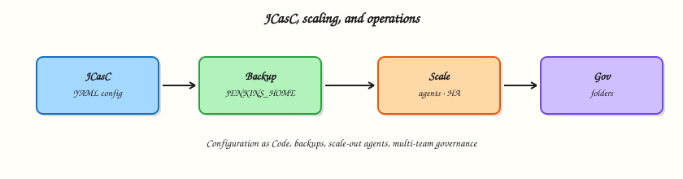

# JCasC, Scaling, and Operations

## Overview

Click-ops controllers cannot be rebuilt after disk loss. **Jenkins Configuration as Code (JCasC)** stores system config as YAML you can review in Git. Operations also means **backup/restore of `JENKINS_HOME`**, **architecting for scale** (controller vs agent capacity), **metrics and logging hooks**, and **multi-team folders** with clear ownership.

This is **Tutorial 15** in **Module 15: JCasC, Scaling, and Operations** of the REBASH Academy **Jenkins for Cloud & DevOps Engineers** series — written for Cloud, DevOps, Platform, and Site Reliability Engineering (SRE) engineers. Plugin docs: [Configuration as Code](https://plugins.jenkins.io/configuration-as-code/).

## Prerequisites

- [Managing Jenkins — Plugins, Tools, and CLI](managing-jenkins-plugins-tools-and-cli.md)
- [Securing Jenkins](securing-jenkins.md)
- Admin access on a **lab** controller
- Configuration as Code plugin available (install on lab if missing)

## Learning Objectives

By the end of this tutorial, you will be able to:

- [ ] Author a minimal JCasC YAML snippet and explain how it is applied
- [ ] Design a `JENKINS_HOME` backup and restore drill
- [ ] Outline controller versus agent scaling levers
- [ ] List practical metrics and log signals for a Jenkins platform
- [ ] Propose a multi-team folder governance model

## Architecture

Git-held JCasC configures the controller; backups protect `JENKINS_HOME`; agents scale horizontally; folders isolate teams.



## Theory

### What it is

**JCasC** loads YAML (files, URL, or ConfigMap) at start or via reload to configure security realms, clouds, tool installers, global libraries, and more. Not every plugin is fully covered — treat JCasC as the preferred path, with documented exceptions.

**Backup** means copying `JENKINS_HOME` (or volume snapshots) consistently — jobs, plugins, credentials ciphertext, build history. Restore is how you prove the backup.

**Scaling:** add **agents** for build concurrency; keep the **controller** lean (CPU/RAM/disk for orchestration, not compiles). Horizontal agent autoscaling (Kubernetes cloud) beats vertical controller growth.

**Metrics/logging:** expose Jenkins metrics (Prometheus plugin or equivalent), ship controller logs, alert on queue time, executor starvation, disk, and 5xx on the UI.

**Multi-team folders:** one folder (or folder tree) per team/product with folder credentials, libraries, and role bindings.

### Why it matters

Without JCasC and backups, a failed upgrade is a career-limiting incident. Without agent scale, queues explode. Without folder governance, every squad shares one flat credential blast radius.

### How it works

1. Install Configuration as Code plugin.
2. Store YAML in Git; mount or fetch into the controller (`CASC_JENKINS_CONFIG`).
3. Boot/reload applies config; review “Configuration as Code” UI for unresolved items.
4. Nightly snapshot the Jenkins volume; quarterly restore to a scratch controller.
5. Scale agents via Kubernetes cloud or VM pools; watch queue metrics.
6. Onboard teams into folders with CODEOWNERS-equivalent platform process.

### Key concepts and comparisons

| Concern | Prefer |
|---------|--------|
| System config | JCasC in Git |
| Job definitions | Jenkinsfiles / Job DSL / Multibranch (not giant JCasC job trees) |
| Secrets in YAML | Credentials plugin + secret sources; avoid plaintext in Git |
| Scale builds | More agents |
| Scale UI/API | HA patterns / adequate controller sizing (advanced) |

### Common pitfalls

- Putting secrets in committed JCasC.
- Believing JCasC replaces Jenkinsfiles.
- Backups without restore tests.
- Autoscaling agents without Jenkins URL reachability.
- One global folder for all teams “for simplicity.”

## Hands-on Lab

### Objective

Write a minimal JCasC snippet, a backup/restore shell script for your Compose volume, and folder governance YAML. Validate YAML locally; apply on lab only if the plugin is installed.

### Prerequisites

- Module 2 Compose stack (named volume `jenkins_home`)
- Optional: Configuration as Code plugin on lab Jenkins

### Lab environment

Workspace: `~/rebash-jenkins/module-15`

``` {.bash .ra-terminal title="Terminal"}
mkdir -p ~/rebash-jenkins/module-15 && cd ~/rebash-jenkins/module-15
set -euo pipefail
```

### Real-world scenario

Leadership asked: “If the Jenkins disk dies tonight, how long to rebuild?” You must show JCasC for baseline config plus a practised volume restore drill.

### Step-by-step tasks

#### Task 1 – Minimal JCasC YAML

Run:

``` {.bash .ra-terminal title="Terminal"}
cd ~/rebash-jenkins/module-15
set -euo pipefail

mkdir -p jcasc
```

Create `jcasc/jenkins.yaml`:

```yaml title="jenkins.yaml"
jenkins:
  systemMessage: "REBASH Academy lab controller — Module 15 JCasC"
  numExecutors: 0
  mode: NORMAL
  securityRealm:
    local:
      allowsSignup: false
      users:
        - id: "admin"
          # password from secret / first-boot — do not commit real passwords
          password: "${JENKINS_ADMIN_PASSWORD:-changeme}"
unclassified:
  location:
    url: "http://127.0.0.1:8080/"
```

Create `jcasc/apply-casc.sh`:

```bash title="apply-casc.sh"
#!/usr/bin/env bash
set -euo pipefail
: "${CASC_JENKINS_CONFIG:=$(pwd)/jcasc/jenkins.yaml}"
echo "Set CASC_JENKINS_CONFIG=$CASC_JENKINS_CONFIG on the controller container"
grep -q 'numExecutors: 0' jcasc/jenkins.yaml
grep -q systemMessage jcasc/jenkins.yaml
echo jcasc_bundle_ok
```

Verify:

``` {.bash .ra-terminal title="Terminal"}
chmod +x jcasc/apply-casc.sh
./jcasc/apply-casc.sh | tee jcasc-validate.txt
```

!!! example "Expected output"
    YAML emphasises zero built-in executors and a system message.


#### Task 2 – Backup and restore script (Compose volume)

Run:

``` {.bash .ra-terminal title="Terminal"}
cd ~/rebash-jenkins/module-15
set -euo pipefail
```

Create `backup-restore.sh`:

```bash title="backup-restore.sh"
#!/usr/bin/env bash
set -euo pipefail
echo "Identify volume: docker volume ls | grep jenkins"
echo "Backup example:"
echo '  VOL=..._jenkins_home'
echo '  docker run --rm -v "$VOL":/jenkins -v "$PWD/backups":/backup alpine \'
echo '    tar -czf /backup/jenkins-home-$(date +%Y%m%d).tgz -C /jenkins .'
echo "Restore: extract tarball into volume on disposable controller, then docker compose up -d"
```

Verify:

``` {.bash .ra-terminal title="Terminal"}
chmod +x backup-restore.sh
./backup-restore.sh | tee backup-restore-head.txt

mkdir -p backups
ls backups | tee backups-dir.txt || true
```

!!! example "Expected output"
    Backup script documents commands; practise when safe on lab.


#### Task 3 – Scaling and metrics checklist

Run:

``` {.bash .ra-terminal title="Terminal"}
cd ~/rebash-jenkins/module-15
set -euo pipefail
```

Create `scale-metrics.yaml`:

```yaml title="scale-metrics.yaml"
scaling:
  controller: cpu_ram_disk_for_ui_queue_plugins
  agents: labelled_capacity_k8s_or_vms
  jobs: disableConcurrentBuilds_where_state_required
  builtin_executors: 0
signals:
  - queue_waiting_time
  - agent_offline_count
  - controller_disk_percent
  - http_5xx_login_latency
  - build_success_rate_mttr
logging:
  ship_jenkins_log_to_central
  alert_on_oomkilled_controller
```

Validate and archive:

``` {.bash .ra-terminal title="Terminal"}
python3 -c "
import yaml
with open('scale-metrics.yaml') as f:
    d = yaml.safe_load(f)
assert d['scaling']['builtin_executors'] == 0
print('scale-metrics.yaml OK')
" | tee scale-metrics-validate.txt
```

!!! example "Expected output"
    Metrics YAML validates.


#### Task 4 – Multi-team folder governance

Run:

``` {.bash .ra-terminal title="Terminal"}
cd ~/rebash-jenkins/module-15
set -euo pipefail
```

Create `folder-governance.yaml`:

```yaml title="folder-governance.yaml"
folders:
  - name: rebash-demo
    owners: platform-lab
    credentials: dummy_only
    libraries: rebash-ci
  - name: team-platform
    owners: platform
    credentials: ci_limited_deploy
    libraries: rebash-ci
  - name: team-payments
    owners: payments_and_platform
    credentials: app_ci
    libraries: folder_lib_optional
rules:
  no_prod_secrets_at_root: true
  folder_admins_cannot_administer_controller: true
  new_team_requires_folder_and_rbac_ticket: true
```

Validate and archive:

``` {.bash .ra-terminal title="Terminal"}
python3 -c "
import yaml
with open('folder-governance.yaml') as f:
    d = yaml.safe_load(f)
assert d['rules']['no_prod_secrets_at_root']
print('folder-governance.yaml OK')
" | tee folder-governance-validate.txt

tar -czf module-15-evidence.tgz jcasc backup-restore.sh scale-metrics.yaml folder-governance.yaml backups-dir.txt *.txt
ls -l module-15-evidence.tgz | tee evidence.txt
```

!!! example "Expected output"
    Governance YAML and evidence archive.


### Validation steps

- [ ] JCasC sample sets `numExecutors: 0` and system message
- [ ] `backup-restore.sh` documents volume backup commands
- [ ] `scale-metrics.yaml` validates
- [ ] `folder-governance.yaml` validates

### Common errors and fixes

| Error | Cause | Fix |
|-------|-------|-----|
| JCasC attribute unknown | Plugin schema gap | Check plugin JCasC docs; export live config |
| Password in Git | Hard-coded secret | Use env/secret source |
| Restore boots empty | Wrong volume | Verify volume name/mount |
| Config not applied | Wrong `CASC_JENKINS_CONFIG` | Fix path; view CasC log |

### Challenge exercise

Export live configuration from a lab controller (CasC UI download) into `jcasc/exported.yaml`, redact secrets, and diff against your minimal `jenkins.yaml` to see what else you should codify next.

### Learning outcomes

- Authored starter JCasC
- Defined backup/restore for Compose volumes
- Linked scaling to agents not controller compiles
- Drafted multi-team folder rules

### Cleanup

``` {.bash .ra-terminal title="Terminal"}
# Keep backups/ out of public git if it contains real home tarballs
ls ~/rebash-jenkins/module-15
```

## Validation

- [ ] Lab completed under `~/rebash-jenkins/module-15/`
- [ ] You can explain JCasC versus Jenkinsfile responsibilities
- [ ] You can describe a restore drill
- [ ] You can name three Jenkins platform metrics

## Code Walkthrough

1. **Codify controller defaults** — JCasC in Git.
2. **Back up the volume** — prove restore.
3. **Scale agents** — protect the controller.
4. **Measure queues and disk** — operate with signals.
5. **Folder tenancy** — credentials and RBAC follow ownership.

## Security Considerations

- JCasC with plaintext passwords is a secret leak — use secret sources.
- Backups contain credential ciphertext — encrypt and ACL them.
- Who can edit CasC in Git can reshape security realms — protect the repo.
- Metrics endpoints may need auth.
- Folder admins still need boundaries against controller Administer.

## Common Mistakes

!!! warning "No restore test"
    Backups that never restore are theatre. **Fix:** quarterly scratch restore.

!!! warning "Secrets committed in jcasc/"
    Tokens in Git history. **Fix:** `${ENV}` / vault integrations; scan PRs.

!!! warning "Scaling the controller to run builds"
    Controllers become fragile and unsafe. **Fix:** zero built-in executors; add agents.

!!! warning "One shared folder for all squads"
    Credential blast radius. **Fix:** folder-per-team governance.

## Best Practices

- Pipeline-as-code for jobs; JCasC for system config.
- Pin plugin versions in images or installation lists.
- Document CasC coverage gaps.
- Alert on disk and queue latency.
- Onboard teams with a folder checklist.

## Troubleshooting

| Symptom | Likely cause | Fix |
|---------|--------------|-----|
| CasC reload errors | Invalid YAML/schema | Read Configuration as Code log |
| After restore, old URL | Location URL stale | Update unclassified.location.url |
| Agents cannot connect post-migrate | URL/firewall | Fix Jenkins URL and ingress |
| Huge backups | Build history retention | Trim retention policies |

## Summary

Operate Jenkins as a platform product: JCasC for rebuildable config, tested `JENKINS_HOME` backups, agent-side scale, observable queues, and folder tenancy. Next: [Troubleshooting and Upgrades](troubleshooting-and-upgrades.md).

## Interview Questions

**1. What is Jenkins Configuration as Code (JCasC)?**

??? success "Reveal answer"
    A plugin and practice that configures the Jenkins controller from YAML (often in Git) so system settings are reviewable and rebuildable instead of click-ops only.

**2. Should job Pipeline definitions live in JCasC?**

??? success "Reveal answer"
    Prefer Jenkinsfiles in application repos (and Multibranch/Job DSL where needed). Use JCasC for controller system configuration — security, clouds, tools, global libraries.

**3. What must a Jenkins backup include?**

??? success "Reveal answer"
    The `JENKINS_HOME` contents (or volume snapshot): jobs, plugins, users, credentials ciphertext, and build history as required by retention policy — plus a tested restore procedure.

**4. How do you scale Jenkins for more concurrent builds?**

??? success "Reveal answer"
    Add agent capacity (static or Kubernetes ephemeral agents) and keep the controller focused on orchestration. Raising built-in executors is the wrong default.

**5. Name two metrics that indicate agent shortage.**

??? success "Reveal answer"
    Rising queue wait time and a large number of builds stuck pending matching labels while agents are saturated or offline.

**6. Why encrypt Jenkins backups?**

??? success "Reveal answer"
    Backups contain sensitive configuration and encrypted credentials material; loss of backup media can be as bad as loss of the live controller.

**7. What is multi-team folder governance?**

??? success "Reveal answer"
    Giving each team a folder (or tree) with scoped credentials, permissions, and libraries so they cannot administer the whole controller or see each other’s secrets.

**8. How does `numExecutors: 0` in JCasC help security?**

??? success "Reveal answer"
    It enforces that the built-in node does not run builds, pushing work to agents and reducing controller compromise via untrusted Pipeline steps.

## Related Tutorials

- [Managing Jenkins — Plugins, Tools, and CLI](managing-jenkins-plugins-tools-and-cli.md)
- [Troubleshooting and Upgrades](troubleshooting-and-upgrades.md)
- [Securing Jenkins](securing-jenkins.md)

## References

- [Configuration as Code plugin](https://plugins.jenkins.io/configuration-as-code/)
- [Architecting for scale](https://www.jenkins.io/doc/book/scaling/architecting-for-scale/)
- [Managing Jenkins](https://www.jenkins.io/doc/book/managing/)
