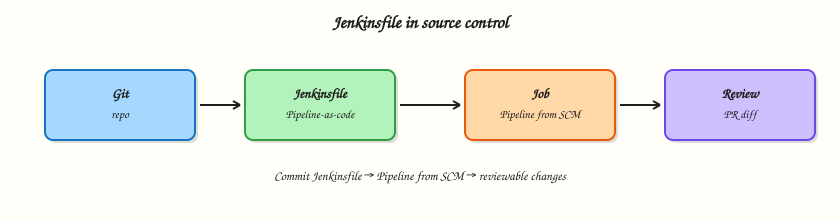

# Jenkinsfile in SCM

## Overview

A Pipeline that lives only in the Jenkins UI cannot be reviewed in a pull request. **Pipeline from Source Control Management (SCM)** loads a **`Jenkinsfile`** from Git so every change is a commit. You will structure that file with **parameters** and **environment**, check it into a local Git repo, point a Pipeline job at it, and leave the layout Multibranch-ready.

This is **Tutorial 5** in **Module 5: Jenkinsfile in SCM** of the REBASH Academy **Jenkins for Cloud & DevOps Engineers** series — written for Cloud, DevOps, Platform, and Site Reliability Engineering (SRE) engineers.

## Prerequisites

- [Pipeline Fundamentals (Declarative)](pipeline-fundamentals-declarative.md)
- Running Jenkins LTS with Git and Pipeline plugins
- Git installed on your workstation (`git --version`)
- Module 4 `Jenkinsfile` ideas (you will replace UI script with SCM)

## Learning Objectives

By the end of this tutorial, you will be able to:

- [ ] Place a `Jenkinsfile` at the repository root (or a documented path)
- [ ] Configure a Pipeline job with **Definition: Pipeline script from SCM**
- [ ] Use `parameters` and `environment` without embedding secrets
- [ ] Explain Multibranch readiness (same file, many branches)
- [ ] Review Pipeline changes like application code

## Architecture

Git holds the Jenkinsfile; the job checks out SCM and executes the Declarative definition.



## Theory

### What it is

A **`Jenkinsfile`** is the text file that defines a Pipeline. **Pipeline script from SCM** tells Jenkins: clone this repository (branch/tag), then load `Jenkinsfile` (or `Jenkinsfile.groovy`, or a custom script path).

Common Declarative additions in SCM:

| Directive | Purpose |
|-----------|---------|
| `parameters { }` | String/boolean/choice inputs for manual or API builds |
| `environment { }` | Environment variables for stages |
| `options { }` | timestamps, durability, concurrent build policy |
| `triggers { }` | cron / upstream (often replaced by webhooks in Multibranch) |

**Checkout** is usually implicit when using Multibranch or `checkout scm` in Scripted; with a single-branch SCM Pipeline job, Jenkins checks out the configured branch before running the loaded script (exact behaviour depends on job type — Multibranch always binds `scm`).

### Why it matters

SCM is how you get code review, blame, revert, and Multibranch. Platform standards (“every service ships a Jenkinsfile”) only work when the file is in the repo. Parameters make rebuilds explicit (`DEPLOY_ENV=staging`). Environment blocks keep non-secret config visible; secrets still belong in the credentials store.

### How it works

1. Commit `Jenkinsfile` to Git (root is conventional).
2. Create/configure a Pipeline job → **Pipeline script from SCM** → Git → repo URL + credentials if needed.
3. Set branch specifier (`*/main` or `*/master`).
4. Script path: `Jenkinsfile` unless you use a subdirectory monorepo layout.
5. Build → Jenkins checks out → runs Declarative Pipeline.
6. Change the file in a branch → review → merge → next build picks it up.

**Multibranch readiness:** one `Jenkinsfile` at a stable path; avoid hard-coding a single branch name inside deploy logic without parameters/`when`; do not require UI-only steps that Multibranch cannot recreate.

**Best practices:** keep stages readable; fail fast; no secrets in plain `environment`; prefer lightweight checkout options when repos are huge; document required Jenkins plugins in the README.

### Key concepts and comparisons

| Definition mode | Pros | Cons |
|-----------------|------|------|
| Pipeline script (UI) | Fast demo | Not reviewable; drifts from Git |
| Pipeline script from SCM | Reviewable; single branch | Still one job per branch unless Multibranch |
| Multibranch Pipeline | Branch/PR discovery | Needs SCM permissions + indexing |

| Parameter type | Example use |
|----------------|-------------|
| `string` | version override |
| `booleanParam` | skip integration tests |
| `choice` | deploy environment |

### Common pitfalls

- Leaving the real Pipeline in the UI while an unused `Jenkinsfile` sits in Git.
- Putting passwords in `environment { SECRET = '...' }`.
- Custom script path in monorepos without documenting it for Multibranch.
- Checking in `Jenkinsfile` only on `develop` while the job tracks `main`.
- Assuming Multibranch works without webhook/indexing (Module 7).

## Hands-on Lab

### Objective

Create a local Git repository with a parameterised Declarative `Jenkinsfile`, configure Jenkins **Pipeline script from SCM** against that repo (file:// or hosted), and prove a build uses the committed file.

### Prerequisites

- Jenkins controller from Module 2
- Git on the workstation
- For `file://` remotes: Jenkins must be able to read the path (same machine / mounted path). If not, use a private GitHub/GitLab repo instead.

### Lab environment

Workspace: `~/rebash-jenkins/module-05`

``` {.bash .ra-terminal title="Terminal"}
mkdir -p ~/rebash-jenkins/module-05 && cd ~/rebash-jenkins/module-05
set -euo pipefail
git --version | tee git-version.txt
```

!!! example "Expected output"
    Git version line printed.


### Real-world scenario

Your service repo must own its CI definition. Reviewers rejected a UI-only Pipeline. You will put a `Jenkinsfile` in Git with a `TARGET` parameter and wire Jenkins to that repository.

### Step-by-step tasks

#### Task 1 – Create a Git repo with Jenkinsfile

Commit and record:

``` {.bash .ra-terminal title="Terminal"}
cd ~/rebash-jenkins/module-05
set -euo pipefail

rm -rf scm-app
mkdir -p scm-app && cd scm-app
git init -b main
```

Create `README.md`:

```markdown title="README.md"
# scm-app

REBASH Jenkins Module 5 — Jenkinsfile in SCM demo.
```

Create `Jenkinsfile`:

```groovy title="Jenkinsfile"
pipeline {
  agent any
  options {
    timestamps()
  }
  parameters {
    string(name: 'TARGET', defaultValue: 'local', description: 'Build target label')
  }
  environment {
    APP_NAME = 'scm-app'
  }
  stages {
    stage('Checkout info') {
      steps {
        echo "Building ${env.APP_NAME} for TARGET=${params.TARGET}"
        sh 'git rev-parse --short HEAD | tee commit.txt || echo "no-git-in-agent" | tee commit.txt'
        sh 'ls -la'
      }
    }
    stage('Test') {
      steps {
        sh 'test -f Jenkinsfile'
        sh 'test -f README.md'
      }
    }
  }
  post {
    always {
      echo "SCM Pipeline finished: ${currentBuild.currentResult}"
    }
  }
}
```

Commit and record:

``` {.bash .ra-terminal title="Terminal"}
git add README.md Jenkinsfile
git -c user.email='rebash-lab@example.com' -c user.name='REBASH Lab' commit -m 'Add Declarative Jenkinsfile for Module 5'
git log -1 --oneline | tee ../commit.txt
pwd | tee ../repo-path.txt
```

!!! example "Expected output"
    Commit hash in `commit.txt`; absolute repo path in `repo-path.txt`.


#### Task 2 – Configure Pipeline from SCM in Jenkins

1. Folder **rebash-demo** → **New Item** → `scm-pipeline` → **Pipeline**.
2. **Pipeline** → Definition: **Pipeline script from SCM**.
3. SCM: **Git**.
4. Repository URL:
   - Same host: `file:///home/<you>/rebash-jenkins/module-05/scm-app`  
     (use the path from `repo-path.txt`; three slashes after `file:` is common for absolute paths)
   - Or push to GitHub/GitLab and paste the HTTPS/SSH URL + credentials.
5. Branch: `*/main`
6. Script path: `Jenkinsfile`
7. Save.

Run:

``` {.bash .ra-terminal title="Terminal"}
cd ~/rebash-jenkins/module-05
set -euo pipefail
```

Create `scm-job-config.yaml`:

```yaml title="scm-job-config.yaml"
job: rebash-demo/scm-pipeline
definition: pipeline_script_from_scm
repo_path: fill_from_repo-path.txt
repo_url: file://fill_from_repo-path.txt
branch: '*/main'
script_path: Jenkinsfile
fallback: push scm-app to remote Git if file:// fails in Dockerised Jenkins
```

Validate and archive:

``` {.bash .ra-terminal title="Terminal"}
python3 -c "
import yaml
from pathlib import Path
p = Path('repo-path.txt').read_text().strip()
d = yaml.safe_load(open('scm-job-config.yaml'))
d['repo_path'] = p
d['repo_url'] = f'file://{p}'
yaml.safe_dump(d, open('scm-job-config.yaml', 'w'), sort_keys=False)
assert d['script_path'] == 'Jenkinsfile'
print('scm-job-config.yaml OK')
" | tee scm-config-validate.txt
```

!!! example "Expected output"
    Config file with your path validates; job configured.


#### Task 3 – Build with parameters and verify SCM load

1. **Build with Parameters** → leave `TARGET=local` or set `TARGET=lab` → Build.
2. Confirm console shows checkout / workspace listing and `TARGET=...`.
3. Change `README.md`, commit, build again — prove a new commit is visible if `git rev-parse` works on the agent.

Commit and record:

``` {.bash .ra-terminal title="Terminal"}
cd ~/rebash-jenkins/module-05/scm-app
set -euo pipefail

echo "touched $(date -u +%Y-%m-%dT%H:%M:%SZ)" >> README.md
git add README.md
git -c user.email='rebash-lab@example.com' -c user.name='REBASH Lab' commit -m 'Touch README for rebuild'
git log -1 --oneline | tee ../second-commit.txt
git rev-parse --short HEAD | tee ../head-after-touch.txt
```

Create `../expected-console-markers.txt`:

```text title="expected-console-markers.txt"
Building scm-app for TARGET=
SCM Pipeline finished:
```

Verify:

``` {.bash .ra-terminal title="Terminal"}
test -f ../second-commit.txt
```

!!! example "Expected output"
    Second commit recorded; paste Console Output to `console.log` after build and grep for markers.


#### Task 4 – Multibranch readiness checklist

Run:

``` {.bash .ra-terminal title="Terminal"}
cd ~/rebash-jenkins/module-05
set -euo pipefail
```

Create `multibranch-readiness.yaml`:

```yaml title="multibranch-readiness.yaml"
jenkinsfile_at_repo_root: true
declarative_structure: true
no_ui_only_secrets: true
parameters_use_params: true
webhooks_branch_indexing: module_07
pr_discovery_credentials: module_7
hardcoded_prod_credential_ids: forbidden
```

Validate and archive:

``` {.bash .ra-terminal title="Terminal"}
python3 -c "
import yaml
with open('multibranch-readiness.yaml') as f:
    d = yaml.safe_load(f)
assert d['jenkinsfile_at_repo_root']
assert not d['hardcoded_prod_credential_ids']
print('multibranch-readiness.yaml OK')
" | tee mb-ready-validate.txt

tar -czf module-05-evidence.tgz scm-app/Jenkinsfile scm-app/README.md scm-job-config.yaml multibranch-readiness.yaml *.txt
ls -l module-05-evidence.tgz | tee evidence.txt
```

!!! example "Expected output"
    Archive listed.


### Validation steps

- [ ] Git repo contains committed `Jenkinsfile`
- [ ] Job uses **Pipeline script from SCM**, not a pasted UI script as source of truth
- [ ] Parameterised build ran (or failure diagnosed from checkout errors)
- [ ] Multibranch readiness YAML validates

### Common errors and fixes

| Error | Cause | Fix |
|-------|-------|-----|
| `file://` not found inside container | Jenkins in Docker cannot see host path | Mount the repo into the controller container, or use a remote Git URL |
| Authentication failed | Private remote without credentials | Add Username/Password or SSH key in Credentials |
| Wrong default branch | Repo uses `master` | Fix branch specifier |
| Old Pipeline still runs | Job still on UI script | Switch Definition to SCM and save |

### Challenge exercise

Add a `booleanParam(name: 'RUN_SLOW_TESTS', defaultValue: false)` and a stage with `when { expression { return params.RUN_SLOW_TESTS } }` that echoes `slow tests`. Commit, build twice (false/true), and capture skip behaviour with `grep -E 'skipped|slow tests' console.log | tee slow-test-evidence.txt`.

### Learning outcomes

- Moved Pipeline definition into Git
- Wired Jenkins to SCM
- Used parameters and environment safely
- Documented Multibranch readiness

### Cleanup

Keep `scm-app` and the SCM job for Module 7 experiments. Do not commit real credentials into the repo.

``` {.bash .ra-terminal title="Terminal"}
ls ~/rebash-jenkins/module-05
```

## Validation

- [ ] Lab completed under `~/rebash-jenkins/module-05/`
- [ ] You can explain UI script versus SCM definition
- [ ] You can list two Multibranch readiness rules
- [ ] You know why secrets do not belong in `environment`

## Code Walkthrough

1. **Commit the Jenkinsfile first** — then point Jenkins at it.
2. **Parameters for humans and APIs** — defaults must be safe.
3. **Environment for non-secrets** — credentials bindings for secrets later.
4. **Stable script path** — root `Jenkinsfile` unless monorepo docs say otherwise.
5. **Review Pipeline diffs** — treat them like production code.

## Security Considerations

- Never store API tokens in `environment` or the Git history.
- Restrict who can change Jenkinsfiles on production branches.
- Prefer least-privilege SCM credentials (read-only clone for CI).
- Audit parameter abuse (`TARGET=prod`) with `when` and separate deploy jobs later.
- Remember build logs inherit job read permissions.

## Common Mistakes

!!! warning "Git has a Jenkinsfile but the job still uses Pipeline script"
    Builds ignore Git. **Fix:** Definition → Pipeline script from SCM.

!!! warning "Secrets in environment blocks"
    They appear in logs and config snapshots. **Fix:** credentials store + `withCredentials` / credential-binding steps later.

!!! warning "Monorepo script path undocumented"
    Multibranch cannot guess `services/foo/Jenkinsfile`. **Fix:** document Script Path and align Multibranch configuration.

!!! warning "Deploying from every branch without gates"
    SCM makes it easy to run anything. **Fix:** `when` on branch + approvals for production.

## Best Practices

- One `Jenkinsfile` at the repo root for simple services.
- Lightweight, readable stages; push shared logic to libraries (Module 9).
- Safe parameter defaults.
- README documents required plugins and agent labels.
- Protect `main` with reviews before Pipeline changes merge.

## Troubleshooting

| Symptom | Likely cause | Fix |
|---------|--------------|-----|
| `Jenkinsfile not found` | Wrong script path / branch | Verify path and branch specifier |
| Checkout timeout | Network / DNS from controller | Fix proxy; use reachable Git host |
| Parameter missing in UI | Need Build with Parameters after first load | Run once or enable parameters from SCM |
| Old commit built | Caching / wrong branch | Check checkout section in console |
| file:// works on host Jenkins only | Docker isolation | Remote Git or bind-mount |

## Summary

SCM is the source of truth for Pipelines. Parameters and environment make builds explicit; Multibranch readiness starts with a stable root `Jenkinsfile`. Next: [Agents, Nodes, and Executors](agents-nodes-and-executors.md).

## Interview Questions

**1. Why store a Jenkinsfile in SCM instead of the job UI?**

??? success "Reveal answer"
    So Pipeline changes are versioned, reviewed, revertible, and reusable across branches. UI-only scripts drift and disappear if the job is deleted or the controller is lost.

**2. What does “Pipeline script from SCM” configure?**

??? success "Reveal answer"
    The job clones a repository (and branch), then loads the Pipeline from a script path such as `Jenkinsfile` instead of using a script pasted into the job config.

**3. How do `parameters` differ from `environment`?**

??? success "Reveal answer"
    Parameters are inputs to a specific build (often shown in Build with Parameters). Environment sets variables for the Pipeline run. Neither should hold long-lived secrets in plain text.

**4. What makes a repository Multibranch-ready?**

??? success "Reveal answer"
    A stable Jenkinsfile path, Declarative structure that does not rely on UI-only config, and branch-aware deploy gates. Indexing/webhooks come next; the file layout must already be sound.

**5. Why can `file://` repositories fail when Jenkins runs in Docker?**

??? success "Reveal answer"
    The path is on the host filesystem; the controller container cannot read it unless that path is mounted into the container. Use a Git remote Jenkins can clone, or mount the repo.

**6. Where should production deploy credentials live?**

??? success "Reveal answer"
    In the Jenkins credentials store (preferably folder-scoped), injected at runtime — not in the Jenkinsfile or Git history.

**7. What is a safe default for a deploy-related parameter?**

??? success "Reveal answer"
    A non-production value such as `local` or `staging`, with production requiring an explicit choice plus `when`/approval controls.

**8. How should Pipeline changes be reviewed?**

??? success "Reveal answer"
    Through the same pull-request process as application code: diff the Jenkinsfile, check agent labels, credentials usage, and deploy gates before merge to the protected branch.

## Related Tutorials

- [Pipeline Fundamentals (Declarative)](pipeline-fundamentals-declarative.md)
- [Agents, Nodes, and Executors](agents-nodes-and-executors.md)
- [Multibranch Pipelines and Pull Requests](multibranch-pipelines-and-prs.md)

## References

- [Pipeline Syntax](https://www.jenkins.io/doc/book/pipeline/syntax/)
- [Using a Jenkinsfile](https://www.jenkins.io/doc/book/pipeline/jenkinsfile/)
- [Git Plugin documentation](https://plugins.jenkins.io/git/)
