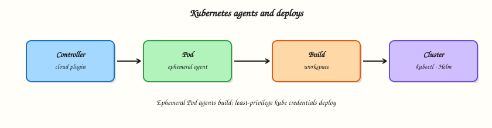

# Kubernetes Agents and Deploys

## Overview

Use the **Kubernetes plugin** and **Pod templates** so each build gets an ephemeral agent Pod.

Then deploy with `kubectl` or Helm from Pipeline using least-privilege cluster access and rollback plans. Requires Kubernetes knowledge from the academy Kubernetes track.

This is a core tutorial in **Module 13 · Kubernetes Agents** of the REBASH Academy **Jenkins for Cloud & DevOps Engineers** series — written for Cloud, DevOps, Platform, and SRE engineers.

## Prerequisites

- Completed prior modules in this track where linked in frontmatter
- [Git](../git/index.md) and [Docker](../docker/index.md) for lab workflows
- Running Jenkins LTS from [Installing Jenkins LTS](installing-jenkins-lts.md) when a live controller is required

## Learning Objectives

By the end of this tutorial, you will be able to:

- [ ] Describe ephemeral Kubernetes agents versus static VMs
- [ ] Sketch a Pod template with build containers
- [ ] Outline kubectl/Helm deploy stages with least privilege
- [ ] Explain rollback approach after a bad deploy

## Architecture

This topic’s control points and relationships are shown below.



## Theory

### What it is

Jenkins Kubernetes cloud provisions a Pod per build (or per stage, depending on config). Containers in the Pod provide tools (Maven, Docker-less build, kubectl). When the build ends, the Pod is deleted — clean workspaces by default. Deploy credentials should be short-lived or narrowly Role-Based Access Control (RBAC) scoped. Helm releases and `kubectl rollout undo` are typical rollback tools.

### Why it matters

Static agent fleets waste capacity and drift. Kubernetes agents scale with queue depth and match cloud-native delivery. Misconfigured cluster credentials from Jenkins are a high-severity finding — treat them like production admin.

### How it works

1. Configure a Kubernetes cloud in Jenkins (cluster URL, credentials, namespace).
2. Define a Pod template YAML (or UI) with a `jnlp` container and build containers.
3. Use `agent { kubernetes { yaml '''…''' } }` in Declarative Pipeline.
4. Deploy with least-privilege ServiceAccount; avoid cluster-admin.
5. Validate rollout; document `rollout undo` / Helm rollback.

See Kubernetes plugin docs linked from jenkins.io plugins and Scaling handbook.

### Key concepts and comparisons

| Piece | Role |
|-------|------|
| Pod template | Agent shape |
| Namespace | Isolation boundary |
| RBAC Role | Deploy permissions |
| Ephemeral Pod | Clean agent lifecycle |

| Bad | Better |
|-----|--------|
| cluster-admin kubeconfig | namespace Role + bind |
| Privileged DinD always | Kaniko/BuildKit patterns |

### Common pitfalls

- Cluster-admin credentials in Jenkins for all jobs.
- Forgetting resource requests/limits — node pressure.
- Long-lived Pods left after aborted builds (watch plugin settings).
- Mixing untrusted PR builds into the production deploy namespace.

## Hands-on Lab

Create a workspace for this tutorial.

```bash
mkdir -p ~/rebash-jenkins/module-13 && cd ~/rebash-jenkins/module-13
```

**Focus:** validate Pod template YAML and a deploy Pipeline stub (cluster optional)

### Step 1 – Primary exercise

```bash
cat > pod-template.yaml << 'EOF'
apiVersion: v1
kind: Pod
spec:
  serviceAccountName: jenkins-agent
  containers:
    - name: jnlp
      image: jenkins/inbound-agent:latest
    - name: kubectl
      image: bitnami/kubectl:latest
      command: ['cat']
      tty: true
EOF
cat > Jenkinsfile << 'EOF'
pipeline {
  agent {
    kubernetes {
      yamlFile 'pod-template.yaml'
    }
  }
  stages {
    stage('Build') {
      steps { sh 'echo build in pod' }
    }
    stage('Deploy') {
      steps {
        container('kubectl') {
          sh 'kubectl -n lab apply -f k8s/ || echo "cluster optional in lab"'
        }
      }
    }
  }
}
EOF
mkdir -p k8s
cat > k8s/deploy.yaml << 'EOF'
apiVersion: apps/v1
kind: Deployment
metadata: { name: demo }
spec:
  replicas: 1
  selector: { matchLabels: { app: demo } }
  template:
    metadata: { labels: { app: demo } }
    spec:
      containers:
        - name: demo
          image: hashicorp/http-echo:1.0
          args: ["-text=hello"]
EOF
# Validate YAML locally if kubectl available
kubectl apply --dry-run=client -f k8s/deploy.yaml 2>/dev/null || python3 -c "import yaml,sys; yaml.safe_load(open('pod-template.yaml')); yaml.safe_load(open('k8s/deploy.yaml')); print('yaml-ok')" 2>/dev/null || echo 'yaml-files-present'
test -f pod-template.yaml && test -f Jenkinsfile
```

### Step 2 – RBAC note

```bash
cat > rbac-notes.md << 'EOF'
# Least privilege
- Role: get/list/watch/create/update/patch on deployments, services in lab ns
- Avoid cluster-admin in Jenkins credentials
- Separate PR CI credentials from prod deploy
EOF
grep cluster-admin rbac-notes.md
```

### Final cleanup

```bash
# Keep ~/rebash-jenkins/ for later tutorials; stop Compose only if you are done with the controller
# docker compose -f ~/rebash-jenkins/module-02/docker-compose.yml down   # optional; omit -v to keep JENKINS_HOME
```

## Validation

- [ ] Lab commands run under `~/rebash-jenkins/module-13/`
- [ ] You can explain each Theory section in your own words
- [ ] You used current Jenkins LTS / Pipeline practices where they apply
- [ ] You can describe one production failure mode for this topic

## Code Walkthrough

Production practice for **Kubernetes Agents and Deploys** always combines:

1. Inspect before you change (status, plan, logs, dry-run)
2. Prefer reversible, documented changes (Git, Jenkinsfile, JCasC)
3. Capture evidence (console logs, plan artefacts) for handovers
4. Prefer current LTS and supported plugins over legacy shortcuts
5. Least privilege — escalate credentials only when required

Keep runbooks short enough to follow under pressure. Automate checks; keep humans for judgement.

## Security Considerations

- Treat Jenkins credentials and cloud tokens as privileged — never commit them
- Keep builds off the built-in node; isolate untrusted pull requests
- Prefer short-lived auth (OIDC-style patterns, scoped RBAC) over long-lived keys
- Validate blast radius before apply/deploy/delete operations
- Collect audit logs; limit who can administer the controller

## Common Mistakes

!!! warning "cluster-admin in Jenkins"
    Scope ServiceAccounts to namespaces and verbs you need.

!!! warning "Privileged pods by default"
    Only add capabilities required for the build tool.

!!! warning "Prod deploys from untrusted PRs"
    Gate deploy stages to protected branches.

## Best Practices

- Encode **Kubernetes Agents and Deploys** changes as code and review them in pull requests
- Prefer Jenkins LTS and pinned agent/tool versions
- Keep builds off the controller; use labelled agents
- Least privilege for credentials and cluster/cloud access
- Destroy or stop lab resources; keep `~/rebash-jenkins/` notes for the track

## Troubleshooting

| Symptom | Likely cause | Fix |
|---------|--------------|-----|
| Job stuck in queue | No matching agent/label or executors busy | Check nodes, labels, and executor counts |
| Checkout / SCM failure | Credentials, URL, or permissions | Verify credential ID and repository access |
| Pipeline CPS / script error | Syntax, sandbox, or library mismatch | Read error line; validate Jenkinsfile; pin library version |
| Plugin / UI broken after update | Incompatible plugin set | Restore backup; disable suspect plugin on test controller |
| Disk full on agent/controller | Workspaces or old builds | Clean workspaces; trim build retention |

## Summary

**Kubernetes Agents and Deploys** is essential for Cloud and DevOps engineers operating Jenkins. Practise the lab until the inspection and change path is muscle memory, then continue the track.

## Interview Questions

1. What advantage do ephemeral Kubernetes agents provide?
2. What is a Pod template in Jenkins?
3. How do you limit deploy permissions from Pipeline?
4. How do you roll back a bad Deployment?
5. Why separate CI and deploy credential sets?

!!! tip "Sample answer — question 1"
    Clean, scalable agents that match queue demand and avoid long-lived VM drift.

!!! tip "Sample answer — question 3"
    Namespace-scoped Roles, dedicated ServiceAccounts, and credentials only on trusted jobs.

## Related Tutorials

- [Course overview](index.md)
- [Testing, Reports, and Quality Gates](testing-reports-and-quality-gates.md)
- [Terraform Pipelines in Jenkins](terraform-pipelines-in-jenkins.md)

## References

- [Scaling Jenkins](https://www.jenkins.io/doc/book/scaling/)
- [Pipeline Syntax — agent](https://www.jenkins.io/doc/book/pipeline/syntax/#agent)
- [Kubernetes plugin](https://plugins.jenkins.io/kubernetes/)
