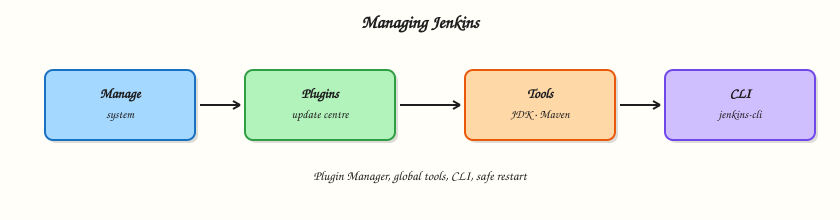

# Managing Jenkins — Plugins, Tools, and CLI

## Overview


Operate day-2 Jenkins: **Manage Jenkins**, **Plugin Manager**, global tool installations, **Jenkins CLI**, reload configuration, and **safeRestart**.

Plugins extend Jenkins but also create upgrade coupling — change them deliberately with a test controller.

This is a core tutorial in **Module 10 · Managing Jenkins** of the REBASH Academy **Jenkins for Cloud & DevOps Engineers** series — written for Cloud, DevOps, Platform, and SRE engineers.

## Prerequisites


- Completed prior modules in this track where linked in frontmatter
- [Git](../git/index.md) and [Docker](../docker/index.md) for lab workflows
- Running Jenkins LTS from [Installing Jenkins LTS](installing-jenkins-lts.md) when a live controller is required

## Learning Objectives


By the end of this tutorial, you will be able to:

- [ ] Navigate Manage Jenkins and Plugin Manager safely
- [ ] Configure a global tool installation
- [ ] Run a Jenkins CLI smoke command
- [ ] Differentiate reload vs safe restart vs hard restart

## Architecture


This topic’s control points and relationships are shown below.



## Theory


### What it is

**Manage Jenkins** is the administrative hub (system, security, plugins, nodes, tools). **Plugin Manager** installs/updates/uninstalls plugins from update centres. **Global tools** define JDK, Maven, NodeJS, etc., for Pipelines via `tools { }`. **Jenkins CLI** (`jenkins-cli.jar`) automates admin tasks over HTTP/SSH. **Safe restart** waits for running builds; reload configuration from disk is narrower.

### Why it matters

Unplanned plugin updates are a leading cause of controller outages. Knowing CLI and safe restart procedures shortens incidents. Tool definitions keep Pipelines portable across agents when used carefully.

### How it works

1. Open Manage Jenkins → Plugins; review Updates vs Available.
2. Prefer staging updates on a clone of `JENKINS_HOME` or a test controller.
3. Configure a JDK under Tools; reference it from a Pipeline `tools` block.
4. Download CLI from the controller and run `help` or `list-plugins`.
5. Use safe restart during a change window.

Handbook: [Managing Jenkins](https://www.jenkins.io/doc/book/managing/).

### Key concepts and comparisons

| Action | Effect |
|--------|--------|
| Reload config | Re-read some config from disk |
| Safe restart | Drain builds, restart JVM |
| Hard restart/kill | Risk aborted builds |
| Plugin update | May require restart |

Pin plugin versions in code later via JCasC / plugin management tools.

### Common pitfalls

- Updating 40 plugins on Friday without snapshot backup.
- Installing unused plugins “just in case” (attack surface).
- Relying on CLI over anonymous access.
- Changing update centre URLs to untrusted mirrors.

## Hands-on Lab


### Objective

Configure a real Jenkins-facing artefact for **Managing Jenkins — Plugins, Tools, and CLI** (Compose controller and/or Jenkinsfile) you can run or import.

### Prerequisites

- Docker Engine for controller labs
- Text editor / shell

### Lab environment

Workspace: `~/rebash-jenkins/module-10`

Local Docker Compose Jenkins LTS where a live UI is needed; file-only Jenkinsfile labs otherwise.

```bash
mkdir -p ~/rebash-jenkins/module-10 && cd ~/rebash-jenkins/module-10
```

### Real-world scenario

Your organisation is standardising **Managing Jenkins — Plugins, Tools, and CLI**. You prototype on a lab controller, keep everything as files, and avoid building on the built-in node in production designs.

### Step-by-step tasks

#### Task 1 – Capture controller/agent mental model files

Document how this topic shows up on a real controller.

```bash
tee scenario.md << 'EOF'
Topic: Managing Jenkins — Plugins, Tools, and CLI
- Controller owns config and orchestration
- Agents execute untrusted build steps
- Prefer Jenkinsfile in SCM over click-ops jobs
EOF
cat scenario.md
mkdir -p jobs && echo 'pipelineJob stub' > jobs/README.txt
```

**Expected output:** scenario.md and jobs/README.txt exist.

#### Task 2 – Write a minimal Declarative stub

Even management topics should leave a Pipeline artefact.

```bash
cat > Jenkinsfile << 'EOF'
pipeline {
  agent any
  stages { stage('OK') { steps { echo 'lab' } } }
}
EOF
grep -n agent Jenkinsfile
```

**Expected output:** Jenkinsfile present with an agent directive.

### Validation steps

- [ ] Artefacts from tasks exist
- [ ] No secrets committed
- [ ] Compose stack stopped if started

### Common errors and fixes

| Error | Cause | Fix |
|-------|-------|-----|
| port 8080 in use | Another Jenkins/lab | Change host port or stop the other container |
| permission denied on volume | Podman/rootless path | Fix volume ownership or use named volumes |
| agent any hangs | No executors | Attach an agent or enable a lab executor carefully |

### Challenge exercise

Disable builds on the built-in node in your notes and document the agent label you would require instead.

### Learning outcomes

- Produced runnable Jenkins artefacts
- Practised safe lab controller hygiene

### Cleanup

```bash
# Keep lab notes under ~/rebash-jenkins/
```

## Validation


- [ ] Lab commands run under `~/rebash-jenkins/module-10/`
- [ ] You can explain each Theory section in your own words
- [ ] You used current Jenkins LTS / Pipeline practices where they apply
- [ ] You can describe one production failure mode for this topic

## Code Walkthrough


Production practice for **Managing Jenkins — Plugins, Tools, and CLI** always combines:

1. Inspect before you change (status, plan, logs, dry-run)
2. Prefer reversible, documented changes (Git, Jenkinsfile, JCasC)
3. Capture evidence (console logs, plan artefacts) for handovers
4. Prefer current LTS and supported plugins over legacy shortcuts
5. Least privilege — escalate credentials only when required

Keep runbooks short enough to follow under pressure. Automate checks; keep humans for judgement.

## Security Considerations


- Treat Jenkins credentials and cloud tokens as privileged — never commit them
- Keep builds off the built-in node; isolate untrusted pull requests
- Prefer short-lived auth (OIDC-style patterns, scoped RBAC) over long-lived keys
- Validate blast radius before apply/deploy/delete operations
- Collect audit logs; limit who can administer the controller

## Common Mistakes


!!! warning "Production plugin updates without backup"
    Backup `JENKINS_HOME` and rehearse on a test controller first.

!!! warning "Anonymous CLI/script consoles"
    Lock down CLI authentication and disable obsolete protocols.

!!! warning "Plugin sprawl"
    Every plugin is upgrade and CVE surface — install only what you operate.

## Best Practices


- Encode **Managing Jenkins — Plugins, Tools, and CLI** changes as code and review them in pull requests
- Prefer Jenkins LTS and pinned agent/tool versions
- Keep builds off the controller; use labelled agents
- Least privilege for credentials and cluster/cloud access
- Destroy or stop lab resources; keep `~/rebash-jenkins/` notes for the track

## Troubleshooting


| Symptom | Likely cause | Fix |
|---------|--------------|-----|
| Job stuck in queue | No matching agent/label or executors busy | Check nodes, labels, and executor counts |
| Checkout / SCM failure | Credentials, URL, or permissions | Verify credential ID and repository access |
| Pipeline CPS / script error | Syntax, sandbox, or library mismatch | Read error line; validate Jenkinsfile; pin library version |
| Plugin / UI broken after update | Incompatible plugin set | Restore backup; disable suspect plugin on test controller |
| Disk full on agent/controller | Workspaces or old builds | Clean workspaces; trim build retention |

## Summary


**Managing Jenkins — Plugins, Tools, and CLI** is essential for Cloud and DevOps engineers operating Jenkins. Practise the lab until the inspection and change path is muscle memory, then continue the track.

## Interview Questions


1. What is the difference between safe restart and reload configuration?
2. How do you roll out plugin updates safely?
3. What does the Pipeline `tools` directive expect to be configured?
4. How do you authenticate Jenkins CLI?
5. Why minimise installed plugins?

!!! tip "Sample answer — question 1"
    Reload re-reads certain config from disk without a full JVM bounce; safe restart drains executors then restarts Jenkins.

!!! tip "Sample answer — question 2"
    Backup, update on a test controller, read plugin changelogs, then change production in a window with smoke tests.

## Related Tutorials


- [Course overview](index.md)
- [Shared Libraries](shared-libraries.md)
- [Securing Jenkins](securing-jenkins.md)

## References


- [Managing Jenkins](https://www.jenkins.io/doc/book/managing/)
- [Plugins](https://www.jenkins.io/doc/book/managing/plugins/)
- [Jenkins CLI](https://www.jenkins.io/doc/book/managing/cli/)
