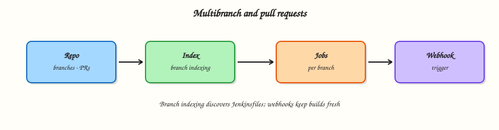

# Multibranch Pipelines and Pull Requests

## Overview

Use **Multibranch Pipeline** jobs so each branch (and often each pull request) gets its own Pipeline from the repository’s Jenkinsfile.

Branch indexing discovers branches; webhooks or periodic scans trigger builds. Organization Folders scale the same idea across many repositories. Credential hygiene matters: PR builds from forks need least privilege.

This is a core tutorial in **Module 7 · Multibranch and PRs** of the REBASH Academy **Jenkins for Cloud & DevOps Engineers** series — written for Cloud, DevOps, Platform, and SRE engineers.

## Prerequisites

- Completed prior modules in this track where linked in frontmatter
- [Git](../git/index.md) and [Docker](../docker/index.md) for lab workflows
- Running Jenkins LTS from [Installing Jenkins LTS](installing-jenkins-lts.md) when a live controller is required

## Learning Objectives

By the end of this tutorial, you will be able to:

- [ ] Explain Multibranch versus a single Pipeline from SCM job
- [ ] Describe branch indexing and webhook/SCM triggers
- [ ] Call out pull request build isolation concerns
- [ ] Recognise when an Organization Folder helps

## Architecture

This topic’s control points and relationships are shown below.



## Theory

### What it is

A **Multibranch Pipeline** project scans an SCM repository for branches (and PR refs when configured) that contain a Jenkinsfile, then creates child jobs automatically. **Branch indexing** is that discovery process. **Organization Folder** scans an org/user/group for repositories. Triggers include SCM webhooks, poll SCM (legacy), and periodic Multibranch scans.

### Why it matters

Manual jobs per branch do not scale. Multibranch keeps feature branches and pull requests under the same definition while preserving separate histories. Platform teams standardise discovery rules (include/exclude branches) so abandoned branches do not clutter forever.

### How it works

1. Create New Item → Multibranch Pipeline.
2. Add a Branch Source (GitHub/Git/GitLab etc.) with credentials.
3. Configure behaviours: discover branches, discover PRs, build origin PRs vs forks carefully.
4. Set build configuration to by Jenkinsfile.
5. Scan repository now; open a branch job and verify.

Docs: [Multibranch](https://www.jenkins.io/doc/book/pipeline/multibranch/) tutorial/handbook sections.

### Key concepts and comparisons

| Mode | Behaviour |
|------|-----------|
| Branch jobs | One job per branch with Jenkinsfile |
| PR discovery | Builds proposed changes |
| Org Folder | Many repos under one folder |
| Webhook | Near real-time; prefer over polling |

| Risk | Mitigation |
|------|------------|
| Fork PR steals secrets | Disable fork builds or use trusted libraries carefully |
| Branch storm | Orphan item strategy; filters |
| Stale index | Webhooks + periodic scan backup |

### Common pitfalls

- Building fork PRs with the same credentials as production deploy jobs.
- No orphaned item strategy — deleted branches leave jobs forever.
- Relying only on poll SCM — slow and chatty.
- Different Jenkinsfile paths undocumented across repos.

## Hands-on Lab

Create a workspace for this tutorial.

```bash
mkdir -p ~/rebash-jenkins/module-07 && cd ~/rebash-jenkins/module-07
```

**Focus:** simulate Multibranch discovery rules with a local repo layout

### Step 1 – Primary exercise

```bash
mkdir -p branches/main branches/feature-x
cp /dev/null branches/main/Jenkinsfile 2>/dev/null || true
cat > branches/main/Jenkinsfile << 'EOF'
pipeline { agent any; stages { stage('Main') { steps { echo 'main' } } } }
EOF
cat > branches/feature-x/Jenkinsfile << 'EOF'
pipeline { agent any; stages { stage('Feature') { steps { echo 'feature-x' } } } }
EOF
cat > multibranch-plan.md << 'EOF'
# Multibranch plan
- Branch source: Git
- Discover branches: all
- Discover PRs: origin only (lab)
- Orphaned item strategy: discard old items after 7 days
- Trigger: webhook preferred; scan fallback hourly
EOF
find branches -name Jenkinsfile | sort
grep -E 'Discover|Orphaned|webhook' multibranch-plan.md
```

### Step 2 – Validate both branch definitions

```bash
grep -R "stage(" branches/*/Jenkinsfile
```

### Final cleanup

```bash
# Keep ~/rebash-jenkins/ for later tutorials; stop Compose only if you are done with the controller
# docker compose -f ~/rebash-jenkins/module-02/docker-compose.yml down   # optional; omit -v to keep JENKINS_HOME
```

## Validation

- [ ] Lab commands run under `~/rebash-jenkins/module-07/`
- [ ] You can explain each Theory section in your own words
- [ ] You used current Jenkins LTS / Pipeline practices where they apply
- [ ] You can describe one production failure mode for this topic

## Code Walkthrough

Production practice for **Multibranch Pipelines and Pull Requests** always combines:

1. Inspect before you change (status, plan, logs, dry-run)
2. Prefer reversible, documented changes (Git, Jenkinsfile, JCasC)
3. Capture evidence (console logs, plan artefacts) for handovers
4. Prefer current LTS and supported plugins over legacy shortcuts
5. Least privilege — escalate credentials only when required

Keep runbooks short enough to follow under pressure. Automate checks; keep humans for judgement.

## Security Considerations

- Treat Jenkins credentials and cloud tokens as privileged — never commit them
- Keep builds off the built-in node; isolate untrusted pull requests
- Prefer short-lived auth (OIDC-style patterns, scoped RBAC) over long-lived keys
- Validate blast radius before apply/deploy/delete operations
- Collect audit logs; limit who can administer the controller

## Common Mistakes

!!! warning "Fork PR builds with deploy credentials"
    Separate trusted vs untrusted Multibranch projects; never let forks apply production credentials.

!!! warning "No orphan cleanup"
    Configure orphaned item strategies so deleted branches do not accumulate jobs.

!!! warning "Poll SCM only"
    Use webhooks for timely builds; keep a slow scan as backup.

## Best Practices

- Encode **Multibranch Pipelines and Pull Requests** changes as code and review them in pull requests
- Prefer Jenkins LTS and pinned agent/tool versions
- Keep builds off the controller; use labelled agents
- Least privilege for credentials and cluster/cloud access
- Destroy or stop lab resources; keep `~/rebash-jenkins/` notes for the track

## Troubleshooting

| Symptom | Likely cause | Fix |
|---------|--------------|-----|
| Job stuck in queue | No matching agent/label or executors busy | Check nodes, labels, and executor counts |
| Checkout / SCM failure | Credentials, URL, or permissions | Verify credential ID and repository access |
| Pipeline CPS / script error | Syntax, sandbox, or library mismatch | Read error line; validate Jenkinsfile; pin library version |
| Plugin / UI broken after update | Incompatible plugin set | Restore backup; disable suspect plugin on test controller |
| Disk full on agent/controller | Workspaces or old builds | Clean workspaces; trim build retention |

## Summary

**Multibranch Pipelines and Pull Requests** is essential for Cloud and DevOps engineers operating Jenkins. Practise the lab until the inspection and change path is muscle memory, then continue the track.

## Interview Questions

1. What problem does Multibranch Pipeline solve?
2. What is branch indexing?
3. How should fork pull requests be treated for secrets?
4. When do you use an Organization Folder?
5. Webhook versus poll SCM — which do you prefer and why?

!!! tip "Sample answer — question 1"
    It automatically creates and maintains per-branch (and optionally per-PR) Pipeline jobs from Jenkinsfiles in SCM.

!!! tip "Sample answer — question 3"
    Treat fork PRs as untrusted: limited credentials, no deploy secrets, or disable fork discovery.

## Related Tutorials

- [Course overview](index.md)
- [Agents, Nodes, and Executors](agents-nodes-and-executors.md)
- [Docker with Jenkins Pipeline](docker-with-jenkins-pipeline.md)

## References

- [Multibranch Pipeline tutorial](https://www.jenkins.io/doc/book/pipeline/multibranch/)
- [Pipeline chapter](https://www.jenkins.io/doc/book/pipeline/)
- [GitHub Branch Source](https://www.jenkins.io/doc/book/pipeline/getting-started/)
