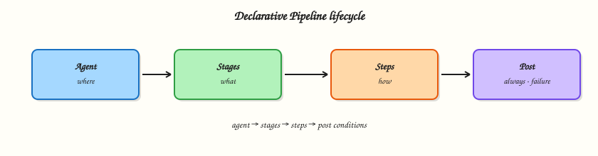

# Pipeline Fundamentals (Declarative)

## Overview

Click-built automation does not survive team growth. **Pipeline** expresses CI/CD as code: **stages**, **steps**, an **agent**, and **post** actions that always run cleanup or notifications. **Declarative Pipeline** is the structured `pipeline { }` syntax most teams should start with; **Scripted Pipeline** remains available for advanced cases.

This tutorial teaches the core directives, contrasts Declarative versus Scripted, and points you at the official [Pipeline Syntax](https://www.jenkins.io/doc/book/pipeline/syntax/) reference. You will run a real Declarative job on your lab controller and keep the definition under `~/rebash-jenkins/module-04`.

This is **Tutorial 4** in **Module 4: Pipeline Fundamentals** of the REBASH Academy **Jenkins for Cloud & DevOps Engineers** series — written for Cloud, DevOps, Platform, and Site Reliability Engineering (SRE) engineers.

## Prerequisites

- [Using Jenkins — Jobs, Views, and Folders](using-jenkins-jobs-views-and-folders.md)
- Running Jenkins LTS with the Pipeline plugins (suggested plugins from Module 2)
- Comfort editing Groovy-like Pipeline syntax in a text editor

## Learning Objectives

By the end of this tutorial, you will be able to:

- [ ] Explain Pipeline, node/agent, stage, step, and post
- [ ] Author a Declarative Pipeline with `agent`, `stages`, `steps`, and `post`
- [ ] Contrast Declarative versus Scripted and know when Scripted appears
- [ ] Use Pipeline Syntax / Snippet Generator ideas without memorising every step
- [ ] Run and debug a Pipeline job from console output

## Architecture

A Declarative Pipeline selects an agent, runs ordered stages of steps, then executes `post` conditions.



## Theory

### What it is

A **Pipeline** is a user-defined automation in Jenkins, typically checked into source control later as a `Jenkinsfile`. Under the hood Jenkins uses a **Pipeline** job type and the Pipeline plugin family.

Core ideas:

| Concept | Meaning |
|---------|---------|
| Agent | Where the Pipeline runs (`any`, label, docker, none, …) |
| Stage | Named phase shown in Stage View (Build, Test, Deploy) |
| Step | Smallest action (`echo`, `sh`, `checkout`, …) |
| Post | Actions after the Pipeline (or stage) based on result |
| Node | Scripted term for allocating an executor (Declarative uses `agent`) |

**Declarative Pipeline** wraps everything in `pipeline { }` with a fixed structure: `agent`, optional `environment` / `options` / `parameters`, required `stages`, optional `post`. **Scripted Pipeline** is mostly imperative Groovy in `node { }` blocks — powerful, easier to make unreadable, harder for newcomers.

### Why it matters

Pipeline-as-code is how changes get reviewed, reused, and recovered. Declarative’s structure gives teams a shared shape: every job has visible stages and predictable `post` cleanup. Scripted still powers some shared libraries and edge cases; you should recognise it, not start there.

Without understanding `agent`, builds land on the built-in node. Without `post`, failures skip cleanup and notifications. Without stages, the UI becomes a single opaque console blob.

### How it works

Minimal Declarative shape:

```groovy
pipeline {
  agent any
  stages {
    stage('Build') {
      steps {
        echo 'compile'
      }
    }
    stage('Test') {
      steps {
        echo 'test'
      }
    }
  }
  post {
    always {
      echo "Result: ${currentBuild.currentResult}"
    }
    failure {
      echo 'Notify or collect diagnostics here'
    }
  }
}
```

Execution model:

1. Jenkins loads the Pipeline definition (UI script or SCM — Module 5).
2. The top-level `agent` allocates an executor (unless `agent none` and per-stage agents).
3. Stages run in order (unless `parallel`).
4. Steps inside each stage run sequentially by default.
5. `post` conditions run (`always`, `success`, `failure`, `unstable`, `changed`, …).

**Pipeline Syntax** (job → Pipeline Syntax) helps generate step snippets. Prefer reading the [syntax reference](https://www.jenkins.io/doc/book/pipeline/syntax/) over inventing directives.

**Why Pipeline-as-code:** the same file can run for every branch (Multibranch), appear in pull requests, and be tested on a personal controller before production.

### Key concepts and comparisons

| Declarative | Scripted |
|-------------|----------|
| `pipeline { }` | `node { }` / Groovy control flow |
| Opinionated sections | Fully flexible |
| Better for most app teams | Useful inside some libraries / complex orchestration |
| Validation of required sections | Easier to write unstructured scripts |

| Directive | Role |
|-----------|------|
| `agent any` | Run on any available executor (labs only — prefer labels in prod) |
| `agent none` | No global agent; each stage declares its own |
| `options { timestamps() }` | Common Pipeline options |
| `environment { … }` | Env vars for the Pipeline |
| `parameters { … }` | Manual/input parameters (deeper in Module 5) |

| Step family | Examples |
|-------------|----------|
| Flow | `echo`, `error`, `timeout` |
| Shell | `sh`, `bat`, `powershell` |
| SCM | `checkout`, `git` (plugin-dependent) |

### Common pitfalls

- Putting heavy logic in Scripted when Declarative + shared library steps would do.
- Using `agent any` in production and building on the controller.
- Forgetting `post { always { } }` for cleanup.
- Treating Stage View colours as proof without reading console errors.
- Copy-pasting Scripted samples into a Declarative job without restructuring.

## Hands-on Lab

### Objective

Author a multi-stage Declarative Pipeline on disk, load it into a Pipeline job under `rebash-demo`, run it, and capture console evidence.

### Prerequisites

- Module 2 controller running
- Folder `rebash-demo` from Module 3 (create it if missing)
- Pipeline plugins installed

### Lab environment

Workspace: `~/rebash-jenkins/module-04`

```bash
mkdir -p ~/rebash-jenkins/module-04 && cd ~/rebash-jenkins/module-04
set -euo pipefail
curl -sS -o /dev/null -w "%{http_code}\n" http://127.0.0.1:8080/login | tee controller-login.txt
```

**Expected output:** HTTP response code from the controller.

### Real-world scenario

Your squad must replace a Freestyle “build and hope” job with a Declarative Pipeline that shows Build → Test → Package stages and always prints the final result. Platform review will not accept Scripted spaghetti for this service.

### Step-by-step tasks

#### Task 1 – Write a Declarative Jenkinsfile on disk

Run:

```bash
cd ~/rebash-jenkins/module-04
set -euo pipefail
```

Create `Jenkinsfile`:

```groovy
pipeline {
  agent any
  options {
    timestamps()
    disableConcurrentBuilds()
  }
  environment {
    APP_NAME = 'rebash-demo'
  }
  stages {
    stage('Build') {
      steps {
        echo "Building ${env.APP_NAME}"
        sh 'mkdir -p dist && echo "artifact" > dist/app.txt && ls -l dist'
      }
    }
    stage('Test') {
      steps {
        echo 'Running unit placeholder'
        sh 'test -f dist/app.txt'
        sh 'grep -q artifact dist/app.txt'
      }
    }
    stage('Package') {
      steps {
        echo 'Packaging placeholder'
        sh 'tar -czf dist/app.tgz -C dist app.txt && ls -l dist/app.tgz'
      }
    }
  }
  post {
    always {
      echo "Pipeline finished with ${currentBuild.currentResult}"
    }
    success {
      echo 'All stages green'
    }
    failure {
      echo 'Investigate console output for the red stage'
    }
  }
}
```

Verify:

```bash
grep -q 'pipeline {' Jenkinsfile
grep -q 'stage('\''Build'\'')' Jenkinsfile || grep -q 'stage("Build")' Jenkinsfile || grep -q "stage('Build')" Jenkinsfile
grep -q 'post {' Jenkinsfile
wc -l Jenkinsfile | tee jenkinsfile-lines.txt
```

**Expected output:** Non-zero line count; structure checks pass.

#### Task 2 – Create or update the Pipeline job

In Jenkins:

1. Open folder **rebash-demo** (create if needed).
2. **New Item** → `declarative-basics` → **Pipeline** (or configure an existing job).
3. Definition: **Pipeline script**.
4. Paste the contents of `~/rebash-jenkins/module-04/Jenkinsfile`.
5. Save.

Run:

```bash
cd ~/rebash-jenkins/module-04
set -euo pipefail
```

Create `job-config.yaml`:

```yaml
folder: rebash-demo
job: declarative-basics
definition: pipeline_script_ui
source_of_truth: ~/rebash-jenkins/module-04/Jenkinsfile
next_module: jenkinsfile-in-scm
```

Validate and archive:

```bash
python3 -c "
import yaml
with open('job-config.yaml') as f:
    d = yaml.safe_load(f)
assert d['job'] == 'declarative-basics'
print('job-config.yaml OK')
" | tee job-config-validate.txt
```

**Expected output:** Job saved; `job-config.yaml` validates.

#### Task 3 – Run the Pipeline and capture console proof

1. **Build Now**.
2. Open the build → confirm Stage View shows Build, Test, Package.
3. Open **Console Output**.

Run:

```bash
cd ~/rebash-jenkins/module-04
set -euo pipefail
```

Create `expected-console-markers.txt`:

```text
Building rebash-demo
Running unit placeholder
Packaging placeholder
Pipeline finished with
All stages green
```

Create `assert-console.sh`:

```bash
#!/usr/bin/env bash
set -euo pipefail
LOG="${1:-console.log}"
test -f "$LOG" || { echo "missing $LOG — paste Console Output first"; exit 1; }
while IFS= read -r marker; do
  grep -q "$marker" "$LOG" || { echo "missing marker: $marker"; exit 1; }
done < expected-console-markers.txt
echo "console markers OK"
```

Verify:

```bash
chmod +x assert-console.sh

# Local syntax sanity (not a Jenkins validator, but catches truncation)
grep -c 'stage' Jenkinsfile | tee stage-count.txt
test "$(cat stage-count.txt)" -ge 3
```

**Expected output:** At least three `stage` occurrences; after a Jenkins run, paste Console Output to `console.log` and run `./assert-console.sh console.log`.

#### Task 4 – Break-fix drill (optional but recommended)

Temporarily change the Test stage to `sh 'false'`, Save, Build Now, observe `failure` post, then restore the good `Jenkinsfile` and rebuild.

Run:

```bash
cd ~/rebash-jenkins/module-04
set -euo pipefail

cp Jenkinsfile Jenkinsfile.good
```

Create `Jenkinsfile.fail`:

```groovy
pipeline {
  agent any
  options { timestamps() }
  environment { APP_NAME = 'rebash-demo' }
  stages {
    stage('Build') {
      steps {
        sh 'mkdir -p dist && echo artifact > dist/app.txt'
      }
    }
    stage('Test') {
      steps {
        sh 'false'
      }
    }
  }
  post {
    failure {
      echo 'Investigate console output for the red stage'
    }
  }
}
```

Verify:

```bash
grep -q "sh 'false'" Jenkinsfile.fail
grep -q 'Investigate console' Jenkinsfile.fail
diff -q Jenkinsfile Jenkinsfile.good && echo 'good copy retained' | tee failure-drill.txt
```

**Expected output:** Failing variant and good copy on disk; swap into the job to observe FAILURE, then restore `Jenkinsfile.good`.

### Validation steps

- [ ] `Jenkinsfile` contains `agent`, three stages, and `post`
- [ ] Job `rebash-demo/declarative-basics` ran at least once
- [ ] You can point to Build / Test / Package in Stage View
- [ ] You know where Pipeline Syntax lives in the job UI

### Common errors and fixes

| Error | Cause | Fix |
|-------|-------|-----|
| `Expected a stage` / parse errors | Scripted mixed into Declarative | Follow `pipeline { stages { stage { steps }}}` |
| Queued forever | No executors | Enable lab executor or add agent |
| `sh` not found on Windows agent | Wrong agent OS | Use `bat` or a Linux agent |
| Stages missing in UI | Build failed at parse time | Read console from the top |

### Challenge exercise

Add a `parallel` test block under a `stage('Test')` with two steps `Unit` and `Lint` (each `echo` is enough). Keep Declarative valid per [syntax parallel](https://www.jenkins.io/doc/book/pipeline/syntax/#parallel). Save as `Jenkinsfile.parallel` and run it in a second job `declarative-parallel`.

### Learning outcomes

- Wrote and ran a Declarative Pipeline with post conditions
- Separated Build / Test / Package stages
- Practised reading console output on failure
- Prepared the file for SCM checkout in Module 5

### Cleanup

Keep `declarative-basics` and the Module 2 volume. Remove only experimental failing jobs you no longer need.

```bash
ls ~/rebash-jenkins/module-04
```

## Validation

- [ ] Lab completed under `~/rebash-jenkins/module-04/`
- [ ] You can sketch agent → stages → steps → post from memory
- [ ] You can explain Declarative versus Scripted in two sentences
- [ ] You can name one production risk of `agent any`

## Code Walkthrough

1. **Start Declarative** — `pipeline { }` before free-form Groovy.
2. **Name stages for humans** — Stage View is an operations tool.
3. **Assert in `sh`** — `test`/`grep -q` fail the stage loudly.
4. **Always write `post`** — success paths forget cleanup; `always` does not.
5. **Move to SCM next** — UI Pipeline script is a stepping stone, not the destination.

## Security Considerations

- `agent any` may schedule on the built-in node — prefer labels before production.
- Pipeline scripts can run arbitrary shell — treat untrusted PRs as hostile (Module 7).
- Do not embed credentials in `environment` as plain text; use credentials bindings later.
- Console output is visible to anyone with read access to the job — avoid echoing secrets.
- Limit who can configure Pipeline jobs that deploy.

## Common Mistakes

!!! warning "Scripted Pipeline as the default teaching path"
    New teams get lost in Groovy. **Fix:** Declarative first; Scripted when a shared library truly needs it.

!!! warning "One giant stage named Build"
    Triage becomes guesswork. **Fix:** split Build / Test / Package (or Deploy) stages.

!!! warning "No post block"
    Failed builds skip notifications and workspace cleanup. **Fix:** at least `post { always { … } }`.

!!! warning "Ignoring Pipeline Syntax reference"
    Invented directives waste hours. **Fix:** use [Pipeline Syntax](https://www.jenkins.io/doc/book/pipeline/syntax/) and the in-product Snippet Generator.

## Best Practices

- Keep Pipelines Declarative and boringly structured.
- Prefer labelled agents over `any` outside personal labs.
- Fail fast with simple shell asserts.
- Use `options { timestamps() }` for readable logs.
- Check the same `Jenkinsfile` into Git in the next module.

## Troubleshooting

| Symptom | Likely cause | Fix |
|---------|--------------|-----|
| `Invalid agent type` | Typo / missing plugin | Check syntax; install Docker Pipeline only when using `agent { docker }` |
| Stage skipped unexpectedly | `when` conditions (later) | Read stage headers in console |
| `workspace` issues | Concurrent builds | `disableConcurrentBuilds()` or unique dirs |
| Groovy `RejectedAccessException` | Script security sandbox | Approve signatures carefully on test controllers only |
| Post not running | Parse failure before runtime | Fix syntax first |

## Summary

Declarative Pipeline gives a clear agent → stages → steps → post model that teams can review and operate. Run it in the UI now; next you will move the same file into Git. Continue with [Jenkinsfile in SCM](jenkinsfile-in-scm.md).

## Interview Questions

**1. What is the difference between Declarative and Scripted Pipeline?**

??? success "Reveal answer"
    Declarative uses a structured `pipeline { }` with required sections such as `agent` and `stages`. Scripted is primarily imperative Groovy inside `node` blocks. Declarative is the default for application teams; Scripted appears in advanced libraries and complex control flow.

**2. What does the `agent` directive control?**

??? success "Reveal answer"
    Where the Pipeline (or stage) executes — which node label, Docker image, or whether no global agent is allocated (`agent none`). It determines isolation and tool availability.

**3. Why split work into stages instead of one `sh` script?**

??? success "Reveal answer"
    Stages appear in Stage View, clarify failure location, allow per-stage agents/options, and make pipelines readable in pull requests. Operators debug by red stage, not by scrolling a monolith.

**4. What is `post { always { } }` for?**

??? success "Reveal answer"
    It runs regardless of success or failure — ideal for cleanup, archiving, and unconditional logging. `success` / `failure` blocks add result-specific notifications.

**5. Why is `agent any` risky in production?**

??? success "Reveal answer"
    It can schedule on the built-in controller node if executors exist there, coupling untrusted build steps to the control plane. Production Pipelines should target labelled agents or ephemeral cloud agents.

**6. How does Pipeline-as-code help compared with Freestyle?**

??? success "Reveal answer"
    The definition is reviewable in Git, reusable across branches, easier to recover after controller loss, and consistent with Multibranch. Freestyle hides logic in UI checkboxes.

**7. Where do you look when a Declarative Pipeline fails?**

??? success "Reveal answer"
    Open the failing build’s Stage View to see the red stage, then Console Output for the exact step error. Parse errors appear at the top before stages run.

**8. When might you still use Scripted Pipeline?**

??? success "Reveal answer"
    When implementing complex shared-library orchestration or dynamic stage generation that is awkward in pure Declarative. Even then, keep application Jenkinsfiles Declarative and hide Scripted inside trusted libraries.

## Related Tutorials

- [Using Jenkins — Jobs, Views, and Folders](using-jenkins-jobs-views-and-folders.md)
- [Jenkinsfile in SCM](jenkinsfile-in-scm.md)
- [Docker with Jenkins Pipeline](docker-with-jenkins-pipeline.md)

## References

- [Pipeline Syntax](https://www.jenkins.io/doc/book/pipeline/syntax/)
- [Pipeline Getting Started](https://www.jenkins.io/doc/pipeline/tour/getting-started/)
- [Pipeline Steps reference](https://www.jenkins.io/doc/pipeline/steps/)
- [Jenkins User Documentation](https://www.jenkins.io/doc/)
