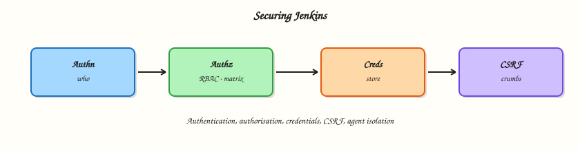

# Securing Jenkins

## Overview

A Jenkins controller is a privileged orchestration plane: it holds **credentials**, can deploy to clusters, and executes Pipeline code. Securing it means getting **authentication** and **authorisation** right, using the **credentials store**, keeping **Cross-Site Request Forgery (CSRF)** protection on, isolating builds from the controller, and practising Multibranch credential hygiene so untrusted pull requests never see production secrets.

This is **Tutorial 11** in **Module 11: Securing Jenkins** of the REBASH Academy **Jenkins for Cloud & DevOps Engineers** series — written for Cloud, DevOps, Platform, DevSecOps, and Site Reliability Engineering (SRE) engineers. Handbook: [Securing Jenkins](https://www.jenkins.io/doc/book/security/).

## Prerequisites

- [Managing Jenkins — Plugins, Tools, and CLI](managing-jenkins-plugins-tools-and-cli.md)
- Lab controller you administer (do not harden a shared production host without change control)
- Modules 6–7 concepts: built-in executors and PR trust tiers

## Learning Objectives

By the end of this tutorial, you will be able to:

- [ ] Distinguish authentication from authorisation in Jenkins
- [ ] Outline matrix / role-based strategies at a practical level
- [ ] Store and reference credentials without embedding secrets in jobs
- [ ] Verify CSRF protection and markup formatter basics
- [ ] Apply a controller-isolation and Multibranch hygiene checklist

## Architecture

Users authenticate; authorisation gates actions; credentials inject at runtime on isolated agents.



## Theory

### What it is

**Authentication** answers who you are (Jenkins’ own user database, Lightweight Directory Access Protocol (LDAP), Security Assertion Markup Language (SAML), OpenID Connect (OIDC), GitHub App, …).

**Authorisation** answers what you may do. Common models:

| Strategy | Idea |
|----------|------|
| Logged-in users can do anything | Lab-only anti-pattern for shared controllers |
| Matrix Authorization | Permissions grid per user/group |
| Role-based (Role Strategy plugin) | Roles mapped to users/groups; folder-aware setups common |
| Folder-scoped permissions | Teams administer inside their folder only |

**Credentials store** holds secrets (secret text, username/password, SSH keys, certificates) encrypted under `JENKINS_HOME`, referenced by **ID** from Pipeline (`withCredentials`, credential bindings, `credentials()` in `environment` where supported).

**CSRF** crumbs prevent forged browser requests from other sites while you are logged into Jenkins. Keep protection enabled.

**Markup formatter** controls whether job descriptions allow HTML — unsafe HTML enables stored XSS if untrusted users can edit descriptions.

**Controller isolation** means zero (or near-zero) executors on the built-in node and privileged work only on labelled agents.

### Why it matters

Compromised Jenkins equals compromised delivery: cloud keys, Kubernetes configs, and production SSH. Most “Jenkins breaches” are exposed UIs, over-powered accounts, secrets in Freestyle builders, or PR builds on privileged agents — not exotic zero-days.

### How it works

1. Enable security realm (who logs in).
2. Choose authorisation strategy; remove anonymous Overall/Administer.
3. Create personal users or sync groups; avoid shared `admin` for daily work.
4. Put secrets in Credentials (folder scope when multi-tenant).
5. Pipelines reference credential IDs; agents receive ephemeral env/files.
6. Multibranch: production deploy credentials live in folders that untrusted PR jobs cannot access — or use separate controllers/folders entirely.
7. Keep CSRF on; restrict who can run Groovy script console.

### Key concepts and comparisons

| Bad practice | Better |
|--------------|--------|
| Secrets in Jenkinsfile | Credentials ID |
| Anonymous read + job configure | Authenticated least privilege |
| Everyone Administer | Matrix/roles + folder admins |
| PR jobs in prod-creds folder | Separate CI folder/agent pool |
| Built-in executors > 0 | Executors = 0 |

| Credential type | Typical use |
|-----------------|-------------|
| Secret text | API tokens |
| Username/password | Registries, basic Git |
| SSH private key | Git over SSH, some hosts |
| Secret file | kubeconfig (prefer short-lived OIDC patterns when possible) |

### Common pitfalls

- “Security disabled” left on from a hurried lab.
- Anonymous Overall/Read on internet-facing controllers.
- Script Console open to non-admins.
- Folder credentials inherited into Multibranch PR jobs unintentionally.
- Disabling CSRF “because the CLI was annoying” without fixing auth properly.

## Hands-on Lab

### Objective

Produce a hardening checklist against your lab controller, create a folder-scoped credential (dummy value), reference it from a Pipeline without printing the secret, and verify CSRF and built-in executor posture with validated YAML and shell checks.

### Prerequisites

- Admin on lab Jenkins
- Ability to create folders and credentials

### Lab environment

Workspace: `~/rebash-jenkins/module-11`

``` {.bash .ra-terminal title="Terminal"}
mkdir -p ~/rebash-jenkins/module-11 && cd ~/rebash-jenkins/module-11
set -euo pipefail
curl -sS -o /dev/null -w "%{http_code}\n" http://127.0.0.1:8080/login | tee controller.txt
```

### Real-world scenario

Security review requires evidence that anonymous users cannot configure jobs, CSRF is enabled, production-like secrets are not in Git, and built-in builds are disabled.

### Step-by-step tasks

#### Task 1 – Security posture as YAML

In UI: Manage Jenkins → Security. Record realm and authorisation strategy in the YAML keys below.

Run:

``` {.bash .ra-terminal title="Terminal"}
cd ~/rebash-jenkins/module-11
set -euo pipefail
```

Create `security-policy.yaml`:

```yaml title="security-policy.yaml"
authentication:
  realm: fill_from_ui
  admin_account_count: fill_from_ui
authorisation:
  strategy: fill_from_ui
  anonymous_administer: false
  anonymous_job_build: fill_from_ui
csrf:
  prevent_csrf: true
markup:
  formatter: fill_from_ui
controller_isolation:
  builtin_executors_target: 0
  privileged_agent_labels: fill_from_ui
script_console:
  access: administer_only
```

Validate and archive:

``` {.bash .ra-terminal title="Terminal"}
python3 -c "
import yaml
with open('security-policy.yaml') as f:
    d = yaml.safe_load(f)
assert d['csrf']['prevent_csrf'] is True
assert d['authorisation']['anonymous_administer'] is False
print('security-policy.yaml OK')
" | tee security-policy-validate.txt
```

!!! example "Expected output"
    YAML validates required keys; fill UI values after inspection.


#### Task 2 – Folder-scoped dummy credential

1. Open folder `rebash-demo` (create if needed) → Credentials → Add.
2. Kind: Secret text. ID: `rebash-demo-dummy`. Secret: `not-a-real-secret`.
3. Scope: folder (not global) if offered.

Run:

``` {.bash .ra-terminal title="Terminal"}
cd ~/rebash-jenkins/module-11
set -euo pipefail
```

Create `credential-config.yaml`:

```yaml title="credential-config.yaml"
id: rebash-demo-dummy
kind: secret_text
scope: folder_rebash-demo
rotation_owner: platform-lab
value_storage: jenkins_credentials_store_only
```

Create `creds-pipeline.Jenkinsfile`:

```groovy title="creds-pipeline.Jenkinsfile"
pipeline {
  agent any
  stages {
    stage('Use credential safely') {
      steps {
        withCredentials([string(credentialsId: 'rebash-demo-dummy', variable: 'DEMO_SECRET')]) {
          sh '''
            test -n "$DEMO_SECRET"
            # Prove length only — never echo the secret
            python3 - <<'PY' || awk 'BEGIN{exit 0}'
import os
s=os.environ.get("DEMO_SECRET","")
print("secret_length=", len(s))
if s == "":
    raise SystemExit(1)
PY
          '''
        }
      }
    }
  }
}
```

Create job `rebash-demo/creds-safe-demo` with this script and build it. Console must **not** print `not-a-real-secret`.

!!! example "Expected output"
    Build success; length line only.


#### Task 3 – Multibranch hygiene policy

Run:

``` {.bash .ra-terminal title="Terminal"}
cd ~/rebash-jenkins/module-11
set -euo pipefail
```

Create `multibranch-hygiene.yaml`:

```yaml title="multibranch-hygiene.yaml"
prod_deploy_credentials_separate_from_pr_jobs: true
fork_pr_discovery: disabled_or_sandboxed_agents
jenkinsfile_prod_credential_ids: forbidden_for_pr_jobs
credential_ids_documented: true
builtin_executors: 0
lab_decision: fill_after_controller_review
```

Validate and archive:

``` {.bash .ra-terminal title="Terminal"}
python3 -c "
import yaml
with open('multibranch-hygiene.yaml') as f:
    d = yaml.safe_load(f)
assert d['prod_deploy_credentials_separate_from_pr_jobs']
print('multibranch-hygiene.yaml OK')
" | tee mb-hygiene-validate.txt
```

!!! example "Expected output"
    Hygiene YAML validates.


#### Task 4 – Evidence pack

Run:

``` {.bash .ra-terminal title="Terminal"}
cd ~/rebash-jenkins/module-11
set -euo pipefail
```

Create `hardening-checks.sh`:

```bash title="hardening-checks.sh"
#!/usr/bin/env bash
set -euo pipefail
python3 -c "
import yaml
for f in ('security-policy.yaml','multibranch-hygiene.yaml','credential-config.yaml'):
    yaml.safe_load(open(f))
print('yaml_bundle_ok')
"
grep -q 'withCredentials' creds-pipeline.Jenkinsfile
grep -q 'secret_length' creds-pipeline.Jenkinsfile
echo hardening_checks_ok
```

Validate and archive:

``` {.bash .ra-terminal title="Terminal"}
chmod +x hardening-checks.sh
./hardening-checks.sh | tee hardening-checks.txt

tar -czf module-11-evidence.tgz security-policy.yaml multibranch-hygiene.yaml credential-config.yaml creds-pipeline.Jenkinsfile hardening-checks.sh *.txt
ls -l module-11-evidence.tgz | tee evidence.txt
```

!!! example "Expected output"
    Archive without real secrets.


### Validation steps

- [ ] CSRF confirmed enabled
- [ ] Dummy credential used via `withCredentials` without echoing value
- [ ] Multibranch hygiene YAML validates
- [ ] `hardening-checks.sh` passes locally
- [ ] Built-in executor policy recorded

### Common errors and fixes

| Error | Cause | Fix |
|-------|-------|-----|
| Credentials unavailable | Wrong folder scope | Add creds where the job runs |
| `withCredentials` missing | Plugin/step not installed | Install Credentials Binding |
| Secret appears in logs | `echo $SECRET` | Print length/hash only |
| Locked yourself out | Authz misconfig | Use disable-security recovery patterns offline on lab only |

### Challenge exercise

Create two users (or simulate with RBAC): `dev-user` with Job/Build in `rebash-demo` only, and ensure they cannot access Manage Jenkins. Capture the matrix or role strategy as `rbac-matrix.yaml` with required permission keys validated by Python.

### Learning outcomes

- Mapped authn vs authz on a real controller
- Practised safe credential binding
- Documented Multibranch secret boundaries
- Reinforced controller isolation

### Cleanup

``` {.bash .ra-terminal title="Terminal"}
# Delete dummy credential after lab if desired
ls ~/rebash-jenkins/module-11
```

## Validation

- [ ] Lab completed under `~/rebash-jenkins/module-11/`
- [ ] You can explain CSRF’s purpose
- [ ] You can place secrets in the store, not Git
- [ ] You can describe one PR credential failure mode

## Code Walkthrough

1. **Authenticate people, authorise actions** — separately.
2. **Credentials by ID** — never literals in Jenkinsfiles.
3. **Folder scope for multi-team** — reduce blast radius.
4. **CSRF stays on** — fix clients properly.
5. **PR trust tiers** — separate folders/agents/creds.

## Security Considerations

- Internet-facing Jenkins needs TLS, SSO, and aggressive authz — not just “installed.”
- Script Console is root-equivalent — Administer only.
- Backup encryption and access control matter; `JENKINS_HOME` contains credential ciphertext.
- Agent compromise leaks whatever credentials a job injects — minimise scopes.
- Audit plugin versions with known CVEs as part of operations.

## Common Mistakes

!!! warning "Anonymous users can Administer"
    Trivial takeover. **Fix:** review Authorization matrix immediately.

!!! warning "Secrets in Multibranch folder shared with fork PRs"
    Untrusted code reads prod IDs. **Fix:** split folders/controllers; sandbox PR CI.

!!! warning "Disabling CSRF for convenience"
    Session-riding attacks. **Fix:** keep CSRF; use API tokens for automation.

!!! warning "Shared admin password on sticky notes"
    No accountability. **Fix:** SSO + personal accounts + break-glass admin.

## Best Practices

- SSO for humans; API tokens for automation with rotation.
- Role Strategy or equivalent for folder tenancy.
- Regular credential rotation and ownership tags.
- Zero built-in executors in production.
- Threat-model Multibranch before enabling fork PRs.

## Troubleshooting

| Symptom | Likely cause | Fix |
|---------|--------------|-----|
| 403 on every POST | CSRF/token issues | Re-login; update CLI auth |
| Creds not found | Scope/ID typo | Match folder + ID |
| Users can see all jobs | Authz too open | Tighten matrix/roles |
| Builds on controller | Executors > 0 | Set 0; force labels |

## Summary

Secure Jenkins by authenticating strongly, authorising narrowly, storing secrets in the credentials system, keeping CSRF on, and isolating untrusted Pipelines from the controller and production credentials. Next: [Testing, Reports, and Quality Gates](testing-reports-and-quality-gates.md).

## Interview Questions

**1. What is the difference between authentication and authorisation in Jenkins?**

??? success "Reveal answer"
    Authentication establishes identity (login). Authorisation decides which Jenkins permissions that identity has (read, build, configure, administer).

**2. Why use the credentials store instead of environment literals?**

??? success "Reveal answer"
    Secrets stay encrypted in `JENKINS_HOME`, are access-controlled, rotatable, and injected at runtime without appearing in Git. Literals leak via repos, config history, and logs.

**3. What does CSRF protection prevent?**

??? success "Reveal answer"
    It prevents other websites from tricking a browser that is already logged into Jenkins into performing state-changing requests (forged builds, config changes) without a valid crumb/token.

**4. How do matrix and role strategies differ at a high level?**

??? success "Reveal answer"
    Matrix assigns permissions directly to users/groups in a grid. Role strategies define named roles with permission sets, then assign users/groups to roles — often easier at scale and with folders.

**5. Why is Script Console dangerous?**

??? success "Reveal answer"
    It can execute arbitrary Groovy with high privilege on the controller — effectively full compromise. Restrict to Administer and monitor usage.

**6. How should production credentials be handled for Multibranch PR builds?**

??? success "Reveal answer"
    Keep them out of folders/stores that untrusted PR jobs can access. Use separate CI credentials and agents for PRs; reserve deploy credentials for protected branches with gates.

**7. What is a practical controller isolation control?**

??? success "Reveal answer"
    Set built-in node executors to zero so Pipelines cannot run on the controller host; require labelled agents for all builds.

**8. What goes wrong if job descriptions allow raw HTML from untrusted users?**

??? success "Reveal answer"
    Stored cross-site scripting can run in admins’ browsers when they view the job, leading to session theft or unintended actions. Use safe markup formatters and limit who can edit descriptions.

## Related Tutorials

- [Agents, Nodes, and Executors](agents-nodes-and-executors.md)
- [Multibranch Pipelines and Pull Requests](multibranch-pipelines-and-prs.md)
- [Testing, Reports, and Quality Gates](testing-reports-and-quality-gates.md)

## References

- [Securing Jenkins](https://www.jenkins.io/doc/book/security/)
- [Credentials plugin](https://plugins.jenkins.io/credentials/)
- [Credentials Binding](https://plugins.jenkins.io/credentials-binding/)
