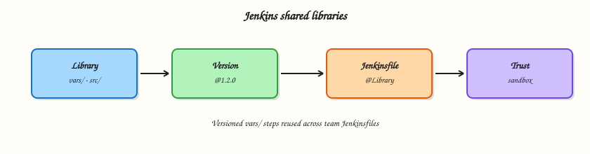

# Shared Libraries

## Overview

Copy-pasting the same `stage('Checkout')` into fifty Jenkinsfiles guarantees drift. A **Shared Library** centralises reusable Pipeline code in Git: **`vars/`** for global steps teams call like `buildService()`, **`src/`** for Groovy classes, optional **`resources/`**. You will configure a library, pin a version with `@`, and respect **trust** boundaries — libraries can run outside the Groovy sandbox.

This is **Tutorial 9** in **Module 9: Shared Libraries** of the REBASH Academy **Jenkins for Cloud & DevOps Engineers** series — written for Cloud, DevOps, Platform, and Site Reliability Engineering (SRE) engineers. Guide: [Extending with Shared Libraries](https://www.jenkins.io/doc/book/pipeline/shared-libraries/).

## Prerequisites

- [Docker with Jenkins Pipeline](docker-with-jenkins-pipeline.md) or solid Declarative skills from Modules 4–5
- Git repository hosting for the library (or local Git Jenkins can clone)
- Admin (or folder admin) rights to configure libraries

## Learning Objectives

By the end of this tutorial, you will be able to:

- [ ] Explain global versus folder shared libraries
- [ ] Structure `vars/` and `src/` correctly
- [ ] Call a library step from a Declarative Jenkinsfile with `@Library`
- [ ] Pin library versions and describe trust/sandbox implications
- [ ] Design a small reusable step for your teams

## Architecture

Application Jenkinsfiles load versioned library code from a separate Git repo configured on the controller or folder.



## Theory

### What it is

A Shared Library is a Git repository (usually) with:

```text
(root)
├── vars/
│   └── sayHello.groovy      # call as sayHello()
├── src/
│   └── org/rebash/Util.groovy
└── resources/
    └── ...
```

**Global libraries** are configured under *Manage Jenkins → System* (Pipeline Shared Groovy Libraries). **Folder libraries** live on a folder and apply to jobs beneath it — better for multi-tenant controllers.

Retrieve with:

```groovy
@Library('rebash-ci@1.2.0') _
```

or implicit load when “Load implicitly” is enabled (use sparingly — makes dependencies invisible).

### Why it matters

Platform teams ship golden paths: lint, build, container publish, notify. Application teams call one step instead of reinventing SCM checkout flags. Version pins (`@1.2.0` or `@main`) let you roll forward safely. Because trusted libraries may bypass sandbox restrictions, **who can merge to the library repo** is a security control.

### How it works

1. Create library Git repo with `vars/sayHello.groovy`:

```groovy
def call(String name = 'world') {
  echo "Hello, ${name}."
}
```

2. Register library name `rebash-ci` → Modern SCM → Git → default version `main`.
3. In an app `Jenkinsfile`:

```groovy
@Library('rebash-ci@main') _
pipeline {
  agent any
  stages {
    stage('Greet') {
      steps {
        script {
          sayHello('rebash')
        }
      }
    }
  }
}
```

Declarative often needs `script { }` to call custom steps cleanly.

**`src/`** holds classes under package paths for more structured code. Prefer thin `vars/` wrappers over huge Scripted blobs.

**Trust:** marking a library *trusted* allows more Jenkins API access. Only trust repos your platform team controls with reviewed merges.

### Key concepts and comparisons

| Scope | Best for |
|-------|----------|
| Global library | Company-wide steps |
| Folder library | Business unit isolation |

| Pin | Trade-off |
|-----|-----------|
| `@1.4.0` tag | Reproducible |
| `@main` | Floating; faster iteration; breakage risk |
| Commit SHA | Strongest pin |

### Common pitfalls

- Putting Jenkinsfiles inside the library repo as the only “docs” without `vars/`.
- Implicit global libraries nobody knows about.
- Untrusted contributors merging to a trusted library.
- Giant Scripted libraries unreadable to app teams.
- No SemVer tags — every app floats on `main`.

## Hands-on Lab

### Objective

Create a Shared Library Git repository with a `vars/` step, document controller configuration, and call it from a demo Pipeline job.

### Prerequisites

- Jenkins admin for global library **or** folder configure permission
- Git remote or `file://` visible to Jenkins (same caveats as Module 5)

### Lab environment

Workspace: `~/rebash-jenkins/module-09`

```bash
mkdir -p ~/rebash-jenkins/module-09 && cd ~/rebash-jenkins/module-09
set -euo pipefail
```

### Real-world scenario

Three squads duplicate Slack notify and git metadata stages. Platform will publish `rebash-ci` Shared Library v0.1.0 with `sayHello` and `ciMeta` steps as the pattern for later real steps.

### Step-by-step tasks

#### Task 1 – Create the library repository layout

Commit and record:

```bash
cd ~/rebash-jenkins/module-09
set -euo pipefail

rm -rf rebash-ci-lib
mkdir -p rebash-ci-lib/vars rebash-ci-lib/src/org/rebash
cd rebash-ci-lib
git init -b main
```

Create `vars/sayHello.groovy`:

```groovy
def call(String name = 'world') {
  echo "Hello, ${name} — from rebash-ci Shared Library"
}
```

Create `vars/ciMeta.groovy`:

```groovy
def call() {
  echo "JOB_NAME=${env.JOB_NAME}"
  echo "BUILD_NUMBER=${env.BUILD_NUMBER}"
  echo "BRANCH_NAME=${env.BRANCH_NAME}"
}
```

Create `src/org/rebash/Strings.groovy`:

```groovy
package org.rebash

class Strings implements Serializable {
  static String shout(String s) {
    return s?.toUpperCase()
  }
}
```

Create `README.md`:

```markdown
# rebash-ci Shared Library

## Usage

@Library('rebash-ci@main') _

steps:
- sayHello('name')
- ciMeta()
```

Commit and record:

```bash
git add vars src README.md
git -c user.email='rebash-lab@example.com' -c user.name='REBASH Lab' commit -m 'Initial rebash-ci library with sayHello and ciMeta'
git tag -a v0.1.0 -m 'v0.1.0'
git log -1 --oneline | tee ../lib-commit.txt
pwd | tee ../lib-path.txt
```

**Expected output:** Tag `v0.1.0` created; path recorded.

#### Task 2 – Configure the library in Jenkins

1. Prefer **folder library** on `rebash-demo`: Folder → Configure → Pipeline Shared Libraries  
   (or Manage Jenkins → System → Global Pipeline Libraries).
2. Name: `rebash-ci`
3. Default version: `v0.1.0` (or `main`)
4. Modern SCM → Git → repository URL (remote or `file://…`)
5. Uncheck “Allow default version to be overridden” only if you want hard pins — for labs, allow override.
6. **Do not** mark Trusted unless you understand sandbox implications; for `echo`-only steps, untrusted is enough.

Run:

```bash
cd ~/rebash-jenkins/module-09
set -euo pipefail
```

Create `library-config.yaml`:

```yaml
name: rebash-ci
scope: folder_rebash_demo_or_global
default_version: v0.1.0
repo: fill_from_lib-path.txt
trusted: false
implicit_load: false
```

Validate and archive:

```bash
python3 -c "
import yaml
from pathlib import Path
p = Path('lib-path.txt').read_text().strip()
d = yaml.safe_load(open('library-config.yaml'))
d['repo'] = p
yaml.safe_dump(d, open('library-config.yaml', 'w'), sort_keys=False)
assert d['name'] == 'rebash-ci'
assert d['default_version'] == 'v0.1.0'
print('library-config.yaml OK')
" | tee library-config-validate.txt
```

**Expected output:** Config YAML validates; library saved in UI.

#### Task 3 – Consumer Jenkinsfile

Run:

```bash
cd ~/rebash-jenkins/module-09
set -euo pipefail

mkdir -p consumer-app
```

Create `consumer-app/Jenkinsfile`:

```groovy
@Library('rebash-ci@v0.1.0') _
pipeline {
  agent any
  options { timestamps() }
  stages {
    stage('Library steps') {
      steps {
        script {
          sayHello('module-09')
          ciMeta()
        }
      }
    }
  }
}
```

Create `consumer-job.yaml`:

```yaml
job: rebash-demo/lib-consumer
definition: pipeline_script_or_scm_consumer_app
library_pin: rebash-ci@v0.1.0
expected_console: Hello from rebash-ci Shared Library
```

Verify:

```bash
grep -q lib-consumer consumer-job.yaml
```

Create/run `lib-consumer` and confirm console output.

**Expected output:** Build success; library echo lines visible.

#### Task 4 – Versioning and trust memo

Run:

```bash
cd ~/rebash-jenkins/module-09
set -euo pipefail
```

Create `trust-policy.yaml`:

```yaml
pin: tag_v0.1.0_for_reproducibility
platform: cut_tags_after_review
trusted_library: merge_rights_equal_script_approval_power
folder_libraries: reduce_blast_radius_vs_global_implicit
rollback: retag_or_point_jobs_at_previous_tag
```

Validate and archive:

```bash
python3 -c "
import yaml
with open('trust-policy.yaml') as f:
    d = yaml.safe_load(f)
assert 'v0.1.0' in d['pin']
print('trust-policy.yaml OK')
" | tee trust-policy-validate.txt

tar -czf module-09-evidence.tgz rebash-ci-lib/vars rebash-ci-lib/README.md consumer-app/Jenkinsfile library-config.yaml consumer-job.yaml trust-policy.yaml *.txt
ls -l module-09-evidence.tgz | tee evidence.txt
```

**Expected output:** Archive present.

### Validation steps

- [ ] Library repo has `vars/sayHello.groovy` and tag `v0.1.0`
- [ ] Jenkins library named `rebash-ci` configured
- [ ] Consumer Pipeline calls library steps successfully
- [ ] Trust policy YAML validates

### Common errors and fixes

| Error | Cause | Fix |
|-------|-------|-----|
| Library not found | Name/URL mismatch | Match library name exactly |
| `sayHello` undefined | Missing `_` / wrong version | Check `@Library('rebash-ci@v0.1.0') _` |
| Sandbox RejectedAccess | Untrusted + restricted API | Avoid privileged APIs; or review trust carefully |
| file:// clone fail | Docker Jenkins isolation | Use hosted Git |

### Challenge exercise

Add `vars/requireLabel.groovy` that errors if `env.NODE_LABELS` / label checks fail your policy string (simple `echo` + `error` if a parameter `REQUIRED_LABEL` is set and not contained in `env.NODE_NAME`). Pin `@v0.1.1` after tagging.

### Learning outcomes

- Built a minimal Shared Library layout
- Registered and consumed a version-pinned library
- Documented trust boundaries for library merges

### Cleanup

Keep `rebash-ci` library config for later modules. Remove experimental consumer jobs if cluttered.

```bash
ls ~/rebash-jenkins/module-09
```

## Validation

- [ ] Lab completed under `~/rebash-jenkins/module-09/`
- [ ] You can explain `vars/` versus `src/`
- [ ] You can justify version pins over floating `main`
- [ ] You can describe why library merge rights are sensitive

## Code Walkthrough

1. **Thin vars steps** — app Jenkinsfiles stay Declarative.
2. **Pin versions** — tags/SHAs in production.
3. **Folder scope when multi-tenant** — limit blast radius.
4. **No implicit globals by default** — make `@Library` visible.
5. **Review library PRs like production code** — they run everywhere.

## Security Considerations

- Trusted libraries can weaken Groovy sandbox protections.
- Library credentials for clone should be read-only.
- Do not put secrets inside library `resources/` committed to Git.
- Separate privileged deploy helpers from PR-safe helpers.
- Audit who can configure global libraries on the controller.

## Common Mistakes

!!! warning "Implicit trusted global library on main"
    Every job loads changing code silently. **Fix:** explicit `@Library` + tags; avoid implicit in production.

!!! warning "Application teams with merge rights to trusted libs"
    Equivalent to broad script approval. **Fix:** platform-owned repo, CODEOWNERS, reviews.

!!! warning "Copy-paste Scripted novels in vars/"
    Unmaintainable. **Fix:** small steps; shared conventions; document parameters.

!!! warning "No tags — everyone on @main"
    One bad commit breaks the company. **Fix:** SemVer tags and staged rollout.

## Best Practices

- SemVer tags and changelog for the library.
- Examples in library README.
- Folder libraries per business unit when needed.
- Deprecate steps with clear echo warnings before removal.
- Test library changes on a canary folder/job first.

## Troubleshooting

| Symptom | Likely cause | Fix |
|---------|--------------|-----|
| Old step behaviour | Cached version / wrong pin | Check replay resolves expected ref |
| `error fetching library` | Git auth | Fix credentials |
| Step works in script{} only | Declarative limits | Wrap custom calls in `script` |
| ClassNotFound in src/ | Package path mismatch | Match `src/org/...` to package |

## Summary

Shared Libraries turn repeated Pipeline glue into versioned platform products. Use `vars/` for callable steps, pin releases, and treat library trust as a security boundary. Next: [Managing Jenkins — Plugins, Tools, and CLI](managing-jenkins-plugins-tools-and-cli.md).

## Interview Questions

**1. What belongs in `vars/` versus `src/`?**

??? success "Reveal answer"
    `vars/` defines global call steps (filename = step name). `src/` holds Groovy classes under Java-like package paths for structured code. Most app-facing APIs should be thin `vars/` wrappers.

**2. What does `@Library('name@version') _` do?**

??? success "Reveal answer"
    It loads the named Shared Library at a Git ref (branch, tag, or commit) into the Pipeline. The underscore imports the global vars for use as steps.

**3. Why pin library versions in production?**

??? success "Reveal answer"
    Floating `@main` means a library merge can break every consumer simultaneously. Tags/SHAs make rollbacks and gradual rollouts possible.

**4. What is the risk of a Trusted shared library?**

??? success "Reveal answer"
    Trusted libraries can run with elevated Groovy permissions (less sandbox). A malicious or sloppy merge can become remote code execution across jobs. Merge rights must be tightly controlled.

**5. Global versus folder library — when choose folder?**

??? success "Reveal answer"
    When different teams need different libraries or you want to limit who can use/admin a library to a folder subtree on a multi-tenant controller.

**6. Why avoid “Load implicitly” for global libraries?**

??? success "Reveal answer"
    Implicit load hides dependencies — Jenkinsfiles no longer show `@Library`, making reviews and debugging harder, and surprise upgrades more likely.

**7. How do you roll back a bad library release?**

??? success "Reveal answer"
    Point consumers at the previous tag/SHA (or fix-forward with a new tag). Avoid rewriting published tags that many pipelines already pinned.

**8. Should deploy credentials live inside the Shared Library repository?**

??? success "Reveal answer"
    No. Libraries should reference Jenkins credentials by ID at runtime. Secrets in Git are a leak and rotation nightmare.

## Related Tutorials

- [Jenkinsfile in SCM](jenkinsfile-in-scm.md)
- [Managing Jenkins — Plugins, Tools, and CLI](managing-jenkins-plugins-tools-and-cli.md)
- [Securing Jenkins](securing-jenkins.md)

## References

- [Extending with Shared Libraries](https://www.jenkins.io/doc/book/pipeline/shared-libraries/)
- [Pipeline Syntax](https://www.jenkins.io/doc/book/pipeline/syntax/)
