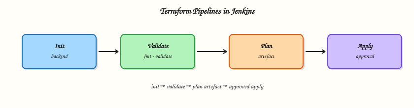

# Terraform Pipelines in Jenkins

## Overview

Automate Infrastructure as Code (IaC) with Terraform in Jenkins: **init**, **validate**, **plan**, **apply**, remote state, credentials or OpenID Connect (OIDC)-style cloud auth patterns, plan artefacts, and destroy discipline for labs.

Never apply unreviewed plans to production.

This is a core tutorial in **Module 14 · Terraform Pipelines** of the REBASH Academy **Jenkins for Cloud & DevOps Engineers** series — written for Cloud, DevOps, Platform, and SRE engineers.

## Prerequisites

- Completed prior modules in this track where linked in frontmatter
- [Git](../git/index.md) and [Docker](../docker/index.md) for lab workflows
- Running Jenkins LTS from [Installing Jenkins LTS](installing-jenkins-lts.md) when a live controller is required

## Learning Objectives

By the end of this tutorial, you will be able to:

- [ ] Structure a Declarative Pipeline for Terraform stages
- [ ] Archive plan artefacts and require approval before apply
- [ ] Explain remote state and locking awareness
- [ ] Outline safer cloud credential patterns (including OIDC-style)

## Architecture

This topic’s control points and relationships are shown below.



## Theory

### What it is

Terraform Pipelines typically: checkout → `terraform init` (remote backend) → `fmt`/`validate` → `plan -out=tfplan` → archive plan → human approval → `apply tfplan`. State belongs in a remote backend with locking. Cloud credentials should be short-lived where possible (OIDC to AWS/Azure/GCP analogues) rather than long-lived keys in Jenkins.

### Why it matters

Click-ops Terraform on laptops drifts from peer review. Jenkins makes plan/apply auditable. Bad apply without approval is a leading cause of costly incidents.

### How it works

1. Use an agent image with a pinned Terraform version.
2. Authenticate to cloud/state backend via credentials or OIDC plugins/patterns.
3. Split plan and apply into stages; use `input` for approval on production.
4. Archive `tfplan` and logs as artefacts.
5. Lab destroy only with explicit parameter and guardrails.

Align with Terraform track practices and jenkins.io Pipeline steps for `sh` wrappers.

### Key concepts and comparisons

| Stage | Gate |
|-------|------|
| validate | fail on invalid config |
| plan | review artefact |
| apply | approval + same plan file |
| destroy | lab-only parameter |

Remote state + locking prevents two applies clobbering each other.

### Common pitfalls

- `apply` without storing the exact plan file.
- Long-lived access keys in Multibranch PR jobs.
- Destroy from `main` without protections.
- Different Terraform versions, between plan and apply agents.

## Hands-on Lab

Create a workspace for this tutorial.

```bash
mkdir -p ~/rebash-jenkins/module-14 && cd ~/rebash-jenkins/module-14
```

**Focus:** Terraform plan-only Pipeline files with local backend for lab

### Step 1 – Primary exercise

```bash
cat > main.tf << 'EOF'
terraform {
  required_version = ">= 1.5.0"
}
resource "null_resource" "lab" {
  triggers = { always = timestamp() }
}
EOF
cat > Jenkinsfile << 'EOF'
pipeline {
  agent any
  parameters {
    booleanParam(name: 'DO_APPLY', defaultValue: false, description: 'Lab only')
  }
  stages {
    stage('Init') { steps { sh 'terraform init -input=false' } }
    stage('Validate') { steps { sh 'terraform validate' } }
    stage('Plan') {
      steps {
        sh 'terraform plan -input=false -out=tfplan'
        archiveArtifacts artifacts: 'tfplan', fingerprint: true
      }
    }
    stage('Apply') {
      when { expression { return params.DO_APPLY == true } }
      steps { sh 'terraform apply -input=false tfplan' }
    }
  }
}
EOF
terraform init -input=false
terraform validate
terraform plan -input=false -out=tfplan
test -f tfplan && echo 'plan-ok'
grep -E 'Plan|DO_APPLY|archiveArtifacts' Jenkinsfile
```

### Step 2 – Destroy discipline note

```bash
cat > destroy-policy.md << 'EOF'
# Destroy
- Never auto-destroy production
- Lab: explicit parameter + confirmation input
- Prefer terraform destroy in disposable workspaces only
EOF
grep production destroy-policy.md
```

### Final cleanup

```bash
# Keep ~/rebash-jenkins/ for later tutorials; stop Compose only if you are done with the controller
# docker compose -f ~/rebash-jenkins/module-02/docker-compose.yml down   # optional; omit -v to keep JENKINS_HOME
```

## Validation

- [ ] Lab commands run under `~/rebash-jenkins/module-14/`
- [ ] You can explain each Theory section in your own words
- [ ] You used current Jenkins LTS / Pipeline practices where they apply
- [ ] You can describe one production failure mode for this topic

## Code Walkthrough

Production practice for **Terraform Pipelines in Jenkins** always combines:

1. Inspect before you change (status, plan, logs, dry-run)
2. Prefer reversible, documented changes (Git, Jenkinsfile, JCasC)
3. Capture evidence (console logs, plan artefacts) for handovers
4. Prefer current LTS and supported plugins over legacy shortcuts
5. Least privilege — escalate credentials only when required

Keep runbooks short enough to follow under pressure. Automate checks; keep humans for judgement.

## Security Considerations

- Treat Jenkins credentials and cloud tokens as privileged — never commit them
- Keep builds off the built-in node; isolate untrusted pull requests
- Prefer short-lived auth (OIDC-style patterns, scoped RBAC) over long-lived keys
- Validate blast radius before apply/deploy/delete operations
- Collect audit logs; limit who can administer the controller

## Common Mistakes

!!! warning "Apply without the saved plan"
    Always `apply` the exact `tfplan` artefact you reviewed.

!!! warning "Long-lived cloud keys on PR builds"
    Prefer OIDC/short-lived creds; deny apply from forks.

!!! warning "Unattended destroy"
    Require human confirmation and environment protection.

## Best Practices

- Encode **Terraform Pipelines in Jenkins** changes as code and review them in pull requests
- Prefer Jenkins LTS and pinned agent/tool versions
- Keep builds off the controller; use labelled agents
- Least privilege for credentials and cluster/cloud access
- Destroy or stop lab resources; keep `~/rebash-jenkins/` notes for the track

## Troubleshooting

| Symptom | Likely cause | Fix |
|---------|--------------|-----|
| Job stuck in queue | No matching agent/label or executors busy | Check nodes, labels, and executor counts |
| Checkout / SCM failure | Credentials, URL, or permissions | Verify credential ID and repository access |
| Pipeline CPS / script error | Syntax, sandbox, or library mismatch | Read error line; validate Jenkinsfile; pin library version |
| Plugin / UI broken after update | Incompatible plugin set | Restore backup; disable suspect plugin on test controller |
| Disk full on agent/controller | Workspaces or old builds | Clean workspaces; trim build retention |

## Summary

**Terraform Pipelines in Jenkins** is essential for Cloud and DevOps engineers operating Jenkins. Practise the lab until the inspection and change path is muscle memory, then continue the track.

## Interview Questions

1. Why separate plan and apply stages?
2. What belongs in remote state configuration?
3. How do you prevent two applies at once?
4. How should cloud credentials be provided to Jenkins?
5. What is dangerous about auto-apply on every PR?

!!! tip "Sample answer — question 1"
    So humans (or policy) review the plan artefact before mutating infrastructure; apply uses the same binary plan.

!!! tip "Sample answer — question 3"
    Remote state locking (for example S3+DynamoDB, Terraform Cloud, or equivalent) serialises applies.

## Related Tutorials

- [Course overview](index.md)
- [Kubernetes Agents and Deploys](kubernetes-agents-and-deploys.md)
- [JCasC, Scaling, and Operations](jcasc-scaling-and-operations.md)

## References

- [Pipeline Syntax](https://www.jenkins.io/doc/book/pipeline/syntax/)
- [Pipeline best practices](https://www.jenkins.io/doc/book/pipeline/pipeline-best-practices/)
- [Jenkins User Documentation](https://www.jenkins.io/doc/)
